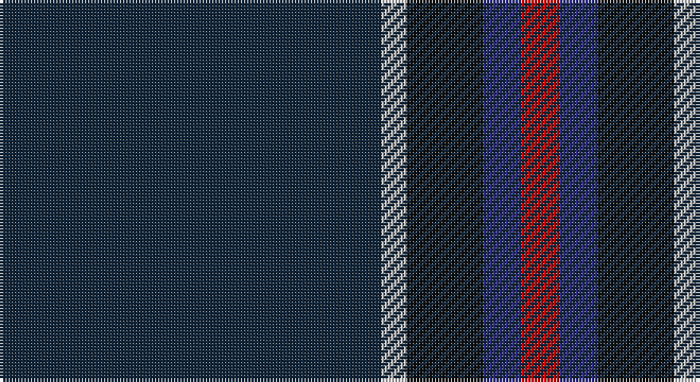

This page is one **sett** — a single exact thread-count. It belongs to the [tartan](/setts/dt30lb2k6db3r3/)
(the same proportion at any scale), whose colour order is pattern [BWKBR](/stripes/bwkbr/).

Part of the [Edinburgh Crystal](/tartans/edinburgh-crystal/) tartan — the named design grouping this sett with its other cloths.

Sourced from register-of-tartans.  It is a [5 stripe tartan](/stripes/stripes5/).

Original link https://www.tartanregister.gov.uk/tartanDetails.aspx?ref=1077

## Register references

External register numbers recorded for this tartan.

- Scottish Register of Tartans: [1077](https://www.tartanregister.gov.uk/tartanDetails.aspx?ref=1077)
- Scottish Tartans Authority (ITI): 2307
- Scottish Tartans World Register: 2307

## Thread count
DN/120 N8 K24 DB12 R/12

One full sett is **220 threads**.

## Palette

Palette: <strong>Tartan Register</strong>
<table><thead><tr><th>Colour</th><th>Threads</th><th>Shade</th><th>Base</th><th>OKLCh</th></tr></thead><tbody><tr><td>DN/</td><td style="text-align:right;font-variant-numeric:tabular-nums">120</td><td><code style="background-color:#14283C;">#14283C</code> <small style="color:#888">#14283C</small></td><td>B <code style="background-color:#2A418A;">#2A418A</code></td><td><small style="color:#888">oklch(27.1% 0.046 249.9)</small></td></tr><tr><td>N</td><td style="text-align:right;font-variant-numeric:tabular-nums">8</td><td><code style="background-color:#C0C0C0;">#C0C0C0</code> <small style="color:#888">#C0C0C0</small></td><td>W <code style="background-color:#F7F7F7;">#F7F7F7</code></td><td><small style="color:#888">oklch(80.8% 0.000 89.9)</small></td></tr><tr><td>K</td><td style="text-align:right;font-variant-numeric:tabular-nums">24</td><td><code style="background-color:#101010;">#101010</code> <small style="color:#888">#101010</small></td><td>K <code style="background-color:#000000;">#000000</code></td><td><small style="color:#888">oklch(17.3% 0.000 89.9)</small></td></tr><tr><td>DB</td><td style="text-align:right;font-variant-numeric:tabular-nums">12</td><td><code style="background-color:#2C2C80;">#2C2C80</code> <small style="color:#888">#2C2C80</small></td><td>B <code style="background-color:#2A418A;">#2A418A</code></td><td><small style="color:#888">oklch(35.0% 0.138 276.6)</small></td></tr><tr><td>R/</td><td style="text-align:right;font-variant-numeric:tabular-nums">12</td><td><code style="background-color:#C80000;">#C80000</code> <small style="color:#888">#C80000</small></td><td>R <code style="background-color:#CC0000;">#CC0000</code></td><td><small style="color:#888">oklch(52.3% 0.215 29.2)</small></td></tr></tbody></table>

# Sample pattern

## Nearest tartans

The nearest existing variants by ΔTartan distance, with this tartan at the top so the swatches line up against it.

ΔTartan

Tartan

Sett

—

<a href="/ttd/edit/#slug=dt30lb2k6db3r3~x4">Edinburgh Crystal</a> <a class="nn-out" href="/variants/s5/dt30lb2k6db3r3~x4/" title="open its dictionary page">↗</a>

0.48

<a href="/ttd/edit/#slug=dt30w2k6db3r3~x4&amp;base=dt30lb2k6db3r3~x4">Edinburgh Crystal (Corporate)</a> <a class="nn-out" href="/variants/s5/dt30w2k6db3r3~x4/" title="open its dictionary page">↗</a>

1.25

<a href="/ttd/edit/#slug=dp3dt42k2dg17dt9dp3w2~x2&amp;base=dt30lb2k6db3r3~x4">Barrance, Paul and Kelly (Personal)</a> <a class="nn-out" href="/variants/s7/dp3dt42k2dg17dt9dp3w2~x2/" title="open its dictionary page">↗</a>

1.42

<a href="/ttd/edit/#slug=k4o2k46dbi20k6db3g4~x2&amp;base=dt30lb2k6db3r3~x4">Silver Thistle (Fashion)</a> <a class="nn-out" href="/variants/s7/k4o2k46dbi20k6db3g4~x2/" title="open its dictionary page">↗</a>

1.47

<a href="/ttd/edit/#slug=dt62r24lo5dg3~x2&amp;base=dt30lb2k6db3r3~x4">Meaux (Personal)</a> <a class="nn-out" href="/variants/s4/dt62r24lo5dg3~x2/" title="open its dictionary page">↗</a>

1.48

<a href="/ttd/edit/#slug=dg1db2dbi5db11ly1~x4&amp;base=dt30lb2k6db3r3~x4">Open Championship, The</a> <a class="nn-out" href="/variants/s5/dg1db2dbi5db11ly1~x4/" title="open its dictionary page">↗</a>

1.51

<a href="/ttd/edit/#slug=db31k8dp4w2~x4&amp;base=dt30lb2k6db3r3~x4">Osborne, Luke Alexander (Personal)</a> <a class="nn-out" href="/variants/s4/db31k8dp4w2~x4/" title="open its dictionary page">↗</a>

1.60

<a href="/ttd/edit/#slug=k62o24lo5dg3~x2&amp;base=dt30lb2k6db3r3~x4">Meaux, Luc G (Personal)</a> <a class="nn-out" href="/variants/s4/k62o24lo5dg3~x2/" title="open its dictionary page">↗</a>

1.62

<a href="/ttd/edit/#slug=db47dg14dp5do2r3dg7~x2&amp;base=dt30lb2k6db3r3~x4">Round Table (1997)</a> <a class="nn-out" href="/variants/s6/db47dg14dp5do2r3dg7~x2/" title="open its dictionary page">↗</a>

1.64

<a href="/ttd/edit/#slug=k8r2k13lo2dg48b6~x2&amp;base=dt30lb2k6db3r3~x4">Green Swamp Youth Campers</a> <a class="nn-out" href="/variants/s6/k8r2k13lo2dg48b6~x2/" title="open its dictionary page">↗</a>

1.67

<a href="/ttd/edit/#slug=k4r1k4r1dg14n1dg1~x4&amp;base=dt30lb2k6db3r3~x4">Pinehurst Resort</a> <a class="nn-out" href="/variants/s7/k4r1k4r1dg14n1dg1~x4/" title="open its dictionary page">↗</a>

## Neighbour map

Every grey dot is one of 14360 variants placed by the first two principal components of the ΔTartan feature space (44% of its variance). Red is this tartan; blue dots are its nearest — click one to open its page.

<svg viewBox="0 0 640 380" role="img" style="max-width:100%;height:auto;border:1px solid #e0e0e0;border-radius:4px;display:block" xmlns="http://www.w3.org/2000/svg"><image href="/nn/cloud.v1.png" width="640" height="380"/><a href="/variants/s5/dt30w2k6db3r3~x4/"><circle cx="429.5" cy="193.4" r="4" fill="#3465a4"><title>Edinburgh Crystal (Corporate)</title></circle></a><a href="/variants/s7/dp3dt42k2dg17dt9dp3w2~x2/"><circle cx="450.4" cy="186.2" r="4" fill="#3465a4"><title>Barrance, Paul and Kelly (Personal)</title></circle></a><a href="/variants/s7/k4o2k46dbi20k6db3g4~x2/"><circle cx="474.6" cy="187.6" r="4" fill="#3465a4"><title>Silver Thistle (Fashion)</title></circle></a><a href="/variants/s4/dt62r24lo5dg3~x2/"><circle cx="471.0" cy="226.5" r="4" fill="#3465a4"><title>Meaux (Personal)</title></circle></a><a href="/variants/s5/dg1db2dbi5db11ly1~x4/"><circle cx="424.2" cy="249.5" r="4" fill="#3465a4"><title>Open Championship, The</title></circle></a><a href="/variants/s4/db31k8dp4w2~x4/"><circle cx="473.5" cy="245.9" r="4" fill="#3465a4"><title>Osborne, Luke Alexander (Personal)</title></circle></a><a href="/variants/s4/k62o24lo5dg3~x2/"><circle cx="449.4" cy="215.9" r="4" fill="#3465a4"><title>Meaux, Luc G (Personal)</title></circle></a><a href="/variants/s6/db47dg14dp5do2r3dg7~x2/"><circle cx="442.1" cy="192.3" r="4" fill="#3465a4"><title>Round Table (1997)</title></circle></a><a href="/variants/s6/k8r2k13lo2dg48b6~x2/"><circle cx="408.0" cy="175.6" r="4" fill="#3465a4"><title>Green Swamp Youth Campers</title></circle></a><a href="/variants/s7/k4r1k4r1dg14n1dg1~x4/"><circle cx="393.1" cy="207.8" r="4" fill="#3465a4"><title>Pinehurst Resort</title></circle></a><circle cx="443.7" cy="200.8" r="5" fill="#c00000"/></svg>

ID: /variants/s5/dt30lb2k6db3r3~x4/
