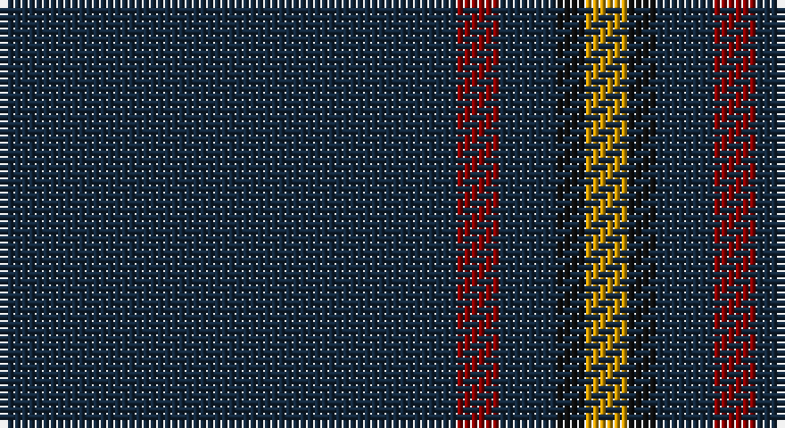

This page is one **sett** — a single exact thread-count. It belongs to the [tartan](/setts/dt32r3dt4k2lo3/)
(the same proportion at any scale), whose colour order is pattern [BRBKY](/stripes/brbky/).

Part of the [MacLaine of Lochbuie Hunting](/tartans/maclaine-of-lochbuie-hunting/) tartan — the named design grouping this sett with its other cloths.

Sourced from register-of-tartans.  It is a [5 stripe tartan](/stripes/stripes5/).

Original link https://www.tartanregister.gov.uk/tartanDetails.aspx?ref=2592

## Also known as

This cloth is also recorded under:

- MacLaine of Lochbuie Htg
- MacLaine of Lochbuie, hunting

2 attestations — the source records this cloth was collapsed from (oldest owns this page)

<ul>
<li>01/01/2002 — MacLaine of Lochbuie Hunting (register-of-tartans, <a href="https://www.tartanregister.gov.uk/tartanDetails.aspx?ref=2592">record</a>)</li>
<li>pre 2002 — MacLaine of Lochbuie Htg (Clan) (tartans-authority, <a href="http://www.tartansauthority.com/tartan-ferret/display/491/">record</a>)</li>
</ul>

## Register references

External register numbers recorded for this tartan.

- Scottish Register of Tartans: [2592](https://www.tartanregister.gov.uk/tartanDetails.aspx?ref=2592)
- Scottish Tartans Authority (ITI): 491
- Scottish Tartans World Register: 491

## Thread count
DN/64 DR6 DN8 K4 DY/6

One full sett is **106 threads**.

## Palette

Palette: <strong>Tartan Register</strong> <small style="color:#888">(3 of 4 colours)</small>
<table><thead><tr><th>Colour</th><th>Threads</th><th>Shade</th><th>Base</th><th>OKLCh</th></tr></thead><tbody><tr><td>DN/</td><td style="text-align:right;font-variant-numeric:tabular-nums">64</td><td><code style="background-color:#14283C;">#14283C</code> <small style="color:#888">#14283C</small></td><td>B <code style="background-color:#2A418A;">#2A418A</code></td><td><small style="color:#888">oklch(27.1% 0.046 249.9)</small></td></tr><tr><td>DR</td><td style="text-align:right;font-variant-numeric:tabular-nums">6</td><td><code style="background-color:#880000;">#880000</code> <small style="color:#888">#880000</small></td><td>R <code style="background-color:#CC0000;">#CC0000</code></td><td><small style="color:#888">oklch(39.4% 0.162 29.2)</small></td></tr><tr><td>DN</td><td style="text-align:right;font-variant-numeric:tabular-nums">8</td><td><code style="background-color:#14283C;">#14283C</code> <small style="color:#888">#14283C</small></td><td>B <code style="background-color:#2A418A;">#2A418A</code></td><td><small style="color:#888">oklch(27.1% 0.046 249.9)</small></td></tr><tr><td>K</td><td style="text-align:right;font-variant-numeric:tabular-nums">4</td><td><code style="background-color:#101010;">#101010</code> <small style="color:#888">#101010</small></td><td>K <code style="background-color:#000000;">#000000</code></td><td><small style="color:#888">oklch(17.3% 0.000 89.9)</small></td></tr><tr><td>DY/</td><td style="text-align:right;font-variant-numeric:tabular-nums">6</td><td><code style="background-color:#D09800;">#D09800</code> <small style="color:#888">#D09800</small></td><td>Y <code style="background-color:#F2BF00;">#F2BF00</code></td><td><small style="color:#888">oklch(71.4% 0.147 82.1)</small></td></tr></tbody></table>

# Sample pattern

## Nearest tartans

The nearest existing variants by ΔTartan distance, with this tartan at the top so the swatches line up against it.

ΔTartan

Tartan

Sett

—

<a href="/ttd/edit/#slug=dt32r3dt4k2lo3~x2">MacLaine of Lochbuie Hunting</a> <a class="nn-out" href="/variants/s5/dt32r3dt4k2lo3~x2/" title="open its dictionary page">↗</a>

1.11

<a href="/ttd/edit/#slug=db1r1k12g1~x4&amp;base=dt32r3dt4k2lo3~x2">MacNathair Sgianach</a> <a class="nn-out" href="/variants/s4/db1r1k12g1~x4/" title="open its dictionary page">↗</a>

1.31

<a href="/ttd/edit/#slug=dt74m9dt4r5dt4m9dt37db9~x2&amp;base=dt32r3dt4k2lo3~x2">Rikaco Vintage</a> <a class="nn-out" href="/variants/s8/dt74m9dt4r5dt4m9dt37db9~x2/" title="open its dictionary page">↗</a>

1.57

<a href="/ttd/edit/#slug=k10n2k2n8k40r4k5ri2~x2&amp;base=dt32r3dt4k2lo3~x2">Laird Abdullah (Personal)</a> <a class="nn-out" href="/variants/s8/k10n2k2n8k40r4k5ri2~x2/" title="open its dictionary page">↗</a>

1.60

<a href="/ttd/edit/#slug=k40dg15k10r2k10lo2k10~x2&amp;base=dt32r3dt4k2lo3~x2">Langhein, Alex (Personal)</a> <a class="nn-out" href="/variants/s7/k40dg15k10r2k10lo2k10~x2/" title="open its dictionary page">↗</a>

1.79

<a href="/ttd/edit/#slug=k72w3k11db9&amp;base=dt32r3dt4k2lo3~x2">Dunnotar (School)</a> <a class="nn-out" href="/variants/s4/k72w3k11db9/" title="open its dictionary page">↗</a>

1.79

<a href="/ttd/edit/#slug=dt68t7dt16k16lo4~x2&amp;base=dt32r3dt4k2lo3~x2">Burnetts &amp; Struth</a> <a class="nn-out" href="/variants/s5/dt68t7dt16k16lo4~x2/" title="open its dictionary page">↗</a>

1.83

<a href="/ttd/edit/#slug=k21dp2o1k1o1dp2k6db2o1~x4&amp;base=dt32r3dt4k2lo3~x2">Clan Inebriated</a> <a class="nn-out" href="/variants/s9/k21dp2o1k1o1dp2k6db2o1~x4/" title="open its dictionary page">↗</a>

1.83

<a href="/ttd/edit/#slug=k40dg15k10r2k10lo2k10lo2~x2&amp;base=dt32r3dt4k2lo3~x2">Langhein, Alex (Personal)</a> <a class="nn-out" href="/variants/s8/k40dg15k10r2k10lo2k10lo2~x2/" title="open its dictionary page">↗</a>

1.83

<a href="/ttd/edit/#slug=k24dg3r3k24r2k2r2&amp;base=dt32r3dt4k2lo3~x2">Unidentified #45</a> <a class="nn-out" href="/variants/s7/k24dg3r3k24r2k2r2/" title="open its dictionary page">↗</a>

1.87

<a href="/ttd/edit/#slug=dt40dg3dp4dt28lo2lr2dt7~x2&amp;base=dt32r3dt4k2lo3~x2">Pisniak (Personal)</a> <a class="nn-out" href="/variants/s7/dt40dg3dp4dt28lo2lr2dt7~x2/" title="open its dictionary page">↗</a>

## Neighbour map

Every grey dot is one of 14360 variants placed by the first two principal components of the ΔTartan feature space (44% of its variance). Red is this tartan; blue dots are its nearest — click one to open its page.

<svg viewBox="0 0 640 380" role="img" style="max-width:100%;height:auto;border:1px solid #e0e0e0;border-radius:4px;display:block" xmlns="http://www.w3.org/2000/svg"><image href="/nn/cloud.v1.png" width="640" height="380"/><a href="/variants/s4/db1r1k12g1~x4/"><circle cx="566.7" cy="238.1" r="4" fill="#3465a4"><title>MacNathair Sgianach</title></circle></a><a href="/variants/s8/dt74m9dt4r5dt4m9dt37db9~x2/"><circle cx="538.7" cy="182.9" r="4" fill="#3465a4"><title>Rikaco Vintage</title></circle></a><a href="/variants/s8/k10n2k2n8k40r4k5ri2~x2/"><circle cx="537.7" cy="174.3" r="4" fill="#3465a4"><title>Laird Abdullah (Personal)</title></circle></a><a href="/variants/s7/k40dg15k10r2k10lo2k10~x2/"><circle cx="547.6" cy="220.6" r="4" fill="#3465a4"><title>Langhein, Alex (Personal)</title></circle></a><a href="/variants/s4/k72w3k11db9/"><circle cx="626.0" cy="233.5" r="4" fill="#3465a4"><title>Dunnotar (School)</title></circle></a><a href="/variants/s5/dt68t7dt16k16lo4~x2/"><circle cx="550.9" cy="245.0" r="4" fill="#3465a4"><title>Burnetts &amp; Struth</title></circle></a><a href="/variants/s9/k21dp2o1k1o1dp2k6db2o1~x4/"><circle cx="529.7" cy="161.8" r="4" fill="#3465a4"><title>Clan Inebriated</title></circle></a><a href="/variants/s8/k40dg15k10r2k10lo2k10lo2~x2/"><circle cx="544.0" cy="213.2" r="4" fill="#3465a4"><title>Langhein, Alex (Personal)</title></circle></a><a href="/variants/s7/k24dg3r3k24r2k2r2/"><circle cx="577.4" cy="225.7" r="4" fill="#3465a4"><title>Unidentified #45</title></circle></a><a href="/variants/s7/dt40dg3dp4dt28lo2lr2dt7~x2/"><circle cx="626.0" cy="204.4" r="4" fill="#3465a4"><title>Pisniak (Personal)</title></circle></a><circle cx="584.8" cy="213.0" r="5" fill="#c00000"/></svg>

ID: /variants/s5/dt32r3dt4k2lo3~x2/
