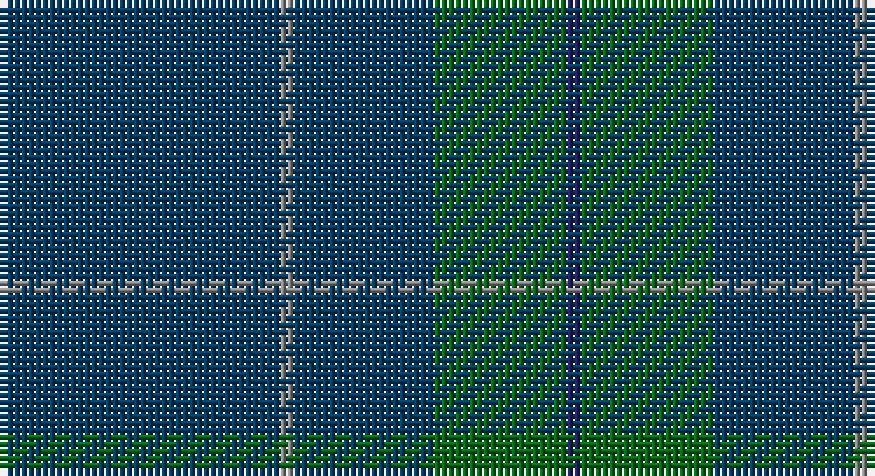

This page is one **sett** — a single exact thread-count. It belongs to the [tartan](/setts/dt40o2dt20g19db2/)
(the same proportion at any scale), whose colour order is pattern [BGBRB](/stripes/bgbrb/).

Part of the [Lloyd](/tartans/lloyd/) tartan — the named design grouping this sett with its other cloths.

Sourced from tartans-authority.  It is a [5 stripe tartan](/stripes/stripes5/).

Original link http://www.tartansauthority.com/tartan-ferret/display/5765/

## Also known as

This cloth is also recorded under:

- Lloyd of Wales

## Register references

External register numbers recorded for this tartan.

- Scottish Tartans Authority (ITI): 5765

## Thread count
DBa/40 N2 DBa20 G19 DB/2

One full sett is **124 threads**.

## Palette

Palette: <strong>Tartan Register</strong>
<table><thead><tr><th>Colour</th><th>Threads</th><th>Shade</th><th>Base</th><th>OKLCh</th></tr></thead><tbody><tr><td>DBa/</td><td style="text-align:right;font-variant-numeric:tabular-nums">40</td><td><code style="background-color:#003C64;">#003C64</code> <small style="color:#888">#003C64</small></td><td>B <code style="background-color:#2A418A;">#2A418A</code></td><td><small style="color:#888">oklch(34.5% 0.089 246.0)</small></td></tr><tr><td>N</td><td style="text-align:right;font-variant-numeric:tabular-nums">2</td><td><code style="background-color:#888888;">#888888</code> <small style="color:#888">#888888</small></td><td>R <code style="background-color:#CC0000;">#CC0000</code></td><td><small style="color:#888">oklch(62.7% 0.000 89.9)</small></td></tr><tr><td>DBa</td><td style="text-align:right;font-variant-numeric:tabular-nums">20</td><td><code style="background-color:#003C64;">#003C64</code> <small style="color:#888">#003C64</small></td><td>B <code style="background-color:#2A418A;">#2A418A</code></td><td><small style="color:#888">oklch(34.5% 0.089 246.0)</small></td></tr><tr><td>G</td><td style="text-align:right;font-variant-numeric:tabular-nums">19</td><td><code style="background-color:#006818;">#006818</code> <small style="color:#888">#006818</small></td><td>G <code style="background-color:#006100;">#006100</code></td><td><small style="color:#888">oklch(45.0% 0.142 145.0)</small></td></tr><tr><td>DB/</td><td style="text-align:right;font-variant-numeric:tabular-nums">2</td><td><code style="background-color:#202060;">#202060</code> <small style="color:#888">#202060</small></td><td>B <code style="background-color:#2A418A;">#2A418A</code></td><td><small style="color:#888">oklch(28.9% 0.111 276.9)</small></td></tr></tbody></table>

# Sample pattern

## Compared to the master

This cloth is one sett of its design; the master sett (the exemplar the design is anchored on) is below for comparison.

<figure style="margin:0"><figcaption style="color:#888;font-size:smaller">this sett</figcaption></figure>
<figure style="margin:0"><figcaption style="color:#888;font-size:smaller"><a href="/setts/o40r2o20g19db2/">master sett →</a></figcaption></figure>

## Nearest tartans

The nearest existing variants by ΔTartan distance, with this tartan at the top so the swatches line up against it.

ΔTartan

Tartan

Sett

—

<a href="/ttd/edit/#slug=dt40o2dt20g19db2">Lloyd (Welsh Name)</a> <a class="nn-out" href="/variants/s5/dt40o2dt20g19db2/" title="open its dictionary page">↗</a>

1.31

<a href="/ttd/edit/#slug=dg31lo1dg18db18r1~x2&amp;base=dt40o2dt20g19db2">Miramichi</a> <a class="nn-out" href="/variants/s5/dg31lo1dg18db18r1~x2/" title="open its dictionary page">↗</a>

1.42

<a href="/ttd/edit/#slug=dt68b7dt16k16lo4~x2&amp;base=dt40o2dt20g19db2">Burnett's &amp; Struth (Corporate)</a> <a class="nn-out" href="/variants/s5/dt68b7dt16k16lo4~x2/" title="open its dictionary page">↗</a>

1.66

<a href="/ttd/edit/#slug=dt68t7dt16k16lo4~x2&amp;base=dt40o2dt20g19db2">Burnetts &amp; Struth</a> <a class="nn-out" href="/variants/s5/dt68t7dt16k16lo4~x2/" title="open its dictionary page">↗</a>

2.06

<a href="/ttd/edit/#slug=db9dy12db44dy12db9r3~x2&amp;base=dt40o2dt20g19db2">Elliot</a> <a class="nn-out" href="/variants/s6/db9dy12db44dy12db9r3~x2/" title="open its dictionary page">↗</a>

2.08

<a href="/ttd/edit/#slug=db13k3db20dy70db20dy30w3~x2&amp;base=dt40o2dt20g19db2">Unidentified #44</a> <a class="nn-out" href="/variants/s7/db13k3db20dy70db20dy30w3~x2/" title="open its dictionary page">↗</a>

2.13

<a href="/ttd/edit/#slug=k30dt6k6dt41t2~x2&amp;base=dt40o2dt20g19db2">Williams (New York) (Personal)</a> <a class="nn-out" href="/variants/s5/k30dt6k6dt41t2~x2/" title="open its dictionary page">↗</a>

2.23

<a href="/ttd/edit/#slug=k40dg15k10r2k10lo2~x2&amp;base=dt40o2dt20g19db2">Kalkofen (Name)</a> <a class="nn-out" href="/variants/s6/k40dg15k10r2k10lo2~x2/" title="open its dictionary page">↗</a>

2.30

<a href="/ttd/edit/#slug=dt58o3y16r3lo2y7dt29r3o2~x2&amp;base=dt40o2dt20g19db2">Aberdeen Mither Kirk (St Nicholas)</a> <a class="nn-out" href="/variants/s9/dt58o3y16r3lo2y7dt29r3o2~x2/" title="open its dictionary page">↗</a>

2.34

<a href="/ttd/edit/#slug=n44dg12dt1r6~x2&amp;base=dt40o2dt20g19db2">Heslop, William D (Name)</a> <a class="nn-out" href="/variants/s4/n44dg12dt1r6~x2/" title="open its dictionary page">↗</a>

2.34

<a href="/variants/s5/dt62o4dy10dyi3dg21~x2/">McGovern (2016)</a>

## Neighbour map

Every grey dot is one of 14360 variants placed by the first two principal components of the ΔTartan feature space (44% of its variance). Red is this tartan; blue dots are its nearest — click one to open its page.

<svg viewBox="0 0 640 380" role="img" style="max-width:100%;height:auto;border:1px solid #e0e0e0;border-radius:4px;display:block" xmlns="http://www.w3.org/2000/svg"><image href="/nn/cloud.v1.png" width="640" height="380"/><a href="/variants/s5/dg31lo1dg18db18r1~x2/"><circle cx="537.2" cy="245.2" r="4" fill="#3465a4"><title>Miramichi</title></circle></a><a href="/variants/s5/dt68b7dt16k16lo4~x2/"><circle cx="547.6" cy="240.9" r="4" fill="#3465a4"><title>Burnett's &amp; Struth (Corporate)</title></circle></a><a href="/variants/s5/dt68t7dt16k16lo4~x2/"><circle cx="550.9" cy="245.0" r="4" fill="#3465a4"><title>Burnetts &amp; Struth</title></circle></a><a href="/variants/s6/db9dy12db44dy12db9r3~x2/"><circle cx="532.0" cy="267.8" r="4" fill="#3465a4"><title>Elliot</title></circle></a><a href="/variants/s7/db13k3db20dy70db20dy30w3~x2/"><circle cx="481.5" cy="221.2" r="4" fill="#3465a4"><title>Unidentified #44</title></circle></a><a href="/variants/s5/k30dt6k6dt41t2~x2/"><circle cx="474.1" cy="271.1" r="4" fill="#3465a4"><title>Williams (New York) (Personal)</title></circle></a><a href="/variants/s6/k40dg15k10r2k10lo2~x2/"><circle cx="566.0" cy="243.4" r="4" fill="#3465a4"><title>Kalkofen (Name)</title></circle></a><a href="/variants/s9/dt58o3y16r3lo2y7dt29r3o2~x2/"><circle cx="515.2" cy="165.0" r="4" fill="#3465a4"><title>Aberdeen Mither Kirk (St Nicholas)</title></circle></a><a href="/variants/s4/n44dg12dt1r6~x2/"><circle cx="585.5" cy="226.2" r="4" fill="#3465a4"><title>Heslop, William D (Name)</title></circle></a><a href="/variants/s5/dt62o4dy10dyi3dg21~x2/"><circle cx="472.0" cy="233.4" r="4" fill="#3465a4"><title>McGovern (2016)</title></circle></a><circle cx="542.4" cy="267.8" r="5" fill="#c00000"/></svg>

ID: /variants/s5/dt40o2dt20g19db2/
