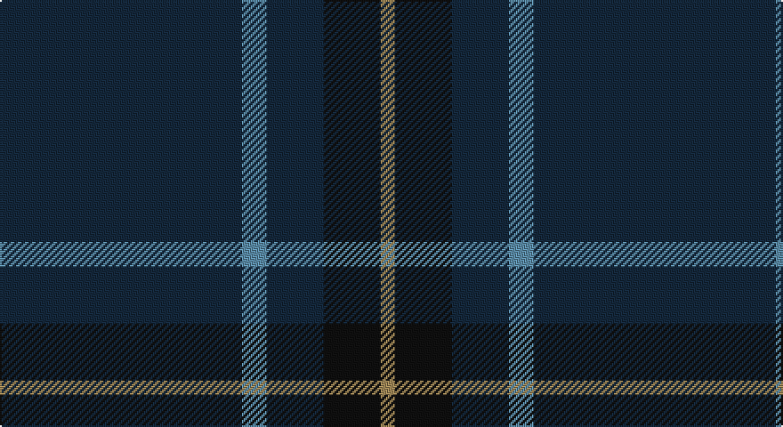

This page is one **sett** — a single exact thread-count. It belongs to the [tartan](/setts/dt68t7dt16k16lo4/)
(the same proportion at any scale), whose colour order is pattern [BBBKY](/stripes/bbbky/).

Sourced from register-of-tartans.  It is a [5 stripe tartan](/stripes/stripes5/).

Original link https://www.tartanregister.gov.uk/tartanDetails.aspx?ref=446

## Register references

External register numbers recorded for this tartan.

- Scottish Register of Tartans: [446](https://www.tartanregister.gov.uk/tartanDetails.aspx?ref=446)
- Scottish Tartans Authority (ITI): 6866

## Thread count
DN/136 B14 DN32 K32 LT/8

One full sett is **300 threads**.

## Palette

Palette: <strong>Tartan Register</strong>
<table><thead><tr><th>Colour</th><th>Threads</th><th>Shade</th><th>Base</th><th>OKLCh</th></tr></thead><tbody><tr><td>DN/</td><td style="text-align:right;font-variant-numeric:tabular-nums">136</td><td><code style="background-color:#14283C;">#14283C</code> <small style="color:#888">#14283C</small></td><td>B <code style="background-color:#2A418A;">#2A418A</code></td><td><small style="color:#888">oklch(27.1% 0.046 249.9)</small></td></tr><tr><td>B</td><td style="text-align:right;font-variant-numeric:tabular-nums">14</td><td><code style="background-color:#5C8CA8;">#5C8CA8</code> <small style="color:#888">#5C8CA8</small></td><td>B <code style="background-color:#2A418A;">#2A418A</code></td><td><small style="color:#888">oklch(61.7% 0.067 235.0)</small></td></tr><tr><td>DN</td><td style="text-align:right;font-variant-numeric:tabular-nums">32</td><td><code style="background-color:#14283C;">#14283C</code> <small style="color:#888">#14283C</small></td><td>B <code style="background-color:#2A418A;">#2A418A</code></td><td><small style="color:#888">oklch(27.1% 0.046 249.9)</small></td></tr><tr><td>K</td><td style="text-align:right;font-variant-numeric:tabular-nums">32</td><td><code style="background-color:#101010;">#101010</code> <small style="color:#888">#101010</small></td><td>K <code style="background-color:#000000;">#000000</code></td><td><small style="color:#888">oklch(17.3% 0.000 89.9)</small></td></tr><tr><td>LT/</td><td style="text-align:right;font-variant-numeric:tabular-nums">8</td><td><code style="background-color:#A08858;">#A08858</code> <small style="color:#888">#A08858</small></td><td>Y <code style="background-color:#F2BF00;">#F2BF00</code></td><td><small style="color:#888">oklch(63.7% 0.071 84.0)</small></td></tr></tbody></table>

# Sample pattern

## Nearest tartans

The nearest existing variants by ΔTartan distance, with this tartan at the top so the swatches line up against it.

ΔTartan

Tartan

Sett

—

<a href="/ttd/edit/#slug=dt68t7dt16k16lo4~x2">Burnetts &amp; Struth</a> <a class="nn-out" href="/variants/s5/dt68t7dt16k16lo4~x2/" title="open its dictionary page">↗</a>

0.93

<a href="/ttd/edit/#slug=dt68b7dt16k16lo4~x2&amp;base=dt68t7dt16k16lo4~x2">Burnett's &amp; Struth (Corporate)</a> <a class="nn-out" href="/variants/s5/dt68b7dt16k16lo4~x2/" title="open its dictionary page">↗</a>

1.24

<a href="/ttd/edit/#slug=k40dg15k10r2k10lo2~x2&amp;base=dt68t7dt16k16lo4~x2">Kalkofen (Name)</a> <a class="nn-out" href="/variants/s6/k40dg15k10r2k10lo2~x2/" title="open its dictionary page">↗</a>

1.39

<a href="/ttd/edit/#slug=dg31lo1dg18db18r1~x2&amp;base=dt68t7dt16k16lo4~x2">Miramichi</a> <a class="nn-out" href="/variants/s5/dg31lo1dg18db18r1~x2/" title="open its dictionary page">↗</a>

1.49

<a href="/ttd/edit/#slug=k40dg15k10r2k10ly2k10~x2&amp;base=dt68t7dt16k16lo4~x2">Langhein Family Tartan</a> <a class="nn-out" href="/variants/s7/k40dg15k10r2k10ly2k10~x2/" title="open its dictionary page">↗</a>

1.66

<a href="/ttd/edit/#slug=dt40o2dt20g19db2&amp;base=dt68t7dt16k16lo4~x2">Lloyd (Welsh Name)</a> <a class="nn-out" href="/variants/s5/dt40o2dt20g19db2/" title="open its dictionary page">↗</a>

1.67

<a href="/ttd/edit/#slug=k40dg15k10r2k10lo2k10lo2~x2&amp;base=dt68t7dt16k16lo4~x2">Langhein, Alex (Personal)</a> <a class="nn-out" href="/variants/s8/k40dg15k10r2k10lo2k10lo2~x2/" title="open its dictionary page">↗</a>

1.76

<a href="/ttd/edit/#slug=dt62r24lo5dg3~x2&amp;base=dt68t7dt16k16lo4~x2">Meaux (Personal)</a> <a class="nn-out" href="/variants/s4/dt62r24lo5dg3~x2/" title="open its dictionary page">↗</a>

1.77

<a href="/ttd/edit/#slug=db31k8dp4w2~x4&amp;base=dt68t7dt16k16lo4~x2">Osborne, Luke Alexander (Personal)</a> <a class="nn-out" href="/variants/s4/db31k8dp4w2~x4/" title="open its dictionary page">↗</a>

1.79

<a href="/ttd/edit/#slug=dt32r3dt4k2lo3~x2&amp;base=dt68t7dt16k16lo4~x2">MacLaine of Lochbuie Hunting</a> <a class="nn-out" href="/variants/s5/dt32r3dt4k2lo3~x2/" title="open its dictionary page">↗</a>

1.86

<a href="/ttd/edit/#slug=k4o2k46dbi20k6db3g4~x2&amp;base=dt68t7dt16k16lo4~x2">Silver Thistle (Fashion)</a> <a class="nn-out" href="/variants/s7/k4o2k46dbi20k6db3g4~x2/" title="open its dictionary page">↗</a>

## Neighbour map

Every grey dot is one of 14360 variants placed by the first two principal components of the ΔTartan feature space (44% of its variance). Red is this tartan; blue dots are its nearest — click one to open its page.

<svg viewBox="0 0 640 380" role="img" style="max-width:100%;height:auto;border:1px solid #e0e0e0;border-radius:4px;display:block" xmlns="http://www.w3.org/2000/svg"><image href="/nn/cloud.v1.png" width="640" height="380"/><a href="/variants/s5/dt68b7dt16k16lo4~x2/"><circle cx="547.6" cy="240.9" r="4" fill="#3465a4"><title>Burnett's &amp; Struth (Corporate)</title></circle></a><a href="/variants/s6/k40dg15k10r2k10lo2~x2/"><circle cx="566.0" cy="243.4" r="4" fill="#3465a4"><title>Kalkofen (Name)</title></circle></a><a href="/variants/s5/dg31lo1dg18db18r1~x2/"><circle cx="537.2" cy="245.2" r="4" fill="#3465a4"><title>Miramichi</title></circle></a><a href="/variants/s7/k40dg15k10r2k10ly2k10~x2/"><circle cx="568.2" cy="233.5" r="4" fill="#3465a4"><title>Langhein Family Tartan</title></circle></a><a href="/variants/s5/dt40o2dt20g19db2/"><circle cx="542.4" cy="267.8" r="4" fill="#3465a4"><title>Lloyd (Welsh Name)</title></circle></a><a href="/variants/s8/k40dg15k10r2k10lo2k10lo2~x2/"><circle cx="544.0" cy="213.2" r="4" fill="#3465a4"><title>Langhein, Alex (Personal)</title></circle></a><a href="/variants/s4/dt62r24lo5dg3~x2/"><circle cx="471.0" cy="226.5" r="4" fill="#3465a4"><title>Meaux (Personal)</title></circle></a><a href="/variants/s4/db31k8dp4w2~x4/"><circle cx="473.5" cy="245.9" r="4" fill="#3465a4"><title>Osborne, Luke Alexander (Personal)</title></circle></a><a href="/variants/s5/dt32r3dt4k2lo3~x2/"><circle cx="584.8" cy="213.0" r="4" fill="#3465a4"><title>MacLaine of Lochbuie Hunting</title></circle></a><a href="/variants/s7/k4o2k46dbi20k6db3g4~x2/"><circle cx="474.6" cy="187.6" r="4" fill="#3465a4"><title>Silver Thistle (Fashion)</title></circle></a><circle cx="550.9" cy="245.0" r="5" fill="#c00000"/></svg>

ID: /variants/s5/dt68t7dt16k16lo4~x2/
