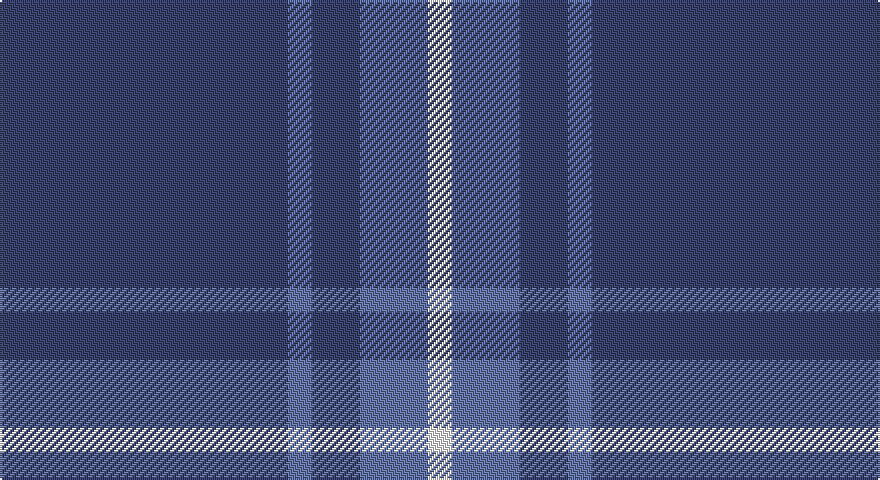

This page is one **sett** — a single exact thread-count. It belongs to the [tartan](/setts/dt72b6dt12b17w6/)
(the same proportion at any scale), whose colour order is pattern [BBBBW](/stripes/bbbbw/).

Sourced from register-of-tartans.  It is a [5 stripe tartan](/stripes/stripes5/).

Original link https://www.tartanregister.gov.uk/tartanDetails.aspx?ref=10325

## Register references

External register numbers recorded for this tartan.

- Scottish Register of Tartans: [10325](https://www.tartanregister.gov.uk/tartanDetails.aspx?ref=10325)

## Thread count
N/144 B12 N24 B34 W/12

One full sett is **296 threads**.

## Palette

Palette: <strong>Tartan Register</strong> <small style="color:#888">(1 of 3 colours)</small>
<table><thead><tr><th>Colour</th><th>Threads</th><th>Shade</th><th>Base</th><th>OKLCh</th></tr></thead><tbody><tr><td>N/</td><td style="text-align:right;font-variant-numeric:tabular-nums">144</td><td><code style="background-color:#3C4266;">#3C4266</code> <small style="color:#888">#3C4266</small></td><td>B <code style="background-color:#2A418A;">#2A418A</code></td><td><small style="color:#888">oklch(39.0% 0.062 275.9)</small></td></tr><tr><td>B</td><td style="text-align:right;font-variant-numeric:tabular-nums">12</td><td><code style="background-color:#6675A0;">#6675A0</code> <small style="color:#888">#6675A0</small></td><td>B <code style="background-color:#2A418A;">#2A418A</code></td><td><small style="color:#888">oklch(56.7% 0.069 269.3)</small></td></tr><tr><td>N</td><td style="text-align:right;font-variant-numeric:tabular-nums">24</td><td><code style="background-color:#3C4266;">#3C4266</code> <small style="color:#888">#3C4266</small></td><td>B <code style="background-color:#2A418A;">#2A418A</code></td><td><small style="color:#888">oklch(39.0% 0.062 275.9)</small></td></tr><tr><td>B</td><td style="text-align:right;font-variant-numeric:tabular-nums">34</td><td><code style="background-color:#6675A0;">#6675A0</code> <small style="color:#888">#6675A0</small></td><td>B <code style="background-color:#2A418A;">#2A418A</code></td><td><small style="color:#888">oklch(56.7% 0.069 269.3)</small></td></tr><tr><td>W/</td><td style="text-align:right;font-variant-numeric:tabular-nums">12</td><td><code style="background-color:#FFFFFF;">#FFFFFF</code> <small style="color:#888">#FFFFFF</small></td><td>W <code style="background-color:#F7F7F7;">#F7F7F7</code></td><td><small style="color:#888">oklch(100.0% 0.000 89.9)</small></td></tr></tbody></table>

# Sample pattern

## Nearest tartans

The nearest existing variants by ΔTartan distance, with this tartan at the top so the swatches line up against it.

ΔTartan

Tartan

Sett

—

<a href="/ttd/edit/#slug=dt72b6dt12b17w6~x2">GulfMark</a> <a class="nn-out" href="/variants/s5/dt72b6dt12b17w6~x2/" title="open its dictionary page">↗</a>

1.49

<a href="/ttd/edit/#slug=db72t6db12t17w6~x2&amp;base=dt72b6dt12b17w6~x2">Gulfmark (Corporate)</a> <a class="nn-out" href="/variants/s5/db72t6db12t17w6~x2/" title="open its dictionary page">↗</a>

1.50

<a href="/ttd/edit/#slug=r19db6r14db101g7db7&amp;base=dt72b6dt12b17w6~x2">Lynch Family Tartan</a> <a class="nn-out" href="/variants/s6/r19db6r14db101g7db7/" title="open its dictionary page">↗</a>

1.54

<a href="/ttd/edit/#slug=r19db6r7db101dg6db7~x2&amp;base=dt72b6dt12b17w6~x2">Lynch</a> <a class="nn-out" href="/variants/s6/r19db6r7db101dg6db7~x2/" title="open its dictionary page">↗</a>

1.61

<a href="/ttd/edit/#slug=db9k9db9k9db42lb5~x2&amp;base=dt72b6dt12b17w6~x2">Dollar Academy</a> <a class="nn-out" href="/variants/s6/db9k9db9k9db42lb5~x2/" title="open its dictionary page">↗</a>

1.68

<a href="/ttd/edit/#slug=db40g7ly3g7db15r5~x2&amp;base=dt72b6dt12b17w6~x2">Wheadon (Name)</a> <a class="nn-out" href="/variants/s6/db40g7ly3g7db15r5~x2/" title="open its dictionary page">↗</a>

1.70

<a href="/ttd/edit/#slug=lg6r1lg17db3lg3db8lg1~x2&amp;base=dt72b6dt12b17w6~x2">Dominion (Fashion)</a> <a class="nn-out" href="/variants/s7/lg6r1lg17db3lg3db8lg1~x2/" title="open its dictionary page">↗</a>

1.74

<a href="/ttd/edit/#slug=db4w3b6db40b8db12g3~x2&amp;base=dt72b6dt12b17w6~x2">JetBlue (Corporate)</a> <a class="nn-out" href="/variants/s7/db4w3b6db40b8db12g3~x2/" title="open its dictionary page">↗</a>

1.75

<a href="/ttd/edit/#slug=db9k9db9k9db42w5~x2&amp;base=dt72b6dt12b17w6~x2">Dollar Academy (1930s) (Corporate)</a> <a class="nn-out" href="/variants/s6/db9k9db9k9db42w5~x2/" title="open its dictionary page">↗</a>

1.76

<a href="/variants/s4/t8dg1r2~x20/">Gyle</a>

1.77

<a href="/ttd/edit/#slug=db64g20r4g3r4g3&amp;base=dt72b6dt12b17w6~x2">Wilson</a> <a class="nn-out" href="/variants/s6/db64g20r4g3r4g3/" title="open its dictionary page">↗</a>

## Neighbour map

Every grey dot is one of 14360 variants placed by the first two principal components of the ΔTartan feature space (44% of its variance). Red is this tartan; blue dots are its nearest — click one to open its page.

<svg viewBox="0 0 640 380" role="img" style="max-width:100%;height:auto;border:1px solid #e0e0e0;border-radius:4px;display:block" xmlns="http://www.w3.org/2000/svg"><image href="/nn/cloud.v1.png" width="640" height="380"/><a href="/variants/s5/db72t6db12t17w6~x2/"><circle cx="496.0" cy="233.7" r="4" fill="#3465a4"><title>Gulfmark (Corporate)</title></circle></a><a href="/variants/s6/r19db6r14db101g7db7/"><circle cx="530.1" cy="198.7" r="4" fill="#3465a4"><title>Lynch Family Tartan</title></circle></a><a href="/variants/s6/r19db6r7db101dg6db7~x2/"><circle cx="593.9" cy="211.5" r="4" fill="#3465a4"><title>Lynch</title></circle></a><a href="/variants/s6/db9k9db9k9db42lb5~x2/"><circle cx="463.7" cy="258.6" r="4" fill="#3465a4"><title>Dollar Academy</title></circle></a><a href="/variants/s6/db40g7ly3g7db15r5~x2/"><circle cx="427.3" cy="202.5" r="4" fill="#3465a4"><title>Wheadon (Name)</title></circle></a><a href="/variants/s7/lg6r1lg17db3lg3db8lg1~x2/"><circle cx="452.9" cy="208.3" r="4" fill="#3465a4"><title>Dominion (Fashion)</title></circle></a><a href="/variants/s7/db4w3b6db40b8db12g3~x2/"><circle cx="470.9" cy="201.2" r="4" fill="#3465a4"><title>JetBlue (Corporate)</title></circle></a><a href="/variants/s6/db9k9db9k9db42w5~x2/"><circle cx="447.9" cy="250.6" r="4" fill="#3465a4"><title>Dollar Academy (1930s) (Corporate)</title></circle></a><a href="/variants/s4/t8dg1r2~x20/"><circle cx="405.4" cy="256.0" r="4" fill="#3465a4"><title>Gyle</title></circle></a><a href="/variants/s6/db64g20r4g3r4g3/"><circle cx="474.1" cy="193.5" r="4" fill="#3465a4"><title>Wilson</title></circle></a><circle cx="511.4" cy="237.4" r="5" fill="#c00000"/></svg>

ID: /variants/s5/dt72b6dt12b17w6~x2/
