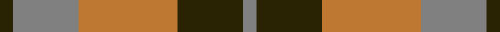
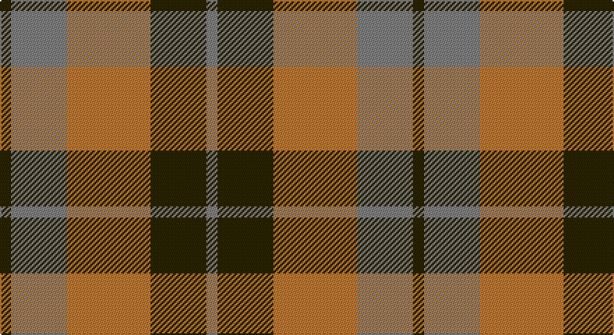

This page is one **sett** — a single exact thread-count. It belongs to the [tartan](/setts/dy2y10o15dy10y2/)
(the same proportion at any scale), whose colour order is pattern [GGRGG](/stripes/ggrgg/).

Part of the [Harmony 8](/tartans/harmony-8/) tartan — the named design grouping this sett with its other cloths.

Sourced from register-of-tartans.  It is a [5 stripe tartan](/stripes/stripes5/).

Original link https://www.tartanregister.gov.uk/tartanDetails.aspx?ref=1612

## Register references

External register numbers recorded for this tartan.

- Scottish Register of Tartans: [1612](https://www.tartanregister.gov.uk/tartanDetails.aspx?ref=1612)
- Scottish Tartans World Register: 1307

## Thread count
K/8 N40 DO60 K40 N/8

One full sett is **296 threads**.

## Palette

Palette: <strong>Tartan Register</strong> <small style="color:#888">(2 of 3 colours)</small>
<table><thead><tr><th>Colour</th><th>Threads</th><th>Shade</th><th>Base</th><th>OKLCh</th></tr></thead><tbody><tr><td>K/</td><td style="text-align:right;font-variant-numeric:tabular-nums">8</td><td><code style="background-color:#2A2303;">#2A2303</code> <small style="color:#888">#2A2303</small></td><td>G <code style="background-color:#006100;">#006100</code></td><td><small style="color:#888">oklch(25.7% 0.049 96.8)</small></td></tr><tr><td>N</td><td style="text-align:right;font-variant-numeric:tabular-nums">40</td><td><code style="background-color:#808080;">#808080</code> <small style="color:#888">#808080</small></td><td>G <code style="background-color:#006100;">#006100</code></td><td><small style="color:#888">oklch(60.0% 0.000 89.9)</small></td></tr><tr><td>DO</td><td style="text-align:right;font-variant-numeric:tabular-nums">60</td><td><code style="background-color:#BE7832;">#BE7832</code> <small style="color:#888">#BE7832</small></td><td>R <code style="background-color:#CC0000;">#CC0000</code></td><td><small style="color:#888">oklch(63.5% 0.121 62.2)</small></td></tr><tr><td>K</td><td style="text-align:right;font-variant-numeric:tabular-nums">40</td><td><code style="background-color:#2A2303;">#2A2303</code> <small style="color:#888">#2A2303</small></td><td>G <code style="background-color:#006100;">#006100</code></td><td><small style="color:#888">oklch(25.7% 0.049 96.8)</small></td></tr><tr><td>N/</td><td style="text-align:right;font-variant-numeric:tabular-nums">8</td><td><code style="background-color:#808080;">#808080</code> <small style="color:#888">#808080</small></td><td>G <code style="background-color:#006100;">#006100</code></td><td><small style="color:#888">oklch(60.0% 0.000 89.9)</small></td></tr></tbody></table>

# Sample pattern

## Nearest tartans

The nearest existing variants by ΔTartan distance, with this tartan at the top so the swatches line up against it.

ΔTartan

Tartan

Sett

—

<a href="/ttd/edit/#slug=dy2y10o15dy10y2~x4">Harmony 8</a> <a class="nn-out" href="/variants/s5/dy2y10o15dy10y2~x4/" title="open its dictionary page">↗</a>

1.03

<a href="/ttd/edit/#slug=dr2y10o15dr10y2~x4&amp;base=dy2y10o15dy10y2~x4">Harmony 8</a> <a class="nn-out" href="/variants/s5/dr2y10o15dr10y2~x4/" title="open its dictionary page">↗</a>

1.12

<a href="/ttd/edit/#slug=dp2g10o15dp10g2~x4&amp;base=dy2y10o15dy10y2~x4">Harmony, 6</a> <a class="nn-out" href="/variants/s5/dp2g10o15dp10g2~x4/" title="open its dictionary page">↗</a>

1.18

<a href="/ttd/edit/#slug=db9r3db1r3g9r3db1~x2&amp;base=dy2y10o15dy10y2~x4">Logan, or Skene</a> <a class="nn-out" href="/variants/s7/db9r3db1r3g9r3db1~x2/" title="open its dictionary page">↗</a>

1.22

<a href="/ttd/edit/#slug=ri1r7ri4g7ri1g1~x4&amp;base=dy2y10o15dy10y2~x4">MacNab, Variant</a> <a class="nn-out" href="/variants/s6/ri1r7ri4g7ri1g1~x4/" title="open its dictionary page">↗</a>

1.31

<a href="/ttd/edit/#slug=dp3r19dp18g19dp3g3~x2&amp;base=dy2y10o15dy10y2~x4">MacNab 1</a> <a class="nn-out" href="/variants/s6/dp3r19dp18g19dp3g3~x2/" title="open its dictionary page">↗</a>

1.35

<a href="/ttd/edit/#slug=g30ly3db8r25~x2&amp;base=dy2y10o15dy10y2~x4">Dohmen (Personal)</a> <a class="nn-out" href="/variants/s4/g30ly3db8r25~x2/" title="open its dictionary page">↗</a>

1.35

<a href="/ttd/edit/#slug=w2o13g13w2~x6&amp;base=dy2y10o15dy10y2~x4">Dunoon Irish (Corporate)</a> <a class="nn-out" href="/variants/s4/w2o13g13w2~x6/" title="open its dictionary page">↗</a>

1.37

<a href="/ttd/edit/#slug=g25r4db24r21g25r3db4~x2&amp;base=dy2y10o15dy10y2~x4">Glasgow</a> <a class="nn-out" href="/variants/s7/g25r4db24r21g25r3db4~x2/" title="open its dictionary page">↗</a>

1.38

<a href="/ttd/edit/#slug=dg2r1dg8r5y5r1y2~x4&amp;base=dy2y10o15dy10y2~x4">Glen Esk (1993)</a> <a class="nn-out" href="/variants/s7/dg2r1dg8r5y5r1y2~x4/" title="open its dictionary page">↗</a>

1.42

<a href="/ttd/edit/#slug=r5g7k2t1~x4&amp;base=dy2y10o15dy10y2~x4">Wilson's No.195</a> <a class="nn-out" href="/variants/s4/r5g7k2t1~x4/" title="open its dictionary page">↗</a>

## Neighbour map

Every grey dot is one of 14360 variants placed by the first two principal components of the ΔTartan feature space (44% of its variance). Red is this tartan; blue dots are its nearest — click one to open its page.

<svg viewBox="0 0 640 380" role="img" style="max-width:100%;height:auto;border:1px solid #e0e0e0;border-radius:4px;display:block" xmlns="http://www.w3.org/2000/svg"><image href="/nn/cloud.v1.png" width="640" height="380"/><a href="/variants/s5/dr2y10o15dr10y2~x4/"><circle cx="256.7" cy="277.8" r="4" fill="#3465a4"><title>Harmony 8</title></circle></a><a href="/variants/s5/dp2g10o15dp10g2~x4/"><circle cx="253.5" cy="278.7" r="4" fill="#3465a4"><title>Harmony, 6</title></circle></a><a href="/variants/s7/db9r3db1r3g9r3db1~x2/"><circle cx="235.4" cy="233.9" r="4" fill="#3465a4"><title>Logan, or Skene</title></circle></a><a href="/variants/s6/ri1r7ri4g7ri1g1~x4/"><circle cx="251.3" cy="249.2" r="4" fill="#3465a4"><title>MacNab, Variant</title></circle></a><a href="/variants/s6/dp3r19dp18g19dp3g3~x2/"><circle cx="210.1" cy="246.7" r="4" fill="#3465a4"><title>MacNab 1</title></circle></a><a href="/variants/s4/g30ly3db8r25~x2/"><circle cx="262.4" cy="247.4" r="4" fill="#3465a4"><title>Dohmen (Personal)</title></circle></a><a href="/variants/s4/w2o13g13w2~x6/"><circle cx="248.3" cy="258.2" r="4" fill="#3465a4"><title>Dunoon Irish (Corporate)</title></circle></a><a href="/variants/s7/g25r4db24r21g25r3db4~x2/"><circle cx="256.5" cy="248.8" r="4" fill="#3465a4"><title>Glasgow</title></circle></a><a href="/variants/s7/dg2r1dg8r5y5r1y2~x4/"><circle cx="270.7" cy="258.6" r="4" fill="#3465a4"><title>Glen Esk (1993)</title></circle></a><a href="/variants/s4/r5g7k2t1~x4/"><circle cx="232.3" cy="260.0" r="4" fill="#3465a4"><title>Wilson's No.195</title></circle></a><circle cx="228.6" cy="263.1" r="5" fill="#c00000"/></svg>

ID: /variants/s5/dy2y10o15dy10y2~x4/
