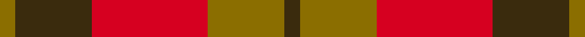

This is one **variant** — a specific cloth: this exact thread count and colourway, with its own
provenance below. It is one weaving of the [sett](/setts/dy2y10r15dy10y2/) (the scale-free proportion — the
same cloth at any scale or shade), whose colour order is pattern [GGRGG](/stripes/ggrgg/).

Part of the [Harmony 9](/tartans/h/ha/harmony-9/) tartan — the named design grouping this sett with its other cloths.

Sourced from register-of-tartans.  It is a [5 stripe tartan](/stripes/stripes5/).

Original link [https://www.tartanregister.gov.uk/tartanDetails.aspx?ref=1613](https://www.tartanregister.gov.uk/tartanDetails.aspx?ref=1613)

Dataset <small>— provenance for this record, inherited from the source manifest</small>

<dl class="dataset-prov">
<dt>source</dt><dd><a href="/sources/register-of-tartans/">Scottish Register of Tartans</a></dd>
<dt>data captured from</dt><dd><a href="https://github.com/thetartan/tartan-database/blob/master/data/register-of-tartans/data.csv">https://github.com/thetartan/tartan-database/blob/master/data/register-of-tartans/data.csv</a></dd>
<dt>data date</dt><dd>2017-01-06 <small>(dataset default)</small></dd>
<dt>licence</dt><dd><a href="https://www.tartanregister.gov.uk/copyright">Crown copyright</a></dd>
</dl>

Capture chain <small>— the hands this data passed through, oldest first; each capture carries its own licence</small>

<ol class="capture-chain">
<li><a href="https://www.tartanregister.gov.uk/">Scottish Register of Tartans</a> · <a href="https://www.tartanregister.gov.uk/copyright">Crown copyright</a> <small>the living register — still published by National Records of Scotland</small></li>
<li><a href="https://github.com/thetartan/tartan-database">thetartan/tartan-database</a> <small>2016-2017</small> · <a href="https://creativecommons.org/licenses/by-nc-nd/4.0/">CC BY-NC-ND 4.0</a> <small>Levko Kravets's frozen compilation — the capture we vendored, and where its CC licence text came from</small></li>
<li>this dictionary <small>captured 2026-06-10 · commit 5bf86c7566</small> <small>each re-capture is a git commit to data/sources</small></li>
</ol>

## Register references

External register numbers recorded for this tartan.

- Scottish Register of Tartans: [1613](https://www.tartanregister.gov.uk/tartanDetails.aspx?ref=1613)
- Scottish Tartans World Register: 1754

## Thread count
Y/8 DY40 R60 Y40 DY/8

One full sett is **296 threads**.

## Palette
<table><thead><tr><th>Colour</th><th>Shade</th><th>OKLCh</th></tr></thead><tbody><tr><td>R</td><td><code style="background-color:#D60020;">#D60020</code> <small style="color:#888">#D60020</small></td><td><small style="color:#888">oklch(55.2% 0.224 25.5)</small></td></tr><tr><td>DY</td><td><code style="background-color:#3A2B0D;">#3A2B0D</code> <small style="color:#888">#3A2B0D</small></td><td><small style="color:#888">oklch(30.0% 0.049 82.0)</small></td></tr><tr><td>Y</td><td><code style="background-color:#8B6E00;">#8B6E00</code> <small style="color:#888">#8B6E00</small></td><td><small style="color:#888">oklch(55.1% 0.113 90.4)</small></td></tr></tbody></table>

# Sample pattern

## Nearest tartan variants

The nearest existing variants by ΔTartan distance, with this cloth at the top so the swatches line up against it.

ΔTartan

Threads

Variant

Sett

—

296

<a href="/variants/s5/dy2y10r15dy10y2~x4/">Harmony 9</a>

<a href="/ttd/edit/#slug=dg1r1dg7r4ri7r1~x4~dg1806142-r1807008-ri2109032&amp;base=dy2y10r15dy10y2~x4" title="compare in the TTD">1.66</a>

160

<a href="/variants/s6/dg1r1dg7r4ri7r1~x4~dg1806142-r1807008-ri2109032/">MacNab #2</a>

<a href="/ttd/edit/#slug=dg1r1dg7r4ri7r1~x6~r1807033-ri2109032&amp;base=dy2y10r15dy10y2~x4" title="compare in the TTD">1.89</a>

240

<a href="/variants/s6/dg1r1dg7r4ri7r1~x6~r1807033-ri2109032/">Dewar (Name)</a>

<a href="/ttd/edit/#slug=r1ri7r4g7r1g1~x4~r1707016-ri2008029&amp;base=dy2y10r15dy10y2~x4" title="compare in the TTD">1.97</a>

160

<a href="/variants/s6/r1ri7r4g7r1g1~x4~r1707016-ri2008029/">MacNab, Variant</a>

<a href="/ttd/edit/#slug=y42b15r28y12b6r20&amp;base=dy2y10r15dy10y2~x4" title="compare in the TTD">2.66</a>

184

<a href="/variants/s6/y42b15r28y12b6r20/">Kozlosky, Kilt</a>

<a href="/ttd/edit/#slug=y1dy5r5w1~x4&amp;base=dy2y10r15dy10y2~x4" title="compare in the TTD">2.85</a>

88

<a href="/variants/s4/y1dy5r5w1~x4/">Manx Mannin Plaid</a>

<a href="/ttd/edit/#slug=o36do15o9r31ly5do4r16~x2~o2503076-ly2705081&amp;base=dy2y10r15dy10y2~x4" title="compare in the TTD">2.88</a>

360

<a href="/variants/s7/ly36do15ly9r31lyi5do4r16~x2~ly2503076-lyi2705081/">Manhattan Ethnic</a>

<a href="/ttd/edit/#slug=r18y3r18y30k4~x2&amp;base=dy2y10r15dy10y2~x4" title="compare in the TTD">3.37</a>

248

<a href="/variants/s5/r18y3r18y30k4~x2/">Shire of Hornwood (USA)</a>

<a href="/ttd/edit/#slug=n7r1dt6r8lb1~x8&amp;base=dy2y10r15dy10y2~x4" title="compare in the TTD">3.39</a>

304

<a href="/variants/s5/n7r1dt6r8lb1~x8/">Callum (Buchan) (Name)</a>

<a href="/ttd/edit/#slug=ri2r2o2r2dr6r1~x8~ri2806019-r2109032-o2307033&amp;base=dy2y10r15dy10y2~x4" title="compare in the TTD">3.46</a>

216

<a href="/variants/s6/rii2r2ri2r2dr6r1~x8~rii2806019-r2109032-ri2307033/">Youth on The Horizon (Fashion)</a>

<a href="/ttd/edit/#slug=o3r19o18g19o3g3~x2&amp;base=dy2y10r15dy10y2~x4" title="compare in the TTD">3.48</a>

248

<a href="/variants/s6/o3r19o18g19o3g3~x2/">MacNab (Macgregor - Hastie)</a>

## Neighbour map

Every grey dot is one of 13621 variants placed by the first two principal components of the ΔTartan feature space (42% of its variance). Red is this tartan; blue dots are its nearest — click one to open its page.

<svg viewBox="0 0 640 380" role="img" style="max-width:100%;height:auto;border:1px solid #e0e0e0;border-radius:4px;display:block" xmlns="http://www.w3.org/2000/svg"><image href="/nn/cloud.v1.png" width="640" height="380"/><a href="/variants/s6/dg1r1dg7r4ri7r1~x4~dg1806142-r1807008-ri2109032/"><circle cx="297.5" cy="264.2" r="4" fill="#3465a4"><title>MacNab #2</title></circle></a><a href="/variants/s6/dg1r1dg7r4ri7r1~x6~r1807033-ri2109032/"><circle cx="301.1" cy="263.5" r="4" fill="#3465a4"><title>Dewar (Name)</title></circle></a><a href="/variants/s6/r1ri7r4g7r1g1~x4~r1707016-ri2008029/"><circle cx="281.2" cy="260.8" r="4" fill="#3465a4"><title>MacNab, Variant</title></circle></a><a href="/variants/s6/y42b15r28y12b6r20/"><circle cx="334.1" cy="292.2" r="4" fill="#3465a4"><title>Kozlosky, Kilt</title></circle></a><a href="/variants/s4/y1dy5r5w1~x4/"><circle cx="228.9" cy="265.7" r="4" fill="#3465a4"><title>Manx Mannin Plaid</title></circle></a><a href="/variants/s7/ly36do15ly9r31lyi5do4r16~x2~ly2503076-lyi2705081/"><circle cx="300.2" cy="246.5" r="4" fill="#3465a4"><title>Manhattan Ethnic</title></circle></a><a href="/variants/s5/r18y3r18y30k4~x2/"><circle cx="346.3" cy="242.4" r="4" fill="#3465a4"><title>Shire of Hornwood (USA)</title></circle></a><a href="/variants/s5/n7r1dt6r8lb1~x8/"><circle cx="255.7" cy="259.7" r="4" fill="#3465a4"><title>Callum (Buchan) (Name)</title></circle></a><a href="/variants/s6/rii2r2ri2r2dr6r1~x8~rii2806019-r2109032-ri2307033/"><circle cx="270.8" cy="264.1" r="4" fill="#3465a4"><title>Youth on The Horizon (Fashion)</title></circle></a><a href="/variants/s6/o3r19o18g19o3g3~x2/"><circle cx="312.0" cy="286.5" r="4" fill="#3465a4"><title>MacNab (Macgregor - Hastie)</title></circle></a><circle cx="296.7" cy="280.5" r="5" fill="#c00000"/><text x="320" y="376" text-anchor="middle" font-size="11" fill="#999">ground</text><text x="11" y="190" text-anchor="middle" font-size="11" fill="#999" transform="rotate(-90 11 190)">complexity</text></svg>

ID: /variants/s5/dy2y10r15dy10y2~x4/
