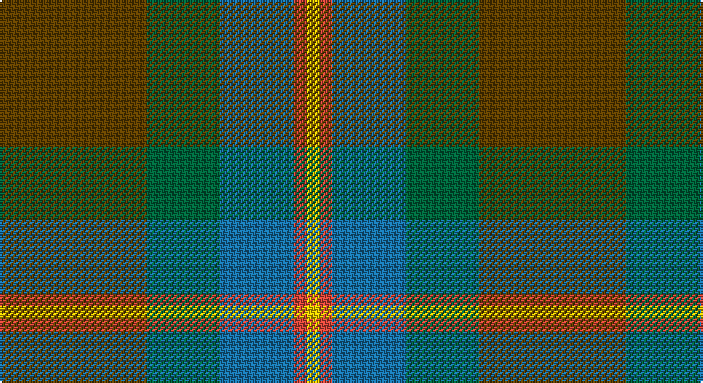

This page is one **sett** — a single exact thread-count. It belongs to the [tartan](/setts/dy46g23b23r4ly4/)
(the same proportion at any scale), whose colour order is pattern [GGBRY](/stripes/ggbry/).

Sourced from tartans-authority.  It is a [5 stripe tartan](/stripes/stripes5/).

Original link http://www.tartansauthority.com/tartan-ferret/display/3102/

## Also known as

This cloth is also recorded under:

- McMoosie Htg

2 attestations — the source records this cloth was collapsed from (oldest owns this page)

<ul>
<li>2002 — McMoosie Htg (Fashion) (tartans-authority, <a href="http://www.tartansauthority.com/tartan-ferret/display/3102/">record</a>)</li>
<li>undated — McMoosie Htg (register-of-tartans, <a href="https://www.tartanregister.gov.uk/tartanDetails.aspx?ref=4859">record</a>)</li>
</ul>

## Register references

External register numbers recorded for this tartan.

- Scottish Register of Tartans: [4859](https://www.tartanregister.gov.uk/tartanDetails.aspx?ref=4859)
- Scottish Tartans Authority (ITI): 3102

## Thread count
T/92 G46 B46 R8 Y/8

One full sett is **300 threads**.

## Palette

Palette: <strong>Tartan Register</strong> <small style="color:#888">(4 of 5 colours)</small>
<table><thead><tr><th>Colour</th><th>Threads</th><th>Shade</th><th>Base</th><th>OKLCh</th></tr></thead><tbody><tr><td>T/</td><td style="text-align:right;font-variant-numeric:tabular-nums">92</td><td><code style="background-color:#604000;">#604000</code> <small style="color:#888">#604000</small></td><td>G <code style="background-color:#006100;">#006100</code></td><td><small style="color:#888">oklch(39.8% 0.083 76.8)</small></td></tr><tr><td>G</td><td style="text-align:right;font-variant-numeric:tabular-nums">46</td><td><code style="background-color:#00643C;">#00643C</code> <small style="color:#888">#00643C</small></td><td>G <code style="background-color:#006100;">#006100</code></td><td><small style="color:#888">oklch(44.3% 0.104 157.7)</small></td></tr><tr><td>B</td><td style="text-align:right;font-variant-numeric:tabular-nums">46</td><td><code style="background-color:#1870A4;">#1870A4</code> <small style="color:#888">#1870A4</small></td><td>B <code style="background-color:#2A418A;">#2A418A</code></td><td><small style="color:#888">oklch(52.2% 0.113 241.2)</small></td></tr><tr><td>R</td><td style="text-align:right;font-variant-numeric:tabular-nums">8</td><td><code style="background-color:#CC4438;">#CC4438</code> <small style="color:#888">#CC4438</small></td><td>R <code style="background-color:#CC0000;">#CC0000</code></td><td><small style="color:#888">oklch(57.7% 0.174 28.7)</small></td></tr><tr><td>Y/</td><td style="text-align:right;font-variant-numeric:tabular-nums">8</td><td><code style="background-color:#E8C000;">#E8C000</code> <small style="color:#888">#E8C000</small></td><td>Y <code style="background-color:#F2BF00;">#F2BF00</code></td><td><small style="color:#888">oklch(81.9% 0.168 93.7)</small></td></tr></tbody></table>

# Sample pattern

## Nearest tartans

The nearest existing variants by ΔTartan distance, with this tartan at the top so the swatches line up against it.

ΔTartan

Tartan

Sett

—

<a href="/ttd/edit/#slug=dy46g23b23r4ly4~x2">McMoosie Htg (Fashion)</a> <a class="nn-out" href="/variants/s5/dy46g23b23r4ly4~x2/" title="open its dictionary page">↗</a>

1.02

<a href="/ttd/edit/#slug=dg6ly3dg26k10n30lb3~x2&amp;base=dy46g23b23r4ly4~x2">Montrose (1983)</a> <a class="nn-out" href="/variants/s6/dg6ly3dg26k10n30lb3~x2/" title="open its dictionary page">↗</a>

1.24

<a href="/ttd/edit/#slug=dt37dg37o8k3dp5~x2&amp;base=dy46g23b23r4ly4~x2">Dallard Personal Tartan</a> <a class="nn-out" href="/variants/s5/dt37dg37o8k3dp5~x2/" title="open its dictionary page">↗</a>

1.26

<a href="/ttd/edit/#slug=lo5y33dg33r6w2~x2&amp;base=dy46g23b23r4ly4~x2">Symington</a> <a class="nn-out" href="/variants/s5/lo5y33dg33r6w2~x2/" title="open its dictionary page">↗</a>

1.30

<a href="/variants/s7/dp3n24ni10n2g11n8w3~x2/">Hesco</a>

1.38

<a href="/ttd/edit/#slug=y19r3t19r11y19ly2db4~x2&amp;base=dy46g23b23r4ly4~x2">Rotary Corporate Tartan</a> <a class="nn-out" href="/variants/s7/y19r3t19r11y19ly2db4~x2/" title="open its dictionary page">↗</a>

1.41

<a href="/ttd/edit/#slug=g8n19dg29o16r4~x2&amp;base=dy46g23b23r4ly4~x2">Styrian (Fashion)</a> <a class="nn-out" href="/variants/s5/g8n19dg29o16r4~x2/" title="open its dictionary page">↗</a>

1.41

<a href="/ttd/edit/#slug=yi12dg2yi2dg2yi2dy8y8dy1~x2&amp;base=dy46g23b23r4ly4~x2">Ancient Universal (Fashion?)</a> <a class="nn-out" href="/variants/s8/yi12dg2yi2dg2yi2dy8y8dy1~x2/" title="open its dictionary page">↗</a>

1.42

<a href="/ttd/edit/#slug=g31dg7lo3dg14g8db18dp5~x2&amp;base=dy46g23b23r4ly4~x2">Reidy Wedding</a> <a class="nn-out" href="/variants/s7/g31dg7lo3dg14g8db18dp5~x2/" title="open its dictionary page">↗</a>

1.48

<a href="/ttd/edit/#slug=y27dr2y4o15db26k2db6~x2&amp;base=dy46g23b23r4ly4~x2">Bailies of Bennachie Corporate Tartan</a> <a class="nn-out" href="/variants/s7/y27dr2y4o15db26k2db6~x2/" title="open its dictionary page">↗</a>

1.51

<a href="/ttd/edit/#slug=dt14k5dp5k5dt14dg32r4~x2&amp;base=dy46g23b23r4ly4~x2">Bennachie (Whisky)</a> <a class="nn-out" href="/variants/s7/dt14k5dp5k5dt14dg32r4~x2/" title="open its dictionary page">↗</a>

## Neighbour map

Every grey dot is one of 14360 variants placed by the first two principal components of the ΔTartan feature space (44% of its variance). Red is this tartan; blue dots are its nearest — click one to open its page.

<svg viewBox="0 0 640 380" role="img" style="max-width:100%;height:auto;border:1px solid #e0e0e0;border-radius:4px;display:block" xmlns="http://www.w3.org/2000/svg"><image href="/nn/cloud.v1.png" width="640" height="380"/><a href="/variants/s6/dg6ly3dg26k10n30lb3~x2/"><circle cx="254.3" cy="228.9" r="4" fill="#3465a4"><title>Montrose (1983)</title></circle></a><a href="/variants/s5/dt37dg37o8k3dp5~x2/"><circle cx="287.7" cy="237.6" r="4" fill="#3465a4"><title>Dallard Personal Tartan</title></circle></a><a href="/variants/s5/lo5y33dg33r6w2~x2/"><circle cx="305.7" cy="219.4" r="4" fill="#3465a4"><title>Symington</title></circle></a><a href="/variants/s7/dp3n24ni10n2g11n8w3~x2/"><circle cx="323.8" cy="218.0" r="4" fill="#3465a4"><title>Hesco</title></circle></a><a href="/variants/s7/y19r3t19r11y19ly2db4~x2/"><circle cx="265.0" cy="226.0" r="4" fill="#3465a4"><title>Rotary Corporate Tartan</title></circle></a><a href="/variants/s5/g8n19dg29o16r4~x2/"><circle cx="194.9" cy="274.2" r="4" fill="#3465a4"><title>Styrian (Fashion)</title></circle></a><a href="/variants/s8/yi12dg2yi2dg2yi2dy8y8dy1~x2/"><circle cx="283.4" cy="227.7" r="4" fill="#3465a4"><title>Ancient Universal (Fashion?)</title></circle></a><a href="/variants/s7/g31dg7lo3dg14g8db18dp5~x2/"><circle cx="245.7" cy="231.8" r="4" fill="#3465a4"><title>Reidy Wedding</title></circle></a><a href="/variants/s7/y27dr2y4o15db26k2db6~x2/"><circle cx="261.2" cy="207.7" r="4" fill="#3465a4"><title>Bailies of Bennachie Corporate Tartan</title></circle></a><a href="/variants/s7/dt14k5dp5k5dt14dg32r4~x2/"><circle cx="252.8" cy="243.6" r="4" fill="#3465a4"><title>Bennachie (Whisky)</title></circle></a><circle cx="283.4" cy="239.5" r="5" fill="#c00000"/></svg>

ID: /variants/s5/dy46g23b23r4ly4~x2/
