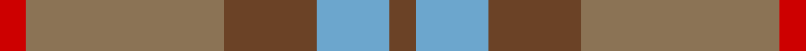
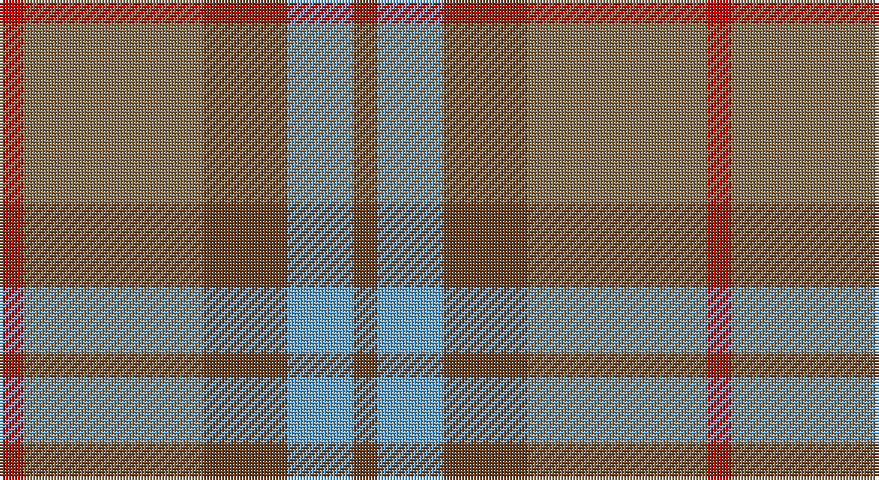

This page is one **sett** — a single exact thread-count. It belongs to the [tartan](/setts/dy4lg11dy14o30r4/)
(the same proportion at any scale), whose colour order is pattern [GYGRR](/stripes/gygrr/).

Part of the [Trinity Bicycles](/tartans/trinity-bicycles/) tartan — the named design grouping this sett with its other cloths.

Sourced from register-of-tartans.  It is a [5 stripe tartan](/stripes/stripes5/).

Original link https://www.tartanregister.gov.uk/tartanDetails.aspx?ref=10177

## Register references

External register numbers recorded for this tartan.

- Scottish Register of Tartans: [10177](https://www.tartanregister.gov.uk/tartanDetails.aspx?ref=10177)

## Thread count
R/8 LT60 T28 B22 T/8

One full sett is **236 threads**.

## Palette

Palette: <strong>custom</strong>
<table><thead><tr><th>Colour</th><th>Threads</th><th>Shade</th><th>Base</th><th>OKLCh</th></tr></thead><tbody><tr><td>R/</td><td style="text-align:right;font-variant-numeric:tabular-nums">8</td><td><code style="background-color:#CD0000;">#CD0000</code> <small style="color:#888">#CD0000</small></td><td>R <code style="background-color:#CC0000;">#CC0000</code></td><td><small style="color:#888">oklch(53.3% 0.219 29.2)</small></td></tr><tr><td>LT</td><td style="text-align:right;font-variant-numeric:tabular-nums">60</td><td><code style="background-color:#8B7355;">#8B7355</code> <small style="color:#888">#8B7355</small></td><td>R <code style="background-color:#CC0000;">#CC0000</code></td><td><small style="color:#888">oklch(57.1% 0.053 72.7)</small></td></tr><tr><td>T</td><td style="text-align:right;font-variant-numeric:tabular-nums">28</td><td><code style="background-color:#6B4226;">#6B4226</code> <small style="color:#888">#6B4226</small></td><td>G <code style="background-color:#006100;">#006100</code></td><td><small style="color:#888">oklch(42.1% 0.070 53.9)</small></td></tr><tr><td>B</td><td style="text-align:right;font-variant-numeric:tabular-nums">22</td><td><code style="background-color:#6CA6CD;">#6CA6CD</code> <small style="color:#888">#6CA6CD</small></td><td>Y <code style="background-color:#F2BF00;">#F2BF00</code></td><td><small style="color:#888">oklch(70.0% 0.083 239.0)</small></td></tr><tr><td>T/</td><td style="text-align:right;font-variant-numeric:tabular-nums">8</td><td><code style="background-color:#6B4226;">#6B4226</code> <small style="color:#888">#6B4226</small></td><td>G <code style="background-color:#006100;">#006100</code></td><td><small style="color:#888">oklch(42.1% 0.070 53.9)</small></td></tr></tbody></table>

# Sample pattern

## Nearest tartans

The nearest existing variants by ΔTartan distance, with this tartan at the top so the swatches line up against it.

ΔTartan

Tartan

Sett

—

<a href="/ttd/edit/#slug=dy4lg11dy14o30r4~x2">Trinity Bicycles</a> <a class="nn-out" href="/variants/s5/dy4lg11dy14o30r4~x2/" title="open its dictionary page">↗</a>

1.30

<a href="/ttd/edit/#slug=lr24o9n23ly3~x2&amp;base=dy4lg11dy14o30r4~x2">Porcelanosa</a> <a class="nn-out" href="/variants/s4/lr24o9n23ly3~x2/" title="open its dictionary page">↗</a>

1.47

<a href="/ttd/edit/#slug=n10lr3o3r1g1~x10&amp;base=dy4lg11dy14o30r4~x2">Bagpipe Shop, The (Corporate)</a> <a class="nn-out" href="/variants/s5/n10lr3o3r1g1~x10/" title="open its dictionary page">↗</a>

1.49

<a href="/ttd/edit/#slug=dg15r3n11b2~x2&amp;base=dy4lg11dy14o30r4~x2">MacNab WI 2</a> <a class="nn-out" href="/variants/s4/dg15r3n11b2~x2/" title="open its dictionary page">↗</a>

1.49

<a href="/ttd/edit/#slug=dg15r3n11b2&amp;base=dy4lg11dy14o30r4~x2">MacNab WI2</a> <a class="nn-out" href="/variants/s4/dg15r3n11b2/" title="open its dictionary page">↗</a>

1.49

<a href="/ttd/edit/#slug=r1o8r2db8t1~x2&amp;base=dy4lg11dy14o30r4~x2">Unamed, Riding cloak 1745</a> <a class="nn-out" href="/variants/s5/r1o8r2db8t1~x2/" title="open its dictionary page">↗</a>

1.52

<a href="/ttd/edit/#slug=dt1dy1dt7dy5y7lr1~x4&amp;base=dy4lg11dy14o30r4~x2">Dewar (WCWM)</a> <a class="nn-out" href="/variants/s6/dt1dy1dt7dy5y7lr1~x4/" title="open its dictionary page">↗</a>

1.66

<a href="/ttd/edit/#slug=r1o4g3o1db3o1~x2&amp;base=dy4lg11dy14o30r4~x2">Fraser Hunting</a> <a class="nn-out" href="/variants/s6/r1o4g3o1db3o1~x2/" title="open its dictionary page">↗</a>

1.68

<a href="/ttd/edit/#slug=o7r3o9g15db19o14r4~x2&amp;base=dy4lg11dy14o30r4~x2">Dorward</a> <a class="nn-out" href="/variants/s7/o7r3o9g15db19o14r4~x2/" title="open its dictionary page">↗</a>

1.69

<a href="/ttd/edit/#slug=g30lo3t8o25~x2&amp;base=dy4lg11dy14o30r4~x2">Dohmen Family (Zuid-Nederland)</a> <a class="nn-out" href="/variants/s4/g30lo3t8o25~x2/" title="open its dictionary page">↗</a>

1.69

<a href="/ttd/edit/#slug=n7r1dt6r8lr1~x8&amp;base=dy4lg11dy14o30r4~x2">Callum (Buchan) (Name)</a> <a class="nn-out" href="/variants/s5/n7r1dt6r8lr1~x8/" title="open its dictionary page">↗</a>

## Neighbour map

Every grey dot is one of 14360 variants placed by the first two principal components of the ΔTartan feature space (44% of its variance). Red is this tartan; blue dots are its nearest — click one to open its page.

<svg viewBox="0 0 640 380" role="img" style="max-width:100%;height:auto;border:1px solid #e0e0e0;border-radius:4px;display:block" xmlns="http://www.w3.org/2000/svg"><image href="/nn/cloud.v1.png" width="640" height="380"/><a href="/variants/s4/lr24o9n23ly3~x2/"><circle cx="281.2" cy="293.0" r="4" fill="#3465a4"><title>Porcelanosa</title></circle></a><a href="/variants/s5/n10lr3o3r1g1~x10/"><circle cx="363.7" cy="239.7" r="4" fill="#3465a4"><title>Bagpipe Shop, The (Corporate)</title></circle></a><a href="/variants/s4/dg15r3n11b2~x2/"><circle cx="335.6" cy="300.6" r="4" fill="#3465a4"><title>MacNab WI 2</title></circle></a><a href="/variants/s4/dg15r3n11b2/"><circle cx="335.6" cy="300.6" r="4" fill="#3465a4"><title>MacNab WI2</title></circle></a><a href="/variants/s5/r1o8r2db8t1~x2/"><circle cx="299.4" cy="264.4" r="4" fill="#3465a4"><title>Unamed, Riding cloak 1745</title></circle></a><a href="/variants/s6/dt1dy1dt7dy5y7lr1~x4/"><circle cx="256.3" cy="273.3" r="4" fill="#3465a4"><title>Dewar (WCWM)</title></circle></a><a href="/variants/s6/r1o4g3o1db3o1~x2/"><circle cx="242.5" cy="303.9" r="4" fill="#3465a4"><title>Fraser Hunting</title></circle></a><a href="/variants/s7/o7r3o9g15db19o14r4~x2/"><circle cx="230.3" cy="279.1" r="4" fill="#3465a4"><title>Dorward</title></circle></a><a href="/variants/s4/g30lo3t8o25~x2/"><circle cx="294.3" cy="259.0" r="4" fill="#3465a4"><title>Dohmen Family (Zuid-Nederland)</title></circle></a><a href="/variants/s5/n7r1dt6r8lr1~x8/"><circle cx="258.2" cy="263.9" r="4" fill="#3465a4"><title>Callum (Buchan) (Name)</title></circle></a><circle cx="317.1" cy="270.9" r="5" fill="#c00000"/></svg>

ID: /variants/s5/dy4lg11dy14o30r4~x2/
