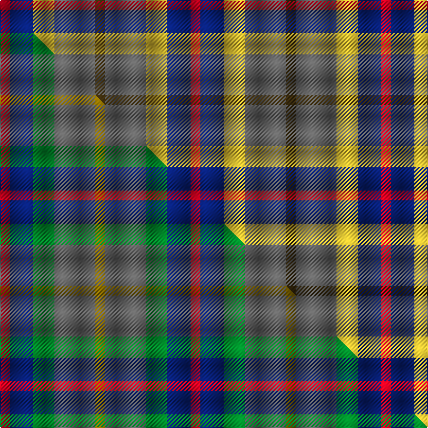

This page is one **sett** — a single exact thread-count. It belongs to the [tartan](/setts/dy5n21ly11db12r5/)
(the same proportion at any scale), whose colour order is pattern [GBYBR](/stripes/gbybr/).

Part of the [Inspiration](/tartans/inspiration/) tartan — the named design grouping this sett with its other cloths.

Sourced from tartans-authority.  It is a [5 stripe tartan](/stripes/stripes5/).

Original link http://www.tartansauthority.com/tartan-ferret/display/10893/

## Register references

External register numbers recorded for this tartan.

- Scottish Register of Tartans: [10893](https://www.tartanregister.gov.uk/tartanDetails?ref=10893)
- Scottish Tartans Authority (ITI): 10893

## Thread count
R/10 DB24 LY22 N42 DY/10

One full sett is **196 threads**.

## Palette
<table><thead><tr><th>Colour</th><th>Shade</th><th>OKLCh</th></tr></thead><tbody><tr><td>DB</td><td><code style="background-color:#082077;">#082077</code> <small style="color:#888">#082077</small></td><td><small style="color:#888">oklch(30.0% 0.149 265.1)</small></td></tr><tr><td>N</td><td><code style="background-color:#636363;">#636363</code> <small style="color:#888">#636363</small></td><td><small style="color:#888">oklch(50.0% 0.000 89.9)</small></td></tr><tr><td>R</td><td><code style="background-color:#D60020;">#D60020</code> <small style="color:#888">#D60020</small></td><td><small style="color:#888">oklch(55.2% 0.224 25.5)</small></td></tr><tr><td>LY</td><td><code style="background-color:#DCBC32;">#DCBC32</code> <small style="color:#888">#DCBC32</small></td><td><small style="color:#888">oklch(80.0% 0.150 95.2)</small></td></tr><tr><td>DY</td><td><code style="background-color:#3A2B0D;">#3A2B0D</code> <small style="color:#888">#3A2B0D</small></td><td><small style="color:#888">oklch(30.0% 0.049 82.0)</small></td></tr></tbody></table>

# Sample pattern

## Compared to the master

This cloth is one sett of its design; the master sett (the exemplar the design is anchored on) is below for comparison.

Its **ΔTartan distance** from the master is **1.00** — the same measure the nearest-tartans table ranks by (0 is identical; a re-scale of the same cloth is near 0, a recolour or a different proportion further).

<figure class="master-compare" style="margin:0">

this sett
master sett ★

<figcaption style="color:#888;font-size:smaller">One weave of this sett against the <a href="/setts/r5db12g11n21y5/">master sett ★</a>, split on the diagonal: a shared proportion runs seamlessly across it with only the shades shifting; a different proportion breaks on it.</figcaption>
</figure>

## Nearest tartan variants

The nearest existing variants by ΔTartan distance, with this cloth at the top so the swatches line up against it.

ΔTartan

Threads

Variant

Sett

—

196

<a href="/variants/s5/dy5n21ly11db12r5~x2/">Inspiration</a>

<a href="/ttd/edit/#slug=db27ly9w3dy16r7~x2&amp;base=dy5n21ly11db12r5~x2" title="compare in the TTD">0.87</a>

180

<a href="/variants/s5/db27ly9w3dy16r7~x2/">Unidentified (Sock Tie)</a>

<a href="/ttd/edit/#slug=r5db12g11n21y5~x2&amp;base=dy5n21ly11db12r5~x2" title="compare in the TTD">1.00</a>

196

<a href="/variants/s5/r5db12g11n21y5~x2/">Inspiration</a>

<a href="/ttd/edit/#slug=g15dg18dp23w4r8~x2&amp;base=dy5n21ly11db12r5~x2" title="compare in the TTD">1.96</a>

226

<a href="/variants/s5/g15dg18dp23w4r8~x2/">Friebe (2014)</a>

<a href="/ttd/edit/#slug=n25g25k6dp10r6~x2~n2203265-dp1502305&amp;base=dy5n21ly11db12r5~x2" title="compare in the TTD">2.24</a>

226

<a href="/variants/s5/n25g25k6dp10r6~x2~n2203265-dp1502305/">Breon (Jersey Shore, Pennsylvania) (Personal)</a>

<a href="/ttd/edit/#slug=r1db3dr1g3dr5lb1~x4&amp;base=dy5n21ly11db12r5~x2" title="compare in the TTD">2.26</a>

104

<a href="/variants/s6/r1db3dr1g3dr5lb1~x4/">Lanark (Fashion #1)</a>

<a href="/ttd/edit/#slug=g21db34r14w6~x2&amp;base=dy5n21ly11db12r5~x2" title="compare in the TTD">2.32</a>

246

<a href="/variants/s4/g21db34r14w6~x2/">Harbison (2015)</a>

<a href="/ttd/edit/#slug=dy19g23y3db15r11w5~x2&amp;base=dy5n21ly11db12r5~x2" title="compare in the TTD">2.33</a>

256

<a href="/variants/s6/dy19g23y3db15r11w5~x2/">Mekos, The</a>

<a href="/ttd/edit/#slug=dy19g23ly3db15r11w5~x2&amp;base=dy5n21ly11db12r5~x2" title="compare in the TTD">2.34</a>

256

<a href="/variants/s6/dy19g23ly3db15r11w5~x2/">Mekos, The</a>

<a href="/ttd/edit/#slug=r13y13g13db22w4~x2&amp;base=dy5n21ly11db12r5~x2" title="compare in the TTD">2.43</a>

226

<a href="/variants/s5/r13y13g13db22w4~x2/">Clan Haggis World (Corporate)</a>

<a href="/ttd/edit/#slug=lb1dp3r1g3lb1~x4&amp;base=dy5n21ly11db12r5~x2" title="compare in the TTD">2.64</a>

64

<a href="/variants/s5/lb1dp3r1g3lb1~x4/">Wilson's No.95</a>

## Neighbour map

Every grey dot is one of 13620 variants placed by the first two principal components of the ΔTartan feature space (42% of its variance). Red is this tartan; blue dots are its nearest — click one to open its page.

<svg viewBox="0 0 640 380" role="img" style="max-width:100%;height:auto;border:1px solid #e0e0e0;border-radius:4px;display:block" xmlns="http://www.w3.org/2000/svg"><image href="/nn/cloud.v1.png" width="640" height="380"/><a href="/variants/s5/db27ly9w3dy16r7~x2/"><circle cx="183.4" cy="220.6" r="4" fill="#3465a4"><title>Unidentified (Sock Tie)</title></circle></a><a href="/variants/s5/r5db12g11n21y5~x2/"><circle cx="201.7" cy="295.9" r="4" fill="#3465a4"><title>Inspiration</title></circle></a><a href="/variants/s5/g15dg18dp23w4r8~x2/"><circle cx="125.3" cy="264.9" r="4" fill="#3465a4"><title>Friebe (2014)</title></circle></a><a href="/variants/s5/n25g25k6dp10r6~x2~n2203265-dp1502305/"><circle cx="133.3" cy="262.1" r="4" fill="#3465a4"><title>Breon (Jersey Shore, Pennsylvania) (Personal)</title></circle></a><a href="/variants/s6/r1db3dr1g3dr5lb1~x4/"><circle cx="184.1" cy="249.7" r="4" fill="#3465a4"><title>Lanark (Fashion #1)</title></circle></a><a href="/variants/s4/g21db34r14w6~x2/"><circle cx="195.1" cy="277.2" r="4" fill="#3465a4"><title>Harbison (2015)</title></circle></a><a href="/variants/s6/dy19g23y3db15r11w5~x2/"><circle cx="96.4" cy="230.7" r="4" fill="#3465a4"><title>Mekos, The</title></circle></a><a href="/variants/s6/dy19g23ly3db15r11w5~x2/"><circle cx="91.7" cy="229.6" r="4" fill="#3465a4"><title>Mekos, The</title></circle></a><a href="/variants/s5/r13y13g13db22w4~x2/"><circle cx="107.4" cy="274.3" r="4" fill="#3465a4"><title>Clan Haggis World (Corporate)</title></circle></a><a href="/variants/s5/lb1dp3r1g3lb1~x4/"><circle cx="130.1" cy="296.2" r="4" fill="#3465a4"><title>Wilson's No.95</title></circle></a><circle cx="147.7" cy="273.9" r="5" fill="#c00000"/><text x="320" y="376" text-anchor="middle" font-size="11" fill="#999">ground</text><text x="11" y="190" text-anchor="middle" font-size="11" fill="#999" transform="rotate(-90 11 190)">complexity</text></svg>

ID: /variants/s5/dy5n21ly11db12r5~x2/
