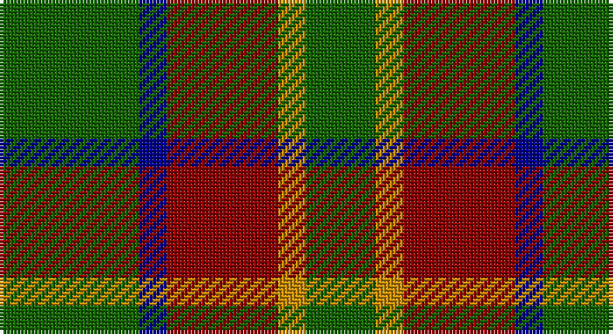

This page is one **sett** — a single exact thread-count. It belongs to the [tartan](/setts/g10db2r8lo2g5/)
(the same proportion at any scale), whose colour order is pattern [GBRYG](/stripes/gbryg/).

Sourced from register-of-tartans.  It is a [5 stripe tartan](/stripes/stripes5/).

Original link https://www.tartanregister.gov.uk/tartanDetails.aspx?ref=819

2 attestations — the source records this cloth was collapsed from (oldest owns this page)

<ul>
<li>01/01/2000 — Cub Scouts of America (register-of-tartans, <a href="https://www.tartanregister.gov.uk/tartanDetails.aspx?ref=819">record</a>)</li>
<li>pre 2000 — Cub Scouts of America (Corporate) (tartans-authority, <a href="http://www.tartansauthority.com/tartan-ferret/display/4119/">record</a>)</li>
</ul>

## Register references

External register numbers recorded for this tartan.

- Scottish Register of Tartans: [819](https://www.tartanregister.gov.uk/tartanDetails.aspx?ref=819)
- Scottish Tartans Authority (ITI): 4119

## Thread count
G/40 DB8 DR32 DY8 G/20

One full sett is **156 threads**.

## Palette

Palette: <strong>Tartan Register</strong> <small style="color:#888">(3 of 4 colours)</small>
<table><thead><tr><th>Colour</th><th>Threads</th><th>Shade</th><th>Base</th><th>OKLCh</th></tr></thead><tbody><tr><td>G/</td><td style="text-align:right;font-variant-numeric:tabular-nums">40</td><td><code style="background-color:#146400;">#146400</code> <small style="color:#888">#146400</small></td><td>G <code style="background-color:#006100;">#006100</code></td><td><small style="color:#888">oklch(43.9% 0.144 140.9)</small></td></tr><tr><td>DB</td><td style="text-align:right;font-variant-numeric:tabular-nums">8</td><td><code style="background-color:#00008C;">#00008C</code> <small style="color:#888">#00008C</small></td><td>B <code style="background-color:#2A418A;">#2A418A</code></td><td><small style="color:#888">oklch(28.9% 0.200 264.1)</small></td></tr><tr><td>DR</td><td style="text-align:right;font-variant-numeric:tabular-nums">32</td><td><code style="background-color:#8C0000;">#8C0000</code> <small style="color:#888">#8C0000</small></td><td>R <code style="background-color:#CC0000;">#CC0000</code></td><td><small style="color:#888">oklch(40.2% 0.165 29.2)</small></td></tr><tr><td>DY</td><td style="text-align:right;font-variant-numeric:tabular-nums">8</td><td><code style="background-color:#C88C00;">#C88C00</code> <small style="color:#888">#C88C00</small></td><td>Y <code style="background-color:#F2BF00;">#F2BF00</code></td><td><small style="color:#888">oklch(68.2% 0.142 78.2)</small></td></tr><tr><td>G/</td><td style="text-align:right;font-variant-numeric:tabular-nums">20</td><td><code style="background-color:#146400;">#146400</code> <small style="color:#888">#146400</small></td><td>G <code style="background-color:#006100;">#006100</code></td><td><small style="color:#888">oklch(43.9% 0.144 140.9)</small></td></tr></tbody></table>

# Sample pattern

## Nearest tartans

The nearest existing variants by ΔTartan distance, with this tartan at the top so the swatches line up against it.

ΔTartan

Tartan

Sett

—

<a href="/ttd/edit/#slug=g10db2r8lo2g5~x4">Cub Scouts of America</a> <a class="nn-out" href="/variants/s5/g10db2r8lo2g5~x4/" title="open its dictionary page">↗</a>

1.20

<a href="/ttd/edit/#slug=db6r15g41r15db20g41t6&amp;base=g10db2r8lo2g5~x4">Bean Hunting</a> <a class="nn-out" href="/variants/s7/db6r15g41r15db20g41t6/" title="open its dictionary page">↗</a>

1.29

<a href="/ttd/edit/#slug=g6k2r3k1~x4&amp;base=g10db2r8lo2g5~x4">Red Watch (Fashion) #1</a> <a class="nn-out" href="/variants/s4/g6k2r3k1~x4/" title="open its dictionary page">↗</a>

1.35

<a href="/ttd/edit/#slug=dg2y14dg8y3dg12lo2~x2&amp;base=g10db2r8lo2g5~x4">Confederate Cavalry (Military)</a> <a class="nn-out" href="/variants/s6/dg2y14dg8y3dg12lo2~x2/" title="open its dictionary page">↗</a>

1.37

<a href="/ttd/edit/#slug=g38r24k9r9~x2&amp;base=g10db2r8lo2g5~x4">Royal Guard of Oman 4th Band Squadron</a> <a class="nn-out" href="/variants/s4/g38r24k9r9~x2/" title="open its dictionary page">↗</a>

1.39

<a href="/ttd/edit/#slug=r5g20r5g20db24g6ly4&amp;base=g10db2r8lo2g5~x4">Cameron of Lochiel (Hunting) Clan/Family Tartan</a> <a class="nn-out" href="/variants/s7/r5g20r5g20db24g6ly4/" title="open its dictionary page">↗</a>

1.40

<a href="/ttd/edit/#slug=dg2o14dg8o3dg12r2~x2&amp;base=g10db2r8lo2g5~x4">Confederate Artillery</a> <a class="nn-out" href="/variants/s6/dg2o14dg8o3dg12r2~x2/" title="open its dictionary page">↗</a>

1.41

<a href="/ttd/edit/#slug=r20dg29db10dg16r6dg10k19~x2&amp;base=g10db2r8lo2g5~x4">MacDonagh (Name)</a> <a class="nn-out" href="/variants/s7/r20dg29db10dg16r6dg10k19~x2/" title="open its dictionary page">↗</a>

1.42

<a href="/ttd/edit/#slug=r20g29db10g16r6g10k19~x2&amp;base=g10db2r8lo2g5~x4">MacDonagh</a> <a class="nn-out" href="/variants/s7/r20g29db10g16r6g10k19~x2/" title="open its dictionary page">↗</a>

1.43

<a href="/ttd/edit/#slug=r5g7k2t1~x4&amp;base=g10db2r8lo2g5~x4">Wilson's No.195</a> <a class="nn-out" href="/variants/s4/r5g7k2t1~x4/" title="open its dictionary page">↗</a>

1.43

<a href="/ttd/edit/#slug=dt6r15g41r15dt20g41db6&amp;base=g10db2r8lo2g5~x4">Bean of Freeport Htg (Corporate)</a> <a class="nn-out" href="/variants/s7/dt6r15g41r15dt20g41db6/" title="open its dictionary page">↗</a>

## Neighbour map

Every grey dot is one of 14360 variants placed by the first two principal components of the ΔTartan feature space (44% of its variance). Red is this tartan; blue dots are its nearest — click one to open its page.

<svg viewBox="0 0 640 380" role="img" style="max-width:100%;height:auto;border:1px solid #e0e0e0;border-radius:4px;display:block" xmlns="http://www.w3.org/2000/svg"><image href="/nn/cloud.v1.png" width="640" height="380"/><a href="/variants/s7/db6r15g41r15db20g41t6/"><circle cx="283.8" cy="247.3" r="4" fill="#3465a4"><title>Bean Hunting</title></circle></a><a href="/variants/s4/g6k2r3k1~x4/"><circle cx="283.4" cy="302.7" r="4" fill="#3465a4"><title>Red Watch (Fashion) #1</title></circle></a><a href="/variants/s6/dg2y14dg8y3dg12lo2~x2/"><circle cx="336.6" cy="274.7" r="4" fill="#3465a4"><title>Confederate Cavalry (Military)</title></circle></a><a href="/variants/s4/g38r24k9r9~x2/"><circle cx="286.4" cy="318.8" r="4" fill="#3465a4"><title>Royal Guard of Oman 4th Band Squadron</title></circle></a><a href="/variants/s7/r5g20r5g20db24g6ly4/"><circle cx="263.7" cy="248.8" r="4" fill="#3465a4"><title>Cameron of Lochiel (Hunting) Clan/Family Tartan</title></circle></a><a href="/variants/s6/dg2o14dg8o3dg12r2~x2/"><circle cx="319.8" cy="263.9" r="4" fill="#3465a4"><title>Confederate Artillery</title></circle></a><a href="/variants/s7/r20dg29db10dg16r6dg10k19~x2/"><circle cx="209.2" cy="281.4" r="4" fill="#3465a4"><title>MacDonagh (Name)</title></circle></a><a href="/variants/s7/r20g29db10g16r6g10k19~x2/"><circle cx="196.9" cy="276.7" r="4" fill="#3465a4"><title>MacDonagh</title></circle></a><a href="/variants/s4/r5g7k2t1~x4/"><circle cx="232.3" cy="260.0" r="4" fill="#3465a4"><title>Wilson's No.195</title></circle></a><a href="/variants/s7/dt6r15g41r15dt20g41db6/"><circle cx="304.7" cy="259.1" r="4" fill="#3465a4"><title>Bean of Freeport Htg (Corporate)</title></circle></a><circle cx="279.2" cy="283.4" r="5" fill="#c00000"/></svg>

ID: /variants/s5/g10db2r8lo2g5~x4/
