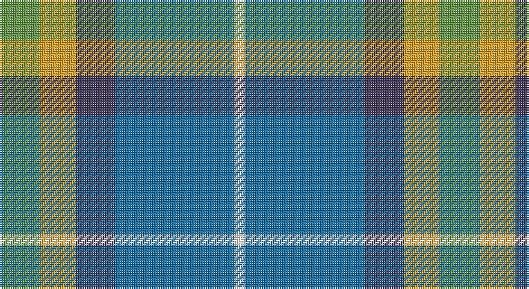

This page is one **sett** — a single exact thread-count. It belongs to the [tartan](/setts/g11lo10dp11b33w3/)
(the same proportion at any scale), whose colour order is pattern [GYBBW](/stripes/gybbw/).

Sourced from register-of-tartans.  It is a [5 stripe tartan](/stripes/stripes5/).

Original link https://www.tartanregister.gov.uk/tartanDetails.aspx?ref=10653

## Also known as

This cloth is also recorded under:

- Sterling, Rob (Persona

## Register references

External register numbers recorded for this tartan.

- Scottish Register of Tartans: [10653](https://www.tartanregister.gov.uk/tartanDetails.aspx?ref=10653)

## Thread count
LG/22 Y20 N22 B66 W/6

One full sett is **244 threads**.

## Palette

Palette: <strong>Tartan Register</strong> <small style="color:#888">(3 of 5 colours)</small>
<table><thead><tr><th>Colour</th><th>Threads</th><th>Shade</th><th>Base</th><th>OKLCh</th></tr></thead><tbody><tr><td>LG/</td><td style="text-align:right;font-variant-numeric:tabular-nums">22</td><td><code style="background-color:#649848;">#649848</code> <small style="color:#888">#649848</small></td><td>G <code style="background-color:#006100;">#006100</code></td><td><small style="color:#888">oklch(62.4% 0.125 135.7)</small></td></tr><tr><td>Y</td><td style="text-align:right;font-variant-numeric:tabular-nums">20</td><td><code style="background-color:#E0A126;">#E0A126</code> <small style="color:#888">#E0A126</small></td><td>Y <code style="background-color:#F2BF00;">#F2BF00</code></td><td><small style="color:#888">oklch(75.1% 0.146 78.3)</small></td></tr><tr><td>N</td><td style="text-align:right;font-variant-numeric:tabular-nums">22</td><td><code style="background-color:#433A5A;">#433A5A</code> <small style="color:#888">#433A5A</small></td><td>B <code style="background-color:#2A418A;">#2A418A</code></td><td><small style="color:#888">oklch(37.2% 0.055 296.6)</small></td></tr><tr><td>B</td><td style="text-align:right;font-variant-numeric:tabular-nums">66</td><td><code style="background-color:#1870A4;">#1870A4</code> <small style="color:#888">#1870A4</small></td><td>B <code style="background-color:#2A418A;">#2A418A</code></td><td><small style="color:#888">oklch(52.2% 0.113 241.2)</small></td></tr><tr><td>W/</td><td style="text-align:right;font-variant-numeric:tabular-nums">6</td><td><code style="background-color:#F9F5EF;">#F9F5EF</code> <small style="color:#888">#F9F5EF</small></td><td>W <code style="background-color:#F7F7F7;">#F7F7F7</code></td><td><small style="color:#888">oklch(97.2% 0.009 78.3)</small></td></tr></tbody></table>

# Sample pattern

## Nearest tartans

The nearest existing variants by ΔTartan distance, with this tartan at the top so the swatches line up against it.

ΔTartan

Tartan

Sett

—

<a href="/ttd/edit/#slug=g11lo10dp11b33w3~x2">Sterling, Rob (Florida) (Personal)</a> <a class="nn-out" href="/variants/s5/g11lo10dp11b33w3~x2/" title="open its dictionary page">↗</a>

0.57

<a href="/ttd/edit/#slug=g11lo10dt11b33w3~x2&amp;base=g11lo10dp11b33w3~x2">Sterling (Name)</a> <a class="nn-out" href="/variants/s5/g11lo10dt11b33w3~x2/" title="open its dictionary page">↗</a>

0.71

<a href="/ttd/edit/#slug=g11lo10dp11t33w3~x2&amp;base=g11lo10dp11b33w3~x2">Sterling, Rob (Florida) (Persona Name Tartan</a> <a class="nn-out" href="/variants/s5/g11lo10dp11t33w3~x2/" title="open its dictionary page">↗</a>

0.97

<a href="/ttd/edit/#slug=db9w4g36t36r4~x2&amp;base=g11lo10dp11b33w3~x2">Alvis of Lee (Personal)</a> <a class="nn-out" href="/variants/s5/db9w4g36t36r4~x2/" title="open its dictionary page">↗</a>

1.00

<a href="/ttd/edit/#slug=t4dg16ly2dp7t28w4~x2&amp;base=g11lo10dp11b33w3~x2">Manx Laxey (Blue)</a> <a class="nn-out" href="/variants/s6/t4dg16ly2dp7t28w4~x2/" title="open its dictionary page">↗</a>

1.02

<a href="/ttd/edit/#slug=t4g16ly2db7t28w4~x2&amp;base=g11lo10dp11b33w3~x2">Allanton (Fashion)</a> <a class="nn-out" href="/variants/s6/t4g16ly2db7t28w4~x2/" title="open its dictionary page">↗</a>

1.09

<a href="/ttd/edit/#slug=r15t98dt72ly25dt8w15&amp;base=g11lo10dp11b33w3~x2">Afternoon Tea / Earl Grey</a> <a class="nn-out" href="/variants/s6/r15t98dt72ly25dt8w15/" title="open its dictionary page">↗</a>

1.15

<a href="/ttd/edit/#slug=lb6lo6b21dt32r3~x2&amp;base=g11lo10dp11b33w3~x2">Jamieson, Robert (Personal)</a> <a class="nn-out" href="/variants/s5/lb6lo6b21dt32r3~x2/" title="open its dictionary page">↗</a>

1.17

<a href="/ttd/edit/#slug=db9w4g36t36r4&amp;base=g11lo10dp11b33w3~x2">Alvis of Lee (Personal)</a> <a class="nn-out" href="/variants/s5/db9w4g36t36r4/" title="open its dictionary page">↗</a>

1.29

<a href="/ttd/edit/#slug=n8ly2n22dg6r2lb10dg12n3~x2&amp;base=g11lo10dp11b33w3~x2">Bahamas</a> <a class="nn-out" href="/variants/s8/n8ly2n22dg6r2lb10dg12n3~x2/" title="open its dictionary page">↗</a>

1.30

<a href="/ttd/edit/#slug=b4g16ly2p7b28w4~x2&amp;base=g11lo10dp11b33w3~x2">Manx Laxey</a> <a class="nn-out" href="/variants/s6/b4g16ly2p7b28w4~x2/" title="open its dictionary page">↗</a>

## Neighbour map

Every grey dot is one of 14360 variants placed by the first two principal components of the ΔTartan feature space (44% of its variance). Red is this tartan; blue dots are its nearest — click one to open its page.

<svg viewBox="0 0 640 380" role="img" style="max-width:100%;height:auto;border:1px solid #e0e0e0;border-radius:4px;display:block" xmlns="http://www.w3.org/2000/svg"><image href="/nn/cloud.v1.png" width="640" height="380"/><a href="/variants/s5/g11lo10dt11b33w3~x2/"><circle cx="228.7" cy="219.6" r="4" fill="#3465a4"><title>Sterling (Name)</title></circle></a><a href="/variants/s5/g11lo10dp11t33w3~x2/"><circle cx="242.2" cy="215.6" r="4" fill="#3465a4"><title>Sterling, Rob (Florida) (Persona Name Tartan</title></circle></a><a href="/variants/s5/db9w4g36t36r4~x2/"><circle cx="221.1" cy="221.0" r="4" fill="#3465a4"><title>Alvis of Lee (Personal)</title></circle></a><a href="/variants/s6/t4dg16ly2dp7t28w4~x2/"><circle cx="273.2" cy="182.3" r="4" fill="#3465a4"><title>Manx Laxey (Blue)</title></circle></a><a href="/variants/s6/t4g16ly2db7t28w4~x2/"><circle cx="281.0" cy="190.4" r="4" fill="#3465a4"><title>Allanton (Fashion)</title></circle></a><a href="/variants/s6/r15t98dt72ly25dt8w15/"><circle cx="207.9" cy="186.9" r="4" fill="#3465a4"><title>Afternoon Tea / Earl Grey</title></circle></a><a href="/variants/s5/lb6lo6b21dt32r3~x2/"><circle cx="240.9" cy="214.8" r="4" fill="#3465a4"><title>Jamieson, Robert (Personal)</title></circle></a><a href="/variants/s5/db9w4g36t36r4/"><circle cx="213.3" cy="216.7" r="4" fill="#3465a4"><title>Alvis of Lee (Personal)</title></circle></a><a href="/variants/s8/n8ly2n22dg6r2lb10dg12n3~x2/"><circle cx="248.8" cy="196.4" r="4" fill="#3465a4"><title>Bahamas</title></circle></a><a href="/variants/s6/b4g16ly2p7b28w4~x2/"><circle cx="271.5" cy="176.2" r="4" fill="#3465a4"><title>Manx Laxey</title></circle></a><circle cx="229.1" cy="214.4" r="5" fill="#c00000"/></svg>

ID: /variants/s5/g11lo10dp11b33w3~x2/
