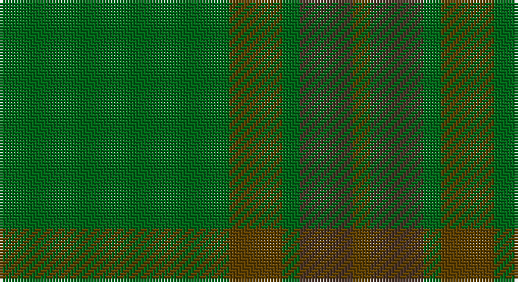

This page is one **sett** — a single exact thread-count. It belongs to the [tartan](/setts/g13dy3g1do3dy1/)
(the same proportion at any scale), whose colour order is pattern [GBGGG](/stripes/gbggg/).

Sourced from register-of-tartans.  It is a [5 stripe tartan](/stripes/stripes5/).

Original link https://www.tartanregister.gov.uk/tartanDetails.aspx?ref=1366

2 attestations — the source records this cloth was collapsed from (oldest owns this page)

<ul>
<li>01/01/2002 — Glen Boig (register-of-tartans, <a href="https://www.tartanregister.gov.uk/tartanDetails.aspx?ref=1366">record</a>)</li>
<li>pre 2002 — Glen Boig (Fashion) (tartans-authority, <a href="http://www.tartansauthority.com/tartan-ferret/display/915/">record</a>)</li>
</ul>

## Register references

External register numbers recorded for this tartan.

- Scottish Register of Tartans: [1366](https://www.tartanregister.gov.uk/tartanDetails.aspx?ref=1366)
- Scottish Tartans Authority (ITI): 915
- Scottish Tartans World Register: 915

## Thread count
G/78 T18 G6 Ta18 T/6

One full sett is **168 threads**.

## Palette

Palette: <strong>Tartan Register</strong>
<table><thead><tr><th>Colour</th><th>Threads</th><th>Shade</th><th>Base</th><th>OKLCh</th></tr></thead><tbody><tr><td>G/</td><td style="text-align:right;font-variant-numeric:tabular-nums">78</td><td><code style="background-color:#006818;">#006818</code> <small style="color:#888">#006818</small></td><td>G <code style="background-color:#006100;">#006100</code></td><td><small style="color:#888">oklch(45.0% 0.142 145.0)</small></td></tr><tr><td>T</td><td style="text-align:right;font-variant-numeric:tabular-nums">18</td><td><code style="background-color:#604000;">#604000</code> <small style="color:#888">#604000</small></td><td>G <code style="background-color:#006100;">#006100</code></td><td><small style="color:#888">oklch(39.8% 0.083 76.8)</small></td></tr><tr><td>G</td><td style="text-align:right;font-variant-numeric:tabular-nums">6</td><td><code style="background-color:#006818;">#006818</code> <small style="color:#888">#006818</small></td><td>G <code style="background-color:#006100;">#006100</code></td><td><small style="color:#888">oklch(45.0% 0.142 145.0)</small></td></tr><tr><td>Ta</td><td style="text-align:right;font-variant-numeric:tabular-nums">18</td><td><code style="background-color:#4C3428;">#4C3428</code> <small style="color:#888">#4C3428</small></td><td>B <code style="background-color:#2A418A;">#2A418A</code></td><td><small style="color:#888">oklch(34.9% 0.040 47.5)</small></td></tr><tr><td>T/</td><td style="text-align:right;font-variant-numeric:tabular-nums">6</td><td><code style="background-color:#604000;">#604000</code> <small style="color:#888">#604000</small></td><td>G <code style="background-color:#006100;">#006100</code></td><td><small style="color:#888">oklch(39.8% 0.083 76.8)</small></td></tr></tbody></table>

# Sample pattern

## Nearest tartans

The nearest existing variants by ΔTartan distance, with this tartan at the top so the swatches line up against it.

ΔTartan

Tartan

Sett

—

<a href="/ttd/edit/#slug=g13dy3g1do3dy1~x6">Glen Boig</a> <a class="nn-out" href="/variants/s5/g13dy3g1do3dy1~x6/" title="open its dictionary page">↗</a>

1.30

<a href="/ttd/edit/#slug=y37dy9y3do9dy3~x2&amp;base=g13dy3g1do3dy1~x6">Glen Boig Trade Tartan</a> <a class="nn-out" href="/variants/s5/y37dy9y3do9dy3~x2/" title="open its dictionary page">↗</a>

1.37

<a href="/ttd/edit/#slug=gi40dg15g4dg4g4~x2&amp;base=g13dy3g1do3dy1~x6">Celtic 2009 (Sports)</a> <a class="nn-out" href="/variants/s5/gi40dg15g4dg4g4~x2/" title="open its dictionary page">↗</a>

1.63

<a href="/ttd/edit/#slug=dg18r6dg75db6dg13dy35dg12db6&amp;base=g13dy3g1do3dy1~x6">Gayre Bodyguard</a> <a class="nn-out" href="/variants/s8/dg18r6dg75db6dg13dy35dg12db6/" title="open its dictionary page">↗</a>

1.64

<a href="/ttd/edit/#slug=y9yi52dy15ly4~x2&amp;base=g13dy3g1do3dy1~x6">McGuigan, Julia (St Monans, Fife) (Personal)</a> <a class="nn-out" href="/variants/s4/y9yi52dy15ly4~x2/" title="open its dictionary page">↗</a>

1.87

<a href="/ttd/edit/#slug=dg3dy30dg40r3~x2&amp;base=g13dy3g1do3dy1~x6">Sanix Muted</a> <a class="nn-out" href="/variants/s4/dg3dy30dg40r3~x2/" title="open its dictionary page">↗</a>

1.89

<a href="/ttd/edit/#slug=dg2g2gi7dg10gi1g1~x4&amp;base=g13dy3g1do3dy1~x6">Emerald, The</a> <a class="nn-out" href="/variants/s6/dg2g2gi7dg10gi1g1~x4/" title="open its dictionary page">↗</a>

2.15

<a href="/ttd/edit/#slug=dg5g3dg24g24dg3g5~x2&amp;base=g13dy3g1do3dy1~x6">Erskine Hunting</a> <a class="nn-out" href="/variants/s6/dg5g3dg24g24dg3g5~x2/" title="open its dictionary page">↗</a>

2.19

<a href="/ttd/edit/#slug=dgi24r2dgi2dg40dgi25dg2dgi2r2dgi2dg20~x2&amp;base=g13dy3g1do3dy1~x6">Donachie of Brockloch Hunting Clan Tartan</a> <a class="nn-out" href="/variants/s10/dgi24r2dgi2dg40dgi25dg2dgi2r2dgi2dg20~x2/" title="open its dictionary page">↗</a>

2.32

<a href="/ttd/edit/#slug=dg27dgi39db3dgi3db4dgi3db3dgi39db3dgi3db4dgi3~x2&amp;base=g13dy3g1do3dy1~x6">Montgomerie/Montgomery</a> <a class="nn-out" href="/variants/s12/dg27dgi39db3dgi3db4dgi3db3dgi39db3dgi3db4dgi3~x2/" title="open its dictionary page">↗</a>

2.38

<a href="/ttd/edit/#slug=y50dy25ly2dp6~x2&amp;base=g13dy3g1do3dy1~x6">Highland Greenford (Personal)</a> <a class="nn-out" href="/variants/s4/y50dy25ly2dp6~x2/" title="open its dictionary page">↗</a>

## Neighbour map

Every grey dot is one of 14360 variants placed by the first two principal components of the ΔTartan feature space (44% of its variance). Red is this tartan; blue dots are its nearest — click one to open its page.

<svg viewBox="0 0 640 380" role="img" style="max-width:100%;height:auto;border:1px solid #e0e0e0;border-radius:4px;display:block" xmlns="http://www.w3.org/2000/svg"><image href="/nn/cloud.v1.png" width="640" height="380"/><a href="/variants/s5/y37dy9y3do9dy3~x2/"><circle cx="554.6" cy="298.1" r="4" fill="#3465a4"><title>Glen Boig Trade Tartan</title></circle></a><a href="/variants/s5/gi40dg15g4dg4g4~x2/"><circle cx="488.1" cy="307.3" r="4" fill="#3465a4"><title>Celtic 2009 (Sports)</title></circle></a><a href="/variants/s8/dg18r6dg75db6dg13dy35dg12db6/"><circle cx="541.3" cy="270.0" r="4" fill="#3465a4"><title>Gayre Bodyguard</title></circle></a><a href="/variants/s4/y9yi52dy15ly4~x2/"><circle cx="537.9" cy="304.1" r="4" fill="#3465a4"><title>McGuigan, Julia (St Monans, Fife) (Personal)</title></circle></a><a href="/variants/s4/dg3dy30dg40r3~x2/"><circle cx="537.0" cy="335.5" r="4" fill="#3465a4"><title>Sanix Muted</title></circle></a><a href="/variants/s6/dg2g2gi7dg10gi1g1~x4/"><circle cx="447.4" cy="317.8" r="4" fill="#3465a4"><title>Emerald, The</title></circle></a><a href="/variants/s6/dg5g3dg24g24dg3g5~x2/"><circle cx="477.7" cy="340.1" r="4" fill="#3465a4"><title>Erskine Hunting</title></circle></a><a href="/variants/s10/dgi24r2dgi2dg40dgi25dg2dgi2r2dgi2dg20~x2/"><circle cx="516.3" cy="268.5" r="4" fill="#3465a4"><title>Donachie of Brockloch Hunting Clan Tartan</title></circle></a><a href="/variants/s12/dg27dgi39db3dgi3db4dgi3db3dgi39db3dgi3db4dgi3~x2/"><circle cx="549.4" cy="255.1" r="4" fill="#3465a4"><title>Montgomerie/Montgomery</title></circle></a><a href="/variants/s4/y50dy25ly2dp6~x2/"><circle cx="505.5" cy="261.9" r="4" fill="#3465a4"><title>Highland Greenford (Personal)</title></circle></a><circle cx="568.6" cy="306.9" r="5" fill="#c00000"/></svg>

ID: /variants/s5/g13dy3g1do3dy1~x6/
