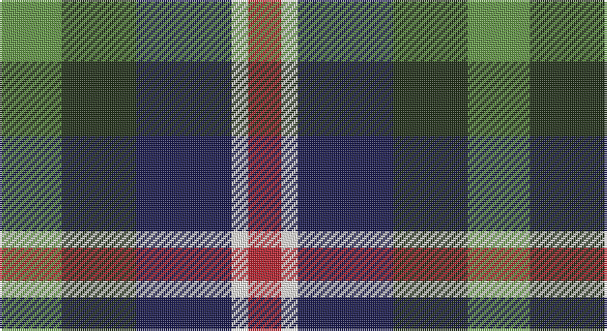

This page is one **sett** — a single exact thread-count. It belongs to the [tartan](/setts/g15dg18db23w4r8/)
(the same proportion at any scale), whose colour order is pattern [GGBWR](/stripes/ggbwr/).

Part of the [Friebe](/tartans/friebe/) tartan — the named design grouping this sett with its other cloths.

Sourced from register-of-tartans.  It is a [5 stripe tartan](/stripes/stripes5/).

Original link https://www.tartanregister.gov.uk/tartanDetails.aspx?ref=11171

## Register references

External register numbers recorded for this tartan.

- Scottish Register of Tartans: [11171](https://www.tartanregister.gov.uk/tartanDetails.aspx?ref=11171)

## Thread count
LG/30 K36 DB46 W8 R/16

One full sett is **226 threads**.

## Palette

Palette: <strong>Logan (The Scottish Gael, 1831)</strong> <small style="color:#888">(2 of 5 colours)</small>
<table><thead><tr><th>Colour</th><th>Threads</th><th>Shade</th><th>Base</th><th>OKLCh</th></tr></thead><tbody><tr><td>LG/</td><td style="text-align:right;font-variant-numeric:tabular-nums">30</td><td><code style="background-color:#649848;">#649848</code> <small style="color:#888">#649848</small></td><td>G <code style="background-color:#006100;">#006100</code></td><td><small style="color:#888">oklch(62.4% 0.125 135.7)</small></td></tr><tr><td>K</td><td style="text-align:right;font-variant-numeric:tabular-nums">36</td><td><code style="background-color:#23321B;">#23321B</code> <small style="color:#888">#23321B</small></td><td>G <code style="background-color:#006100;">#006100</code></td><td><small style="color:#888">oklch(29.7% 0.045 135.3)</small></td></tr><tr><td>DB</td><td style="text-align:right;font-variant-numeric:tabular-nums">46</td><td><code style="background-color:#1C1C50;">#1C1C50</code> <small style="color:#888">#1C1C50</small></td><td>B <code style="background-color:#2A418A;">#2A418A</code></td><td><small style="color:#888">oklch(26.2% 0.093 277.9)</small></td></tr><tr><td>W</td><td style="text-align:right;font-variant-numeric:tabular-nums">8</td><td><code style="background-color:#F9F5EF;">#F9F5EF</code> <small style="color:#888">#F9F5EF</small></td><td>W <code style="background-color:#F7F7F7;">#F7F7F7</code></td><td><small style="color:#888">oklch(97.2% 0.009 78.3)</small></td></tr><tr><td>R/</td><td style="text-align:right;font-variant-numeric:tabular-nums">16</td><td><code style="background-color:#B62531;">#B62531</code> <small style="color:#888">#B62531</small></td><td>R <code style="background-color:#CC0000;">#CC0000</code></td><td><small style="color:#888">oklch(50.8% 0.180 22.7)</small></td></tr></tbody></table>

# Sample pattern

## Nearest tartans

The nearest existing variants by ΔTartan distance, with this tartan at the top so the swatches line up against it.

ΔTartan

Tartan

Sett

—

<a href="/ttd/edit/#slug=g15dg18db23w4r8~x2">Friebe (2014)</a> <a class="nn-out" href="/variants/s5/g15dg18db23w4r8~x2/" title="open its dictionary page">↗</a>

0.55

<a href="/ttd/edit/#slug=dp11t2k10g10ly3~x2&amp;base=g15dg18db23w4r8~x2">Nobiliary Fraternity</a> <a class="nn-out" href="/variants/s5/dp11t2k10g10ly3~x2/" title="open its dictionary page">↗</a>

0.79

<a href="/ttd/edit/#slug=dp11y2k10g10lo2~x2&amp;base=g15dg18db23w4r8~x2">Selkirk (Name)</a> <a class="nn-out" href="/variants/s5/dp11y2k10g10lo2~x2/" title="open its dictionary page">↗</a>

0.79

<a href="/ttd/edit/#slug=g15dg18dt23w4r8~x2&amp;base=g15dg18db23w4r8~x2">Friebe (2014)</a> <a class="nn-out" href="/variants/s5/g15dg18dt23w4r8~x2/" title="open its dictionary page">↗</a>

0.85

<a href="/ttd/edit/#slug=dp2g6k2db6k1r2~x4&amp;base=g15dg18db23w4r8~x2">MacCaughan, or MacEachain</a> <a class="nn-out" href="/variants/s6/dp2g6k2db6k1r2~x4/" title="open its dictionary page">↗</a>

0.86

<a href="/ttd/edit/#slug=r1dy6db2lb4k4lb1~x6&amp;base=g15dg18db23w4r8~x2">Thompson's Fancy (Fashion)</a> <a class="nn-out" href="/variants/s6/r1dy6db2lb4k4lb1~x6/" title="open its dictionary page">↗</a>

0.87

<a href="/ttd/edit/#slug=r4g11k11g2n11ly3~x4&amp;base=g15dg18db23w4r8~x2">Casely (Name)</a> <a class="nn-out" href="/variants/s6/r4g11k11g2n11ly3~x4/" title="open its dictionary page">↗</a>

0.94

<a href="/ttd/edit/#slug=k19t10dp19dg40ly10&amp;base=g15dg18db23w4r8~x2">Gala Water Old</a> <a class="nn-out" href="/variants/s5/k19t10dp19dg40ly10/" title="open its dictionary page">↗</a>

0.96

<a href="/ttd/edit/#slug=k3g8k8r2db8w2~x2&amp;base=g15dg18db23w4r8~x2">Mitchell Family Tartan</a> <a class="nn-out" href="/variants/s6/k3g8k8r2db8w2~x2/" title="open its dictionary page">↗</a>

1.03

<a href="/ttd/edit/#slug=r5t12ly11dt21lo5~x2&amp;base=g15dg18db23w4r8~x2">Inspiration</a> <a class="nn-out" href="/variants/s5/r5t12ly11dt21lo5~x2/" title="open its dictionary page">↗</a>

1.03

<a href="/ttd/edit/#slug=k19t10dp19g40ly10&amp;base=g15dg18db23w4r8~x2">Gallowater Old District Tartan</a> <a class="nn-out" href="/variants/s5/k19t10dp19g40ly10/" title="open its dictionary page">↗</a>

## Neighbour map

Every grey dot is one of 14360 variants placed by the first two principal components of the ΔTartan feature space (44% of its variance). Red is this tartan; blue dots are its nearest — click one to open its page.

<svg viewBox="0 0 640 380" role="img" style="max-width:100%;height:auto;border:1px solid #e0e0e0;border-radius:4px;display:block" xmlns="http://www.w3.org/2000/svg"><image href="/nn/cloud.v1.png" width="640" height="380"/><a href="/variants/s5/dp11t2k10g10ly3~x2/"><circle cx="87.8" cy="247.3" r="4" fill="#3465a4"><title>Nobiliary Fraternity</title></circle></a><a href="/variants/s5/dp11y2k10g10lo2~x2/"><circle cx="111.6" cy="248.1" r="4" fill="#3465a4"><title>Selkirk (Name)</title></circle></a><a href="/variants/s5/g15dg18dt23w4r8~x2/"><circle cx="104.3" cy="262.5" r="4" fill="#3465a4"><title>Friebe (2014)</title></circle></a><a href="/variants/s6/dp2g6k2db6k1r2~x4/"><circle cx="94.1" cy="227.1" r="4" fill="#3465a4"><title>MacCaughan, or MacEachain</title></circle></a><a href="/variants/s6/r1dy6db2lb4k4lb1~x6/"><circle cx="87.4" cy="220.3" r="4" fill="#3465a4"><title>Thompson's Fancy (Fashion)</title></circle></a><a href="/variants/s6/r4g11k11g2n11ly3~x4/"><circle cx="98.4" cy="244.4" r="4" fill="#3465a4"><title>Casely (Name)</title></circle></a><a href="/variants/s5/k19t10dp19dg40ly10/"><circle cx="113.4" cy="262.7" r="4" fill="#3465a4"><title>Gala Water Old</title></circle></a><a href="/variants/s6/k3g8k8r2db8w2~x2/"><circle cx="94.7" cy="257.5" r="4" fill="#3465a4"><title>Mitchell Family Tartan</title></circle></a><a href="/variants/s5/r5t12ly11dt21lo5~x2/"><circle cx="97.7" cy="247.8" r="4" fill="#3465a4"><title>Inspiration</title></circle></a><a href="/variants/s5/k19t10dp19g40ly10/"><circle cx="108.6" cy="257.2" r="4" fill="#3465a4"><title>Gallowater Old District Tartan</title></circle></a><circle cx="91.0" cy="251.4" r="5" fill="#c00000"/></svg>

ID: /variants/s5/g15dg18db23w4r8~x2/
