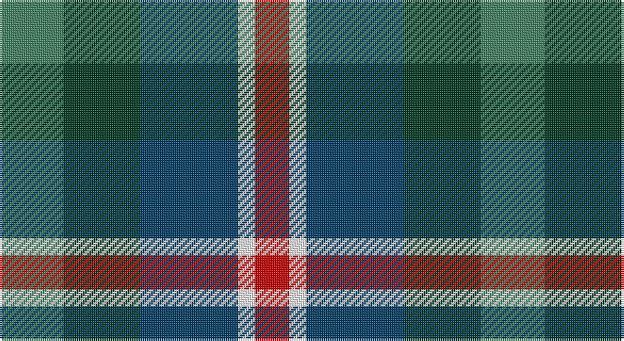

This page is one **sett** — a single exact thread-count. It belongs to the [tartan](/setts/g15dg18dt23w4r8/)
(the same proportion at any scale), whose colour order is pattern [GGBWR](/stripes/ggbwr/).

Part of the [Friebe](/tartans/friebe/) tartan — the named design grouping this sett with its other cloths.

Sourced from tartans-authority.  It is a [5 stripe tartan](/stripes/stripes5/).

Original link http://www.tartansauthority.com/tartan-ferret/display/11171/

## Register references

External register numbers recorded for this tartan.

- Scottish Register of Tartans: [11171](https://www.tartanregister.gov.uk/tartanDetails?ref=11171)
- Scottish Tartans Authority (ITI): 11171

## Thread count
G/30 DG36 DB46 W8 R/16

One full sett is **226 threads**.

## Palette

Palette: <strong>Tartan Register</strong>
<table><thead><tr><th>Colour</th><th>Threads</th><th>Shade</th><th>Base</th><th>OKLCh</th></tr></thead><tbody><tr><td>G/</td><td style="text-align:right;font-variant-numeric:tabular-nums">30</td><td><code style="background-color:#408060;">#408060</code> <small style="color:#888">#408060</small></td><td>G <code style="background-color:#006100;">#006100</code></td><td><small style="color:#888">oklch(54.8% 0.084 160.1)</small></td></tr><tr><td>DG</td><td style="text-align:right;font-variant-numeric:tabular-nums">36</td><td><code style="background-color:#003820;">#003820</code> <small style="color:#888">#003820</small></td><td>G <code style="background-color:#006100;">#006100</code></td><td><small style="color:#888">oklch(30.0% 0.070 158.3)</small></td></tr><tr><td>DB</td><td style="text-align:right;font-variant-numeric:tabular-nums">46</td><td><code style="background-color:#003C64;">#003C64</code> <small style="color:#888">#003C64</small></td><td>B <code style="background-color:#2A418A;">#2A418A</code></td><td><small style="color:#888">oklch(34.5% 0.089 246.0)</small></td></tr><tr><td>W</td><td style="text-align:right;font-variant-numeric:tabular-nums">8</td><td><code style="background-color:#FCFCFC;">#FCFCFC</code> <small style="color:#888">#FCFCFC</small></td><td>W <code style="background-color:#F7F7F7;">#F7F7F7</code></td><td><small style="color:#888">oklch(99.1% 0.000 89.9)</small></td></tr><tr><td>R/</td><td style="text-align:right;font-variant-numeric:tabular-nums">16</td><td><code style="background-color:#C80000;">#C80000</code> <small style="color:#888">#C80000</small></td><td>R <code style="background-color:#CC0000;">#CC0000</code></td><td><small style="color:#888">oklch(52.3% 0.215 29.2)</small></td></tr></tbody></table>

# Sample pattern

## Compared to the master

This cloth is one sett of its design; the master sett (the exemplar the design is anchored on) is below for comparison.

<figure style="margin:0"><figcaption style="color:#888;font-size:smaller">this sett</figcaption></figure>
<figure style="margin:0"><figcaption style="color:#888;font-size:smaller"><a href="/setts/g15dg18db23w4r8/">master sett →</a></figcaption></figure>

## Nearest tartans

The nearest existing variants by ΔTartan distance, with this tartan at the top so the swatches line up against it.

ΔTartan

Tartan

Sett

—

<a href="/ttd/edit/#slug=g15dg18dt23w4r8~x2">Friebe (2014)</a> <a class="nn-out" href="/variants/s5/g15dg18dt23w4r8~x2/" title="open its dictionary page">↗</a>

0.71

<a href="/ttd/edit/#slug=r4g11k11g2n11ly3~x4&amp;base=g15dg18dt23w4r8~x2">Casely (Name)</a> <a class="nn-out" href="/variants/s6/r4g11k11g2n11ly3~x4/" title="open its dictionary page">↗</a>

0.79

<a href="/ttd/edit/#slug=g15dg18db23w4r8~x2&amp;base=g15dg18dt23w4r8~x2">Friebe (2014)</a> <a class="nn-out" href="/variants/s5/g15dg18db23w4r8~x2/" title="open its dictionary page">↗</a>

0.97

<a href="/ttd/edit/#slug=r1db6k3dg6w1~x4&amp;base=g15dg18dt23w4r8~x2">Davidson of Tulloch #2</a> <a class="nn-out" href="/variants/s5/r1db6k3dg6w1~x4/" title="open its dictionary page">↗</a>

1.03

<a href="/ttd/edit/#slug=k4g16k14lo3n16r4~x2&amp;base=g15dg18dt23w4r8~x2">Birse</a> <a class="nn-out" href="/variants/s6/k4g16k14lo3n16r4~x2/" title="open its dictionary page">↗</a>

1.04

<a href="/ttd/edit/#slug=k19t10dp19dg40ly10&amp;base=g15dg18dt23w4r8~x2">Gala Water Old</a> <a class="nn-out" href="/variants/s5/k19t10dp19dg40ly10/" title="open its dictionary page">↗</a>

1.10

<a href="/ttd/edit/#slug=r9dt6db13dt21y18w4~x2&amp;base=g15dg18dt23w4r8~x2">Fox-Eves Wedding</a> <a class="nn-out" href="/variants/s6/r9dt6db13dt21y18w4~x2/" title="open its dictionary page">↗</a>

1.12

<a href="/ttd/edit/#slug=r1db7k7g7w1~x6&amp;base=g15dg18dt23w4r8~x2">Davidson of Tulloch (Clan)</a> <a class="nn-out" href="/variants/s5/r1db7k7g7w1~x6/" title="open its dictionary page">↗</a>

1.16

<a href="/ttd/edit/#slug=k2ly1dg6k6db6w1~x4&amp;base=g15dg18dt23w4r8~x2">Dyce #3</a> <a class="nn-out" href="/variants/s6/k2ly1dg6k6db6w1~x4/" title="open its dictionary page">↗</a>

1.18

<a href="/ttd/edit/#slug=k6t2db12g8r5k2g3~x4&amp;base=g15dg18dt23w4r8~x2">Cooke (Personal)</a> <a class="nn-out" href="/variants/s7/k6t2db12g8r5k2g3~x4/" title="open its dictionary page">↗</a>

1.18

<a href="/ttd/edit/#slug=k3g8k8r2db8w2~x2&amp;base=g15dg18dt23w4r8~x2">Mitchell Family Tartan</a> <a class="nn-out" href="/variants/s6/k3g8k8r2db8w2~x2/" title="open its dictionary page">↗</a>

## Neighbour map

Every grey dot is one of 14360 variants placed by the first two principal components of the ΔTartan feature space (44% of its variance). Red is this tartan; blue dots are its nearest — click one to open its page.

<svg viewBox="0 0 640 380" role="img" style="max-width:100%;height:auto;border:1px solid #e0e0e0;border-radius:4px;display:block" xmlns="http://www.w3.org/2000/svg"><image href="/nn/cloud.v1.png" width="640" height="380"/><a href="/variants/s6/r4g11k11g2n11ly3~x4/"><circle cx="98.4" cy="244.4" r="4" fill="#3465a4"><title>Casely (Name)</title></circle></a><a href="/variants/s5/g15dg18db23w4r8~x2/"><circle cx="91.0" cy="251.4" r="4" fill="#3465a4"><title>Friebe (2014)</title></circle></a><a href="/variants/s5/r1db6k3dg6w1~x4/"><circle cx="146.7" cy="248.4" r="4" fill="#3465a4"><title>Davidson of Tulloch #2</title></circle></a><a href="/variants/s6/k4g16k14lo3n16r4~x2/"><circle cx="127.3" cy="255.8" r="4" fill="#3465a4"><title>Birse</title></circle></a><a href="/variants/s5/k19t10dp19dg40ly10/"><circle cx="113.4" cy="262.7" r="4" fill="#3465a4"><title>Gala Water Old</title></circle></a><a href="/variants/s6/r9dt6db13dt21y18w4~x2/"><circle cx="123.0" cy="255.8" r="4" fill="#3465a4"><title>Fox-Eves Wedding</title></circle></a><a href="/variants/s5/r1db7k7g7w1~x6/"><circle cx="126.6" cy="242.8" r="4" fill="#3465a4"><title>Davidson of Tulloch (Clan)</title></circle></a><a href="/variants/s6/k2ly1dg6k6db6w1~x4/"><circle cx="135.4" cy="240.4" r="4" fill="#3465a4"><title>Dyce #3</title></circle></a><a href="/variants/s7/k6t2db12g8r5k2g3~x4/"><circle cx="114.2" cy="236.5" r="4" fill="#3465a4"><title>Cooke (Personal)</title></circle></a><a href="/variants/s6/k3g8k8r2db8w2~x2/"><circle cx="94.7" cy="257.5" r="4" fill="#3465a4"><title>Mitchell Family Tartan</title></circle></a><circle cx="104.3" cy="262.5" r="5" fill="#c00000"/></svg>

ID: /variants/s5/g15dg18dt23w4r8~x2/
