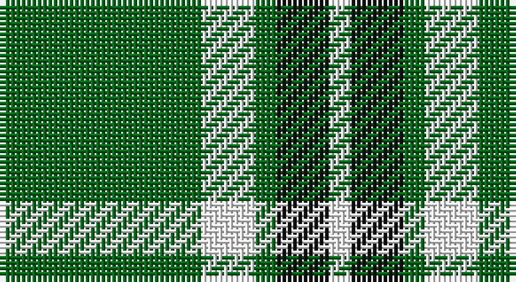

This page is one **sett** — a single exact thread-count. It belongs to the [tartan](/setts/g19w5g2k5w2/)
(the same proportion at any scale), whose colour order is pattern [GWGKW](/stripes/gwgkw/).

Part of the [Loch Rannoch](/tartans/loch-rannoch/) tartan — the named design grouping this sett with its other cloths.

Sourced from register-of-tartans.  It is a [5 stripe tartan](/stripes/stripes5/).

Original link https://www.tartanregister.gov.uk/tartanDetails.aspx?ref=2156

## Also known as

This cloth is also recorded under:

- Loch Rannoch #2
- Loch Rannoch Fancy

## Register references

External register numbers recorded for this tartan.

- Scottish Register of Tartans: [2156](https://www.tartanregister.gov.uk/tartanDetails.aspx?ref=2156)
- Scottish Tartans Authority (ITI): 943
- Scottish Tartans World Register: 943

## Thread count
G/38 W10 G4 K10 W/4

One full sett is **90 threads**.

## Palette

Palette: <strong>Tartan Register</strong>
<table><thead><tr><th>Colour</th><th>Threads</th><th>Shade</th><th>Base</th><th>OKLCh</th></tr></thead><tbody><tr><td>G/</td><td style="text-align:right;font-variant-numeric:tabular-nums">38</td><td><code style="background-color:#006818;">#006818</code> <small style="color:#888">#006818</small></td><td>G <code style="background-color:#006100;">#006100</code></td><td><small style="color:#888">oklch(45.0% 0.142 145.0)</small></td></tr><tr><td>W</td><td style="text-align:right;font-variant-numeric:tabular-nums">10</td><td><code style="background-color:#FCFCFC;">#FCFCFC</code> <small style="color:#888">#FCFCFC</small></td><td>W <code style="background-color:#F7F7F7;">#F7F7F7</code></td><td><small style="color:#888">oklch(99.1% 0.000 89.9)</small></td></tr><tr><td>G</td><td style="text-align:right;font-variant-numeric:tabular-nums">4</td><td><code style="background-color:#006818;">#006818</code> <small style="color:#888">#006818</small></td><td>G <code style="background-color:#006100;">#006100</code></td><td><small style="color:#888">oklch(45.0% 0.142 145.0)</small></td></tr><tr><td>K</td><td style="text-align:right;font-variant-numeric:tabular-nums">10</td><td><code style="background-color:#101010;">#101010</code> <small style="color:#888">#101010</small></td><td>K <code style="background-color:#000000;">#000000</code></td><td><small style="color:#888">oklch(17.3% 0.000 89.9)</small></td></tr><tr><td>W/</td><td style="text-align:right;font-variant-numeric:tabular-nums">4</td><td><code style="background-color:#FCFCFC;">#FCFCFC</code> <small style="color:#888">#FCFCFC</small></td><td>W <code style="background-color:#F7F7F7;">#F7F7F7</code></td><td><small style="color:#888">oklch(99.1% 0.000 89.9)</small></td></tr></tbody></table>

# Sample pattern

## Compared to the master

This cloth is one sett of its design; the master sett (the exemplar the design is anchored on) is below for comparison.

<figure style="margin:0"><figcaption style="color:#888;font-size:smaller">this sett</figcaption></figure>
<figure style="margin:0"><figcaption style="color:#888;font-size:smaller"><a href="/setts/dy24g2dy5o14g2o5lo17dy2/">master sett →</a></figcaption></figure>

## Nearest tartans

The nearest existing variants by ΔTartan distance, with this tartan at the top so the swatches line up against it.

ΔTartan

Tartan

Sett

—

<a href="/ttd/edit/#slug=g19w5g2k5w2~x2">Loch Rannoch</a> <a class="nn-out" href="/variants/s5/g19w5g2k5w2~x2/" title="open its dictionary page">↗</a>

0.75

<a href="/ttd/edit/#slug=g37w9g3k9w3&amp;base=g19w5g2k5w2~x2">Loch Rannoch</a> <a class="nn-out" href="/variants/s5/g37w9g3k9w3/" title="open its dictionary page">↗</a>

1.20

<a href="/ttd/edit/#slug=dg11ly1dg1ly6k1ly1~x8&amp;base=g19w5g2k5w2~x2">Big Spruce Brewing</a> <a class="nn-out" href="/variants/s6/dg11ly1dg1ly6k1ly1~x8/" title="open its dictionary page">↗</a>

1.33

<a href="/ttd/edit/#slug=dg21ly43dg86t10&amp;base=g19w5g2k5w2~x2">Special Saffron Tartan</a> <a class="nn-out" href="/variants/s4/dg21ly43dg86t10/" title="open its dictionary page">↗</a>

1.44

<a href="/ttd/edit/#slug=dg20w2dg9w2ly5w7dg10~x2&amp;base=g19w5g2k5w2~x2">Heritage #2</a> <a class="nn-out" href="/variants/s7/dg20w2dg9w2ly5w7dg10~x2/" title="open its dictionary page">↗</a>

1.47

<a href="/ttd/edit/#slug=dg11lo1dg1lo6k1lo1~x4&amp;base=g19w5g2k5w2~x2">Big Spruce Brewing</a> <a class="nn-out" href="/variants/s6/dg11lo1dg1lo6k1lo1~x4/" title="open its dictionary page">↗</a>

1.48

<a href="/ttd/edit/#slug=g8w4g50k12g4k15lo5~x2&amp;base=g19w5g2k5w2~x2">Instakilt, Green (Fashion)</a> <a class="nn-out" href="/variants/s7/g8w4g50k12g4k15lo5~x2/" title="open its dictionary page">↗</a>

1.52

<a href="/variants/s4/dg20w5r3~x2/">Juchter (Personal)</a>

1.58

<a href="/ttd/edit/#slug=p4g10w1r1~x2&amp;base=g19w5g2k5w2~x2">Wilson's, No 189</a> <a class="nn-out" href="/variants/s4/p4g10w1r1~x2/" title="open its dictionary page">↗</a>

1.64

<a href="/ttd/edit/#slug=k3lb1g15g6k2dr3lb2~x2&amp;base=g19w5g2k5w2~x2">Leach Hunting</a> <a class="nn-out" href="/variants/s7/k3lb1g15g6k2dr3lb2~x2/" title="open its dictionary page">↗</a>

1.65

<a href="/ttd/edit/#slug=w12k3g50w3k13lo6~x2&amp;base=g19w5g2k5w2~x2">Limerick County Crest (Fashion)</a> <a class="nn-out" href="/variants/s6/w12k3g50w3k13lo6~x2/" title="open its dictionary page">↗</a>

## Neighbour map

Every grey dot is one of 14360 variants placed by the first two principal components of the ΔTartan feature space (44% of its variance). Red is this tartan; blue dots are its nearest — click one to open its page.

<svg viewBox="0 0 640 380" role="img" style="max-width:100%;height:auto;border:1px solid #e0e0e0;border-radius:4px;display:block" xmlns="http://www.w3.org/2000/svg"><image href="/nn/cloud.v1.png" width="640" height="380"/><a href="/variants/s5/g37w9g3k9w3/"><circle cx="356.6" cy="204.0" r="4" fill="#3465a4"><title>Loch Rannoch</title></circle></a><a href="/variants/s6/dg11ly1dg1ly6k1ly1~x8/"><circle cx="329.2" cy="192.7" r="4" fill="#3465a4"><title>Big Spruce Brewing</title></circle></a><a href="/variants/s4/dg21ly43dg86t10/"><circle cx="356.7" cy="255.8" r="4" fill="#3465a4"><title>Special Saffron Tartan</title></circle></a><a href="/variants/s7/dg20w2dg9w2ly5w7dg10~x2/"><circle cx="371.6" cy="226.4" r="4" fill="#3465a4"><title>Heritage #2</title></circle></a><a href="/variants/s6/dg11lo1dg1lo6k1lo1~x4/"><circle cx="350.7" cy="201.7" r="4" fill="#3465a4"><title>Big Spruce Brewing</title></circle></a><a href="/variants/s7/g8w4g50k12g4k15lo5~x2/"><circle cx="337.8" cy="177.2" r="4" fill="#3465a4"><title>Instakilt, Green (Fashion)</title></circle></a><a href="/variants/s4/dg20w5r3~x2/"><circle cx="305.6" cy="243.6" r="4" fill="#3465a4"><title>Juchter (Personal)</title></circle></a><a href="/variants/s4/p4g10w1r1~x2/"><circle cx="342.5" cy="220.7" r="4" fill="#3465a4"><title>Wilson's, No 189</title></circle></a><a href="/variants/s7/k3lb1g15g6k2dr3lb2~x2/"><circle cx="351.1" cy="180.2" r="4" fill="#3465a4"><title>Leach Hunting</title></circle></a><a href="/variants/s6/w12k3g50w3k13lo6~x2/"><circle cx="308.9" cy="166.7" r="4" fill="#3465a4"><title>Limerick County Crest (Fashion)</title></circle></a><circle cx="332.3" cy="217.2" r="5" fill="#c00000"/></svg>

ID: /variants/s5/g19w5g2k5w2~x2/
