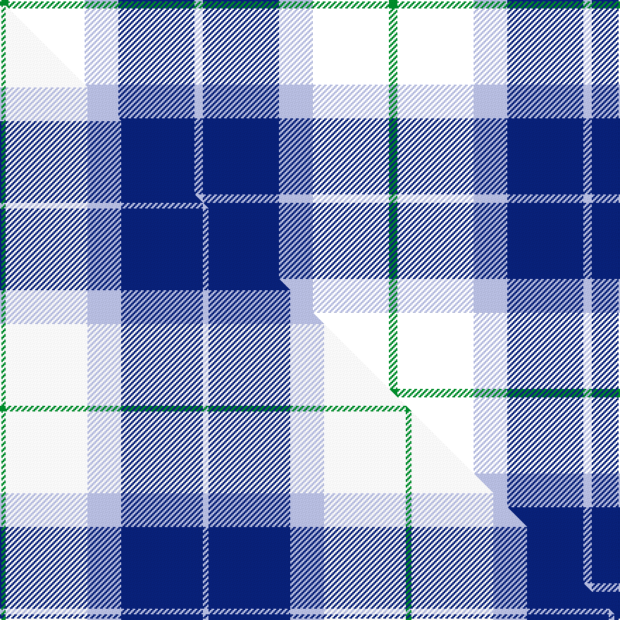

This page is one **sett** — a single exact thread-count. It belongs to the [tartan](/setts/g1k9lb4db9lb1/)
(the same proportion at any scale), whose colour order is pattern [GKWBW](/stripes/gkwbw/).

Part of the [Wallace Blue Dress](/tartans/wallace-blue-dress/) tartan — the named design grouping this sett with its other cloths.

Sourced from house-of-tartan.  It is a [5 stripe tartan](/stripes/stripes5/).

Original link http://www.house-of-tartan.scotland.net/house/TartanViewjs.asp?colr=Def&tnam=6569

## Provenance

Earliest known date:

## Thread count
G/6 K54 LB24 DB54 LB/6

One full sett is **276 threads**.

## Palette
<table><thead><tr><th>Colour</th><th>Shade</th><th>OKLCh</th></tr></thead><tbody><tr><td>LB</td><td><code style="background-color:#B5BBDE;">#B5BBDE</code> <small style="color:#888">#B5BBDE</small></td><td><small style="color:#888">oklch(79.9% 0.050 277.6)</small></td></tr><tr><td>DB</td><td><code style="background-color:#082077;">#082077</code> <small style="color:#888">#082077</small></td><td><small style="color:#888">oklch(30.0% 0.149 265.1)</small></td></tr><tr><td>G</td><td><code style="background-color:#008B2A;">#008B2A</code> <small style="color:#888">#008B2A</small></td><td><small style="color:#888">oklch(55.4% 0.170 145.9)</small></td></tr><tr><td>W</td><td><code style="background-color:#F7F7F7;">#F7F7F7</code> <small style="color:#888">#F7F7F7</small></td><td><small style="color:#888">oklch(97.6% 0.000 89.9)</small></td></tr></tbody></table>

# Sample pattern

## Compared to the master

This cloth is one sett of its design; the master sett (the exemplar the design is anchored on) is below for comparison.

Its **ΔTartan distance** from the master is **4.00** — the same measure the nearest-tartans table ranks by (0 is identical; a re-scale of the same cloth is near 0, a recolour or a different proportion further).

<figure class="master-compare" style="margin:0">

this sett
master sett ★

<figcaption style="color:#888;font-size:smaller">One weave of this sett against the <a href="/setts/g2w29lb12db29lb2/">master sett ★</a>, split on the diagonal: a shared proportion runs seamlessly across it with only the shades shifting; a different proportion breaks on it.</figcaption>
</figure>

## Nearest tartan variants

The nearest existing variants by ΔTartan distance, with this cloth at the top so the swatches line up against it.

ΔTartan

Threads

Variant

Sett

—

276

<a href="/variants/s5/g1k9lb4db9lb1~x6/">Wallace Blue Dress Tartan</a>

<a href="/ttd/edit/#slug=lb1db11k11g11k2lb1~x2&amp;base=g1k9lb4db9lb1~x6" title="compare in the TTD">1.94</a>

144

<a href="/variants/s6/lb1db11k11g11k2lb1~x2/">Unidentified No 59</a>

<a href="/ttd/edit/#slug=w2db12b1k12b12k1~x2&amp;base=g1k9lb4db9lb1~x6" title="compare in the TTD">2.03</a>

154

<a href="/variants/s6/w2db12b1k12b12k1~x2/">Dutch</a>

<a href="/ttd/edit/#slug=r4db24k12g14k4lb3~x2&amp;base=g1k9lb4db9lb1~x6" title="compare in the TTD">2.06</a>

230

<a href="/variants/s6/r4db24k12g14k4lb3~x2/">MacPhail Hunting #2</a>

<a href="/ttd/edit/#slug=lr2r1t7k7lb1~x8~lr2800000-lb3501240&amp;base=g1k9lb4db9lb1~x6" title="compare in the TTD">2.31</a>

264

<a href="/variants/s5/lr2r1t7k7lb1~x8~lr2800000-lb3501240/">Bryson (1988) (Name)</a>

<a href="/ttd/edit/#slug=k2g12k11db12w1~x2&amp;base=g1k9lb4db9lb1~x6" title="compare in the TTD">2.59</a>

146

<a href="/variants/s5/k2g12k11db12w1~x2/">MacKirdy</a>

<a href="/ttd/edit/#slug=k19db18w9r3~x4&amp;base=g1k9lb4db9lb1~x6" title="compare in the TTD">2.69</a>

304

<a href="/variants/s4/k19db18w9r3~x4/">Raven (Fashion)</a>

<a href="/ttd/edit/#slug=db3g12k13w2db13w3~x2&amp;base=g1k9lb4db9lb1~x6" title="compare in the TTD">2.78</a>

172

<a href="/variants/s6/db3g12k13w2db13w3~x2/">Herd/Hurd (Name)</a>

<a href="/ttd/edit/#slug=db3g12k13w2db13w3~x2~db1406275&amp;base=g1k9lb4db9lb1~x6" title="compare in the TTD">2.78</a>

172

<a href="/variants/s6/db3g12k13w2db13w3~x2~db1406275/">Herd/Hurd</a>

<a href="/ttd/edit/#slug=w3k25n9db17ly3~x2&amp;base=g1k9lb4db9lb1~x6" title="compare in the TTD">2.79</a>

216

<a href="/variants/s5/w3k25n9db17ly3~x2/">Teylu Coleman (Name)</a>

<a href="/ttd/edit/#slug=db2g12k13w1db13w2~x2&amp;base=g1k9lb4db9lb1~x6" title="compare in the TTD">2.79</a>

164

<a href="/variants/s6/db2g12k13w1db13w2~x2/">Herd Family Tartan</a>

## Neighbour map

Every grey dot is one of 13620 variants placed by the first two principal components of the ΔTartan feature space (42% of its variance). Red is this tartan; blue dots are its nearest — click one to open its page.

<svg viewBox="0 0 640 380" role="img" style="max-width:100%;height:auto;border:1px solid #e0e0e0;border-radius:4px;display:block" xmlns="http://www.w3.org/2000/svg"><image href="/nn/cloud.v1.png" width="640" height="380"/><a href="/variants/s6/lb1db11k11g11k2lb1~x2/"><circle cx="150.9" cy="197.3" r="4" fill="#3465a4"><title>Unidentified No 59</title></circle></a><a href="/variants/s6/w2db12b1k12b12k1~x2/"><circle cx="155.4" cy="193.4" r="4" fill="#3465a4"><title>Dutch</title></circle></a><a href="/variants/s6/r4db24k12g14k4lb3~x2/"><circle cx="132.2" cy="198.5" r="4" fill="#3465a4"><title>MacPhail Hunting #2</title></circle></a><a href="/variants/s5/lr2r1t7k7lb1~x8~lr2800000-lb3501240/"><circle cx="136.0" cy="204.9" r="4" fill="#3465a4"><title>Bryson (1988) (Name)</title></circle></a><a href="/variants/s5/k2g12k11db12w1~x2/"><circle cx="150.2" cy="214.2" r="4" fill="#3465a4"><title>MacKirdy</title></circle></a><a href="/variants/s4/k19db18w9r3~x4/"><circle cx="126.7" cy="247.7" r="4" fill="#3465a4"><title>Raven (Fashion)</title></circle></a><a href="/variants/s6/db3g12k13w2db13w3~x2/"><circle cx="107.1" cy="227.4" r="4" fill="#3465a4"><title>Herd/Hurd (Name)</title></circle></a><a href="/variants/s6/db3g12k13w2db13w3~x2~db1406275/"><circle cx="108.4" cy="226.8" r="4" fill="#3465a4"><title>Herd/Hurd</title></circle></a><a href="/variants/s5/w3k25n9db17ly3~x2/"><circle cx="160.3" cy="200.4" r="4" fill="#3465a4"><title>Teylu Coleman (Name)</title></circle></a><a href="/variants/s6/db2g12k13w1db13w2~x2/"><circle cx="147.5" cy="192.1" r="4" fill="#3465a4"><title>Herd Family Tartan</title></circle></a><circle cx="159.6" cy="210.7" r="5" fill="#c00000"/><text x="320" y="376" text-anchor="middle" font-size="11" fill="#999">ground</text><text x="11" y="190" text-anchor="middle" font-size="11" fill="#999" transform="rotate(-90 11 190)">complexity</text></svg>

ID: /variants/s5/g1k9lb4db9lb1~x6/
