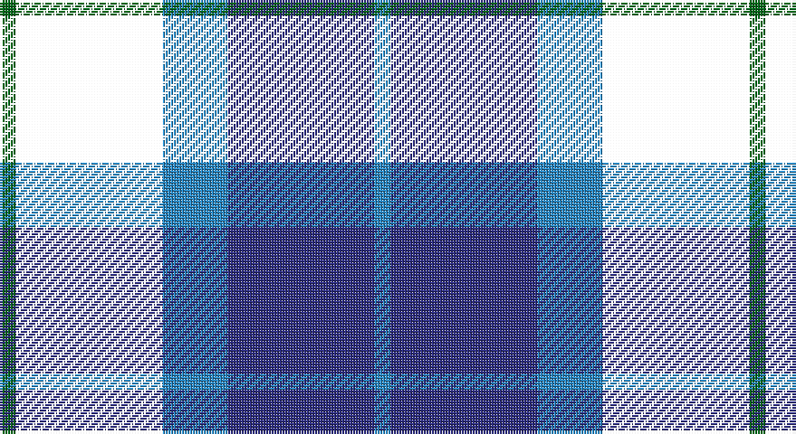

This page is one **sett** — a single exact thread-count. It belongs to the [tartan](/setts/g1k9t4db9t1/)
(the same proportion at any scale), whose colour order is pattern [BBBKG](/stripes/bbbkg/).

Part of the [Wallace Blue Dress](/tartans/wallace-blue-dress/) tartan — the named design grouping this sett with its other cloths.

Sourced from house-of-tartan.  It is a [5 stripe tartan](/stripes/stripes5/).

Original link http://www.house-of-tartan.scotland.net/house/TartanViewjs.asp?colr=Def&tnam=6569

## Provenance

Earliest known date:

## Thread count
G/6 W54 B24 DB54 B/6

One full sett is **276 threads**.

## Palette

Palette: <strong>Tartan Register</strong>
<table><thead><tr><th>Colour</th><th>Threads</th><th>Shade</th><th>Base</th><th>OKLCh</th></tr></thead><tbody><tr><td>G/</td><td style="text-align:right;font-variant-numeric:tabular-nums">6</td><td><code style="background-color:#006818;">#006818</code> <small style="color:#888">#006818</small></td><td>G <code style="background-color:#006100;">#006100</code></td><td><small style="color:#888">oklch(45.0% 0.142 145.0)</small></td></tr><tr><td></td><td style="text-align:right;font-variant-numeric:tabular-nums">54</td><td><code style="background-color:;"></code> <small style="color:#888"></small></td><td> <code style="background-color:;"></code></td><td><small style="color:#888"></small></td></tr><tr><td>B</td><td style="text-align:right;font-variant-numeric:tabular-nums">24</td><td><code style="background-color:#2888C4;">#2888C4</code> <small style="color:#888">#2888C4</small></td><td>B <code style="background-color:#2A418A;">#2A418A</code></td><td><small style="color:#888">oklch(60.1% 0.125 241.5)</small></td></tr><tr><td>DB</td><td style="text-align:right;font-variant-numeric:tabular-nums">54</td><td><code style="background-color:#2C2C80;">#2C2C80</code> <small style="color:#888">#2C2C80</small></td><td>B <code style="background-color:#2A418A;">#2A418A</code></td><td><small style="color:#888">oklch(35.0% 0.138 276.6)</small></td></tr><tr><td>B/</td><td style="text-align:right;font-variant-numeric:tabular-nums">6</td><td><code style="background-color:#2888C4;">#2888C4</code> <small style="color:#888">#2888C4</small></td><td>B <code style="background-color:#2A418A;">#2A418A</code></td><td><small style="color:#888">oklch(60.1% 0.125 241.5)</small></td></tr></tbody></table>

# Sample pattern

## Compared to the master

This cloth is one sett of its design; the master sett (the exemplar the design is anchored on) is below for comparison.

<figure style="margin:0"><figcaption style="color:#888;font-size:smaller">this sett</figcaption></figure>
<figure style="margin:0"><figcaption style="color:#888;font-size:smaller"><a href="/setts/g2w29t12db29t2/">master sett →</a></figcaption></figure>

## Nearest tartans

The nearest existing variants by ΔTartan distance, with this tartan at the top so the swatches line up against it.

ΔTartan

Tartan

Sett

—

<a href="/ttd/edit/#slug=g1k9t4db9t1~x6">Wallace Blue Dress Tartan</a> <a class="nn-out" href="/variants/s5/g1k9t4db9t1~x6/" title="open its dictionary page">↗</a>

0.93

<a href="/ttd/edit/#slug=r2db9k5g6db1~x4&amp;base=g1k9t4db9t1~x6">Frobo Nairn</a> <a class="nn-out" href="/variants/s5/r2db9k5g6db1~x4/" title="open its dictionary page">↗</a>

1.11

<a href="/ttd/edit/#slug=r7k4db28k24t24k4db4~x2&amp;base=g1k9t4db9t1~x6">MacCorquodale</a> <a class="nn-out" href="/variants/s7/r7k4db28k24t24k4db4~x2/" title="open its dictionary page">↗</a>

1.14

<a href="/ttd/edit/#slug=n6db3n6db20k20db8w4~x2&amp;base=g1k9t4db9t1~x6">Allianz Deutschland 2012</a> <a class="nn-out" href="/variants/s7/n6db3n6db20k20db8w4~x2/" title="open its dictionary page">↗</a>

1.21

<a href="/ttd/edit/#slug=m3db17dt13m2k20w2~x2&amp;base=g1k9t4db9t1~x6">Commonwealth Games</a> <a class="nn-out" href="/variants/s6/m3db17dt13m2k20w2~x2/" title="open its dictionary page">↗</a>

1.22

<a href="/ttd/edit/#slug=dg8lb2dg1k12db12k1~x2&amp;base=g1k9t4db9t1~x6">Graham of Menteith</a> <a class="nn-out" href="/variants/s6/dg8lb2dg1k12db12k1~x2/" title="open its dictionary page">↗</a>

1.25

<a href="/ttd/edit/#slug=k2lb2dg8db8lb1&amp;base=g1k9t4db9t1~x6">Douglas</a> <a class="nn-out" href="/variants/s5/k2lb2dg8db8lb1/" title="open its dictionary page">↗</a>

1.30

<a href="/ttd/edit/#slug=k4lb2dg8db8lb1&amp;base=g1k9t4db9t1~x6">Douglas Green</a> <a class="nn-out" href="/variants/s5/k4lb2dg8db8lb1/" title="open its dictionary page">↗</a>

1.32

<a href="/ttd/edit/#slug=k5lb2dg18k17dp16k3&amp;base=g1k9t4db9t1~x6">Melville</a> <a class="nn-out" href="/variants/s6/k5lb2dg18k17dp16k3/" title="open its dictionary page">↗</a>

1.35

<a href="/variants/s6/ki6db50k29b6k29db6/">Scottish Express International</a>

1.37

<a href="/ttd/edit/#slug=k7lt3dg18db18w2~x2&amp;base=g1k9t4db9t1~x6">Bhatti</a> <a class="nn-out" href="/variants/s5/k7lt3dg18db18w2~x2/" title="open its dictionary page">↗</a>

## Neighbour map

Every grey dot is one of 14360 variants placed by the first two principal components of the ΔTartan feature space (44% of its variance). Red is this tartan; blue dots are its nearest — click one to open its page.

<svg viewBox="0 0 640 380" role="img" style="max-width:100%;height:auto;border:1px solid #e0e0e0;border-radius:4px;display:block" xmlns="http://www.w3.org/2000/svg"><image href="/nn/cloud.v1.png" width="640" height="380"/><a href="/variants/s5/r2db9k5g6db1~x4/"><circle cx="186.4" cy="248.9" r="4" fill="#3465a4"><title>Frobo Nairn</title></circle></a><a href="/variants/s7/r7k4db28k24t24k4db4~x2/"><circle cx="144.1" cy="220.5" r="4" fill="#3465a4"><title>MacCorquodale</title></circle></a><a href="/variants/s7/n6db3n6db20k20db8w4~x2/"><circle cx="199.7" cy="237.6" r="4" fill="#3465a4"><title>Allianz Deutschland 2012</title></circle></a><a href="/variants/s6/m3db17dt13m2k20w2~x2/"><circle cx="143.2" cy="201.6" r="4" fill="#3465a4"><title>Commonwealth Games</title></circle></a><a href="/variants/s6/dg8lb2dg1k12db12k1~x2/"><circle cx="190.7" cy="218.2" r="4" fill="#3465a4"><title>Graham of Menteith</title></circle></a><a href="/variants/s5/k2lb2dg8db8lb1/"><circle cx="168.0" cy="234.7" r="4" fill="#3465a4"><title>Douglas</title></circle></a><a href="/variants/s5/k4lb2dg8db8lb1/"><circle cx="135.9" cy="244.6" r="4" fill="#3465a4"><title>Douglas Green</title></circle></a><a href="/variants/s6/k5lb2dg18k17dp16k3/"><circle cx="187.4" cy="232.9" r="4" fill="#3465a4"><title>Melville</title></circle></a><a href="/variants/s6/ki6db50k29b6k29db6/"><circle cx="255.8" cy="236.0" r="4" fill="#3465a4"><title>Scottish Express International</title></circle></a><a href="/variants/s5/k7lt3dg18db18w2~x2/"><circle cx="165.2" cy="226.3" r="4" fill="#3465a4"><title>Bhatti</title></circle></a><circle cx="183.9" cy="234.3" r="5" fill="#c00000"/></svg>

ID: /variants/s5/g1k9t4db9t1~x6/
