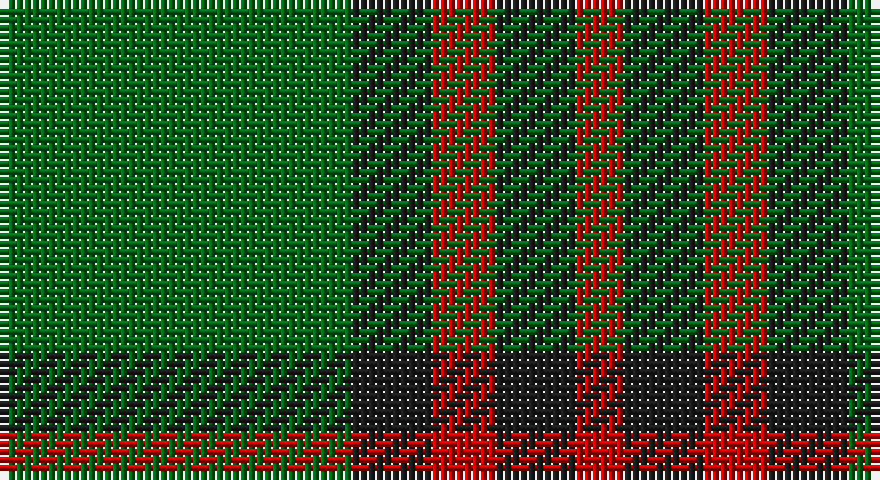

This page is one **sett** — a single exact thread-count. It belongs to the [tartan](/setts/g22dt5r4dt5r3/)
(the same proportion at any scale), whose colour order is pattern [GBRBR](/stripes/gbrbr/).

Part of the [Romsdal](/tartans/romsdal/) tartan — the named design grouping this sett with its other cloths.

Sourced from register-of-tartans.  It is a [5 stripe tartan](/stripes/stripes5/).

Original link https://www.tartanregister.gov.uk/tartanDetails.aspx?ref=3544

2 attestations — the source records this cloth was collapsed from (oldest owns this page)

<ul>
<li>01/01/2002 — Romsdal (register-of-tartans, <a href="https://www.tartanregister.gov.uk/tartanDetails.aspx?ref=3544">record</a>)</li>
<li>pre 2002 — Romsdal (District) (tartans-authority, <a href="http://www.tartansauthority.com/tartan-ferret/display/2087/">record</a>)</li>
</ul>

## Register references

External register numbers recorded for this tartan.

- Scottish Register of Tartans: [3544](https://www.tartanregister.gov.uk/tartanDetails.aspx?ref=3544)
- Scottish Tartans Authority (ITI): 2087
- Scottish Tartans World Register: 2087

## Thread count
G/44 K10 R8 K10 R/6

One full sett is **106 threads**.

## Palette

Palette: <strong>Tartan Register</strong>
<table><thead><tr><th>Colour</th><th>Threads</th><th>Shade</th><th>Base</th><th>OKLCh</th></tr></thead><tbody><tr><td>G/</td><td style="text-align:right;font-variant-numeric:tabular-nums">44</td><td><code style="background-color:#006818;">#006818</code> <small style="color:#888">#006818</small></td><td>G <code style="background-color:#006100;">#006100</code></td><td><small style="color:#888">oklch(45.0% 0.142 145.0)</small></td></tr><tr><td>K</td><td style="text-align:right;font-variant-numeric:tabular-nums">10</td><td><code style="background-color:#1C1C1C;">#1C1C1C</code> <small style="color:#888">#1C1C1C</small></td><td>B <code style="background-color:#2A418A;">#2A418A</code></td><td><small style="color:#888">oklch(22.6% 0.000 89.9)</small></td></tr><tr><td>R</td><td style="text-align:right;font-variant-numeric:tabular-nums">8</td><td><code style="background-color:#C80000;">#C80000</code> <small style="color:#888">#C80000</small></td><td>R <code style="background-color:#CC0000;">#CC0000</code></td><td><small style="color:#888">oklch(52.3% 0.215 29.2)</small></td></tr><tr><td>K</td><td style="text-align:right;font-variant-numeric:tabular-nums">10</td><td><code style="background-color:#1C1C1C;">#1C1C1C</code> <small style="color:#888">#1C1C1C</small></td><td>B <code style="background-color:#2A418A;">#2A418A</code></td><td><small style="color:#888">oklch(22.6% 0.000 89.9)</small></td></tr><tr><td>R/</td><td style="text-align:right;font-variant-numeric:tabular-nums">6</td><td><code style="background-color:#C80000;">#C80000</code> <small style="color:#888">#C80000</small></td><td>R <code style="background-color:#CC0000;">#CC0000</code></td><td><small style="color:#888">oklch(52.3% 0.215 29.2)</small></td></tr></tbody></table>

# Sample pattern

## Nearest tartans

The nearest existing variants by ΔTartan distance, with this tartan at the top so the swatches line up against it.

ΔTartan

Tartan

Sett

—

<a href="/ttd/edit/#slug=g22dt5r4dt5r3~x2">Romsdal</a> <a class="nn-out" href="/variants/s5/g22dt5r4dt5r3~x2/" title="open its dictionary page">↗</a>

0.86

<a href="/ttd/edit/#slug=k8g3k4g20r4~x2&amp;base=g22dt5r4dt5r3~x2">MacArthur-Fox (Personal)</a> <a class="nn-out" href="/variants/s5/k8g3k4g20r4~x2/" title="open its dictionary page">↗</a>

1.04

<a href="/ttd/edit/#slug=dg2y14dg8y3dg12lo2~x2&amp;base=g22dt5r4dt5r3~x2">Confederate Cavalry (Military)</a> <a class="nn-out" href="/variants/s6/dg2y14dg8y3dg12lo2~x2/" title="open its dictionary page">↗</a>

1.07

<a href="/ttd/edit/#slug=dg2o14dg8o3dg12r2~x2&amp;base=g22dt5r4dt5r3~x2">Confederate Artillery</a> <a class="nn-out" href="/variants/s6/dg2o14dg8o3dg12r2~x2/" title="open its dictionary page">↗</a>

1.17

<a href="/ttd/edit/#slug=dg2o14dg8o3dg12db2~x2&amp;base=g22dt5r4dt5r3~x2">Confederate Infantry</a> <a class="nn-out" href="/variants/s6/dg2o14dg8o3dg12db2~x2/" title="open its dictionary page">↗</a>

1.25

<a href="/ttd/edit/#slug=r2g9r2t2~x4&amp;base=g22dt5r4dt5r3~x2">Wilson's No.212</a> <a class="nn-out" href="/variants/s4/r2g9r2t2~x4/" title="open its dictionary page">↗</a>

1.30

<a href="/ttd/edit/#slug=lo1dg11k6dg3lo1dg1lo1~x4&amp;base=g22dt5r4dt5r3~x2">Angle, Green (Fashion)</a> <a class="nn-out" href="/variants/s7/lo1dg11k6dg3lo1dg1lo1~x4/" title="open its dictionary page">↗</a>

1.34

<a href="/ttd/edit/#slug=g14k3r3lr2~x2&amp;base=g22dt5r4dt5r3~x2">Bacon, Green (Fashion)</a> <a class="nn-out" href="/variants/s4/g14k3r3lr2~x2/" title="open its dictionary page">↗</a>

1.35

<a href="/ttd/edit/#slug=db6r3g2r3g12r3g2~x2&amp;base=g22dt5r4dt5r3~x2">Skene Clan Tartan</a> <a class="nn-out" href="/variants/s7/db6r3g2r3g12r3g2~x2/" title="open its dictionary page">↗</a>

1.42

<a href="/ttd/edit/#slug=g3db8g3k4g15r2~x2&amp;base=g22dt5r4dt5r3~x2">Lauder (Family)</a> <a class="nn-out" href="/variants/s6/g3db8g3k4g15r2~x2/" title="open its dictionary page">↗</a>

1.43

<a href="/ttd/edit/#slug=g6k2r3k1~x4&amp;base=g22dt5r4dt5r3~x2">Red Watch (Fashion) #1</a> <a class="nn-out" href="/variants/s4/g6k2r3k1~x4/" title="open its dictionary page">↗</a>

## Neighbour map

Every grey dot is one of 14360 variants placed by the first two principal components of the ΔTartan feature space (44% of its variance). Red is this tartan; blue dots are its nearest — click one to open its page.

<svg viewBox="0 0 640 380" role="img" style="max-width:100%;height:auto;border:1px solid #e0e0e0;border-radius:4px;display:block" xmlns="http://www.w3.org/2000/svg"><image href="/nn/cloud.v1.png" width="640" height="380"/><a href="/variants/s5/k8g3k4g20r4~x2/"><circle cx="355.6" cy="278.7" r="4" fill="#3465a4"><title>MacArthur-Fox (Personal)</title></circle></a><a href="/variants/s6/dg2y14dg8y3dg12lo2~x2/"><circle cx="336.6" cy="274.7" r="4" fill="#3465a4"><title>Confederate Cavalry (Military)</title></circle></a><a href="/variants/s6/dg2o14dg8o3dg12r2~x2/"><circle cx="319.8" cy="263.9" r="4" fill="#3465a4"><title>Confederate Artillery</title></circle></a><a href="/variants/s6/dg2o14dg8o3dg12db2~x2/"><circle cx="313.3" cy="263.0" r="4" fill="#3465a4"><title>Confederate Infantry</title></circle></a><a href="/variants/s4/r2g9r2t2~x4/"><circle cx="343.1" cy="289.1" r="4" fill="#3465a4"><title>Wilson's No.212</title></circle></a><a href="/variants/s7/lo1dg11k6dg3lo1dg1lo1~x4/"><circle cx="396.3" cy="226.6" r="4" fill="#3465a4"><title>Angle, Green (Fashion)</title></circle></a><a href="/variants/s4/g14k3r3lr2~x2/"><circle cx="346.9" cy="251.3" r="4" fill="#3465a4"><title>Bacon, Green (Fashion)</title></circle></a><a href="/variants/s7/db6r3g2r3g12r3g2~x2/"><circle cx="283.5" cy="254.3" r="4" fill="#3465a4"><title>Skene Clan Tartan</title></circle></a><a href="/variants/s6/g3db8g3k4g15r2~x2/"><circle cx="328.7" cy="254.2" r="4" fill="#3465a4"><title>Lauder (Family)</title></circle></a><a href="/variants/s4/g6k2r3k1~x4/"><circle cx="283.4" cy="302.7" r="4" fill="#3465a4"><title>Red Watch (Fashion) #1</title></circle></a><circle cx="341.5" cy="257.4" r="5" fill="#c00000"/></svg>

ID: /variants/s5/g22dt5r4dt5r3~x2/
