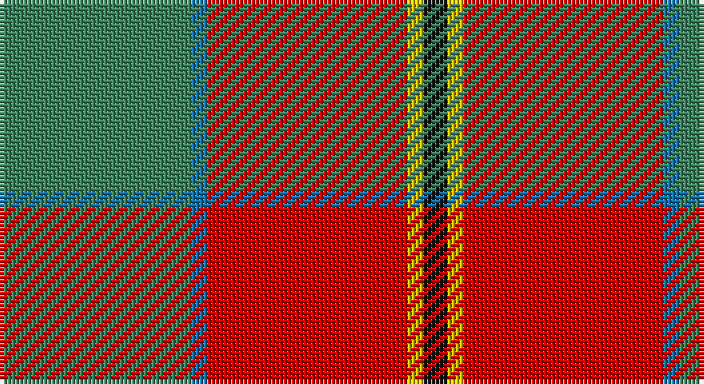

This page is one **sett** — a single exact thread-count. It belongs to the [tartan](/setts/g24b2r25ly2k3/)
(the same proportion at any scale), whose colour order is pattern [GBRYK](/stripes/gbryk/).

Sourced from register-of-tartans.  It is a [5 stripe tartan](/stripes/stripes5/).

Original link https://www.tartanregister.gov.uk/tartanDetails.aspx?ref=379

2 attestations — the source records this cloth was collapsed from (oldest owns this page)

<ul>
<li>01/01/2005 — Bronte (register-of-tartans, <a href="https://www.tartanregister.gov.uk/tartanDetails.aspx?ref=379">record</a>)</li>
<li>pre 2005 — Bronte (Name) (tartans-authority, <a href="http://www.tartansauthority.com/tartan-ferret/display/6614/">record</a>)</li>
</ul>

## Register references

External register numbers recorded for this tartan.

- Scottish Register of Tartans: [379](https://www.tartanregister.gov.uk/tartanDetails.aspx?ref=379)
- Scottish Tartans Authority (ITI): 6614

## Thread count
G/48 B4 R50 Y4 K/6

One full sett is **170 threads**.

## Palette

Palette: <strong>Tartan Register</strong>
<table><thead><tr><th>Colour</th><th>Threads</th><th>Shade</th><th>Base</th><th>OKLCh</th></tr></thead><tbody><tr><td>G/</td><td style="text-align:right;font-variant-numeric:tabular-nums">48</td><td><code style="background-color:#408060;">#408060</code> <small style="color:#888">#408060</small></td><td>G <code style="background-color:#006100;">#006100</code></td><td><small style="color:#888">oklch(54.8% 0.084 160.1)</small></td></tr><tr><td>B</td><td style="text-align:right;font-variant-numeric:tabular-nums">4</td><td><code style="background-color:#1870A4;">#1870A4</code> <small style="color:#888">#1870A4</small></td><td>B <code style="background-color:#2A418A;">#2A418A</code></td><td><small style="color:#888">oklch(52.2% 0.113 241.2)</small></td></tr><tr><td>R</td><td style="text-align:right;font-variant-numeric:tabular-nums">50</td><td><code style="background-color:#C80000;">#C80000</code> <small style="color:#888">#C80000</small></td><td>R <code style="background-color:#CC0000;">#CC0000</code></td><td><small style="color:#888">oklch(52.3% 0.215 29.2)</small></td></tr><tr><td>Y</td><td style="text-align:right;font-variant-numeric:tabular-nums">4</td><td><code style="background-color:#E8C000;">#E8C000</code> <small style="color:#888">#E8C000</small></td><td>Y <code style="background-color:#F2BF00;">#F2BF00</code></td><td><small style="color:#888">oklch(81.9% 0.168 93.7)</small></td></tr><tr><td>K/</td><td style="text-align:right;font-variant-numeric:tabular-nums">6</td><td><code style="background-color:#101010;">#101010</code> <small style="color:#888">#101010</small></td><td>K <code style="background-color:#000000;">#000000</code></td><td><small style="color:#888">oklch(17.3% 0.000 89.9)</small></td></tr></tbody></table>

# Sample pattern

## Nearest tartans

The nearest existing variants by ΔTartan distance, with this tartan at the top so the swatches line up against it.

ΔTartan

Tartan

Sett

—

<a href="/ttd/edit/#slug=g24b2r25ly2k3~x2">Bronte</a> <a class="nn-out" href="/variants/s5/g24b2r25ly2k3~x2/" title="open its dictionary page">↗</a>

0.84

<a href="/ttd/edit/#slug=r15w1db4ly1g15~x4&amp;base=g24b2r25ly2k3~x2">Eglinton, Duke of (Artefact)</a> <a class="nn-out" href="/variants/s5/r15w1db4ly1g15~x4/" title="open its dictionary page">↗</a>

1.02

<a href="/ttd/edit/#slug=k2db1g10r10ly1~x6&amp;base=g24b2r25ly2k3~x2">Turnbull Dress</a> <a class="nn-out" href="/variants/s5/k2db1g10r10ly1~x6/" title="open its dictionary page">↗</a>

1.12

<a href="/ttd/edit/#slug=db6lo25dy16k2db3~x2&amp;base=g24b2r25ly2k3~x2">Prince of Orange #2</a> <a class="nn-out" href="/variants/s5/db6lo25dy16k2db3~x2/" title="open its dictionary page">↗</a>

1.14

<a href="/ttd/edit/#slug=ri2dg16r1ri2r12ly1y1~x2&amp;base=g24b2r25ly2k3~x2">Spragg, Andrew</a> <a class="nn-out" href="/variants/s7/ri2dg16r1ri2r12ly1y1~x2/" title="open its dictionary page">↗</a>

1.15

<a href="/ttd/edit/#slug=db1r12g6ly1g6db1~x4&amp;base=g24b2r25ly2k3~x2">Cetoloni (Personal)</a> <a class="nn-out" href="/variants/s6/db1r12g6ly1g6db1~x4/" title="open its dictionary page">↗</a>

1.18

<a href="/ttd/edit/#slug=r3db1r12o3dg12lb1dg2~x4&amp;base=g24b2r25ly2k3~x2">Leckie (Personal)</a> <a class="nn-out" href="/variants/s7/r3db1r12o3dg12lb1dg2~x4/" title="open its dictionary page">↗</a>

1.18

<a href="/ttd/edit/#slug=w15lo98do72r25do8lg15&amp;base=g24b2r25ly2k3~x2">Afternoon Tea / Milk Tea</a> <a class="nn-out" href="/variants/s6/w15lo98do72r25do8lg15/" title="open its dictionary page">↗</a>

1.19

<a href="/ttd/edit/#slug=ri2g16r1ri2r12ly1t1~x2&amp;base=g24b2r25ly2k3~x2">Spragg (Name)</a> <a class="nn-out" href="/variants/s7/ri2g16r1ri2r12ly1t1~x2/" title="open its dictionary page">↗</a>

1.22

<a href="/ttd/edit/#slug=dt8y4r30g30lo3g4~x2&amp;base=g24b2r25ly2k3~x2">Hutcheson (Name)</a> <a class="nn-out" href="/variants/s6/dt8y4r30g30lo3g4~x2/" title="open its dictionary page">↗</a>

1.24

<a href="/ttd/edit/#slug=y47w6r24w3dp5lo3~x2&amp;base=g24b2r25ly2k3~x2">Duminiak (Trevose, Pennsylvania)</a> <a class="nn-out" href="/variants/s6/y47w6r24w3dp5lo3~x2/" title="open its dictionary page">↗</a>

## Neighbour map

Every grey dot is one of 14360 variants placed by the first two principal components of the ΔTartan feature space (44% of its variance). Red is this tartan; blue dots are its nearest — click one to open its page.

<svg viewBox="0 0 640 380" role="img" style="max-width:100%;height:auto;border:1px solid #e0e0e0;border-radius:4px;display:block" xmlns="http://www.w3.org/2000/svg"><image href="/nn/cloud.v1.png" width="640" height="380"/><a href="/variants/s5/r15w1db4ly1g15~x4/"><circle cx="249.6" cy="177.9" r="4" fill="#3465a4"><title>Eglinton, Duke of (Artefact)</title></circle></a><a href="/variants/s5/k2db1g10r10ly1~x6/"><circle cx="235.2" cy="194.8" r="4" fill="#3465a4"><title>Turnbull Dress</title></circle></a><a href="/variants/s5/db6lo25dy16k2db3~x2/"><circle cx="276.5" cy="201.1" r="4" fill="#3465a4"><title>Prince of Orange #2</title></circle></a><a href="/variants/s7/ri2dg16r1ri2r12ly1y1~x2/"><circle cx="301.7" cy="154.5" r="4" fill="#3465a4"><title>Spragg, Andrew</title></circle></a><a href="/variants/s6/db1r12g6ly1g6db1~x4/"><circle cx="287.5" cy="198.5" r="4" fill="#3465a4"><title>Cetoloni (Personal)</title></circle></a><a href="/variants/s7/r3db1r12o3dg12lb1dg2~x4/"><circle cx="274.4" cy="181.5" r="4" fill="#3465a4"><title>Leckie (Personal)</title></circle></a><a href="/variants/s6/w15lo98do72r25do8lg15/"><circle cx="227.2" cy="182.2" r="4" fill="#3465a4"><title>Afternoon Tea / Milk Tea</title></circle></a><a href="/variants/s7/ri2g16r1ri2r12ly1t1~x2/"><circle cx="298.4" cy="152.7" r="4" fill="#3465a4"><title>Spragg (Name)</title></circle></a><a href="/variants/s6/dt8y4r30g30lo3g4~x2/"><circle cx="255.5" cy="200.5" r="4" fill="#3465a4"><title>Hutcheson (Name)</title></circle></a><a href="/variants/s6/y47w6r24w3dp5lo3~x2/"><circle cx="334.6" cy="167.2" r="4" fill="#3465a4"><title>Duminiak (Trevose, Pennsylvania)</title></circle></a><circle cx="283.1" cy="183.3" r="5" fill="#c00000"/></svg>

ID: /variants/s5/g24b2r25ly2k3~x2/
