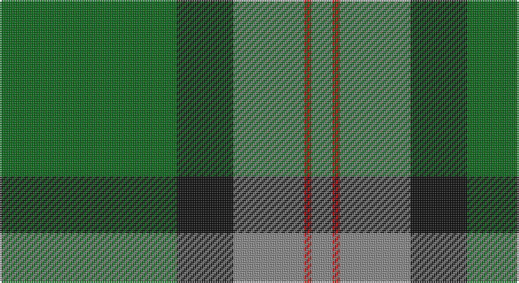

This page is one **sett** — a single exact thread-count. It belongs to the [tartan](/setts/g25k8o10r1o3/)
(the same proportion at any scale), whose colour order is pattern [GKRRR](/stripes/gkrrr/).

Part of the [Herbage](/tartans/herbage/) tartan — the named design grouping this sett with its other cloths.

Sourced from house-of-tartan.  It is a [5 stripe tartan](/stripes/stripes5/).

Original link http://www.house-of-tartan.scotland.net/house/TartanViewjs.asp?colr=Def&tnam=811

## Provenance

Earliest known date: 1983 Designed by the Scottish Tartans Society for Mr Herbage, Laggan.

## Thread count
G/100 K32 N40 R4 N/12

One full sett is **264 threads**.

## Palette

Palette: <strong>Tartan Register</strong>
<table><thead><tr><th>Colour</th><th>Threads</th><th>Shade</th><th>Base</th><th>OKLCh</th></tr></thead><tbody><tr><td>G/</td><td style="text-align:right;font-variant-numeric:tabular-nums">100</td><td><code style="background-color:#006818;">#006818</code> <small style="color:#888">#006818</small></td><td>G <code style="background-color:#006100;">#006100</code></td><td><small style="color:#888">oklch(45.0% 0.142 145.0)</small></td></tr><tr><td>K</td><td style="text-align:right;font-variant-numeric:tabular-nums">32</td><td><code style="background-color:#101010;">#101010</code> <small style="color:#888">#101010</small></td><td>K <code style="background-color:#000000;">#000000</code></td><td><small style="color:#888">oklch(17.3% 0.000 89.9)</small></td></tr><tr><td>N</td><td style="text-align:right;font-variant-numeric:tabular-nums">40</td><td><code style="background-color:#888888;">#888888</code> <small style="color:#888">#888888</small></td><td>R <code style="background-color:#CC0000;">#CC0000</code></td><td><small style="color:#888">oklch(62.7% 0.000 89.9)</small></td></tr><tr><td>R</td><td style="text-align:right;font-variant-numeric:tabular-nums">4</td><td><code style="background-color:#C80000;">#C80000</code> <small style="color:#888">#C80000</small></td><td>R <code style="background-color:#CC0000;">#CC0000</code></td><td><small style="color:#888">oklch(52.3% 0.215 29.2)</small></td></tr><tr><td>N/</td><td style="text-align:right;font-variant-numeric:tabular-nums">12</td><td><code style="background-color:#888888;">#888888</code> <small style="color:#888">#888888</small></td><td>R <code style="background-color:#CC0000;">#CC0000</code></td><td><small style="color:#888">oklch(62.7% 0.000 89.9)</small></td></tr></tbody></table>

# Sample pattern

## Nearest tartans

The nearest existing variants by ΔTartan distance, with this tartan at the top so the swatches line up against it.

ΔTartan

Tartan

Sett

—

<a href="/ttd/edit/#slug=g25k8o10r1o3~x4">Herbage Family Tartan</a> <a class="nn-out" href="/variants/s5/g25k8o10r1o3~x4/" title="open its dictionary page">↗</a>

0.31

<a href="/ttd/edit/#slug=g68k22o28r3o12~x2&amp;base=g25k8o10r1o3~x4">Herbage of Laggan (Personal)</a> <a class="nn-out" href="/variants/s5/g68k22o28r3o12~x2/" title="open its dictionary page">↗</a>

1.18

<a href="/ttd/edit/#slug=g47r3g6db35ly3~x2&amp;base=g25k8o10r1o3~x4">Gracie</a> <a class="nn-out" href="/variants/s5/g47r3g6db35ly3~x2/" title="open its dictionary page">↗</a>

1.23

<a href="/ttd/edit/#slug=g55k17r9k11ly2k4~x2&amp;base=g25k8o10r1o3~x4">Moran (Name)</a> <a class="nn-out" href="/variants/s6/g55k17r9k11ly2k4~x2/" title="open its dictionary page">↗</a>

1.28

<a href="/ttd/edit/#slug=r3g30k12g1k16lo2~x2&amp;base=g25k8o10r1o3~x4">MacArthur-Fox Htg (Personal)</a> <a class="nn-out" href="/variants/s6/r3g30k12g1k16lo2~x2/" title="open its dictionary page">↗</a>

1.31

<a href="/ttd/edit/#slug=g25k8y10r1y3~x4&amp;base=g25k8o10r1o3~x4">Herbage</a> <a class="nn-out" href="/variants/s5/g25k8y10r1y3~x4/" title="open its dictionary page">↗</a>

1.35

<a href="/ttd/edit/#slug=db4k4db24g32w1g2~x2&amp;base=g25k8o10r1o3~x4">Oliphant</a> <a class="nn-out" href="/variants/s6/db4k4db24g32w1g2~x2/" title="open its dictionary page">↗</a>

1.40

<a href="/ttd/edit/#slug=g55k17r9k11ly2db4~x2&amp;base=g25k8o10r1o3~x4">Moran Family Tartan</a> <a class="nn-out" href="/variants/s6/g55k17r9k11ly2db4~x2/" title="open its dictionary page">↗</a>

1.41

<a href="/ttd/edit/#slug=k5g40db20ly3~x2&amp;base=g25k8o10r1o3~x4">Robert Byers Family - Dooballagh, Ireland</a> <a class="nn-out" href="/variants/s4/k5g40db20ly3~x2/" title="open its dictionary page">↗</a>

1.42

<a href="/ttd/edit/#slug=g27db14k2db2ly2~x4&amp;base=g25k8o10r1o3~x4">Irving of Bonshaw</a> <a class="nn-out" href="/variants/s5/g27db14k2db2ly2~x4/" title="open its dictionary page">↗</a>

1.44

<a href="/ttd/edit/#slug=r3g30k12g6k16ly2~x2&amp;base=g25k8o10r1o3~x4">MacArthur (Variant)</a> <a class="nn-out" href="/variants/s6/r3g30k12g6k16ly2~x2/" title="open its dictionary page">↗</a>

## Neighbour map

Every grey dot is one of 14360 variants placed by the first two principal components of the ΔTartan feature space (44% of its variance). Red is this tartan; blue dots are its nearest — click one to open its page.

<svg viewBox="0 0 640 380" role="img" style="max-width:100%;height:auto;border:1px solid #e0e0e0;border-radius:4px;display:block" xmlns="http://www.w3.org/2000/svg"><image href="/nn/cloud.v1.png" width="640" height="380"/><a href="/variants/s5/g68k22o28r3o12~x2/"><circle cx="321.7" cy="207.2" r="4" fill="#3465a4"><title>Herbage of Laggan (Personal)</title></circle></a><a href="/variants/s5/g47r3g6db35ly3~x2/"><circle cx="363.9" cy="213.0" r="4" fill="#3465a4"><title>Gracie</title></circle></a><a href="/variants/s6/g55k17r9k11ly2k4~x2/"><circle cx="369.3" cy="171.5" r="4" fill="#3465a4"><title>Moran (Name)</title></circle></a><a href="/variants/s6/r3g30k12g1k16lo2~x2/"><circle cx="347.9" cy="185.3" r="4" fill="#3465a4"><title>MacArthur-Fox Htg (Personal)</title></circle></a><a href="/variants/s5/g25k8y10r1y3~x4/"><circle cx="301.3" cy="182.1" r="4" fill="#3465a4"><title>Herbage</title></circle></a><a href="/variants/s6/db4k4db24g32w1g2~x2/"><circle cx="349.8" cy="166.4" r="4" fill="#3465a4"><title>Oliphant</title></circle></a><a href="/variants/s6/g55k17r9k11ly2db4~x2/"><circle cx="344.8" cy="156.2" r="4" fill="#3465a4"><title>Moran Family Tartan</title></circle></a><a href="/variants/s4/k5g40db20ly3~x2/"><circle cx="353.1" cy="238.0" r="4" fill="#3465a4"><title>Robert Byers Family - Dooballagh, Ireland</title></circle></a><a href="/variants/s5/g27db14k2db2ly2~x4/"><circle cx="353.0" cy="209.7" r="4" fill="#3465a4"><title>Irving of Bonshaw</title></circle></a><a href="/variants/s6/r3g30k12g6k16ly2~x2/"><circle cx="319.1" cy="214.6" r="4" fill="#3465a4"><title>MacArthur (Variant)</title></circle></a><circle cx="339.1" cy="199.3" r="5" fill="#c00000"/></svg>

ID: /variants/s5/g25k8o10r1o3~x4/
