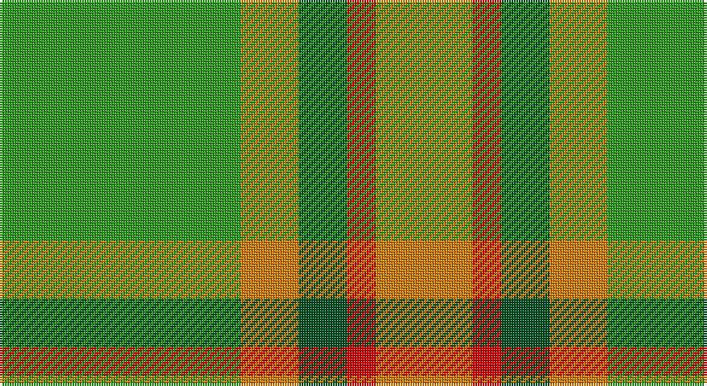

This page is one **sett** — a single exact thread-count. It belongs to the [tartan](/setts/g25lo6dg5r3lo10/)
(the same proportion at any scale), whose colour order is pattern [GYGRY](/stripes/gygry/).

Sourced from register-of-tartans.  It is a [5 stripe tartan](/stripes/stripes5/).

Original link https://www.tartanregister.gov.uk/tartanDetails.aspx?ref=11462

## Register references

External register numbers recorded for this tartan.

- Scottish Register of Tartans: [11462](https://www.tartanregister.gov.uk/tartanDetails.aspx?ref=11462)

## Thread count
G/100 O24 Ga20 R12 O/40

One full sett is **252 threads**.

## Palette

Palette: <strong>Tartan Register</strong>
<table><thead><tr><th>Colour</th><th>Threads</th><th>Shade</th><th>Base</th><th>OKLCh</th></tr></thead><tbody><tr><td>G/</td><td style="text-align:right;font-variant-numeric:tabular-nums">100</td><td><code style="background-color:#289C18;">#289C18</code> <small style="color:#888">#289C18</small></td><td>G <code style="background-color:#006100;">#006100</code></td><td><small style="color:#888">oklch(60.6% 0.191 141.6)</small></td></tr><tr><td>O</td><td style="text-align:right;font-variant-numeric:tabular-nums">24</td><td><code style="background-color:#D87C00;">#D87C00</code> <small style="color:#888">#D87C00</small></td><td>Y <code style="background-color:#F2BF00;">#F2BF00</code></td><td><small style="color:#888">oklch(67.3% 0.155 61.8)</small></td></tr><tr><td>Ga</td><td style="text-align:right;font-variant-numeric:tabular-nums">20</td><td><code style="background-color:#005020;">#005020</code> <small style="color:#888">#005020</small></td><td>G <code style="background-color:#006100;">#006100</code></td><td><small style="color:#888">oklch(37.7% 0.105 149.6)</small></td></tr><tr><td>R</td><td style="text-align:right;font-variant-numeric:tabular-nums">12</td><td><code style="background-color:#DC0000;">#DC0000</code> <small style="color:#888">#DC0000</small></td><td>R <code style="background-color:#CC0000;">#CC0000</code></td><td><small style="color:#888">oklch(56.2% 0.230 29.2)</small></td></tr><tr><td>O/</td><td style="text-align:right;font-variant-numeric:tabular-nums">40</td><td><code style="background-color:#D87C00;">#D87C00</code> <small style="color:#888">#D87C00</small></td><td>Y <code style="background-color:#F2BF00;">#F2BF00</code></td><td><small style="color:#888">oklch(67.3% 0.155 61.8)</small></td></tr></tbody></table>

# Sample pattern

## Nearest tartans

The nearest existing variants by ΔTartan distance, with this tartan at the top so the swatches line up against it.

ΔTartan

Tartan

Sett

—

<a href="/ttd/edit/#slug=g25lo6dg5r3lo10~x4">Pendlebury, Andrew (Personal)</a> <a class="nn-out" href="/variants/s5/g25lo6dg5r3lo10~x4/" title="open its dictionary page">↗</a>

1.44

<a href="/ttd/edit/#slug=r1g8o8w1~x2&amp;base=g25lo6dg5r3lo10~x4">MacKinnon, hunting</a> <a class="nn-out" href="/variants/s4/r1g8o8w1~x2/" title="open its dictionary page">↗</a>

1.47

<a href="/ttd/edit/#slug=lo11gi5lo10g4gi26lo4~x2&amp;base=g25lo6dg5r3lo10~x4">North Dakota State University (Corp.</a> <a class="nn-out" href="/variants/s6/lo11gi5lo10g4gi26lo4~x2/" title="open its dictionary page">↗</a>

1.48

<a href="/ttd/edit/#slug=g6ly1r1t2r2~x4&amp;base=g25lo6dg5r3lo10~x4">Wilson's, No 179</a> <a class="nn-out" href="/variants/s5/g6ly1r1t2r2~x4/" title="open its dictionary page">↗</a>

1.50

<a href="/ttd/edit/#slug=g8lo1g8lo12r1lo1~x4&amp;base=g25lo6dg5r3lo10~x4">Forget Family (Personal)</a> <a class="nn-out" href="/variants/s6/g8lo1g8lo12r1lo1~x4/" title="open its dictionary page">↗</a>

1.60

<a href="/ttd/edit/#slug=r4g3o8w3o4g18ly3~x2&amp;base=g25lo6dg5r3lo10~x4">Newfoundland</a> <a class="nn-out" href="/variants/s7/r4g3o8w3o4g18ly3~x2/" title="open its dictionary page">↗</a>

1.81

<a href="/ttd/edit/#slug=r1g8dy8w1~x2&amp;base=g25lo6dg5r3lo10~x4">MacKinnon Hunting (Var) Clan Tartan</a> <a class="nn-out" href="/variants/s4/r1g8dy8w1~x2/" title="open its dictionary page">↗</a>

1.87

<a href="/ttd/edit/#slug=o1g1o5g8lg1g1lg1~x4&amp;base=g25lo6dg5r3lo10~x4">O'Neill Pipe Band 1983 (Corporate)</a> <a class="nn-out" href="/variants/s7/o1g1o5g8lg1g1lg1~x4/" title="open its dictionary page">↗</a>

1.89

<a href="/ttd/edit/#slug=g30lo3t8o25~x2&amp;base=g25lo6dg5r3lo10~x4">Dohmen Family (Zuid-Nederland)</a> <a class="nn-out" href="/variants/s4/g30lo3t8o25~x2/" title="open its dictionary page">↗</a>

1.89

<a href="/ttd/edit/#slug=dt5lo5dy13g41r3~x2&amp;base=g25lo6dg5r3lo10~x4">Clare, Richard (Personal)</a> <a class="nn-out" href="/variants/s5/dt5lo5dy13g41r3~x2/" title="open its dictionary page">↗</a>

1.91

<a href="/ttd/edit/#slug=ly5g14dy4db4dy27g3dy4ly5~x2&amp;base=g25lo6dg5r3lo10~x4">Invertere (Daks #2) (Fashion)</a> <a class="nn-out" href="/variants/s8/ly5g14dy4db4dy27g3dy4ly5~x2/" title="open its dictionary page">↗</a>

## Neighbour map

Every grey dot is one of 14360 variants placed by the first two principal components of the ΔTartan feature space (44% of its variance). Red is this tartan; blue dots are its nearest — click one to open its page.

<svg viewBox="0 0 640 380" role="img" style="max-width:100%;height:auto;border:1px solid #e0e0e0;border-radius:4px;display:block" xmlns="http://www.w3.org/2000/svg"><image href="/nn/cloud.v1.png" width="640" height="380"/><a href="/variants/s4/r1g8o8w1~x2/"><circle cx="301.4" cy="268.4" r="4" fill="#3465a4"><title>MacKinnon, hunting</title></circle></a><a href="/variants/s6/lo11gi5lo10g4gi26lo4~x2/"><circle cx="345.3" cy="280.2" r="4" fill="#3465a4"><title>North Dakota State University (Corp.</title></circle></a><a href="/variants/s5/g6ly1r1t2r2~x4/"><circle cx="244.6" cy="244.0" r="4" fill="#3465a4"><title>Wilson's, No 179</title></circle></a><a href="/variants/s6/g8lo1g8lo12r1lo1~x4/"><circle cx="374.6" cy="244.0" r="4" fill="#3465a4"><title>Forget Family (Personal)</title></circle></a><a href="/variants/s7/r4g3o8w3o4g18ly3~x2/"><circle cx="224.5" cy="215.2" r="4" fill="#3465a4"><title>Newfoundland</title></circle></a><a href="/variants/s4/r1g8dy8w1~x2/"><circle cx="305.4" cy="273.7" r="4" fill="#3465a4"><title>MacKinnon Hunting (Var) Clan Tartan</title></circle></a><a href="/variants/s7/o1g1o5g8lg1g1lg1~x4/"><circle cx="368.6" cy="240.0" r="4" fill="#3465a4"><title>O'Neill Pipe Band 1983 (Corporate)</title></circle></a><a href="/variants/s4/g30lo3t8o25~x2/"><circle cx="294.3" cy="259.0" r="4" fill="#3465a4"><title>Dohmen Family (Zuid-Nederland)</title></circle></a><a href="/variants/s5/dt5lo5dy13g41r3~x2/"><circle cx="359.4" cy="196.9" r="4" fill="#3465a4"><title>Clare, Richard (Personal)</title></circle></a><a href="/variants/s8/ly5g14dy4db4dy27g3dy4ly5~x2/"><circle cx="277.8" cy="195.0" r="4" fill="#3465a4"><title>Invertere (Daks #2) (Fashion)</title></circle></a><circle cx="298.4" cy="242.2" r="5" fill="#c00000"/></svg>

ID: /variants/s5/g25lo6dg5r3lo10~x4/
