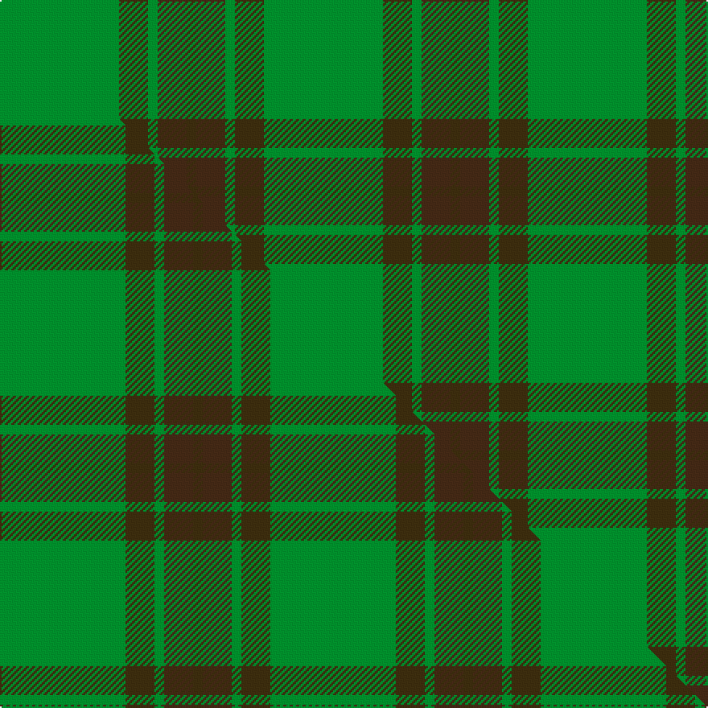

This page is one **sett** — a single exact thread-count. It belongs to the [tartan](/setts/g37dy9g3do9dy3/)
(the same proportion at any scale), whose colour order is pattern [GBGGG](/stripes/gbggg/).

Part of the [Glen Boig](/tartans/glen-boig/) tartan — the named design grouping this sett with its other cloths.

Sourced from house-of-tartan.  It is a [5 stripe tartan](/stripes/stripes5/).

Original link http://www.house-of-tartan.scotland.net/house/TartanViewjs.asp?colr=Def&tnam=915

## Provenance

Earliest known date: Modern Many new designs have been given district names to promote their Scottish connections. However, these names should not be confused with the District tartans which have earned their title through 'use and wont' and not a little history.

## Thread count
G/74 DY18 G6 DO18 DY/6

One full sett is **164 threads**.

## Palette
<table><thead><tr><th>Colour</th><th>Shade</th><th>OKLCh</th></tr></thead><tbody><tr><td>DO</td><td><code style="background-color:#412714;">#412714</code> <small style="color:#888">#412714</small></td><td><small style="color:#888">oklch(30.1% 0.050 55.7)</small></td></tr><tr><td>G</td><td><code style="background-color:#008B2A;">#008B2A</code> <small style="color:#888">#008B2A</small></td><td><small style="color:#888">oklch(55.4% 0.170 145.9)</small></td></tr><tr><td>DY</td><td><code style="background-color:#3A2B0D;">#3A2B0D</code> <small style="color:#888">#3A2B0D</small></td><td><small style="color:#888">oklch(30.0% 0.049 82.0)</small></td></tr></tbody></table>

# Sample pattern

## Compared to the master

This cloth is one sett of its design; the master sett (the exemplar the design is anchored on) is below for comparison.

Its **ΔTartan distance** from the master is **0.07** — the same measure the nearest-tartans table ranks by (0 is identical; a re-scale of the same cloth is near 0, a recolour or a different proportion further).

<figure class="master-compare" style="margin:0">

this sett
master sett ★

<figcaption style="color:#888;font-size:smaller">One weave of this sett against the <a href="/setts/g13dy3g1do3dy1/">master sett ★</a>, split on the diagonal: a shared proportion runs seamlessly across it with only the shades shifting; a different proportion breaks on it.</figcaption>
</figure>

## Nearest tartan variants

The nearest existing variants by ΔTartan distance, with this cloth at the top so the swatches line up against it.

ΔTartan

Threads

Variant

Sett

—

164

<a href="/variants/s5/g37dy9g3do9dy3~x2/">Glen Boig Trade Tartan</a>

<a href="/ttd/edit/#slug=g13dy3g1do3dy1~x6&amp;base=g37dy9g3do9dy3~x2" title="compare in the TTD">0.07</a>

168

<a href="/variants/s5/g13dy3g1do3dy1~x6/">Glen Boig</a>

<a href="/ttd/edit/#slug=dg37dy9dg3r9dy3~x2&amp;base=g37dy9g3do9dy3~x2" title="compare in the TTD">0.45</a>

164

<a href="/variants/s5/dg37dy9dg3r9dy3~x2/">Glen Trool District Tartan</a>

<a href="/ttd/edit/#slug=dg2y14dg8y3dg12lo2~x2&amp;base=g37dy9g3do9dy3~x2" title="compare in the TTD">1.94</a>

156

<a href="/variants/s6/dg2y14dg8y3dg12lo2~x2/">Confederate Cavalry (Military)</a>

<a href="/ttd/edit/#slug=dg21y43dg86lb10&amp;base=g37dy9g3do9dy3~x2" title="compare in the TTD">2.04</a>

289

<a href="/variants/s4/dg21y43dg86lb10/">Special Saffron Tartan</a>

<a href="/ttd/edit/#slug=g9dy20g40w5~x2&amp;base=g37dy9g3do9dy3~x2" title="compare in the TTD">2.05</a>

268

<a href="/variants/s4/g9dy20g40w5~x2/">O'Neill Irish Family Tartan</a>

<a href="/ttd/edit/#slug=g3dy2g18dy21lo2g3lo2~x2&amp;base=g37dy9g3do9dy3~x2" title="compare in the TTD">2.24</a>

194

<a href="/variants/s7/g3dy2g18dy21lo2g3lo2~x2/">Prince David #1 (Royal)</a>

<a href="/ttd/edit/#slug=g8ly1g8ly12r1ly1~x4&amp;base=g37dy9g3do9dy3~x2" title="compare in the TTD">2.31</a>

212

<a href="/variants/s6/g8ly1g8ly12r1ly1~x4/">Forget Family (Personal)</a>

<a href="/ttd/edit/#slug=r2g12ly3g8ly14g2~x2&amp;base=g37dy9g3do9dy3~x2" title="compare in the TTD">2.36</a>

156

<a href="/variants/s6/r2g12ly3g8ly14g2~x2/">Confederate Artillery (Military)</a>

<a href="/ttd/edit/#slug=y11dg5y10g4dg26y4~x2&amp;base=g37dy9g3do9dy3~x2" title="compare in the TTD">2.40</a>

210

<a href="/variants/s6/y11dg5y10g4dg26y4~x2/">North Dakota State University Bison</a>

<a href="/ttd/edit/#slug=ly11dg5ly10g4dg26ly4~x2~dg1806142-g2408144&amp;base=g37dy9g3do9dy3~x2" title="compare in the TTD">2.46</a>

210

<a href="/variants/s6/ly11dg5ly10g4dg26ly4~x2~dg1806142-g2408144/">North Dakota State University (Corp.</a>

## Neighbour map

Every grey dot is one of 13620 variants placed by the first two principal components of the ΔTartan feature space (42% of its variance). Red is this tartan; blue dots are its nearest — click one to open its page.

<svg viewBox="0 0 640 380" role="img" style="max-width:100%;height:auto;border:1px solid #e0e0e0;border-radius:4px;display:block" xmlns="http://www.w3.org/2000/svg"><image href="/nn/cloud.v1.png" width="640" height="380"/><a href="/variants/s5/g13dy3g1do3dy1~x6/"><circle cx="494.0" cy="247.8" r="4" fill="#3465a4"><title>Glen Boig</title></circle></a><a href="/variants/s5/dg37dy9dg3r9dy3~x2/"><circle cx="508.6" cy="245.6" r="4" fill="#3465a4"><title>Glen Trool District Tartan</title></circle></a><a href="/variants/s6/dg2y14dg8y3dg12lo2~x2/"><circle cx="382.7" cy="284.5" r="4" fill="#3465a4"><title>Confederate Cavalry (Military)</title></circle></a><a href="/variants/s4/dg21y43dg86lb10/"><circle cx="450.9" cy="285.4" r="4" fill="#3465a4"><title>Special Saffron Tartan</title></circle></a><a href="/variants/s4/g9dy20g40w5~x2/"><circle cx="415.3" cy="284.6" r="4" fill="#3465a4"><title>O'Neill Irish Family Tartan</title></circle></a><a href="/variants/s7/g3dy2g18dy21lo2g3lo2~x2/"><circle cx="358.4" cy="230.4" r="4" fill="#3465a4"><title>Prince David #1 (Royal)</title></circle></a><a href="/variants/s6/g8ly1g8ly12r1ly1~x4/"><circle cx="395.2" cy="251.6" r="4" fill="#3465a4"><title>Forget Family (Personal)</title></circle></a><a href="/variants/s6/r2g12ly3g8ly14g2~x2/"><circle cx="362.1" cy="278.2" r="4" fill="#3465a4"><title>Confederate Artillery (Military)</title></circle></a><a href="/variants/s6/y11dg5y10g4dg26y4~x2/"><circle cx="400.7" cy="293.1" r="4" fill="#3465a4"><title>North Dakota State University Bison</title></circle></a><a href="/variants/s6/ly11dg5ly10g4dg26ly4~x2~dg1806142-g2408144/"><circle cx="341.8" cy="278.8" r="4" fill="#3465a4"><title>North Dakota State University (Corp.</title></circle></a><circle cx="483.4" cy="251.7" r="5" fill="#c00000"/><text x="320" y="376" text-anchor="middle" font-size="11" fill="#999">ground</text><text x="11" y="190" text-anchor="middle" font-size="11" fill="#999" transform="rotate(-90 11 190)">complexity</text></svg>

ID: /variants/s5/g37dy9g3do9dy3~x2/
