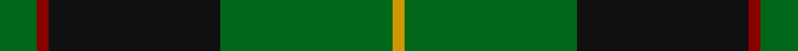
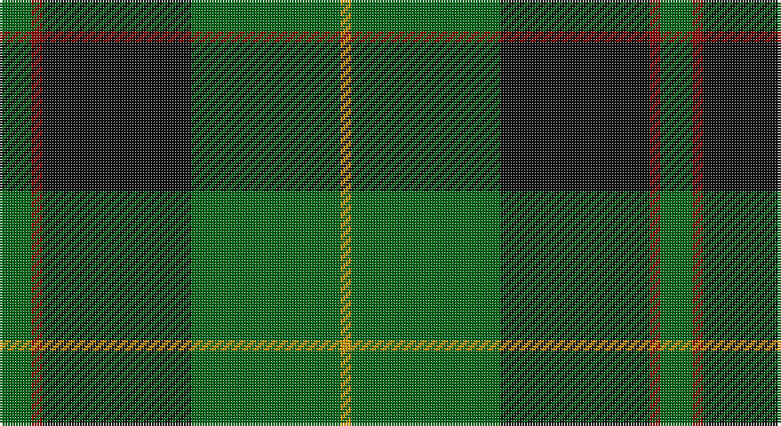

This page is one **sett** — a single exact thread-count. It belongs to the [tartan](/setts/g3r1k14g14lo1/)
(the same proportion at any scale), whose colour order is pattern [GRKGY](/stripes/grkgy/).

Sourced from register-of-tartans.  It is a [5 stripe tartan](/stripes/stripes5/).

Original link https://www.tartanregister.gov.uk/tartanDetails.aspx?ref=4516

## Register references

External register numbers recorded for this tartan.

- Scottish Register of Tartans: [4516](https://www.tartanregister.gov.uk/tartanDetails.aspx?ref=4516)
- Scottish Tartans Authority (ITI): 4314

## Thread count
G/12 DR4 K56 G56 DY/4

One full sett is **248 threads**.

## Palette

Palette: <strong>Tartan Register</strong> <small style="color:#888">(3 of 4 colours)</small>
<table><thead><tr><th>Colour</th><th>Threads</th><th>Shade</th><th>Base</th><th>OKLCh</th></tr></thead><tbody><tr><td>G/</td><td style="text-align:right;font-variant-numeric:tabular-nums">12</td><td><code style="background-color:#006818;">#006818</code> <small style="color:#888">#006818</small></td><td>G <code style="background-color:#006100;">#006100</code></td><td><small style="color:#888">oklch(45.0% 0.142 145.0)</small></td></tr><tr><td>DR</td><td style="text-align:right;font-variant-numeric:tabular-nums">4</td><td><code style="background-color:#880000;">#880000</code> <small style="color:#888">#880000</small></td><td>R <code style="background-color:#CC0000;">#CC0000</code></td><td><small style="color:#888">oklch(39.4% 0.162 29.2)</small></td></tr><tr><td>K</td><td style="text-align:right;font-variant-numeric:tabular-nums">56</td><td><code style="background-color:#101010;">#101010</code> <small style="color:#888">#101010</small></td><td>K <code style="background-color:#000000;">#000000</code></td><td><small style="color:#888">oklch(17.3% 0.000 89.9)</small></td></tr><tr><td>G</td><td style="text-align:right;font-variant-numeric:tabular-nums">56</td><td><code style="background-color:#006818;">#006818</code> <small style="color:#888">#006818</small></td><td>G <code style="background-color:#006100;">#006100</code></td><td><small style="color:#888">oklch(45.0% 0.142 145.0)</small></td></tr><tr><td>DY/</td><td style="text-align:right;font-variant-numeric:tabular-nums">4</td><td><code style="background-color:#D09800;">#D09800</code> <small style="color:#888">#D09800</small></td><td>Y <code style="background-color:#F2BF00;">#F2BF00</code></td><td><small style="color:#888">oklch(71.4% 0.147 82.1)</small></td></tr></tbody></table>

# Sample pattern

## Nearest tartans

The nearest existing variants by ΔTartan distance, with this tartan at the top so the swatches line up against it.

ΔTartan

Tartan

Sett

—

<a href="/ttd/edit/#slug=g3r1k14g14lo1~x4">Wcwm 1255</a> <a class="nn-out" href="/variants/s5/g3r1k14g14lo1~x4/" title="open its dictionary page">↗</a>

0.59

<a href="/ttd/edit/#slug=r3g30k12g6k16ly2~x2&amp;base=g3r1k14g14lo1~x4">MacArthur (Variant)</a> <a class="nn-out" href="/variants/s6/r3g30k12g6k16ly2~x2/" title="open its dictionary page">↗</a>

0.84

<a href="/ttd/edit/#slug=k6g4gi44k41w4~x2&amp;base=g3r1k14g14lo1~x4">Raeside</a> <a class="nn-out" href="/variants/s5/k6g4gi44k41w4~x2/" title="open its dictionary page">↗</a>

0.85

<a href="/ttd/edit/#slug=r1g11k11lo1~x4&amp;base=g3r1k14g14lo1~x4">Brooks Brothers (Corporate)</a> <a class="nn-out" href="/variants/s4/r1g11k11lo1~x4/" title="open its dictionary page">↗</a>

0.87

<a href="/ttd/edit/#slug=k6db4g44k41w4~x2&amp;base=g3r1k14g14lo1~x4">Douglas (alternative threadcount)</a> <a class="nn-out" href="/variants/s5/k6db4g44k41w4~x2/" title="open its dictionary page">↗</a>

0.95

<a href="/ttd/edit/#slug=k6db1k6g4k10g20r2~x2&amp;base=g3r1k14g14lo1~x4">MacKinross</a> <a class="nn-out" href="/variants/s7/k6db1k6g4k10g20r2~x2/" title="open its dictionary page">↗</a>

0.99

<a href="/ttd/edit/#slug=r1dg16k8dg4k4ly1~x2&amp;base=g3r1k14g14lo1~x4">Forbes #6</a> <a class="nn-out" href="/variants/s6/r1dg16k8dg4k4ly1~x2/" title="open its dictionary page">↗</a>

1.00

<a href="/ttd/edit/#slug=k5g40db20ly3~x2&amp;base=g3r1k14g14lo1~x4">Robert Byers Family - Dooballagh, Ireland</a> <a class="nn-out" href="/variants/s4/k5g40db20ly3~x2/" title="open its dictionary page">↗</a>

1.02

<a href="/ttd/edit/#slug=dg46k18dg6k13r4k4w4~x2&amp;base=g3r1k14g14lo1~x4">Page</a> <a class="nn-out" href="/variants/s7/dg46k18dg6k13r4k4w4~x2/" title="open its dictionary page">↗</a>

1.13

<a href="/ttd/edit/#slug=g62k40ly3k3w3~x2&amp;base=g3r1k14g14lo1~x4">O'Donoghue</a> <a class="nn-out" href="/variants/s5/g62k40ly3k3w3~x2/" title="open its dictionary page">↗</a>

1.20

<a href="/ttd/edit/#slug=k6db4dg44k41w4~x2&amp;base=g3r1k14g14lo1~x4">Douglas (Clan)</a> <a class="nn-out" href="/variants/s5/k6db4dg44k41w4~x2/" title="open its dictionary page">↗</a>

## Neighbour map

Every grey dot is one of 14360 variants placed by the first two principal components of the ΔTartan feature space (44% of its variance). Red is this tartan; blue dots are its nearest — click one to open its page.

<svg viewBox="0 0 640 380" role="img" style="max-width:100%;height:auto;border:1px solid #e0e0e0;border-radius:4px;display:block" xmlns="http://www.w3.org/2000/svg"><image href="/nn/cloud.v1.png" width="640" height="380"/><a href="/variants/s6/r3g30k12g6k16ly2~x2/"><circle cx="319.1" cy="214.6" r="4" fill="#3465a4"><title>MacArthur (Variant)</title></circle></a><a href="/variants/s5/k6g4gi44k41w4~x2/"><circle cx="289.3" cy="221.7" r="4" fill="#3465a4"><title>Raeside</title></circle></a><a href="/variants/s4/r1g11k11lo1~x4/"><circle cx="296.3" cy="245.7" r="4" fill="#3465a4"><title>Brooks Brothers (Corporate)</title></circle></a><a href="/variants/s5/k6db4g44k41w4~x2/"><circle cx="293.0" cy="223.5" r="4" fill="#3465a4"><title>Douglas (alternative threadcount)</title></circle></a><a href="/variants/s7/k6db1k6g4k10g20r2~x2/"><circle cx="332.8" cy="204.5" r="4" fill="#3465a4"><title>MacKinross</title></circle></a><a href="/variants/s6/r1dg16k8dg4k4ly1~x2/"><circle cx="388.3" cy="222.4" r="4" fill="#3465a4"><title>Forbes #6</title></circle></a><a href="/variants/s4/k5g40db20ly3~x2/"><circle cx="353.1" cy="238.0" r="4" fill="#3465a4"><title>Robert Byers Family - Dooballagh, Ireland</title></circle></a><a href="/variants/s7/dg46k18dg6k13r4k4w4~x2/"><circle cx="343.8" cy="210.4" r="4" fill="#3465a4"><title>Page</title></circle></a><a href="/variants/s5/g62k40ly3k3w3~x2/"><circle cx="362.3" cy="188.0" r="4" fill="#3465a4"><title>O'Donoghue</title></circle></a><a href="/variants/s5/k6db4dg44k41w4~x2/"><circle cx="317.7" cy="236.5" r="4" fill="#3465a4"><title>Douglas (Clan)</title></circle></a><circle cx="337.3" cy="224.0" r="5" fill="#c00000"/></svg>

ID: /variants/s5/g3r1k14g14lo1~x4/
