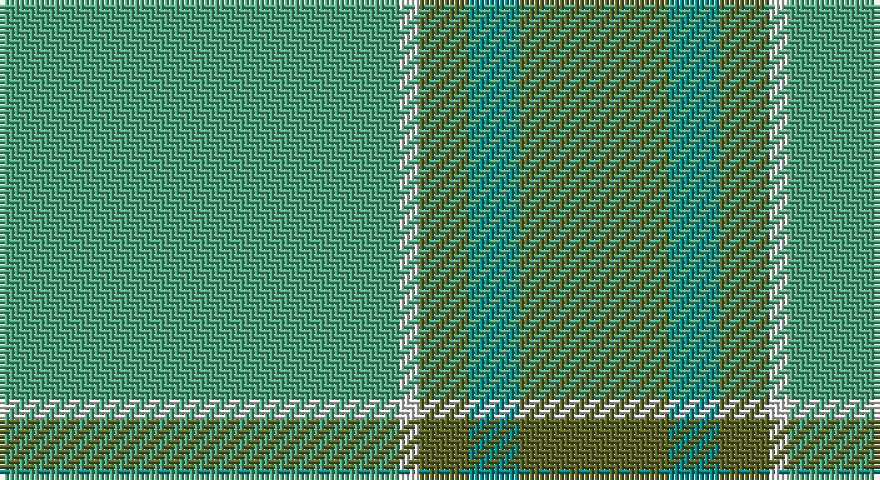

This page is one **sett** — a single exact thread-count. It belongs to the [tartan](/setts/g40w2y5gi5y15/)
(the same proportion at any scale), whose colour order is pattern [GGGWG](/stripes/gggwg/).

Sourced from tartans-authority.  It is a [5 stripe tartan](/stripes/stripes5/).

Original link http://www.tartansauthority.com/tartan-ferret/display/8113/

## Register references

External register numbers recorded for this tartan.

- Scottish Tartans Authority (ITI): 8113

## Thread count
LG/80 LN4 G10 B10 G/30

One full sett is **158 threads**.

## Palette

Palette: <strong>Tartan Register</strong> <small style="color:#888">(3 of 4 colours)</small>
<table><thead><tr><th>Colour</th><th>Threads</th><th>Shade</th><th>Base</th><th>OKLCh</th></tr></thead><tbody><tr><td>LG/</td><td style="text-align:right;font-variant-numeric:tabular-nums">80</td><td><code style="background-color:#50A47C;">#50A47C</code> <small style="color:#888">#50A47C</small></td><td>G <code style="background-color:#006100;">#006100</code></td><td><small style="color:#888">oklch(65.5% 0.103 160.9)</small></td></tr><tr><td>LN</td><td style="text-align:right;font-variant-numeric:tabular-nums">4</td><td><code style="background-color:#E0E0E0;">#E0E0E0</code> <small style="color:#888">#E0E0E0</small></td><td>W <code style="background-color:#F7F7F7;">#F7F7F7</code></td><td><small style="color:#888">oklch(90.7% 0.000 89.9)</small></td></tr><tr><td>G</td><td style="text-align:right;font-variant-numeric:tabular-nums">10</td><td><code style="background-color:#5C6428;">#5C6428</code> <small style="color:#888">#5C6428</small></td><td>G <code style="background-color:#006100;">#006100</code></td><td><small style="color:#888">oklch(48.3% 0.084 116.0)</small></td></tr><tr><td>B</td><td style="text-align:right;font-variant-numeric:tabular-nums">10</td><td><code style="background-color:#048888;">#048888</code> <small style="color:#888">#048888</small></td><td>G <code style="background-color:#006100;">#006100</code></td><td><small style="color:#888">oklch(56.8% 0.096 194.8)</small></td></tr><tr><td>G/</td><td style="text-align:right;font-variant-numeric:tabular-nums">30</td><td><code style="background-color:#5C6428;">#5C6428</code> <small style="color:#888">#5C6428</small></td><td>G <code style="background-color:#006100;">#006100</code></td><td><small style="color:#888">oklch(48.3% 0.084 116.0)</small></td></tr></tbody></table>

# Sample pattern

## Nearest tartans

The nearest existing variants by ΔTartan distance, with this tartan at the top so the swatches line up against it.

ΔTartan

Tartan

Sett

—

<a href="/ttd/edit/#slug=g40w2y5gi5y15~x2">Castle Bay (Fashion)</a> <a class="nn-out" href="/variants/s5/g40w2y5gi5y15~x2/" title="open its dictionary page">↗</a>

1.04

<a href="/ttd/edit/#slug=g32t6g12t28r2db1~x2&amp;base=g40w2y5gi5y15~x2">Palm Beach Gardens Police</a> <a class="nn-out" href="/variants/s6/g32t6g12t28r2db1~x2/" title="open its dictionary page">↗</a>

1.37

<a href="/ttd/edit/#slug=g27gi14dt2gi2ly2~x4&amp;base=g40w2y5gi5y15~x2">Irving of Bonshaw</a> <a class="nn-out" href="/variants/s5/g27gi14dt2gi2ly2~x4/" title="open its dictionary page">↗</a>

1.48

<a href="/ttd/edit/#slug=g49t21k3t3w3~x2&amp;base=g40w2y5gi5y15~x2">Irvine of Drum (Clan)</a> <a class="nn-out" href="/variants/s5/g49t21k3t3w3~x2/" title="open its dictionary page">↗</a>

1.53

<a href="/ttd/edit/#slug=ly10g30gi25g30k2g3~x2&amp;base=g40w2y5gi5y15~x2">Gordon Cumming (Artefact)</a> <a class="nn-out" href="/variants/s6/ly10g30gi25g30k2g3~x2/" title="open its dictionary page">↗</a>

1.87

<a href="/ttd/edit/#slug=y36g19y4g31b2r3b2r3g12~x2&amp;base=g40w2y5gi5y15~x2">O'Brien (Scotch Corner)</a> <a class="nn-out" href="/variants/s9/y36g19y4g31b2r3b2r3g12~x2/" title="open its dictionary page">↗</a>

1.93

<a href="/ttd/edit/#slug=r3n34db4g47lb3~x2&amp;base=g40w2y5gi5y15~x2">Exabyte</a> <a class="nn-out" href="/variants/s5/r3n34db4g47lb3~x2/" title="open its dictionary page">↗</a>

2.01

<a href="/ttd/edit/#slug=n8g20w4r1~x5&amp;base=g40w2y5gi5y15~x2">Farooq (Personal)</a> <a class="nn-out" href="/variants/s4/n8g20w4r1~x5/" title="open its dictionary page">↗</a>

2.03

<a href="/ttd/edit/#slug=g1y9g9lo1~x4&amp;base=g40w2y5gi5y15~x2">Spring Morning (Fashion)</a> <a class="nn-out" href="/variants/s4/g1y9g9lo1~x4/" title="open its dictionary page">↗</a>

2.16

<a href="/ttd/edit/#slug=g38n8b3db4n12lo1g4n1~x2&amp;base=g40w2y5gi5y15~x2">Del Forno Wolf (Personal)</a> <a class="nn-out" href="/variants/s8/g38n8b3db4n12lo1g4n1~x2/" title="open its dictionary page">↗</a>

2.22

<a href="/ttd/edit/#slug=g18r6g75db6g13dy35g12db6&amp;base=g40w2y5gi5y15~x2">Glenlivet Corporate Tartan</a> <a class="nn-out" href="/variants/s8/g18r6g75db6g13dy35g12db6/" title="open its dictionary page">↗</a>

## Neighbour map

Every grey dot is one of 14360 variants placed by the first two principal components of the ΔTartan feature space (44% of its variance). Red is this tartan; blue dots are its nearest — click one to open its page.

<svg viewBox="0 0 640 380" role="img" style="max-width:100%;height:auto;border:1px solid #e0e0e0;border-radius:4px;display:block" xmlns="http://www.w3.org/2000/svg"><image href="/nn/cloud.v1.png" width="640" height="380"/><a href="/variants/s6/g32t6g12t28r2db1~x2/"><circle cx="455.7" cy="225.9" r="4" fill="#3465a4"><title>Palm Beach Gardens Police</title></circle></a><a href="/variants/s5/g27gi14dt2gi2ly2~x4/"><circle cx="424.6" cy="250.7" r="4" fill="#3465a4"><title>Irving of Bonshaw</title></circle></a><a href="/variants/s5/g49t21k3t3w3~x2/"><circle cx="451.6" cy="226.9" r="4" fill="#3465a4"><title>Irvine of Drum (Clan)</title></circle></a><a href="/variants/s6/ly10g30gi25g30k2g3~x2/"><circle cx="418.1" cy="261.9" r="4" fill="#3465a4"><title>Gordon Cumming (Artefact)</title></circle></a><a href="/variants/s9/y36g19y4g31b2r3b2r3g12~x2/"><circle cx="410.4" cy="213.0" r="4" fill="#3465a4"><title>O'Brien (Scotch Corner)</title></circle></a><a href="/variants/s5/r3n34db4g47lb3~x2/"><circle cx="380.5" cy="226.2" r="4" fill="#3465a4"><title>Exabyte</title></circle></a><a href="/variants/s4/n8g20w4r1~x5/"><circle cx="414.7" cy="231.7" r="4" fill="#3465a4"><title>Farooq (Personal)</title></circle></a><a href="/variants/s4/g1y9g9lo1~x4/"><circle cx="413.5" cy="313.5" r="4" fill="#3465a4"><title>Spring Morning (Fashion)</title></circle></a><a href="/variants/s8/g38n8b3db4n12lo1g4n1~x2/"><circle cx="488.7" cy="180.4" r="4" fill="#3465a4"><title>Del Forno Wolf (Personal)</title></circle></a><a href="/variants/s8/g18r6g75db6g13dy35g12db6/"><circle cx="498.1" cy="244.0" r="4" fill="#3465a4"><title>Glenlivet Corporate Tartan</title></circle></a><circle cx="463.2" cy="238.1" r="5" fill="#c00000"/></svg>

ID: /variants/s5/g40w2y5gi5y15~x2/
