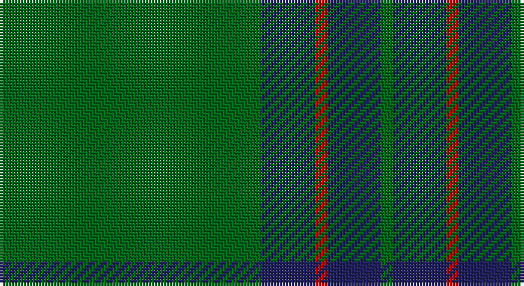

This page is one **sett** — a single exact thread-count. It belongs to the [tartan](/setts/g44db9r2db9g2/)
(the same proportion at any scale), whose colour order is pattern [GBRBG](/stripes/gbrbg/).

Sourced from register-of-tartans.  It is a [5 stripe tartan](/stripes/stripes5/).

Original link https://www.tartanregister.gov.uk/tartanDetails.aspx?ref=4177

3 attestations — the source records this cloth was collapsed from (oldest owns this page)

<ul>
<li>01/01/1998 — Tyrconnell (Personal) (register-of-tartans, <a href="https://www.tartanregister.gov.uk/tartanDetails.aspx?ref=4177">record</a>)</li>
<li>1998 — Tyrconnell (Personal) (tartans-authority, <a href="http://www.tartansauthority.com/tartan-ferret/display/2580/">record</a>)</li>
<li>undated — Tyrconnell (weddslist, <a href="http://www.weddslist.com/cgi-bin/tartans/pg.pl?source=sts">record</a>)</li>
</ul>

## Register references

External register numbers recorded for this tartan.

- Scottish Register of Tartans: [4177](https://www.tartanregister.gov.uk/tartanDetails.aspx?ref=4177)
- Scottish Tartans Authority (ITI): 2580
- Scottish Tartans World Register: 2580

## Thread count
G/88 DB18 R4 DB18 G/4

One full sett is **172 threads**.

## Palette

Palette: <strong>Tartan Register</strong>
<table><thead><tr><th>Colour</th><th>Threads</th><th>Shade</th><th>Base</th><th>OKLCh</th></tr></thead><tbody><tr><td>G/</td><td style="text-align:right;font-variant-numeric:tabular-nums">88</td><td><code style="background-color:#006818;">#006818</code> <small style="color:#888">#006818</small></td><td>G <code style="background-color:#006100;">#006100</code></td><td><small style="color:#888">oklch(45.0% 0.142 145.0)</small></td></tr><tr><td>DB</td><td style="text-align:right;font-variant-numeric:tabular-nums">18</td><td><code style="background-color:#202060;">#202060</code> <small style="color:#888">#202060</small></td><td>B <code style="background-color:#2A418A;">#2A418A</code></td><td><small style="color:#888">oklch(28.9% 0.111 276.9)</small></td></tr><tr><td>R</td><td style="text-align:right;font-variant-numeric:tabular-nums">4</td><td><code style="background-color:#C80000;">#C80000</code> <small style="color:#888">#C80000</small></td><td>R <code style="background-color:#CC0000;">#CC0000</code></td><td><small style="color:#888">oklch(52.3% 0.215 29.2)</small></td></tr><tr><td>DB</td><td style="text-align:right;font-variant-numeric:tabular-nums">18</td><td><code style="background-color:#202060;">#202060</code> <small style="color:#888">#202060</small></td><td>B <code style="background-color:#2A418A;">#2A418A</code></td><td><small style="color:#888">oklch(28.9% 0.111 276.9)</small></td></tr><tr><td>G/</td><td style="text-align:right;font-variant-numeric:tabular-nums">4</td><td><code style="background-color:#006818;">#006818</code> <small style="color:#888">#006818</small></td><td>G <code style="background-color:#006100;">#006100</code></td><td><small style="color:#888">oklch(45.0% 0.142 145.0)</small></td></tr></tbody></table>

# Sample pattern

## Nearest tartans

The nearest existing variants by ΔTartan distance, with this tartan at the top so the swatches line up against it.

ΔTartan

Tartan

Sett

—

<a href="/ttd/edit/#slug=g44db9r2db9g2~x2">Tyrconnell (Personal)</a> <a class="nn-out" href="/variants/s5/g44db9r2db9g2~x2/" title="open its dictionary page">↗</a>

1.11

<a href="/ttd/edit/#slug=dg32k6dg4k8r1k2~x4&amp;base=g44db9r2db9g2~x2">Fife, Duke Of</a> <a class="nn-out" href="/variants/s6/dg32k6dg4k8r1k2~x4/" title="open its dictionary page">↗</a>

1.20

<a href="/ttd/edit/#slug=g49db16dy3db2dy2db6~x2&amp;base=g44db9r2db9g2~x2">Royal and Ancient, The</a> <a class="nn-out" href="/variants/s6/g49db16dy3db2dy2db6~x2/" title="open its dictionary page">↗</a>

1.23

<a href="/ttd/edit/#slug=g49db16o3db2o2db6~x2&amp;base=g44db9r2db9g2~x2">Royal and Ancient, The</a> <a class="nn-out" href="/variants/s6/g49db16o3db2o2db6~x2/" title="open its dictionary page">↗</a>

1.36

<a href="/ttd/edit/#slug=r1k2dg16k2ly1~x2&amp;base=g44db9r2db9g2~x2">Skene or Tribe of Mar</a> <a class="nn-out" href="/variants/s5/r1k2dg16k2ly1~x2/" title="open its dictionary page">↗</a>

1.51

<a href="/ttd/edit/#slug=g50db20k3db2dy2db5~x2&amp;base=g44db9r2db9g2~x2">St Andrews Old Course Hotel Corporate Tartan</a> <a class="nn-out" href="/variants/s6/g50db20k3db2dy2db5~x2/" title="open its dictionary page">↗</a>

1.53

<a href="/ttd/edit/#slug=dg42o10dg3r10o3~x2&amp;base=g44db9r2db9g2~x2">Glen Trool (Fashion)</a> <a class="nn-out" href="/variants/s5/dg42o10dg3r10o3~x2/" title="open its dictionary page">↗</a>

1.53

<a href="/ttd/edit/#slug=g30t8g5lb4g5r2~x4&amp;base=g44db9r2db9g2~x2">Annapolis Valley</a> <a class="nn-out" href="/variants/s6/g30t8g5lb4g5r2~x4/" title="open its dictionary page">↗</a>

1.62

<a href="/ttd/edit/#slug=g70k26g12k14db3k16~x2&amp;base=g44db9r2db9g2~x2">Duchess of Fife #2</a> <a class="nn-out" href="/variants/s6/g70k26g12k14db3k16~x2/" title="open its dictionary page">↗</a>

1.66

<a href="/ttd/edit/#slug=g30b8g5lb4g5r1~x4&amp;base=g44db9r2db9g2~x2">Annapolis Valley</a> <a class="nn-out" href="/variants/s6/g30b8g5lb4g5r1~x4/" title="open its dictionary page">↗</a>

1.68

<a href="/ttd/edit/#slug=r8g3r4g44w4~x2&amp;base=g44db9r2db9g2~x2">Welsh National (District)</a> <a class="nn-out" href="/variants/s5/r8g3r4g44w4~x2/" title="open its dictionary page">↗</a>

## Neighbour map

Every grey dot is one of 14360 variants placed by the first two principal components of the ΔTartan feature space (44% of its variance). Red is this tartan; blue dots are its nearest — click one to open its page.

<svg viewBox="0 0 640 380" role="img" style="max-width:100%;height:auto;border:1px solid #e0e0e0;border-radius:4px;display:block" xmlns="http://www.w3.org/2000/svg"><image href="/nn/cloud.v1.png" width="640" height="380"/><a href="/variants/s6/dg32k6dg4k8r1k2~x4/"><circle cx="529.9" cy="209.0" r="4" fill="#3465a4"><title>Fife, Duke Of</title></circle></a><a href="/variants/s6/g49db16dy3db2dy2db6~x2/"><circle cx="484.8" cy="209.7" r="4" fill="#3465a4"><title>Royal and Ancient, The</title></circle></a><a href="/variants/s6/g49db16o3db2o2db6~x2/"><circle cx="470.2" cy="201.7" r="4" fill="#3465a4"><title>Royal and Ancient, The</title></circle></a><a href="/variants/s5/r1k2dg16k2ly1~x2/"><circle cx="488.8" cy="201.6" r="4" fill="#3465a4"><title>Skene or Tribe of Mar</title></circle></a><a href="/variants/s6/g50db20k3db2dy2db5~x2/"><circle cx="446.9" cy="189.2" r="4" fill="#3465a4"><title>St Andrews Old Course Hotel Corporate Tartan</title></circle></a><a href="/variants/s5/dg42o10dg3r10o3~x2/"><circle cx="466.7" cy="241.0" r="4" fill="#3465a4"><title>Glen Trool (Fashion)</title></circle></a><a href="/variants/s6/g30t8g5lb4g5r2~x4/"><circle cx="477.5" cy="213.2" r="4" fill="#3465a4"><title>Annapolis Valley</title></circle></a><a href="/variants/s6/g70k26g12k14db3k16~x2/"><circle cx="419.6" cy="222.1" r="4" fill="#3465a4"><title>Duchess of Fife #2</title></circle></a><a href="/variants/s6/g30b8g5lb4g5r1~x4/"><circle cx="510.4" cy="183.7" r="4" fill="#3465a4"><title>Annapolis Valley</title></circle></a><a href="/variants/s5/r8g3r4g44w4~x2/"><circle cx="503.5" cy="208.4" r="4" fill="#3465a4"><title>Welsh National (District)</title></circle></a><circle cx="512.3" cy="221.4" r="5" fill="#c00000"/></svg>

ID: /variants/s5/g44db9r2db9g2~x2/
