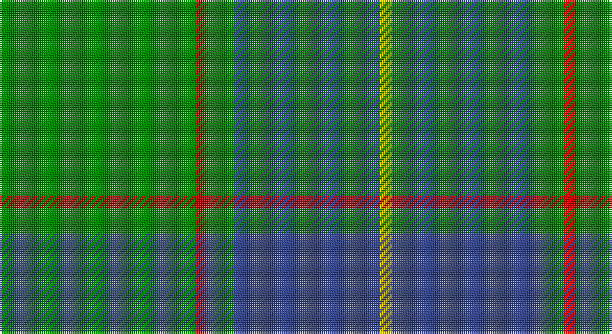

This page is one **sett** — a single exact thread-count. It belongs to the [tartan](/setts/g47r3g6db35ly3/)
(the same proportion at any scale), whose colour order is pattern [GRGBY](/stripes/grgby/).

Sourced from weddslist.  It is a [5 stripe tartan](/stripes/stripes5/).

Original link http://www.weddslist.com/cgi-bin/tartans/pg.pl?source=sts

## Thread count
G/94 R6 G12 B70 Y/6

One full sett is **276 threads**.

## Palette

Palette: <strong>custom</strong>
<table><thead><tr><th>Colour</th><th>Threads</th><th>Shade</th><th>Base</th><th>OKLCh</th></tr></thead><tbody><tr><td>G/</td><td style="text-align:right;font-variant-numeric:tabular-nums">94</td><td><code style="background-color:#008000;">#008000</code> <small style="color:#888">#008000</small></td><td>G <code style="background-color:#006100;">#006100</code></td><td><small style="color:#888">oklch(52.0% 0.177 142.5)</small></td></tr><tr><td>R</td><td style="text-align:right;font-variant-numeric:tabular-nums">6</td><td><code style="background-color:#C00000;">#C00000</code> <small style="color:#888">#C00000</small></td><td>R <code style="background-color:#CC0000;">#CC0000</code></td><td><small style="color:#888">oklch(50.7% 0.208 29.2)</small></td></tr><tr><td>G</td><td style="text-align:right;font-variant-numeric:tabular-nums">12</td><td><code style="background-color:#008000;">#008000</code> <small style="color:#888">#008000</small></td><td>G <code style="background-color:#006100;">#006100</code></td><td><small style="color:#888">oklch(52.0% 0.177 142.5)</small></td></tr><tr><td>B</td><td style="text-align:right;font-variant-numeric:tabular-nums">70</td><td><code style="background-color:#304080;">#304080</code> <small style="color:#888">#304080</small></td><td>B <code style="background-color:#2A418A;">#2A418A</code></td><td><small style="color:#888">oklch(39.4% 0.109 270.2)</small></td></tr><tr><td>Y/</td><td style="text-align:right;font-variant-numeric:tabular-nums">6</td><td><code style="background-color:#F0C000;">#F0C000</code> <small style="color:#888">#F0C000</small></td><td>Y <code style="background-color:#F2BF00;">#F2BF00</code></td><td><small style="color:#888">oklch(82.7% 0.169 90.5)</small></td></tr></tbody></table>

# Sample pattern

## Nearest tartans

The nearest existing variants by ΔTartan distance, with this tartan at the top so the swatches line up against it.

ΔTartan

Tartan

Sett

—

<a href="/ttd/edit/#slug=g47r3g6db35ly3~x2">Gracie</a> <a class="nn-out" href="/variants/s5/g47r3g6db35ly3~x2/" title="open its dictionary page">↗</a>

0.49

<a href="/ttd/edit/#slug=g27db14k2db2ly2~x4&amp;base=g47r3g6db35ly3~x2">Irving of Bonshaw</a> <a class="nn-out" href="/variants/s5/g27db14k2db2ly2~x4/" title="open its dictionary page">↗</a>

0.78

<a href="/ttd/edit/#slug=g18db9k1db1w1~x4&amp;base=g47r3g6db35ly3~x2">Irvine</a> <a class="nn-out" href="/variants/s5/g18db9k1db1w1~x4/" title="open its dictionary page">↗</a>

1.05

<a href="/ttd/edit/#slug=t1db4g10ly1~x2&amp;base=g47r3g6db35ly3~x2">Wilson's No.174</a> <a class="nn-out" href="/variants/s4/t1db4g10ly1~x2/" title="open its dictionary page">↗</a>

1.07

<a href="/ttd/edit/#slug=k5g40db20ly3~x2&amp;base=g47r3g6db35ly3~x2">Robert Byers Family - Dooballagh, Ireland</a> <a class="nn-out" href="/variants/s4/k5g40db20ly3~x2/" title="open its dictionary page">↗</a>

1.08

<a href="/ttd/edit/#slug=t1db4g10w1~x2&amp;base=g47r3g6db35ly3~x2">Wilson's, No 205</a> <a class="nn-out" href="/variants/s4/t1db4g10w1~x2/" title="open its dictionary page">↗</a>

1.18

<a href="/ttd/edit/#slug=g25k8o10r1o3~x4&amp;base=g47r3g6db35ly3~x2">Herbage Family Tartan</a> <a class="nn-out" href="/variants/s5/g25k8o10r1o3~x4/" title="open its dictionary page">↗</a>

1.19

<a href="/ttd/edit/#slug=g12lo1db8k1db1~x4&amp;base=g47r3g6db35ly3~x2">Rowan (Personal)</a> <a class="nn-out" href="/variants/s5/g12lo1db8k1db1~x4/" title="open its dictionary page">↗</a>

1.20

<a href="/ttd/edit/#slug=g24k2db3k2db8r2~x2&amp;base=g47r3g6db35ly3~x2">Shaw (Clan 1)</a> <a class="nn-out" href="/variants/s6/g24k2db3k2db8r2~x2/" title="open its dictionary page">↗</a>

1.20

<a href="/ttd/edit/#slug=g50db20k3db2o2db5~x2&amp;base=g47r3g6db35ly3~x2">St Andrews Hotel, Golf Resort, and SPA</a> <a class="nn-out" href="/variants/s6/g50db20k3db2o2db5~x2/" title="open its dictionary page">↗</a>

1.24

<a href="/ttd/edit/#slug=g28r2g2r2g8db24y3r2~x2&amp;base=g47r3g6db35ly3~x2">Leatherneck, U.S.Marine Corps</a> <a class="nn-out" href="/variants/s8/g28r2g2r2g8db24y3r2~x2/" title="open its dictionary page">↗</a>

## Neighbour map

Every grey dot is one of 14360 variants placed by the first two principal components of the ΔTartan feature space (44% of its variance). Red is this tartan; blue dots are its nearest — click one to open its page.

<svg viewBox="0 0 640 380" role="img" style="max-width:100%;height:auto;border:1px solid #e0e0e0;border-radius:4px;display:block" xmlns="http://www.w3.org/2000/svg"><image href="/nn/cloud.v1.png" width="640" height="380"/><a href="/variants/s5/g27db14k2db2ly2~x4/"><circle cx="353.0" cy="209.7" r="4" fill="#3465a4"><title>Irving of Bonshaw</title></circle></a><a href="/variants/s5/g18db9k1db1w1~x4/"><circle cx="379.2" cy="193.7" r="4" fill="#3465a4"><title>Irvine</title></circle></a><a href="/variants/s4/t1db4g10ly1~x2/"><circle cx="362.1" cy="242.5" r="4" fill="#3465a4"><title>Wilson's No.174</title></circle></a><a href="/variants/s4/k5g40db20ly3~x2/"><circle cx="353.1" cy="238.0" r="4" fill="#3465a4"><title>Robert Byers Family - Dooballagh, Ireland</title></circle></a><a href="/variants/s4/t1db4g10w1~x2/"><circle cx="359.7" cy="240.7" r="4" fill="#3465a4"><title>Wilson's, No 205</title></circle></a><a href="/variants/s5/g25k8o10r1o3~x4/"><circle cx="339.1" cy="199.3" r="4" fill="#3465a4"><title>Herbage Family Tartan</title></circle></a><a href="/variants/s5/g12lo1db8k1db1~x4/"><circle cx="339.9" cy="226.8" r="4" fill="#3465a4"><title>Rowan (Personal)</title></circle></a><a href="/variants/s6/g24k2db3k2db8r2~x2/"><circle cx="369.4" cy="209.1" r="4" fill="#3465a4"><title>Shaw (Clan 1)</title></circle></a><a href="/variants/s6/g50db20k3db2o2db5~x2/"><circle cx="416.1" cy="173.6" r="4" fill="#3465a4"><title>St Andrews Hotel, Golf Resort, and SPA</title></circle></a><a href="/variants/s8/g28r2g2r2g8db24y3r2~x2/"><circle cx="340.8" cy="187.4" r="4" fill="#3465a4"><title>Leatherneck, U.S.Marine Corps</title></circle></a><circle cx="363.9" cy="213.0" r="5" fill="#c00000"/></svg>

ID: /variants/s5/g47r3g6db35ly3~x2/
