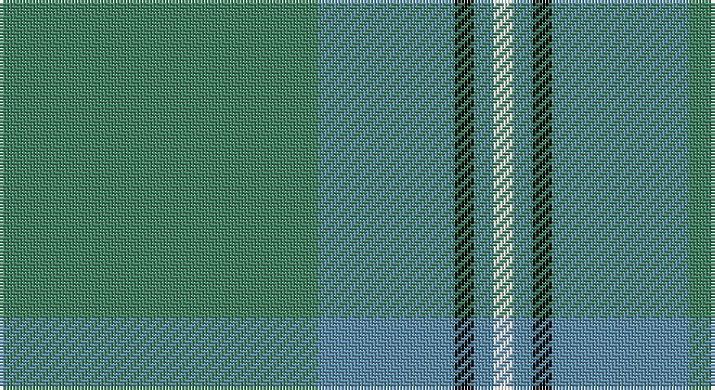

This page is one **sett** — a single exact thread-count. It belongs to the [tartan](/setts/g49t21k3t3w3/)
(the same proportion at any scale), whose colour order is pattern [GBKBW](/stripes/gbkbw/).

Part of the [Irvine of Drum](/tartans/irvine-of-drum/) tartan — the named design grouping this sett with its other cloths.

Sourced from tartans-authority.  It is a [5 stripe tartan](/stripes/stripes5/).

Original link http://www.tartansauthority.com/tartan-ferret/display/733/

## Register references

External register numbers recorded for this tartan.

- Scottish Tartans Authority (ITI): 733

## Thread count
G/98 B42 K6 B6 W/6

One full sett is **212 threads**.

## Palette

Palette: <strong>Tartan Register</strong>
<table><thead><tr><th>Colour</th><th>Threads</th><th>Shade</th><th>Base</th><th>OKLCh</th></tr></thead><tbody><tr><td>G/</td><td style="text-align:right;font-variant-numeric:tabular-nums">98</td><td><code style="background-color:#408060;">#408060</code> <small style="color:#888">#408060</small></td><td>G <code style="background-color:#006100;">#006100</code></td><td><small style="color:#888">oklch(54.8% 0.084 160.1)</small></td></tr><tr><td>B</td><td style="text-align:right;font-variant-numeric:tabular-nums">42</td><td><code style="background-color:#5C8CA8;">#5C8CA8</code> <small style="color:#888">#5C8CA8</small></td><td>B <code style="background-color:#2A418A;">#2A418A</code></td><td><small style="color:#888">oklch(61.7% 0.067 235.0)</small></td></tr><tr><td>K</td><td style="text-align:right;font-variant-numeric:tabular-nums">6</td><td><code style="background-color:#101010;">#101010</code> <small style="color:#888">#101010</small></td><td>K <code style="background-color:#000000;">#000000</code></td><td><small style="color:#888">oklch(17.3% 0.000 89.9)</small></td></tr><tr><td>B</td><td style="text-align:right;font-variant-numeric:tabular-nums">6</td><td><code style="background-color:#5C8CA8;">#5C8CA8</code> <small style="color:#888">#5C8CA8</small></td><td>B <code style="background-color:#2A418A;">#2A418A</code></td><td><small style="color:#888">oklch(61.7% 0.067 235.0)</small></td></tr><tr><td>W/</td><td style="text-align:right;font-variant-numeric:tabular-nums">6</td><td><code style="background-color:#FCFCFC;">#FCFCFC</code> <small style="color:#888">#FCFCFC</small></td><td>W <code style="background-color:#F7F7F7;">#F7F7F7</code></td><td><small style="color:#888">oklch(99.1% 0.000 89.9)</small></td></tr></tbody></table>

# Sample pattern

## Compared to the master

This cloth is one sett of its design; the master sett (the exemplar the design is anchored on) is below for comparison.

<figure style="margin:0"><figcaption style="color:#888;font-size:smaller">this sett</figcaption></figure>
<figure style="margin:0"><figcaption style="color:#888;font-size:smaller"><a href="/setts/t3k3t21g49t21k3t3w3/">master sett →</a></figcaption></figure>

## Nearest tartans

The nearest existing variants by ΔTartan distance, with this tartan at the top so the swatches line up against it.

ΔTartan

Tartan

Sett

—

<a href="/ttd/edit/#slug=g49t21k3t3w3~x2">Irvine of Drum (Clan)</a> <a class="nn-out" href="/variants/s5/g49t21k3t3w3~x2/" title="open its dictionary page">↗</a>

1.38

<a href="/ttd/edit/#slug=n8g20w4r1~x5&amp;base=g49t21k3t3w3~x2">Farooq (Personal)</a> <a class="nn-out" href="/variants/s4/n8g20w4r1~x5/" title="open its dictionary page">↗</a>

1.48

<a href="/ttd/edit/#slug=g40w2y5gi5y15~x2&amp;base=g49t21k3t3w3~x2">Castle Bay (Fashion)</a> <a class="nn-out" href="/variants/s5/g40w2y5gi5y15~x2/" title="open its dictionary page">↗</a>

1.53

<a href="/ttd/edit/#slug=g27gi14dt2gi2ly2~x4&amp;base=g49t21k3t3w3~x2">Irving of Bonshaw</a> <a class="nn-out" href="/variants/s5/g27gi14dt2gi2ly2~x4/" title="open its dictionary page">↗</a>

1.59

<a href="/ttd/edit/#slug=o57w5g20o5lo10~x2&amp;base=g49t21k3t3w3~x2">Johore (District)</a> <a class="nn-out" href="/variants/s5/o57w5g20o5lo10~x2/" title="open its dictionary page">↗</a>

1.69

<a href="/ttd/edit/#slug=t3k3t21g49t21k3t3w3~x2&amp;base=g49t21k3t3w3~x2">Irvine of Drum</a> <a class="nn-out" href="/variants/s8/t3k3t21g49t21k3t3w3~x2/" title="open its dictionary page">↗</a>

1.80

<a href="/ttd/edit/#slug=y57w5g20y5ly10&amp;base=g49t21k3t3w3~x2">Jahore</a> <a class="nn-out" href="/variants/s5/y57w5g20y5ly10/" title="open its dictionary page">↗</a>

1.84

<a href="/ttd/edit/#slug=r3n34db4g47lb3~x2&amp;base=g49t21k3t3w3~x2">Exabyte</a> <a class="nn-out" href="/variants/s5/r3n34db4g47lb3~x2/" title="open its dictionary page">↗</a>

1.85

<a href="/ttd/edit/#slug=ly10g30gi25g30k2g3~x2&amp;base=g49t21k3t3w3~x2">Gordon Cumming (Artefact)</a> <a class="nn-out" href="/variants/s6/ly10g30gi25g30k2g3~x2/" title="open its dictionary page">↗</a>

1.89

<a href="/ttd/edit/#slug=g32t6g12t28r2db1~x2&amp;base=g49t21k3t3w3~x2">Palm Beach Gardens Police</a> <a class="nn-out" href="/variants/s6/g32t6g12t28r2db1~x2/" title="open its dictionary page">↗</a>

1.90

<a href="/ttd/edit/#slug=g13k2g34k6b16r2b16k2g13~x2&amp;base=g49t21k3t3w3~x2">Lockhart</a> <a class="nn-out" href="/variants/s9/g13k2g34k6b16r2b16k2g13~x2/" title="open its dictionary page">↗</a>

## Neighbour map

Every grey dot is one of 14360 variants placed by the first two principal components of the ΔTartan feature space (44% of its variance). Red is this tartan; blue dots are its nearest — click one to open its page.

<svg viewBox="0 0 640 380" role="img" style="max-width:100%;height:auto;border:1px solid #e0e0e0;border-radius:4px;display:block" xmlns="http://www.w3.org/2000/svg"><image href="/nn/cloud.v1.png" width="640" height="380"/><a href="/variants/s4/n8g20w4r1~x5/"><circle cx="414.7" cy="231.7" r="4" fill="#3465a4"><title>Farooq (Personal)</title></circle></a><a href="/variants/s5/g40w2y5gi5y15~x2/"><circle cx="463.2" cy="238.1" r="4" fill="#3465a4"><title>Castle Bay (Fashion)</title></circle></a><a href="/variants/s5/g27gi14dt2gi2ly2~x4/"><circle cx="424.6" cy="250.7" r="4" fill="#3465a4"><title>Irving of Bonshaw</title></circle></a><a href="/variants/s5/o57w5g20o5lo10~x2/"><circle cx="420.7" cy="229.1" r="4" fill="#3465a4"><title>Johore (District)</title></circle></a><a href="/variants/s8/t3k3t21g49t21k3t3w3~x2/"><circle cx="367.3" cy="200.9" r="4" fill="#3465a4"><title>Irvine of Drum</title></circle></a><a href="/variants/s5/y57w5g20y5ly10/"><circle cx="409.3" cy="223.5" r="4" fill="#3465a4"><title>Jahore</title></circle></a><a href="/variants/s5/r3n34db4g47lb3~x2/"><circle cx="380.5" cy="226.2" r="4" fill="#3465a4"><title>Exabyte</title></circle></a><a href="/variants/s6/ly10g30gi25g30k2g3~x2/"><circle cx="418.1" cy="261.9" r="4" fill="#3465a4"><title>Gordon Cumming (Artefact)</title></circle></a><a href="/variants/s6/g32t6g12t28r2db1~x2/"><circle cx="455.7" cy="225.9" r="4" fill="#3465a4"><title>Palm Beach Gardens Police</title></circle></a><a href="/variants/s9/g13k2g34k6b16r2b16k2g13~x2/"><circle cx="373.7" cy="213.7" r="4" fill="#3465a4"><title>Lockhart</title></circle></a><circle cx="451.6" cy="226.9" r="5" fill="#c00000"/></svg>

ID: /variants/s5/g49t21k3t3w3~x2/
