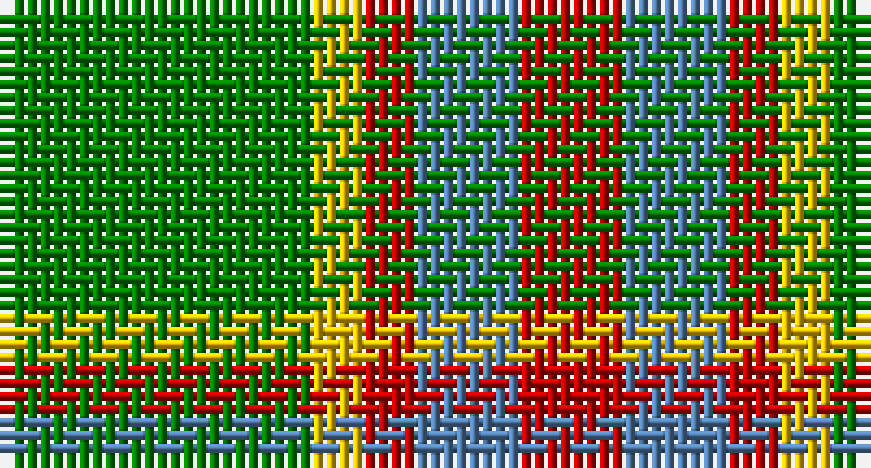

This page is one **sett** — a single exact thread-count. It belongs to the [tartan](/setts/g6ly1r1t2r2/)
(the same proportion at any scale), whose colour order is pattern [GYRBR](/stripes/gyrbr/).

Sourced from weddslist.  It is a [5 stripe tartan](/stripes/stripes5/).

Original link http://www.weddslist.com/cgi-bin/tartans/pg.pl?source=sts

## Also known as

This cloth is also recorded under:

- Wilson's, No 179

## Thread count
G/24 Y4 R4 B8 R/8

One full sett is **64 threads**.

## Palette

Palette: <strong>custom</strong>
<table><thead><tr><th>Colour</th><th>Threads</th><th>Shade</th><th>Base</th><th>OKLCh</th></tr></thead><tbody><tr><td>G/</td><td style="text-align:right;font-variant-numeric:tabular-nums">24</td><td><code style="background-color:#008000;">#008000</code> <small style="color:#888">#008000</small></td><td>G <code style="background-color:#006100;">#006100</code></td><td><small style="color:#888">oklch(52.0% 0.177 142.5)</small></td></tr><tr><td>Y</td><td style="text-align:right;font-variant-numeric:tabular-nums">4</td><td><code style="background-color:#F0C000;">#F0C000</code> <small style="color:#888">#F0C000</small></td><td>Y <code style="background-color:#F2BF00;">#F2BF00</code></td><td><small style="color:#888">oklch(82.7% 0.169 90.5)</small></td></tr><tr><td>R</td><td style="text-align:right;font-variant-numeric:tabular-nums">4</td><td><code style="background-color:#C00000;">#C00000</code> <small style="color:#888">#C00000</small></td><td>R <code style="background-color:#CC0000;">#CC0000</code></td><td><small style="color:#888">oklch(50.7% 0.208 29.2)</small></td></tr><tr><td>B</td><td style="text-align:right;font-variant-numeric:tabular-nums">8</td><td><code style="background-color:#5480B0;">#5480B0</code> <small style="color:#888">#5480B0</small></td><td>B <code style="background-color:#2A418A;">#2A418A</code></td><td><small style="color:#888">oklch(58.8% 0.089 251.5)</small></td></tr><tr><td>R/</td><td style="text-align:right;font-variant-numeric:tabular-nums">8</td><td><code style="background-color:#C00000;">#C00000</code> <small style="color:#888">#C00000</small></td><td>R <code style="background-color:#CC0000;">#CC0000</code></td><td><small style="color:#888">oklch(50.7% 0.208 29.2)</small></td></tr></tbody></table>

# Sample pattern

## Nearest tartans

The nearest existing variants by ΔTartan distance, with this tartan at the top so the swatches line up against it.

ΔTartan

Tartan

Sett

—

<a href="/ttd/edit/#slug=g6ly1r1t2r2~x4">Wilson's, No 179</a> <a class="nn-out" href="/variants/s5/g6ly1r1t2r2~x4/" title="open its dictionary page">↗</a>

1.02

<a href="/ttd/edit/#slug=g6k1r1t2r2~x4&amp;base=g6ly1r1t2r2~x4">Wilson's, No 193</a> <a class="nn-out" href="/variants/s5/g6k1r1t2r2~x4/" title="open its dictionary page">↗</a>

1.23

<a href="/ttd/edit/#slug=r4g3o8w3o4g18ly3~x2&amp;base=g6ly1r1t2r2~x4">Newfoundland</a> <a class="nn-out" href="/variants/s7/r4g3o8w3o4g18ly3~x2/" title="open its dictionary page">↗</a>

1.24

<a href="/ttd/edit/#slug=r4g3dy8w3dy4g18ly3~x2&amp;base=g6ly1r1t2r2~x4">Newfoundland District Tartan</a> <a class="nn-out" href="/variants/s7/r4g3dy8w3dy4g18ly3~x2/" title="open its dictionary page">↗</a>

1.33

<a href="/ttd/edit/#slug=lo5g7k1t1~x4&amp;base=g6ly1r1t2r2~x4">Wilson's, No 195</a> <a class="nn-out" href="/variants/s4/lo5g7k1t1~x4/" title="open its dictionary page">↗</a>

1.34

<a href="/ttd/edit/#slug=db6r15g41r15db20g41t6&amp;base=g6ly1r1t2r2~x4">Bean Hunting</a> <a class="nn-out" href="/variants/s7/db6r15g41r15db20g41t6/" title="open its dictionary page">↗</a>

1.41

<a href="/ttd/edit/#slug=ly5g14dy4db4dy27g3dy4ly5~x2&amp;base=g6ly1r1t2r2~x4">Invertere (Daks #2) (Fashion)</a> <a class="nn-out" href="/variants/s8/ly5g14dy4db4dy27g3dy4ly5~x2/" title="open its dictionary page">↗</a>

1.47

<a href="/ttd/edit/#slug=r5g7k2t1~x4&amp;base=g6ly1r1t2r2~x4">Wilson's No.195</a> <a class="nn-out" href="/variants/s4/r5g7k2t1~x4/" title="open its dictionary page">↗</a>

1.48

<a href="/ttd/edit/#slug=g25lo6dg5r3lo10~x4&amp;base=g6ly1r1t2r2~x4">Pendlebury, Andrew (Personal)</a> <a class="nn-out" href="/variants/s5/g25lo6dg5r3lo10~x4/" title="open its dictionary page">↗</a>

1.49

<a href="/ttd/edit/#slug=dg13ly2dg2ly2dg4r10g2r2~x4&amp;base=g6ly1r1t2r2~x4">Oakwood</a> <a class="nn-out" href="/variants/s8/dg13ly2dg2ly2dg4r10g2r2~x4/" title="open its dictionary page">↗</a>

1.49

<a href="/ttd/edit/#slug=do4g25lo10g3lo18r4~x2&amp;base=g6ly1r1t2r2~x4">Unidentfied (Ligioner Highland Games</a> <a class="nn-out" href="/variants/s6/do4g25lo10g3lo18r4~x2/" title="open its dictionary page">↗</a>

## Neighbour map

Every grey dot is one of 14360 variants placed by the first two principal components of the ΔTartan feature space (44% of its variance). Red is this tartan; blue dots are its nearest — click one to open its page.

<svg viewBox="0 0 640 380" role="img" style="max-width:100%;height:auto;border:1px solid #e0e0e0;border-radius:4px;display:block" xmlns="http://www.w3.org/2000/svg"><image href="/nn/cloud.v1.png" width="640" height="380"/><a href="/variants/s5/g6k1r1t2r2~x4/"><circle cx="224.5" cy="237.6" r="4" fill="#3465a4"><title>Wilson's, No 193</title></circle></a><a href="/variants/s7/r4g3o8w3o4g18ly3~x2/"><circle cx="224.5" cy="215.2" r="4" fill="#3465a4"><title>Newfoundland</title></circle></a><a href="/variants/s7/r4g3dy8w3dy4g18ly3~x2/"><circle cx="219.6" cy="214.4" r="4" fill="#3465a4"><title>Newfoundland District Tartan</title></circle></a><a href="/variants/s4/lo5g7k1t1~x4/"><circle cx="236.1" cy="235.8" r="4" fill="#3465a4"><title>Wilson's, No 195</title></circle></a><a href="/variants/s7/db6r15g41r15db20g41t6/"><circle cx="283.8" cy="247.3" r="4" fill="#3465a4"><title>Bean Hunting</title></circle></a><a href="/variants/s8/ly5g14dy4db4dy27g3dy4ly5~x2/"><circle cx="277.8" cy="195.0" r="4" fill="#3465a4"><title>Invertere (Daks #2) (Fashion)</title></circle></a><a href="/variants/s4/r5g7k2t1~x4/"><circle cx="232.3" cy="260.0" r="4" fill="#3465a4"><title>Wilson's No.195</title></circle></a><a href="/variants/s5/g25lo6dg5r3lo10~x4/"><circle cx="298.4" cy="242.2" r="4" fill="#3465a4"><title>Pendlebury, Andrew (Personal)</title></circle></a><a href="/variants/s8/dg13ly2dg2ly2dg4r10g2r2~x4/"><circle cx="278.1" cy="217.6" r="4" fill="#3465a4"><title>Oakwood</title></circle></a><a href="/variants/s6/do4g25lo10g3lo18r4~x2/"><circle cx="221.4" cy="206.0" r="4" fill="#3465a4"><title>Unidentfied (Ligioner Highland Games</title></circle></a><circle cx="244.6" cy="244.0" r="5" fill="#c00000"/></svg>

ID: /variants/s5/g6ly1r1t2r2~x4/
