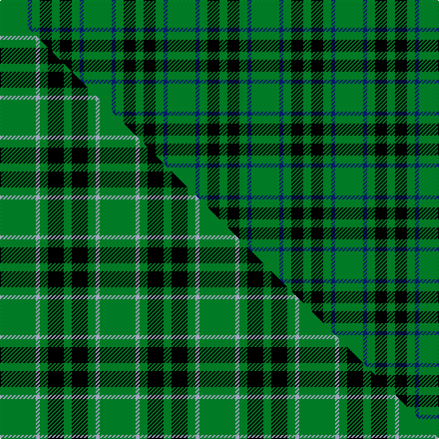

This page is one **sett** — a single exact thread-count. It belongs to the [tartan](/setts/g7db1g2k3g2/)
(the same proportion at any scale), whose colour order is pattern [GBGKG](/stripes/gbgkg/).

Part of the [Peterhead](/tartans/peterhead/) tartan — the named design grouping this sett with its other cloths.

Sourced from weddslist.  It is a [5 stripe tartan](/stripes/stripes5/).

Original link http://www.weddslist.com/cgi-bin/tartans/pg.pl?source=sts

## Thread count
G/28 DB4 G8 K12 G/8

One full sett is **84 threads**.

## Palette
<table><thead><tr><th>Colour</th><th>Shade</th><th>OKLCh</th></tr></thead><tbody><tr><td>DB</td><td><code style="background-color:#082077;">#082077</code> <small style="color:#888">#082077</small></td><td><small style="color:#888">oklch(30.0% 0.149 265.1)</small></td></tr><tr><td>G</td><td><code style="background-color:#008B2A;">#008B2A</code> <small style="color:#888">#008B2A</small></td><td><small style="color:#888">oklch(55.4% 0.170 145.9)</small></td></tr><tr><td>K</td><td><code style="background-color:#000000;">#000000</code> <small style="color:#888">#000000</small></td><td><small style="color:#888">oklch(0.0% 0.000 0.0)</small></td></tr></tbody></table>

# Sample pattern

## Compared to the master

This cloth is one sett of its design; the master sett (the exemplar the design is anchored on) is below for comparison.

Its **ΔTartan distance** from the master is **0.60** — the same measure the nearest-tartans table ranks by (0 is identical; a re-scale of the same cloth is near 0, a recolour or a different proportion further).

<figure class="master-compare" style="margin:0">

this sett
master sett ★

<figcaption style="color:#888;font-size:smaller">One weave of this sett against the <a href="/setts/g9lb1g2k4g2/">master sett ★</a>, split on the diagonal: a shared proportion runs seamlessly across it with only the shades shifting; a different proportion breaks on it.</figcaption>
</figure>

## Nearest variants

The nearest existing variants by ΔTartan distance, with this cloth at the top so the swatches line up against it.

ΔTartan

Threads

Variant

Sett

—

84

<a href="/variants/s5/g7db1g2k3g2~x4/">Peterhead</a>

<a href="/ttd/edit/#slug=g9lb1g2k4g2~x4&amp;base=g7db1g2k3g2~x4" title="compare in the TTD">0.27</a>

100

<a href="/variants/s5/g9lb1g2k4g2~x4/">Peterhead (Personal)</a>

<a href="/ttd/edit/#slug=g8r3g4k6g9dp2~x2&amp;base=g7db1g2k3g2~x4" title="compare in the TTD">1.00</a>

108

<a href="/variants/s6/g8r3g4k6g9dp2~x2/">Milton</a>

<a href="/ttd/edit/#slug=g8r3g4k6g9dp2~x4&amp;base=g7db1g2k3g2~x4" title="compare in the TTD">1.00</a>

216

<a href="/variants/s6/g8r3g4k6g9dp2~x4/">Milton (Name?)</a>

<a href="/ttd/edit/#slug=g3db8g3k4g15r2~x2&amp;base=g7db1g2k3g2~x4" title="compare in the TTD">1.04</a>

130

<a href="/variants/s6/g3db8g3k4g15r2~x2/">Lauder (Family)</a>

<a href="/ttd/edit/#slug=dr3g20k20g20lo2g2lo2~x2&amp;base=g7db1g2k3g2~x4" title="compare in the TTD">1.77</a>

266

<a href="/variants/s7/dr3g20k20g20lo2g2lo2~x2/">Paton (Personal)</a>

<a href="/ttd/edit/#slug=g16k11g16dr2~x4&amp;base=g7db1g2k3g2~x4" title="compare in the TTD">1.83</a>

288

<a href="/variants/s4/g16k11g16dr2~x4/">Kincaid of Kincaid</a>

<a href="/ttd/edit/#slug=g3k8g8lb3k18g2~x4&amp;base=g7db1g2k3g2~x4" title="compare in the TTD">1.96</a>

316

<a href="/variants/s6/g3k8g8lb3k18g2~x4/">Kincardine City</a>

<a href="/ttd/edit/#slug=g22k3g25k4~x2&amp;base=g7db1g2k3g2~x4" title="compare in the TTD">2.02</a>

164

<a href="/variants/s4/g22k3g25k4~x2/">Campbell Simpson</a>

<a href="/ttd/edit/#slug=g18y2g18k4g2k15~x2&amp;base=g7db1g2k3g2~x4" title="compare in the TTD">2.04</a>

170

<a href="/variants/s6/g18y2g18k4g2k15~x2/">MacArthur</a>

<a href="/ttd/edit/#slug=g18ly2g18k4g2k15~x2&amp;base=g7db1g2k3g2~x4" title="compare in the TTD">2.04</a>

170

<a href="/variants/s6/g18ly2g18k4g2k15~x2/">MacArthur (Highland Society)</a>

## Neighbour map

Every grey dot is one of 13620 variants placed by the first two principal components of the ΔTartan feature space (42% of its variance). Red is this tartan; blue dots are its nearest — click one to open its page.

<svg viewBox="0 0 640 380" role="img" style="max-width:100%;height:auto;border:1px solid #e0e0e0;border-radius:4px;display:block" xmlns="http://www.w3.org/2000/svg"><image href="/nn/cloud.v1.png" width="640" height="380"/><a href="/variants/s5/g9lb1g2k4g2~x4/"><circle cx="369.1" cy="222.9" r="4" fill="#3465a4"><title>Peterhead (Personal)</title></circle></a><a href="/variants/s6/g8r3g4k6g9dp2~x2/"><circle cx="252.7" cy="261.2" r="4" fill="#3465a4"><title>Milton</title></circle></a><a href="/variants/s6/g8r3g4k6g9dp2~x4/"><circle cx="252.7" cy="261.2" r="4" fill="#3465a4"><title>Milton (Name?)</title></circle></a><a href="/variants/s6/g3db8g3k4g15r2~x2/"><circle cx="269.3" cy="215.5" r="4" fill="#3465a4"><title>Lauder (Family)</title></circle></a><a href="/variants/s7/dr3g20k20g20lo2g2lo2~x2/"><circle cx="277.2" cy="182.9" r="4" fill="#3465a4"><title>Paton (Personal)</title></circle></a><a href="/variants/s4/g16k11g16dr2~x4/"><circle cx="343.4" cy="267.0" r="4" fill="#3465a4"><title>Kincaid of Kincaid</title></circle></a><a href="/variants/s6/g3k8g8lb3k18g2~x4/"><circle cx="293.8" cy="208.0" r="4" fill="#3465a4"><title>Kincardine City</title></circle></a><a href="/variants/s4/g22k3g25k4~x2/"><circle cx="521.9" cy="258.5" r="4" fill="#3465a4"><title>Campbell Simpson</title></circle></a><a href="/variants/s6/g18y2g18k4g2k15~x2/"><circle cx="313.9" cy="219.3" r="4" fill="#3465a4"><title>MacArthur</title></circle></a><a href="/variants/s6/g18ly2g18k4g2k15~x2/"><circle cx="311.0" cy="218.5" r="4" fill="#3465a4"><title>MacArthur (Highland Society)</title></circle></a><circle cx="366.2" cy="243.1" r="5" fill="#c00000"/><text x="320" y="376" text-anchor="middle" font-size="11" fill="#999">ground</text><text x="11" y="190" text-anchor="middle" font-size="11" fill="#999" transform="rotate(-90 11 190)">complexity</text></svg>

ID: /variants/s5/g7db1g2k3g2~x4/
