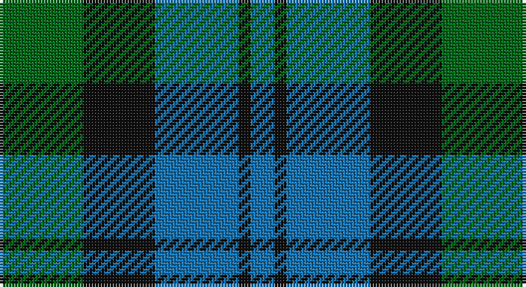

This page is one **sett** — a single exact thread-count. It belongs to the [tartan](/setts/g7k6b7k1b2/)
(the same proportion at any scale), whose colour order is pattern [BKBKG](/stripes/bkbkg/).

Part of the [Campbell of Glenlyon](/tartans/campbell-of-glenlyon/) tartan — the named design grouping this sett with its other cloths.

Sourced from tartans-authority.  It is a [5 stripe tartan](/stripes/stripes5/).

Original link http://www.tartansauthority.com/tartan-ferret/display/14/

## Also known as

This cloth is also recorded under:

- Campbell of Glenlyon Check

## Register references

External register numbers recorded for this tartan.

- Scottish Tartans Authority (ITI): 14

## Thread count
G/28 K24 B28 K4 B/8

One full sett is **148 threads**.

## Palette

Palette: <strong>Tartan Register</strong>
<table><thead><tr><th>Colour</th><th>Threads</th><th>Shade</th><th>Base</th><th>OKLCh</th></tr></thead><tbody><tr><td>G/</td><td style="text-align:right;font-variant-numeric:tabular-nums">28</td><td><code style="background-color:#006818;">#006818</code> <small style="color:#888">#006818</small></td><td>G <code style="background-color:#006100;">#006100</code></td><td><small style="color:#888">oklch(45.0% 0.142 145.0)</small></td></tr><tr><td>K</td><td style="text-align:right;font-variant-numeric:tabular-nums">24</td><td><code style="background-color:#101010;">#101010</code> <small style="color:#888">#101010</small></td><td>K <code style="background-color:#000000;">#000000</code></td><td><small style="color:#888">oklch(17.3% 0.000 89.9)</small></td></tr><tr><td>B</td><td style="text-align:right;font-variant-numeric:tabular-nums">28</td><td><code style="background-color:#1474B4;">#1474B4</code> <small style="color:#888">#1474B4</small></td><td>B <code style="background-color:#2A418A;">#2A418A</code></td><td><small style="color:#888">oklch(54.0% 0.129 245.1)</small></td></tr><tr><td>K</td><td style="text-align:right;font-variant-numeric:tabular-nums">4</td><td><code style="background-color:#101010;">#101010</code> <small style="color:#888">#101010</small></td><td>K <code style="background-color:#000000;">#000000</code></td><td><small style="color:#888">oklch(17.3% 0.000 89.9)</small></td></tr><tr><td>B/</td><td style="text-align:right;font-variant-numeric:tabular-nums">8</td><td><code style="background-color:#1474B4;">#1474B4</code> <small style="color:#888">#1474B4</small></td><td>B <code style="background-color:#2A418A;">#2A418A</code></td><td><small style="color:#888">oklch(54.0% 0.129 245.1)</small></td></tr></tbody></table>

# Sample pattern

## Nearest tartans

The nearest existing variants by ΔTartan distance, with this tartan at the top so the swatches line up against it.

ΔTartan

Tartan

Sett

—

<a href="/ttd/edit/#slug=g7k6b7k1b2~x4">Campbell of Glenlyon Check (Clan)</a> <a class="nn-out" href="/variants/s5/g7k6b7k1b2~x4/" title="open its dictionary page">↗</a>

0.00

<a href="/ttd/edit/#slug=g7k6b7k1b2~x2&amp;base=g7k6b7k1b2~x4">Campbell of Glenlyon</a> <a class="nn-out" href="/variants/s5/g7k6b7k1b2~x2/" title="open its dictionary page">↗</a>

0.86

<a href="/ttd/edit/#slug=b6k6b18k18g22k5~x2&amp;base=g7k6b7k1b2~x4">Campbell, The 42nd</a> <a class="nn-out" href="/variants/s6/b6k6b18k18g22k5~x2/" title="open its dictionary page">↗</a>

1.11

<a href="/ttd/edit/#slug=b3k4b4g9k2~x4&amp;base=g7k6b7k1b2~x4">Falconer</a> <a class="nn-out" href="/variants/s5/b3k4b4g9k2~x4/" title="open its dictionary page">↗</a>

1.19

<a href="/ttd/edit/#slug=db4k4db4g9k2~x2&amp;base=g7k6b7k1b2~x4">Austin Clan</a> <a class="nn-out" href="/variants/s5/db4k4db4g9k2~x2/" title="open its dictionary page">↗</a>

1.30

<a href="/ttd/edit/#slug=g24b6lb3k6b12k15g4~x2&amp;base=g7k6b7k1b2~x4">Blaylock Annandale</a> <a class="nn-out" href="/variants/s7/g24b6lb3k6b12k15g4~x2/" title="open its dictionary page">↗</a>

1.31

<a href="/ttd/edit/#slug=g52lb7g9k35db35k7&amp;base=g7k6b7k1b2~x4">Redland</a> <a class="nn-out" href="/variants/s6/g52lb7g9k35db35k7/" title="open its dictionary page">↗</a>

1.32

<a href="/variants/s6/b12k4g6ly1~x8/">Sinclair of Ulbster</a>

1.33

<a href="/ttd/edit/#slug=k3g14k14g2b14r3~x2&amp;base=g7k6b7k1b2~x4">Morrison Society</a> <a class="nn-out" href="/variants/s6/k3g14k14g2b14r3~x2/" title="open its dictionary page">↗</a>

1.35

<a href="/ttd/edit/#slug=k2dg9t1k6b4dg2~x2&amp;base=g7k6b7k1b2~x4">Unidentified #28</a> <a class="nn-out" href="/variants/s6/k2dg9t1k6b4dg2~x2/" title="open its dictionary page">↗</a>

1.37

<a href="/ttd/edit/#slug=g7k6db7k1db2~x2&amp;base=g7k6b7k1b2~x4">Campbell of Glenlyon</a> <a class="nn-out" href="/variants/s5/g7k6db7k1db2~x2/" title="open its dictionary page">↗</a>

## Neighbour map

Every grey dot is one of 14360 variants placed by the first two principal components of the ΔTartan feature space (44% of its variance). Red is this tartan; blue dots are its nearest — click one to open its page.

<svg viewBox="0 0 640 380" role="img" style="max-width:100%;height:auto;border:1px solid #e0e0e0;border-radius:4px;display:block" xmlns="http://www.w3.org/2000/svg"><image href="/nn/cloud.v1.png" width="640" height="380"/><a href="/variants/s5/g7k6b7k1b2~x2/"><circle cx="204.4" cy="290.4" r="4" fill="#3465a4"><title>Campbell of Glenlyon</title></circle></a><a href="/variants/s6/b6k6b18k18g22k5~x2/"><circle cx="181.0" cy="298.8" r="4" fill="#3465a4"><title>Campbell, The 42nd</title></circle></a><a href="/variants/s5/b3k4b4g9k2~x4/"><circle cx="180.5" cy="297.0" r="4" fill="#3465a4"><title>Falconer</title></circle></a><a href="/variants/s5/db4k4db4g9k2~x2/"><circle cx="209.3" cy="324.9" r="4" fill="#3465a4"><title>Austin Clan</title></circle></a><a href="/variants/s7/g24b6lb3k6b12k15g4~x2/"><circle cx="189.5" cy="236.9" r="4" fill="#3465a4"><title>Blaylock Annandale</title></circle></a><a href="/variants/s6/g52lb7g9k35db35k7/"><circle cx="207.5" cy="247.7" r="4" fill="#3465a4"><title>Redland</title></circle></a><a href="/variants/s6/b12k4g6ly1~x8/"><circle cx="191.9" cy="240.6" r="4" fill="#3465a4"><title>Sinclair of Ulbster</title></circle></a><a href="/variants/s6/k3g14k14g2b14r3~x2/"><circle cx="163.0" cy="248.5" r="4" fill="#3465a4"><title>Morrison Society</title></circle></a><a href="/variants/s6/k2dg9t1k6b4dg2~x2/"><circle cx="229.2" cy="243.7" r="4" fill="#3465a4"><title>Unidentified #28</title></circle></a><a href="/variants/s5/g7k6db7k1db2~x2/"><circle cx="179.0" cy="278.0" r="4" fill="#3465a4"><title>Campbell of Glenlyon</title></circle></a><circle cx="204.4" cy="290.4" r="5" fill="#c00000"/></svg>

ID: /variants/s5/g7k6b7k1b2~x4/
