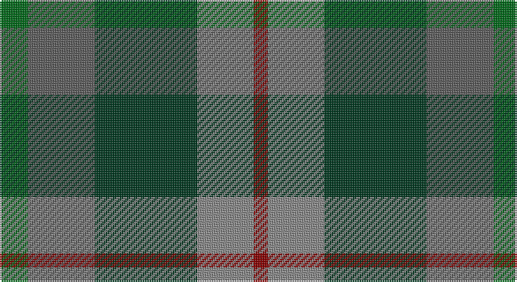

This page is one **sett** — a single exact thread-count. It belongs to the [tartan](/setts/g8n19dg29o16r4/)
(the same proportion at any scale), whose colour order is pattern [GBGRR](/stripes/gbgrr/).

Part of the [Styrian](/tartans/styrian/) tartan — the named design grouping this sett with its other cloths.

Sourced from tartans-authority.  It is a [5 stripe tartan](/stripes/stripes5/).

Original link http://www.tartansauthority.com/tartan-ferret/display/5839/

## Register references

External register numbers recorded for this tartan.

- Scottish Tartans Authority (ITI): 5839

## Thread count
G/16 N38 DG58 Na32 DR/8

One full sett is **280 threads**.

## Palette

Palette: <strong>Tartan Register</strong> <small style="color:#888">(4 of 5 colours)</small>
<table><thead><tr><th>Colour</th><th>Threads</th><th>Shade</th><th>Base</th><th>OKLCh</th></tr></thead><tbody><tr><td>G/</td><td style="text-align:right;font-variant-numeric:tabular-nums">16</td><td><code style="background-color:#006818;">#006818</code> <small style="color:#888">#006818</small></td><td>G <code style="background-color:#006100;">#006100</code></td><td><small style="color:#888">oklch(45.0% 0.142 145.0)</small></td></tr><tr><td>N</td><td style="text-align:right;font-variant-numeric:tabular-nums">38</td><td><code style="background-color:#5C5C5C;">#5C5C5C</code> <small style="color:#888">#5C5C5C</small></td><td>B <code style="background-color:#2A418A;">#2A418A</code></td><td><small style="color:#888">oklch(47.5% 0.000 89.9)</small></td></tr><tr><td>DG</td><td style="text-align:right;font-variant-numeric:tabular-nums">58</td><td><code style="background-color:#003820;">#003820</code> <small style="color:#888">#003820</small></td><td>G <code style="background-color:#006100;">#006100</code></td><td><small style="color:#888">oklch(30.0% 0.070 158.3)</small></td></tr><tr><td>Na</td><td style="text-align:right;font-variant-numeric:tabular-nums">32</td><td><code style="background-color:#888888;">#888888</code> <small style="color:#888">#888888</small></td><td>R <code style="background-color:#CC0000;">#CC0000</code></td><td><small style="color:#888">oklch(62.7% 0.000 89.9)</small></td></tr><tr><td>DR/</td><td style="text-align:right;font-variant-numeric:tabular-nums">8</td><td><code style="background-color:#880000;">#880000</code> <small style="color:#888">#880000</small></td><td>R <code style="background-color:#CC0000;">#CC0000</code></td><td><small style="color:#888">oklch(39.4% 0.162 29.2)</small></td></tr></tbody></table>

# Sample pattern

## Compared to the master

This cloth is one sett of its design; the master sett (the exemplar the design is anchored on) is below for comparison.

<figure style="margin:0"><figcaption style="color:#888;font-size:smaller">this sett</figcaption></figure>
<figure style="margin:0"><figcaption style="color:#888;font-size:smaller"><a href="/setts/o16dg29n19g8n19dg29o16r4/">master sett →</a></figcaption></figure>

## Nearest tartans

The nearest existing variants by ΔTartan distance, with this tartan at the top so the swatches line up against it.

ΔTartan

Tartan

Sett

—

<a href="/ttd/edit/#slug=g8n19dg29o16r4~x2">Styrian (Fashion)</a> <a class="nn-out" href="/variants/s5/g8n19dg29o16r4~x2/" title="open its dictionary page">↗</a>

1.17

<a href="/ttd/edit/#slug=db11g15k2n5dbi3n11~x2&amp;base=g8n19dg29o16r4~x2">Saorsa (Corporate)</a> <a class="nn-out" href="/variants/s6/db11g15k2n5dbi3n11~x2/" title="open its dictionary page">↗</a>

1.17

<a href="/ttd/edit/#slug=o16dg29n19g8n19dg29o16r4~x2&amp;base=g8n19dg29o16r4~x2">Styrian</a> <a class="nn-out" href="/variants/s8/o16dg29n19g8n19dg29o16r4~x2/" title="open its dictionary page">↗</a>

1.20

<a href="/ttd/edit/#slug=r4g11k11g2n11y3~x4&amp;base=g8n19dg29o16r4~x2">Casely</a> <a class="nn-out" href="/variants/s6/r4g11k11g2n11y3~x4/" title="open its dictionary page">↗</a>

1.24

<a href="/ttd/edit/#slug=r1dy7db7k7g7dy7r1~x4&amp;base=g8n19dg29o16r4~x2">Tennant Family Tartan</a> <a class="nn-out" href="/variants/s7/r1dy7db7k7g7dy7r1~x4/" title="open its dictionary page">↗</a>

1.30

<a href="/ttd/edit/#slug=r1dy7g7k7b7dy7r1~x4&amp;base=g8n19dg29o16r4~x2">Tennant (Clan)</a> <a class="nn-out" href="/variants/s7/r1dy7g7k7b7dy7r1~x4/" title="open its dictionary page">↗</a>

1.34

<a href="/ttd/edit/#slug=dp4n18k17n3g18n4~x2&amp;base=g8n19dg29o16r4~x2">Scottish Airports (Corporate)</a> <a class="nn-out" href="/variants/s6/dp4n18k17n3g18n4~x2/" title="open its dictionary page">↗</a>

1.38

<a href="/ttd/edit/#slug=g2lo1g5k4do5r1~x4&amp;base=g8n19dg29o16r4~x2">Forres</a> <a class="nn-out" href="/variants/s6/g2lo1g5k4do5r1~x4/" title="open its dictionary page">↗</a>

1.39

<a href="/ttd/edit/#slug=b32dy16g3lo4dg28~x2&amp;base=g8n19dg29o16r4~x2">Corey (Name)</a> <a class="nn-out" href="/variants/s5/b32dy16g3lo4dg28~x2/" title="open its dictionary page">↗</a>

1.41

<a href="/ttd/edit/#slug=dy46g23b23r4ly4~x2&amp;base=g8n19dg29o16r4~x2">McMoosie Htg (Fashion)</a> <a class="nn-out" href="/variants/s5/dy46g23b23r4ly4~x2/" title="open its dictionary page">↗</a>

1.44

<a href="/ttd/edit/#slug=t25dg25k6dp10r6~x2&amp;base=g8n19dg29o16r4~x2">Breon (Jersey Shore, Pennsylvania) (Personal)</a> <a class="nn-out" href="/variants/s5/t25dg25k6dp10r6~x2/" title="open its dictionary page">↗</a>

## Neighbour map

Every grey dot is one of 14360 variants placed by the first two principal components of the ΔTartan feature space (44% of its variance). Red is this tartan; blue dots are its nearest — click one to open its page.

<svg viewBox="0 0 640 380" role="img" style="max-width:100%;height:auto;border:1px solid #e0e0e0;border-radius:4px;display:block" xmlns="http://www.w3.org/2000/svg"><image href="/nn/cloud.v1.png" width="640" height="380"/><a href="/variants/s6/db11g15k2n5dbi3n11~x2/"><circle cx="186.2" cy="262.8" r="4" fill="#3465a4"><title>Saorsa (Corporate)</title></circle></a><a href="/variants/s8/o16dg29n19g8n19dg29o16r4~x2/"><circle cx="195.1" cy="267.6" r="4" fill="#3465a4"><title>Styrian</title></circle></a><a href="/variants/s6/r4g11k11g2n11y3~x4/"><circle cx="133.1" cy="264.8" r="4" fill="#3465a4"><title>Casely</title></circle></a><a href="/variants/s7/r1dy7db7k7g7dy7r1~x4/"><circle cx="167.7" cy="262.2" r="4" fill="#3465a4"><title>Tennant Family Tartan</title></circle></a><a href="/variants/s7/r1dy7g7k7b7dy7r1~x4/"><circle cx="151.6" cy="254.5" r="4" fill="#3465a4"><title>Tennant (Clan)</title></circle></a><a href="/variants/s6/dp4n18k17n3g18n4~x2/"><circle cx="223.0" cy="281.8" r="4" fill="#3465a4"><title>Scottish Airports (Corporate)</title></circle></a><a href="/variants/s6/g2lo1g5k4do5r1~x4/"><circle cx="166.5" cy="269.7" r="4" fill="#3465a4"><title>Forres</title></circle></a><a href="/variants/s5/b32dy16g3lo4dg28~x2/"><circle cx="218.0" cy="238.8" r="4" fill="#3465a4"><title>Corey (Name)</title></circle></a><a href="/variants/s5/dy46g23b23r4ly4~x2/"><circle cx="283.4" cy="239.5" r="4" fill="#3465a4"><title>McMoosie Htg (Fashion)</title></circle></a><a href="/variants/s5/t25dg25k6dp10r6~x2/"><circle cx="163.9" cy="282.9" r="4" fill="#3465a4"><title>Breon (Jersey Shore, Pennsylvania) (Personal)</title></circle></a><circle cx="194.9" cy="274.2" r="5" fill="#c00000"/></svg>

ID: /variants/s5/g8n19dg29o16r4~x2/
