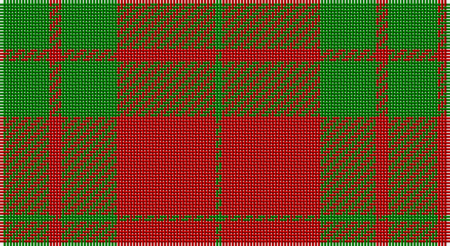

This page is one **sett** — a single exact thread-count. It belongs to the [tartan](/setts/g8r2g9r16g1/)
(the same proportion at any scale), whose colour order is pattern [GRGRG](/stripes/grgrg/).

Part of the [MacGregor of Glenstrae](/tartans/macgregor-of-glenstrae/) tartan — the named design grouping this sett with its other cloths.

Sourced from weddslist.  It is a [5 stripe tartan](/stripes/stripes5/).

Original link http://www.weddslist.com/cgi-bin/tartans/pg.pl?source=sts

## Provenance

Earliest known date: 1842 This sett appears in the text of the Vestiarium but is not illustrated. Glen Straye (Glenstrae) lies in the heart of Campbell country and was the scene of a noteable period in the history of Clan Gregor which led to the prosciption of the name.

## Also known as

This cloth is also recorded under:

- MacGregor of Glen Strae
- MacGregor of Glen Straye Htg
- MacGregor of Glenstrae #2

2 attestations — the source records this cloth was collapsed from (oldest owns this page)

<ul>
<li>undated — MacGregor of Glen Strae (weddslist, <a href="http://www.weddslist.com/cgi-bin/tartans/pg.pl?source=sts">record</a>)</li>
<li>undated — MacGregor of Glen Straye Htg Clan Tartan (house-of-tartan, <a href="http://www.house-of-tartan.scotland.net/house/TartanViewjs.asp?colr=Def&tnam=866">record</a>)</li>
</ul>

## Thread count
G/16 R4 G18 R32 G/2

One full sett is **126 threads**.

## Palette

Palette: <strong>custom</strong>
<table><thead><tr><th>Colour</th><th>Threads</th><th>Shade</th><th>Base</th><th>OKLCh</th></tr></thead><tbody><tr><td>G/</td><td style="text-align:right;font-variant-numeric:tabular-nums">16</td><td><code style="background-color:#008000;">#008000</code> <small style="color:#888">#008000</small></td><td>G <code style="background-color:#006100;">#006100</code></td><td><small style="color:#888">oklch(52.0% 0.177 142.5)</small></td></tr><tr><td>R</td><td style="text-align:right;font-variant-numeric:tabular-nums">4</td><td><code style="background-color:#C00000;">#C00000</code> <small style="color:#888">#C00000</small></td><td>R <code style="background-color:#CC0000;">#CC0000</code></td><td><small style="color:#888">oklch(50.7% 0.208 29.2)</small></td></tr><tr><td>G</td><td style="text-align:right;font-variant-numeric:tabular-nums">18</td><td><code style="background-color:#008000;">#008000</code> <small style="color:#888">#008000</small></td><td>G <code style="background-color:#006100;">#006100</code></td><td><small style="color:#888">oklch(52.0% 0.177 142.5)</small></td></tr><tr><td>R</td><td style="text-align:right;font-variant-numeric:tabular-nums">32</td><td><code style="background-color:#C00000;">#C00000</code> <small style="color:#888">#C00000</small></td><td>R <code style="background-color:#CC0000;">#CC0000</code></td><td><small style="color:#888">oklch(50.7% 0.208 29.2)</small></td></tr><tr><td>G/</td><td style="text-align:right;font-variant-numeric:tabular-nums">2</td><td><code style="background-color:#008000;">#008000</code> <small style="color:#888">#008000</small></td><td>G <code style="background-color:#006100;">#006100</code></td><td><small style="color:#888">oklch(52.0% 0.177 142.5)</small></td></tr></tbody></table>

# Sample pattern

## Nearest tartans

The nearest existing variants by ΔTartan distance, with this tartan at the top so the swatches line up against it.

ΔTartan

Tartan

Sett

—

<a href="/ttd/edit/#slug=g8r2g9r16g1~x2">MacGregor of Glen Strae</a> <a class="nn-out" href="/variants/s5/g8r2g9r16g1~x2/" title="open its dictionary page">↗</a>

1.03

<a href="/ttd/edit/#slug=dg8r2dg9r16dg1~x2&amp;base=g8r2g9r16g1~x2">MacGregor of Glenstrae</a> <a class="nn-out" href="/variants/s5/dg8r2dg9r16dg1~x2/" title="open its dictionary page">↗</a>

1.12

<a href="/ttd/edit/#slug=g16r1g2r11~x8&amp;base=g8r2g9r16g1~x2">Middleton</a> <a class="nn-out" href="/variants/s4/g16r1g2r11~x8/" title="open its dictionary page">↗</a>

1.26

<a href="/ttd/edit/#slug=r18g7r2g18~x2&amp;base=g8r2g9r16g1~x2">Applecross</a> <a class="nn-out" href="/variants/s4/r18g7r2g18~x2/" title="open its dictionary page">↗</a>

1.26

<a href="/ttd/edit/#slug=r18g7r2g18~x4&amp;base=g8r2g9r16g1~x2">Applecross (District)</a> <a class="nn-out" href="/variants/s4/r18g7r2g18~x4/" title="open its dictionary page">↗</a>

1.30

<a href="/variants/s4/r17g9r2~x2/">MacGregor of Glenstrae</a>

1.34

<a href="/ttd/edit/#slug=r2g2r16g15r2g2~x2&amp;base=g8r2g9r16g1~x2">Unidentified, NW Highlands</a> <a class="nn-out" href="/variants/s6/r2g2r16g15r2g2~x2/" title="open its dictionary page">↗</a>

1.40

<a href="/ttd/edit/#slug=k1r5g10r5g1~x4&amp;base=g8r2g9r16g1~x2">Murray, Lord George (Hose)</a> <a class="nn-out" href="/variants/s5/k1r5g10r5g1~x4/" title="open its dictionary page">↗</a>

1.46

<a href="/ttd/edit/#slug=dg8r2dg9r16w1~x2&amp;base=g8r2g9r16g1~x2">MacGregor of Balquhidder</a> <a class="nn-out" href="/variants/s5/dg8r2dg9r16w1~x2/" title="open its dictionary page">↗</a>

1.50

<a href="/ttd/edit/#slug=g5w2r27g27r5w2~x2&amp;base=g8r2g9r16g1~x2">MacDonald of Glenaladale (symmetrical)</a> <a class="nn-out" href="/variants/s6/g5w2r27g27r5w2~x2/" title="open its dictionary page">↗</a>

1.53

<a href="/ttd/edit/#slug=g16r5g2r18k2~x2&amp;base=g8r2g9r16g1~x2">MacDonald, Lord of The Isles (Artef)</a> <a class="nn-out" href="/variants/s5/g16r5g2r18k2~x2/" title="open its dictionary page">↗</a>

## Neighbour map

Every grey dot is one of 14360 variants placed by the first two principal components of the ΔTartan feature space (44% of its variance). Red is this tartan; blue dots are its nearest — click one to open its page.

<svg viewBox="0 0 640 380" role="img" style="max-width:100%;height:auto;border:1px solid #e0e0e0;border-radius:4px;display:block" xmlns="http://www.w3.org/2000/svg"><image href="/nn/cloud.v1.png" width="640" height="380"/><a href="/variants/s5/dg8r2dg9r16dg1~x2/"><circle cx="380.5" cy="239.0" r="4" fill="#3465a4"><title>MacGregor of Glenstrae</title></circle></a><a href="/variants/s4/g16r1g2r11~x8/"><circle cx="442.1" cy="255.6" r="4" fill="#3465a4"><title>Middleton</title></circle></a><a href="/variants/s4/r18g7r2g18~x2/"><circle cx="382.0" cy="293.3" r="4" fill="#3465a4"><title>Applecross</title></circle></a><a href="/variants/s4/r18g7r2g18~x4/"><circle cx="382.0" cy="293.3" r="4" fill="#3465a4"><title>Applecross (District)</title></circle></a><a href="/variants/s4/r17g9r2~x2/"><circle cx="354.3" cy="294.5" r="4" fill="#3465a4"><title>MacGregor of Glenstrae</title></circle></a><a href="/variants/s6/r2g2r16g15r2g2~x2/"><circle cx="379.4" cy="242.8" r="4" fill="#3465a4"><title>Unidentified, NW Highlands</title></circle></a><a href="/variants/s5/k1r5g10r5g1~x4/"><circle cx="323.1" cy="240.3" r="4" fill="#3465a4"><title>Murray, Lord George (Hose)</title></circle></a><a href="/variants/s5/dg8r2dg9r16w1~x2/"><circle cx="345.6" cy="217.9" r="4" fill="#3465a4"><title>MacGregor of Balquhidder</title></circle></a><a href="/variants/s6/g5w2r27g27r5w2~x2/"><circle cx="334.3" cy="199.7" r="4" fill="#3465a4"><title>MacDonald of Glenaladale (symmetrical)</title></circle></a><a href="/variants/s5/g16r5g2r18k2~x2/"><circle cx="351.5" cy="241.0" r="4" fill="#3465a4"><title>MacDonald, Lord of The Isles (Artef)</title></circle></a><circle cx="385.8" cy="245.2" r="5" fill="#c00000"/></svg>

ID: /variants/s5/g8r2g9r16g1~x2/
