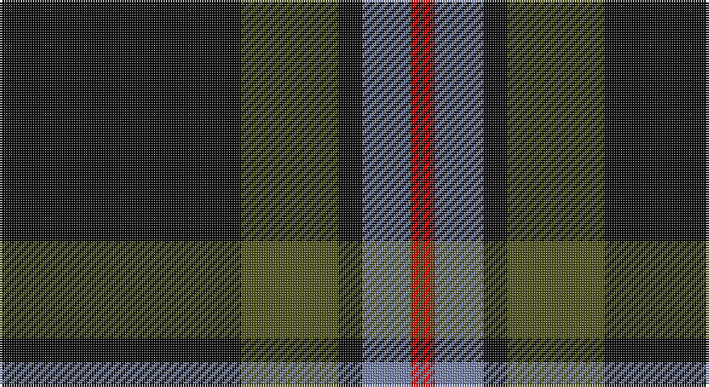

This page is one **sett** — a single exact thread-count. It belongs to the [tartan](/setts/k10y4k1t2r1/)
(the same proportion at any scale), whose colour order is pattern [KGKBR](/stripes/kgkbr/).

Sourced from register-of-tartans.  It is a [5 stripe tartan](/stripes/stripes5/).

Original link https://www.tartanregister.gov.uk/tartanDetails.aspx?ref=5659

## Also known as

This cloth is also recorded under:

- Brotherhood of the Kilt

## Register references

External register numbers recorded for this tartan.

- Scottish Register of Tartans: [5659](https://www.tartanregister.gov.uk/tartanDetails.aspx?ref=5659)
- Scottish Tartans Authority (ITI): 7646

## Thread count
K/100 G40 K10 B20 R/10

One full sett is **250 threads**.

## Palette

Palette: <strong>Tartan Register</strong> <small style="color:#888">(2 of 4 colours)</small>
<table><thead><tr><th>Colour</th><th>Threads</th><th>Shade</th><th>Base</th><th>OKLCh</th></tr></thead><tbody><tr><td>K/</td><td style="text-align:right;font-variant-numeric:tabular-nums">100</td><td><code style="background-color:#101010;">#101010</code> <small style="color:#888">#101010</small></td><td>K <code style="background-color:#000000;">#000000</code></td><td><small style="color:#888">oklch(17.3% 0.000 89.9)</small></td></tr><tr><td>G</td><td style="text-align:right;font-variant-numeric:tabular-nums">40</td><td><code style="background-color:#505420;">#505420</code> <small style="color:#888">#505420</small></td><td>G <code style="background-color:#006100;">#006100</code></td><td><small style="color:#888">oklch(43.0% 0.074 113.1)</small></td></tr><tr><td>K</td><td style="text-align:right;font-variant-numeric:tabular-nums">10</td><td><code style="background-color:#101010;">#101010</code> <small style="color:#888">#101010</small></td><td>K <code style="background-color:#000000;">#000000</code></td><td><small style="color:#888">oklch(17.3% 0.000 89.9)</small></td></tr><tr><td>B</td><td style="text-align:right;font-variant-numeric:tabular-nums">20</td><td><code style="background-color:#7884A8;">#7884A8</code> <small style="color:#888">#7884A8</small></td><td>B <code style="background-color:#2A418A;">#2A418A</code></td><td><small style="color:#888">oklch(61.7% 0.056 270.3)</small></td></tr><tr><td>R/</td><td style="text-align:right;font-variant-numeric:tabular-nums">10</td><td><code style="background-color:#C80000;">#C80000</code> <small style="color:#888">#C80000</small></td><td>R <code style="background-color:#CC0000;">#CC0000</code></td><td><small style="color:#888">oklch(52.3% 0.215 29.2)</small></td></tr></tbody></table>

# Sample pattern

## Nearest tartans

The nearest existing variants by ΔTartan distance, with this tartan at the top so the swatches line up against it.

ΔTartan

Tartan

Sett

—

<a href="/ttd/edit/#slug=k10y4k1t2r1~x10">Brotherhood of the Kilt</a> <a class="nn-out" href="/variants/s5/k10y4k1t2r1~x10/" title="open its dictionary page">↗</a>

1.04

<a href="/ttd/edit/#slug=k31r12ly2n5k2~x4&amp;base=k10y4k1t2r1~x10">Perry (2014)</a> <a class="nn-out" href="/variants/s5/k31r12ly2n5k2~x4/" title="open its dictionary page">↗</a>

1.10

<a href="/ttd/edit/#slug=k3w2n27k31p3~x2&amp;base=k10y4k1t2r1~x10">Kelley Oliphint</a> <a class="nn-out" href="/variants/s5/k3w2n27k31p3~x2/" title="open its dictionary page">↗</a>

1.13

<a href="/ttd/edit/#slug=m11dr5dg5k40ly3~x2&amp;base=k10y4k1t2r1~x10">MacShimsi Personal Tartan</a> <a class="nn-out" href="/variants/s5/m11dr5dg5k40ly3~x2/" title="open its dictionary page">↗</a>

1.16

<a href="/ttd/edit/#slug=y4k48y16r12b3~x2&amp;base=k10y4k1t2r1~x10">Calgary Firefighters</a> <a class="nn-out" href="/variants/s5/y4k48y16r12b3~x2/" title="open its dictionary page">↗</a>

1.20

<a href="/ttd/edit/#slug=r17db7lo8dg58k6~x2&amp;base=k10y4k1t2r1~x10">St Johns County's Sheriff's Office</a> <a class="nn-out" href="/variants/s5/r17db7lo8dg58k6~x2/" title="open its dictionary page">↗</a>

1.22

<a href="/ttd/edit/#slug=k3w2n27k31lr3~x2&amp;base=k10y4k1t2r1~x10">Kelley Oliphint (Commemorative)</a> <a class="nn-out" href="/variants/s5/k3w2n27k31lr3~x2/" title="open its dictionary page">↗</a>

1.27

<a href="/ttd/edit/#slug=k36w3k10w3g28r6k18~x2&amp;base=k10y4k1t2r1~x10">Wild Highlanders (Corporate)</a> <a class="nn-out" href="/variants/s7/k36w3k10w3g28r6k18~x2/" title="open its dictionary page">↗</a>

1.30

<a href="/ttd/edit/#slug=o4k48o16r12db3~x2&amp;base=k10y4k1t2r1~x10">Calgary Firefighters (Corporate)</a> <a class="nn-out" href="/variants/s5/o4k48o16r12db3~x2/" title="open its dictionary page">↗</a>

1.33

<a href="/ttd/edit/#slug=r11ri5g5k40ly3~x2&amp;base=k10y4k1t2r1~x10">MacShimsi</a> <a class="nn-out" href="/variants/s5/r11ri5g5k40ly3~x2/" title="open its dictionary page">↗</a>

1.33

<a href="/ttd/edit/#slug=k32b2k6b2k13n30w2~x2&amp;base=k10y4k1t2r1~x10">Mountain Rescue Association Honor Guard</a> <a class="nn-out" href="/variants/s7/k32b2k6b2k13n30w2~x2/" title="open its dictionary page">↗</a>

## Neighbour map

Every grey dot is one of 14360 variants placed by the first two principal components of the ΔTartan feature space (44% of its variance). Red is this tartan; blue dots are its nearest — click one to open its page.

<svg viewBox="0 0 640 380" role="img" style="max-width:100%;height:auto;border:1px solid #e0e0e0;border-radius:4px;display:block" xmlns="http://www.w3.org/2000/svg"><image href="/nn/cloud.v1.png" width="640" height="380"/><a href="/variants/s5/k31r12ly2n5k2~x4/"><circle cx="400.5" cy="202.6" r="4" fill="#3465a4"><title>Perry (2014)</title></circle></a><a href="/variants/s5/k3w2n27k31p3~x2/"><circle cx="340.6" cy="207.6" r="4" fill="#3465a4"><title>Kelley Oliphint</title></circle></a><a href="/variants/s5/m11dr5dg5k40ly3~x2/"><circle cx="365.8" cy="192.1" r="4" fill="#3465a4"><title>MacShimsi Personal Tartan</title></circle></a><a href="/variants/s5/y4k48y16r12b3~x2/"><circle cx="341.8" cy="193.6" r="4" fill="#3465a4"><title>Calgary Firefighters</title></circle></a><a href="/variants/s5/r17db7lo8dg58k6~x2/"><circle cx="316.8" cy="198.3" r="4" fill="#3465a4"><title>St Johns County's Sheriff's Office</title></circle></a><a href="/variants/s5/k3w2n27k31lr3~x2/"><circle cx="328.3" cy="200.5" r="4" fill="#3465a4"><title>Kelley Oliphint (Commemorative)</title></circle></a><a href="/variants/s7/k36w3k10w3g28r6k18~x2/"><circle cx="328.7" cy="209.9" r="4" fill="#3465a4"><title>Wild Highlanders (Corporate)</title></circle></a><a href="/variants/s5/o4k48o16r12db3~x2/"><circle cx="335.4" cy="189.7" r="4" fill="#3465a4"><title>Calgary Firefighters (Corporate)</title></circle></a><a href="/variants/s5/r11ri5g5k40ly3~x2/"><circle cx="349.0" cy="180.2" r="4" fill="#3465a4"><title>MacShimsi</title></circle></a><a href="/variants/s7/k32b2k6b2k13n30w2~x2/"><circle cx="376.9" cy="203.3" r="4" fill="#3465a4"><title>Mountain Rescue Association Honor Guard</title></circle></a><circle cx="356.6" cy="228.2" r="5" fill="#c00000"/></svg>

ID: /variants/s5/k10y4k1t2r1~x10/
