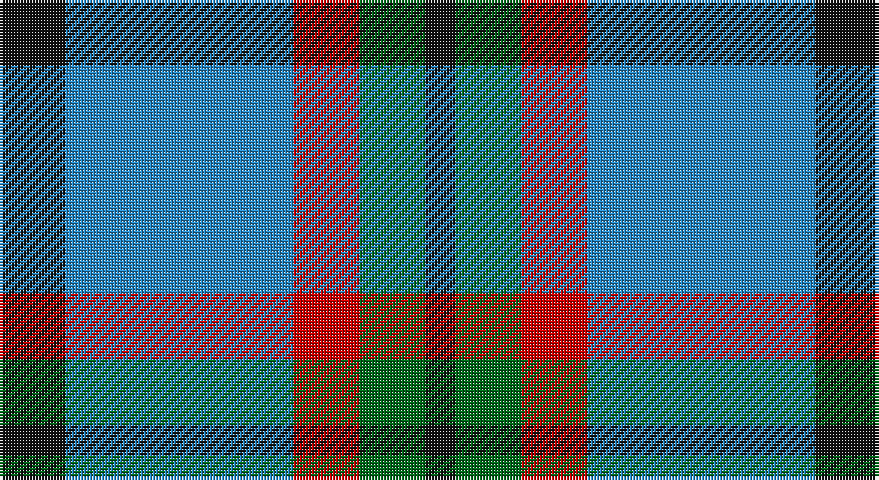

This page is one **sett** — a single exact thread-count. It belongs to the [tartan](/setts/k11t38r11g11k5/)
(the same proportion at any scale), whose colour order is pattern [KBRGK](/stripes/kbrgk/).

Sourced from tartans-authority.  It is a [5 stripe tartan](/stripes/stripes5/).

Original link http://www.tartansauthority.com/tartan-ferret/display/6617/

2 attestations — the source records this cloth was collapsed from (oldest owns this page)

<ul>
<li>2005 March — All as One (Corporate) (tartans-authority, <a href="http://www.tartansauthority.com/tartan-ferret/display/6617/">record</a>)</li>
<li>undated — All as One (register-of-tartans, <a href="https://www.tartanregister.gov.uk/tartanDetails.aspx?ref=5350">record</a>)</li>
</ul>

## Register references

External register numbers recorded for this tartan.

- Scottish Register of Tartans: [5350](https://www.tartanregister.gov.uk/tartanDetails.aspx?ref=5350)
- Scottish Tartans Authority (ITI): 6617
- Scottish Tartans World Register: 3045

## Thread count
K/22 B76 R22 G22 K/10

One full sett is **272 threads**.

## Palette

Palette: <strong>Tartan Register</strong>
<table><thead><tr><th>Colour</th><th>Threads</th><th>Shade</th><th>Base</th><th>OKLCh</th></tr></thead><tbody><tr><td>K/</td><td style="text-align:right;font-variant-numeric:tabular-nums">22</td><td><code style="background-color:#101010;">#101010</code> <small style="color:#888">#101010</small></td><td>K <code style="background-color:#000000;">#000000</code></td><td><small style="color:#888">oklch(17.3% 0.000 89.9)</small></td></tr><tr><td>B</td><td style="text-align:right;font-variant-numeric:tabular-nums">76</td><td><code style="background-color:#2888C4;">#2888C4</code> <small style="color:#888">#2888C4</small></td><td>B <code style="background-color:#2A418A;">#2A418A</code></td><td><small style="color:#888">oklch(60.1% 0.125 241.5)</small></td></tr><tr><td>R</td><td style="text-align:right;font-variant-numeric:tabular-nums">22</td><td><code style="background-color:#C80000;">#C80000</code> <small style="color:#888">#C80000</small></td><td>R <code style="background-color:#CC0000;">#CC0000</code></td><td><small style="color:#888">oklch(52.3% 0.215 29.2)</small></td></tr><tr><td>G</td><td style="text-align:right;font-variant-numeric:tabular-nums">22</td><td><code style="background-color:#006818;">#006818</code> <small style="color:#888">#006818</small></td><td>G <code style="background-color:#006100;">#006100</code></td><td><small style="color:#888">oklch(45.0% 0.142 145.0)</small></td></tr><tr><td>K/</td><td style="text-align:right;font-variant-numeric:tabular-nums">10</td><td><code style="background-color:#101010;">#101010</code> <small style="color:#888">#101010</small></td><td>K <code style="background-color:#000000;">#000000</code></td><td><small style="color:#888">oklch(17.3% 0.000 89.9)</small></td></tr></tbody></table>

# Sample pattern

## Nearest tartans

The nearest existing variants by ΔTartan distance, with this tartan at the top so the swatches line up against it.

ΔTartan

Tartan

Sett

—

<a href="/ttd/edit/#slug=k11t38r11g11k5~x2">All as One (Corporate)</a> <a class="nn-out" href="/variants/s5/k11t38r11g11k5~x2/" title="open its dictionary page">↗</a>

0.77

<a href="/ttd/edit/#slug=k3lb10db2g6db18g2~x2&amp;base=k11t38r11g11k5~x2">Crombie House Check</a> <a class="nn-out" href="/variants/s6/k3lb10db2g6db18g2~x2/" title="open its dictionary page">↗</a>

0.80

<a href="/ttd/edit/#slug=dr5b35k24b9g9dr5~x2&amp;base=k11t38r11g11k5~x2">Notre Dame Marching Guard (Corp)</a> <a class="nn-out" href="/variants/s6/dr5b35k24b9g9dr5~x2/" title="open its dictionary page">↗</a>

0.81

<a href="/ttd/edit/#slug=db9ly9db9t23r3~x2&amp;base=k11t38r11g11k5~x2">Tilburg (District)</a> <a class="nn-out" href="/variants/s5/db9ly9db9t23r3~x2/" title="open its dictionary page">↗</a>

0.83

<a href="/ttd/edit/#slug=r5db25w5db3g25db3~x2&amp;base=k11t38r11g11k5~x2">Thayer USA (Name)</a> <a class="nn-out" href="/variants/s6/r5db25w5db3g25db3~x2/" title="open its dictionary page">↗</a>

1.07

<a href="/ttd/edit/#slug=r5db25w5db3dg25db3~x2&amp;base=k11t38r11g11k5~x2">Thayer USA</a> <a class="nn-out" href="/variants/s6/r5db25w5db3dg25db3~x2/" title="open its dictionary page">↗</a>

1.08

<a href="/ttd/edit/#slug=dg15r3dp11lb2&amp;base=k11t38r11g11k5~x2">MacNab WI2</a> <a class="nn-out" href="/variants/s4/dg15r3dp11lb2/" title="open its dictionary page">↗</a>

1.08

<a href="/ttd/edit/#slug=t4o28g6t12k12t3~x2&amp;base=k11t38r11g11k5~x2">MacTavish / Thom(p)son, hunting</a> <a class="nn-out" href="/variants/s6/t4o28g6t12k12t3~x2/" title="open its dictionary page">↗</a>

1.09

<a href="/ttd/edit/#slug=k4lb4k4o15r2~x4&amp;base=k11t38r11g11k5~x2">Oban Grey (Fashion)</a> <a class="nn-out" href="/variants/s5/k4lb4k4o15r2~x4/" title="open its dictionary page">↗</a>

1.10

<a href="/ttd/edit/#slug=w4g28db18r4db18ly3~x2&amp;base=k11t38r11g11k5~x2">MacIntyre, Inglis</a> <a class="nn-out" href="/variants/s6/w4g28db18r4db18ly3~x2/" title="open its dictionary page">↗</a>

1.16

<a href="/ttd/edit/#slug=dg3r1dg9o10db3~x4&amp;base=k11t38r11g11k5~x2">Bethlehem, City of</a> <a class="nn-out" href="/variants/s5/dg3r1dg9o10db3~x4/" title="open its dictionary page">↗</a>

## Neighbour map

Every grey dot is one of 14360 variants placed by the first two principal components of the ΔTartan feature space (44% of its variance). Red is this tartan; blue dots are its nearest — click one to open its page.

<svg viewBox="0 0 640 380" role="img" style="max-width:100%;height:auto;border:1px solid #e0e0e0;border-radius:4px;display:block" xmlns="http://www.w3.org/2000/svg"><image href="/nn/cloud.v1.png" width="640" height="380"/><a href="/variants/s6/k3lb10db2g6db18g2~x2/"><circle cx="226.8" cy="209.5" r="4" fill="#3465a4"><title>Crombie House Check</title></circle></a><a href="/variants/s6/dr5b35k24b9g9dr5~x2/"><circle cx="235.3" cy="235.7" r="4" fill="#3465a4"><title>Notre Dame Marching Guard (Corp)</title></circle></a><a href="/variants/s5/db9ly9db9t23r3~x2/"><circle cx="194.3" cy="246.6" r="4" fill="#3465a4"><title>Tilburg (District)</title></circle></a><a href="/variants/s6/r5db25w5db3g25db3~x2/"><circle cx="251.4" cy="216.9" r="4" fill="#3465a4"><title>Thayer USA (Name)</title></circle></a><a href="/variants/s6/r5db25w5db3dg25db3~x2/"><circle cx="250.0" cy="216.6" r="4" fill="#3465a4"><title>Thayer USA</title></circle></a><a href="/variants/s4/dg15r3dp11lb2/"><circle cx="252.9" cy="255.8" r="4" fill="#3465a4"><title>MacNab WI2</title></circle></a><a href="/variants/s6/t4o28g6t12k12t3~x2/"><circle cx="202.1" cy="213.8" r="4" fill="#3465a4"><title>MacTavish / Thom(p)son, hunting</title></circle></a><a href="/variants/s5/k4lb4k4o15r2~x4/"><circle cx="241.8" cy="218.9" r="4" fill="#3465a4"><title>Oban Grey (Fashion)</title></circle></a><a href="/variants/s6/w4g28db18r4db18ly3~x2/"><circle cx="223.6" cy="207.3" r="4" fill="#3465a4"><title>MacIntyre, Inglis</title></circle></a><a href="/variants/s5/dg3r1dg9o10db3~x4/"><circle cx="256.1" cy="243.8" r="4" fill="#3465a4"><title>Bethlehem, City of</title></circle></a><circle cx="228.1" cy="232.4" r="5" fill="#c00000"/></svg>

ID: /variants/s5/k11t38r11g11k5~x2/
