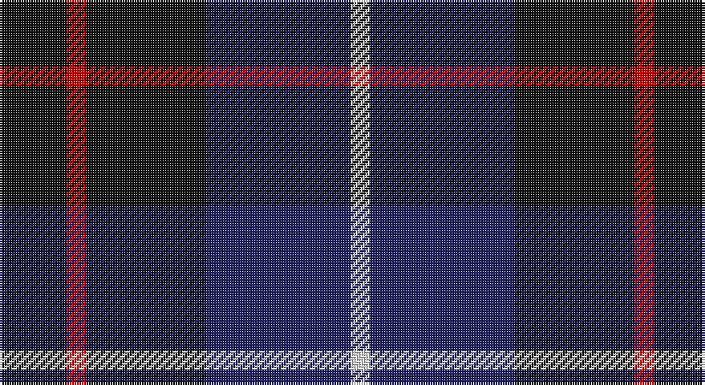

This page is one **sett** — a single exact thread-count. It belongs to the [tartan](/setts/k14r4k25db30w4/)
(the same proportion at any scale), whose colour order is pattern [KRKBW](/stripes/krkbw/).

Sourced from register-of-tartans.  It is a [5 stripe tartan](/stripes/stripes5/).

Original link https://www.tartanregister.gov.uk/tartanDetails.aspx?ref=357

## Register references

External register numbers recorded for this tartan.

- Scottish Register of Tartans: [357](https://www.tartanregister.gov.uk/tartanDetails.aspx?ref=357)
- Scottish Tartans Authority (ITI): 6501

## Thread count
K/28 R8 K50 DB60 LN/8

One full sett is **272 threads**.

## Palette

Palette: <strong>Tartan Register</strong>
<table><thead><tr><th>Colour</th><th>Threads</th><th>Shade</th><th>Base</th><th>OKLCh</th></tr></thead><tbody><tr><td>K/</td><td style="text-align:right;font-variant-numeric:tabular-nums">28</td><td><code style="background-color:#101010;">#101010</code> <small style="color:#888">#101010</small></td><td>K <code style="background-color:#000000;">#000000</code></td><td><small style="color:#888">oklch(17.3% 0.000 89.9)</small></td></tr><tr><td>R</td><td style="text-align:right;font-variant-numeric:tabular-nums">8</td><td><code style="background-color:#C80000;">#C80000</code> <small style="color:#888">#C80000</small></td><td>R <code style="background-color:#CC0000;">#CC0000</code></td><td><small style="color:#888">oklch(52.3% 0.215 29.2)</small></td></tr><tr><td>K</td><td style="text-align:right;font-variant-numeric:tabular-nums">50</td><td><code style="background-color:#101010;">#101010</code> <small style="color:#888">#101010</small></td><td>K <code style="background-color:#000000;">#000000</code></td><td><small style="color:#888">oklch(17.3% 0.000 89.9)</small></td></tr><tr><td>DB</td><td style="text-align:right;font-variant-numeric:tabular-nums">60</td><td><code style="background-color:#202060;">#202060</code> <small style="color:#888">#202060</small></td><td>B <code style="background-color:#2A418A;">#2A418A</code></td><td><small style="color:#888">oklch(28.9% 0.111 276.9)</small></td></tr><tr><td>LN/</td><td style="text-align:right;font-variant-numeric:tabular-nums">8</td><td><code style="background-color:#E0E0E0;">#E0E0E0</code> <small style="color:#888">#E0E0E0</small></td><td>W <code style="background-color:#F7F7F7;">#F7F7F7</code></td><td><small style="color:#888">oklch(90.7% 0.000 89.9)</small></td></tr></tbody></table>

# Sample pattern

## Nearest tartans

The nearest existing variants by ΔTartan distance, with this tartan at the top so the swatches line up against it.

ΔTartan

Tartan

Sett

—

<a href="/ttd/edit/#slug=k14r4k25db30w4~x2">Britannia</a> <a class="nn-out" href="/variants/s5/k14r4k25db30w4~x2/" title="open its dictionary page">↗</a>

0.96

<a href="/ttd/edit/#slug=k1db7k4lb1k4p1~x4&amp;base=k14r4k25db30w4~x2">Scottish Express International</a> <a class="nn-out" href="/variants/s6/k1db7k4lb1k4p1~x4/" title="open its dictionary page">↗</a>

1.05

<a href="/ttd/edit/#slug=r1k8g2db4r1~x8&amp;base=k14r4k25db30w4~x2">Nairn</a> <a class="nn-out" href="/variants/s5/r1k8g2db4r1~x8/" title="open its dictionary page">↗</a>

1.06

<a href="/ttd/edit/#slug=k15ly2k10db18w3~x2&amp;base=k14r4k25db30w4~x2">College of Radiographers Corporate Tartan</a> <a class="nn-out" href="/variants/s5/k15ly2k10db18w3~x2/" title="open its dictionary page">↗</a>

1.12

<a href="/ttd/edit/#slug=k42w5dg16k5k5db21~x2&amp;base=k14r4k25db30w4~x2">Givens (Arizona)</a> <a class="nn-out" href="/variants/s6/k42w5dg16k5k5db21~x2/" title="open its dictionary page">↗</a>

1.12

<a href="/ttd/edit/#slug=k15lo2k10db18lb3~x2&amp;base=k14r4k25db30w4~x2">College of Radiographers</a> <a class="nn-out" href="/variants/s5/k15lo2k10db18lb3~x2/" title="open its dictionary page">↗</a>

1.25

<a href="/ttd/edit/#slug=k15r8ly2db25k5db13k5~x2&amp;base=k14r4k25db30w4~x2">Gifford (Personal)</a> <a class="nn-out" href="/variants/s7/k15r8ly2db25k5db13k5~x2/" title="open its dictionary page">↗</a>

1.25

<a href="/ttd/edit/#slug=k3dg11k3dr11k18o3~x2&amp;base=k14r4k25db30w4~x2">The Harbour Town, Hilton Head</a> <a class="nn-out" href="/variants/s6/k3dg11k3dr11k18o3~x2/" title="open its dictionary page">↗</a>

1.31

<a href="/ttd/edit/#slug=k42w5k5dg16k5db21~x2&amp;base=k14r4k25db30w4~x2">Givens (Arizona)</a> <a class="nn-out" href="/variants/s6/k42w5k5dg16k5db21~x2/" title="open its dictionary page">↗</a>

1.31

<a href="/ttd/edit/#slug=k1db7k7ly1~x10&amp;base=k14r4k25db30w4~x2">Wallace (Personal)</a> <a class="nn-out" href="/variants/s4/k1db7k7ly1~x10/" title="open its dictionary page">↗</a>

1.32

<a href="/ttd/edit/#slug=db1n6k6r1~x10&amp;base=k14r4k25db30w4~x2">Mayer, Chris (Personal)</a> <a class="nn-out" href="/variants/s4/db1n6k6r1~x10/" title="open its dictionary page">↗</a>

## Neighbour map

Every grey dot is one of 14360 variants placed by the first two principal components of the ΔTartan feature space (44% of its variance). Red is this tartan; blue dots are its nearest — click one to open its page.

<svg viewBox="0 0 640 380" role="img" style="max-width:100%;height:auto;border:1px solid #e0e0e0;border-radius:4px;display:block" xmlns="http://www.w3.org/2000/svg"><image href="/nn/cloud.v1.png" width="640" height="380"/><a href="/variants/s6/k1db7k4lb1k4p1~x4/"><circle cx="285.6" cy="258.2" r="4" fill="#3465a4"><title>Scottish Express International</title></circle></a><a href="/variants/s5/r1k8g2db4r1~x8/"><circle cx="274.2" cy="245.1" r="4" fill="#3465a4"><title>Nairn</title></circle></a><a href="/variants/s5/k15ly2k10db18w3~x2/"><circle cx="267.1" cy="245.9" r="4" fill="#3465a4"><title>College of Radiographers Corporate Tartan</title></circle></a><a href="/variants/s6/k42w5dg16k5k5db21~x2/"><circle cx="306.2" cy="243.0" r="4" fill="#3465a4"><title>Givens (Arizona)</title></circle></a><a href="/variants/s5/k15lo2k10db18lb3~x2/"><circle cx="273.6" cy="254.0" r="4" fill="#3465a4"><title>College of Radiographers</title></circle></a><a href="/variants/s7/k15r8ly2db25k5db13k5~x2/"><circle cx="299.5" cy="226.1" r="4" fill="#3465a4"><title>Gifford (Personal)</title></circle></a><a href="/variants/s6/k3dg11k3dr11k18o3~x2/"><circle cx="268.2" cy="275.8" r="4" fill="#3465a4"><title>The Harbour Town, Hilton Head</title></circle></a><a href="/variants/s6/k42w5k5dg16k5db21~x2/"><circle cx="309.2" cy="245.8" r="4" fill="#3465a4"><title>Givens (Arizona)</title></circle></a><a href="/variants/s4/k1db7k7ly1~x10/"><circle cx="308.5" cy="283.0" r="4" fill="#3465a4"><title>Wallace (Personal)</title></circle></a><a href="/variants/s4/db1n6k6r1~x10/"><circle cx="253.6" cy="275.9" r="4" fill="#3465a4"><title>Mayer, Chris (Personal)</title></circle></a><circle cx="285.4" cy="263.8" r="5" fill="#c00000"/></svg>

ID: /variants/s5/k14r4k25db30w4~x2/
