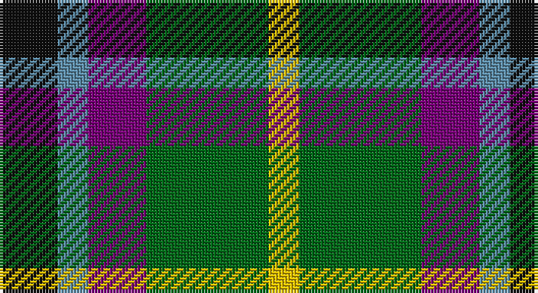

This page is one **sett** — a single exact thread-count. It belongs to the [tartan](/setts/k19t10dp19g40ly10/)
(the same proportion at any scale), whose colour order is pattern [KBBGY](/stripes/kbbgy/).

Sourced from house-of-tartan.  It is a [5 stripe tartan](/stripes/stripes5/).

Original link http://www.house-of-tartan.scotland.net/house/TartanViewjs.asp?colr=Def&tnam=1025

## Provenance

Earliest known date: 1819 Both 'Old' and 'New' appear in Wilson's 1819 pattern book.

## Thread count
K/19 B10 P19 G40 Y/10

One full sett is **167 threads**.

## Palette

Palette: <strong>Tartan Register</strong>
<table><thead><tr><th>Colour</th><th>Threads</th><th>Shade</th><th>Base</th><th>OKLCh</th></tr></thead><tbody><tr><td>K/</td><td style="text-align:right;font-variant-numeric:tabular-nums">19</td><td><code style="background-color:#101010;">#101010</code> <small style="color:#888">#101010</small></td><td>K <code style="background-color:#000000;">#000000</code></td><td><small style="color:#888">oklch(17.3% 0.000 89.9)</small></td></tr><tr><td>B</td><td style="text-align:right;font-variant-numeric:tabular-nums">10</td><td><code style="background-color:#5C8CA8;">#5C8CA8</code> <small style="color:#888">#5C8CA8</small></td><td>B <code style="background-color:#2A418A;">#2A418A</code></td><td><small style="color:#888">oklch(61.7% 0.067 235.0)</small></td></tr><tr><td>P</td><td style="text-align:right;font-variant-numeric:tabular-nums">19</td><td><code style="background-color:#780078;">#780078</code> <small style="color:#888">#780078</small></td><td>B <code style="background-color:#2A418A;">#2A418A</code></td><td><small style="color:#888">oklch(40.2% 0.185 328.4)</small></td></tr><tr><td>G</td><td style="text-align:right;font-variant-numeric:tabular-nums">40</td><td><code style="background-color:#006818;">#006818</code> <small style="color:#888">#006818</small></td><td>G <code style="background-color:#006100;">#006100</code></td><td><small style="color:#888">oklch(45.0% 0.142 145.0)</small></td></tr><tr><td>Y/</td><td style="text-align:right;font-variant-numeric:tabular-nums">10</td><td><code style="background-color:#E8C000;">#E8C000</code> <small style="color:#888">#E8C000</small></td><td>Y <code style="background-color:#F2BF00;">#F2BF00</code></td><td><small style="color:#888">oklch(81.9% 0.168 93.7)</small></td></tr></tbody></table>

# Sample pattern

## Nearest tartans

The nearest existing variants by ΔTartan distance, with this tartan at the top so the swatches line up against it.

ΔTartan

Tartan

Sett

—

<a href="/ttd/edit/#slug=k19t10dp19g40ly10">Gallowater Old District Tartan</a> <a class="nn-out" href="/variants/s5/k19t10dp19g40ly10/" title="open its dictionary page">↗</a>

0.64

<a href="/ttd/edit/#slug=k19t10dp19dg40ly10&amp;base=k19t10dp19g40ly10">Gala Water Old</a> <a class="nn-out" href="/variants/s5/k19t10dp19dg40ly10/" title="open its dictionary page">↗</a>

0.76

<a href="/ttd/edit/#slug=k19t10p19g40ly10&amp;base=k19t10dp19g40ly10">Gallowater, Old</a> <a class="nn-out" href="/variants/s5/k19t10p19g40ly10/" title="open its dictionary page">↗</a>

0.94

<a href="/ttd/edit/#slug=r5t12ly11dt21lo5~x2&amp;base=k19t10dp19g40ly10">Inspiration</a> <a class="nn-out" href="/variants/s5/r5t12ly11dt21lo5~x2/" title="open its dictionary page">↗</a>

1.03

<a href="/ttd/edit/#slug=g15dg18db23w4r8~x2&amp;base=k19t10dp19g40ly10">Friebe (2014)</a> <a class="nn-out" href="/variants/s5/g15dg18db23w4r8~x2/" title="open its dictionary page">↗</a>

1.05

<a href="/ttd/edit/#slug=db2g4ly1db1r2~x12&amp;base=k19t10dp19g40ly10">Creek Indian Nation</a> <a class="nn-out" href="/variants/s5/db2g4ly1db1r2~x12/" title="open its dictionary page">↗</a>

1.06

<a href="/ttd/edit/#slug=k3g10k10r3db8w3~x2&amp;base=k19t10dp19g40ly10">Russell (Clan)</a> <a class="nn-out" href="/variants/s6/k3g10k10r3db8w3~x2/" title="open its dictionary page">↗</a>

1.07

<a href="/ttd/edit/#slug=r10k17t10dp17g40ly10~x2&amp;base=k19t10dp19g40ly10">Gallowater, Original</a> <a class="nn-out" href="/variants/s6/r10k17t10dp17g40ly10~x2/" title="open its dictionary page">↗</a>

1.13

<a href="/ttd/edit/#slug=r2db10k5g12w2~x2&amp;base=k19t10dp19g40ly10">Davidson of Tulloch</a> <a class="nn-out" href="/variants/s5/r2db10k5g12w2~x2/" title="open its dictionary page">↗</a>

1.14

<a href="/ttd/edit/#slug=k3g8k8r2db8w2~x2&amp;base=k19t10dp19g40ly10">Mitchell Family Tartan</a> <a class="nn-out" href="/variants/s6/k3g8k8r2db8w2~x2/" title="open its dictionary page">↗</a>

1.19

<a href="/ttd/edit/#slug=g5r4g19k10g8w4db18r4~x2&amp;base=k19t10dp19g40ly10">CSCA (Corporate)</a> <a class="nn-out" href="/variants/s8/g5r4g19k10g8w4db18r4~x2/" title="open its dictionary page">↗</a>

## Neighbour map

Every grey dot is one of 14360 variants placed by the first two principal components of the ΔTartan feature space (44% of its variance). Red is this tartan; blue dots are its nearest — click one to open its page.

<svg viewBox="0 0 640 380" role="img" style="max-width:100%;height:auto;border:1px solid #e0e0e0;border-radius:4px;display:block" xmlns="http://www.w3.org/2000/svg"><image href="/nn/cloud.v1.png" width="640" height="380"/><a href="/variants/s5/k19t10dp19dg40ly10/"><circle cx="113.4" cy="262.7" r="4" fill="#3465a4"><title>Gala Water Old</title></circle></a><a href="/variants/s5/k19t10p19g40ly10/"><circle cx="86.6" cy="247.1" r="4" fill="#3465a4"><title>Gallowater, Old</title></circle></a><a href="/variants/s5/r5t12ly11dt21lo5~x2/"><circle cx="97.7" cy="247.8" r="4" fill="#3465a4"><title>Inspiration</title></circle></a><a href="/variants/s5/g15dg18db23w4r8~x2/"><circle cx="91.0" cy="251.4" r="4" fill="#3465a4"><title>Friebe (2014)</title></circle></a><a href="/variants/s5/db2g4ly1db1r2~x12/"><circle cx="144.2" cy="274.7" r="4" fill="#3465a4"><title>Creek Indian Nation</title></circle></a><a href="/variants/s6/k3g10k10r3db8w3~x2/"><circle cx="67.3" cy="259.1" r="4" fill="#3465a4"><title>Russell (Clan)</title></circle></a><a href="/variants/s6/r10k17t10dp17g40ly10~x2/"><circle cx="74.7" cy="224.3" r="4" fill="#3465a4"><title>Gallowater, Original</title></circle></a><a href="/variants/s5/r2db10k5g12w2~x2/"><circle cx="119.2" cy="226.1" r="4" fill="#3465a4"><title>Davidson of Tulloch</title></circle></a><a href="/variants/s6/k3g8k8r2db8w2~x2/"><circle cx="94.7" cy="257.5" r="4" fill="#3465a4"><title>Mitchell Family Tartan</title></circle></a><a href="/variants/s8/g5r4g19k10g8w4db18r4~x2/"><circle cx="140.7" cy="226.0" r="4" fill="#3465a4"><title>CSCA (Corporate)</title></circle></a><circle cx="108.6" cy="257.2" r="5" fill="#c00000"/></svg>

ID: /variants/s5/k19t10dp19g40ly10/
