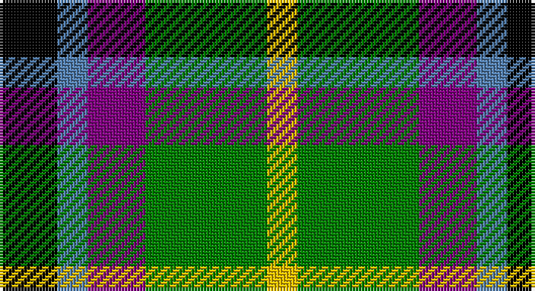

This page is one **sett** — a single exact thread-count. It belongs to the [tartan](/setts/k19t10p19g40ly10/)
(the same proportion at any scale), whose colour order is pattern [KBBGY](/stripes/kbbgy/).

Sourced from weddslist.  It is a [5 stripe tartan](/stripes/stripes5/).

Original link http://www.weddslist.com/cgi-bin/tartans/pg.pl?source=sts

## Thread count
K/19 B10 P19 G40 Y/10

One full sett is **167 threads**.

## Palette

Palette: <strong>Ingles Buchan</strong> <small style="color:#888">(1 of 5 colours)</small>
<table><thead><tr><th>Colour</th><th>Threads</th><th>Shade</th><th>Base</th><th>OKLCh</th></tr></thead><tbody><tr><td>K/</td><td style="text-align:right;font-variant-numeric:tabular-nums">19</td><td><code style="background-color:#000000;">#000000</code> <small style="color:#888">#000000</small></td><td>K <code style="background-color:#000000;">#000000</code></td><td><small style="color:#888">oklch(0.0% 0.000 0.0)</small></td></tr><tr><td>B</td><td style="text-align:right;font-variant-numeric:tabular-nums">10</td><td><code style="background-color:#5480B0;">#5480B0</code> <small style="color:#888">#5480B0</small></td><td>B <code style="background-color:#2A418A;">#2A418A</code></td><td><small style="color:#888">oklch(58.8% 0.089 251.5)</small></td></tr><tr><td>P</td><td style="text-align:right;font-variant-numeric:tabular-nums">19</td><td><code style="background-color:#800080;">#800080</code> <small style="color:#888">#800080</small></td><td>B <code style="background-color:#2A418A;">#2A418A</code></td><td><small style="color:#888">oklch(42.1% 0.193 328.4)</small></td></tr><tr><td>G</td><td style="text-align:right;font-variant-numeric:tabular-nums">40</td><td><code style="background-color:#008000;">#008000</code> <small style="color:#888">#008000</small></td><td>G <code style="background-color:#006100;">#006100</code></td><td><small style="color:#888">oklch(52.0% 0.177 142.5)</small></td></tr><tr><td>Y/</td><td style="text-align:right;font-variant-numeric:tabular-nums">10</td><td><code style="background-color:#F0C000;">#F0C000</code> <small style="color:#888">#F0C000</small></td><td>Y <code style="background-color:#F2BF00;">#F2BF00</code></td><td><small style="color:#888">oklch(82.7% 0.169 90.5)</small></td></tr></tbody></table>

# Sample pattern

## Nearest tartans

The nearest existing variants by ΔTartan distance, with this tartan at the top so the swatches line up against it.

ΔTartan

Tartan

Sett

—

<a href="/ttd/edit/#slug=k19t10p19g40ly10">Gallowater, Old</a> <a class="nn-out" href="/variants/s5/k19t10p19g40ly10/" title="open its dictionary page">↗</a>

0.76

<a href="/ttd/edit/#slug=k19t10dp19g40ly10&amp;base=k19t10p19g40ly10">Gallowater Old District Tartan</a> <a class="nn-out" href="/variants/s5/k19t10dp19g40ly10/" title="open its dictionary page">↗</a>

1.07

<a href="/ttd/edit/#slug=r2db10k5g12w2~x2&amp;base=k19t10p19g40ly10">Davidson of Tulloch</a> <a class="nn-out" href="/variants/s5/r2db10k5g12w2~x2/" title="open its dictionary page">↗</a>

1.15

<a href="/ttd/edit/#slug=r1db6k3g6w1~x4&amp;base=k19t10p19g40ly10">Davidson</a> <a class="nn-out" href="/variants/s5/r1db6k3g6w1~x4/" title="open its dictionary page">↗</a>

1.15

<a href="/ttd/edit/#slug=k19t10dp19dg40ly10&amp;base=k19t10p19g40ly10">Gala Water Old</a> <a class="nn-out" href="/variants/s5/k19t10dp19dg40ly10/" title="open its dictionary page">↗</a>

1.18

<a href="/ttd/edit/#slug=k3g10k10r3db8w3~x2&amp;base=k19t10p19g40ly10">Russell (Clan)</a> <a class="nn-out" href="/variants/s6/k3g10k10r3db8w3~x2/" title="open its dictionary page">↗</a>

1.25

<a href="/ttd/edit/#slug=r5t12ly11dt21lo5~x2&amp;base=k19t10p19g40ly10">Inspiration</a> <a class="nn-out" href="/variants/s5/r5t12ly11dt21lo5~x2/" title="open its dictionary page">↗</a>

1.29

<a href="/ttd/edit/#slug=k3r1g5k3w1p3~x2&amp;base=k19t10p19g40ly10">Wilson's, No 194</a> <a class="nn-out" href="/variants/s6/k3r1g5k3w1p3~x2/" title="open its dictionary page">↗</a>

1.29

<a href="/ttd/edit/#slug=k4t3p11g14ly2~x2&amp;base=k19t10p19g40ly10">Wellington, No 122</a> <a class="nn-out" href="/variants/s5/k4t3p11g14ly2~x2/" title="open its dictionary page">↗</a>

1.30

<a href="/ttd/edit/#slug=r4g15k15db15w4~x2&amp;base=k19t10p19g40ly10">Dalmeny</a> <a class="nn-out" href="/variants/s5/r4g15k15db15w4~x2/" title="open its dictionary page">↗</a>

1.32

<a href="/ttd/edit/#slug=r4g11k11g2db11y3~x4&amp;base=k19t10p19g40ly10">Casely</a> <a class="nn-out" href="/variants/s6/r4g11k11g2db11y3~x4/" title="open its dictionary page">↗</a>

## Neighbour map

Every grey dot is one of 14360 variants placed by the first two principal components of the ΔTartan feature space (44% of its variance). Red is this tartan; blue dots are its nearest — click one to open its page.

<svg viewBox="0 0 640 380" role="img" style="max-width:100%;height:auto;border:1px solid #e0e0e0;border-radius:4px;display:block" xmlns="http://www.w3.org/2000/svg"><image href="/nn/cloud.v1.png" width="640" height="380"/><a href="/variants/s5/k19t10dp19g40ly10/"><circle cx="108.6" cy="257.2" r="4" fill="#3465a4"><title>Gallowater Old District Tartan</title></circle></a><a href="/variants/s5/r2db10k5g12w2~x2/"><circle cx="119.2" cy="226.1" r="4" fill="#3465a4"><title>Davidson of Tulloch</title></circle></a><a href="/variants/s5/r1db6k3g6w1~x4/"><circle cx="111.0" cy="231.0" r="4" fill="#3465a4"><title>Davidson</title></circle></a><a href="/variants/s5/k19t10dp19dg40ly10/"><circle cx="113.4" cy="262.7" r="4" fill="#3465a4"><title>Gala Water Old</title></circle></a><a href="/variants/s6/k3g10k10r3db8w3~x2/"><circle cx="67.3" cy="259.1" r="4" fill="#3465a4"><title>Russell (Clan)</title></circle></a><a href="/variants/s5/r5t12ly11dt21lo5~x2/"><circle cx="97.7" cy="247.8" r="4" fill="#3465a4"><title>Inspiration</title></circle></a><a href="/variants/s6/k3r1g5k3w1p3~x2/"><circle cx="84.7" cy="239.0" r="4" fill="#3465a4"><title>Wilson's, No 194</title></circle></a><a href="/variants/s5/k4t3p11g14ly2~x2/"><circle cx="147.4" cy="214.7" r="4" fill="#3465a4"><title>Wellington, No 122</title></circle></a><a href="/variants/s5/r4g15k15db15w4~x2/"><circle cx="36.3" cy="260.2" r="4" fill="#3465a4"><title>Dalmeny</title></circle></a><a href="/variants/s6/r4g11k11g2db11y3~x4/"><circle cx="73.4" cy="237.6" r="4" fill="#3465a4"><title>Casely</title></circle></a><circle cx="86.6" cy="247.1" r="5" fill="#c00000"/></svg>

ID: /variants/s5/k19t10p19g40ly10/
