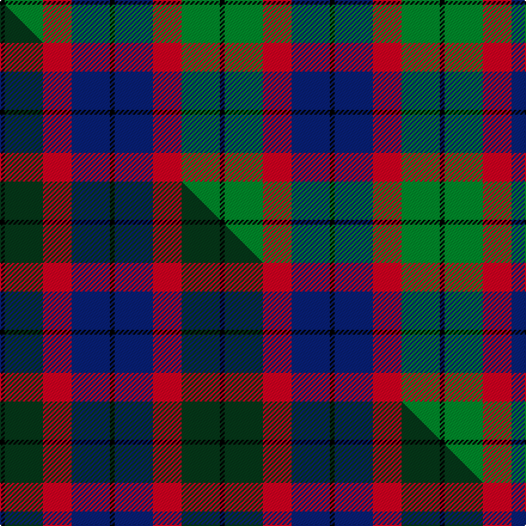

This page is one **sett** — a single exact thread-count. It belongs to the [tartan](/setts/k1db8r6g8k1/)
(the same proportion at any scale), whose colour order is pattern [KBRGK](/stripes/kbrgk/).

Part of the [Edinburgh Military Tattoo 50th](/tartans/edinburgh-military-tattoo-50th/) tartan — the named design grouping this sett with its other cloths.

Sourced from house-of-tartan.  It is a [5 stripe tartan](/stripes/stripes5/).

Original link http://www.house-of-tartan.scotland.net/house/TartanViewjs.asp?colr=Def&tnam=3614

## Provenance

Earliest known date: 1998 Based on a Wilsons of Bannockburn sett, designed by Peter MacDonald in 1998 for the Edinburgh Military Tattoo to celebrate their 50th anniversary in 2000. The colours depict the three military forces - Navy, Army & Air Force with the black from Edinburgh's heraldic arms. Launched on June 16th 1999 in time for the final Tattoo of the 20th century.

## Thread count
K/4 G32 R24 DB32 K/4

One full sett is **184 threads**.

## Palette
<table><thead><tr><th>Colour</th><th>Shade</th><th>OKLCh</th></tr></thead><tbody><tr><td>DB</td><td><code style="background-color:#082077;">#082077</code> <small style="color:#888">#082077</small></td><td><small style="color:#888">oklch(30.0% 0.149 265.1)</small></td></tr><tr><td>G</td><td><code style="background-color:#008B2A;">#008B2A</code> <small style="color:#888">#008B2A</small></td><td><small style="color:#888">oklch(55.4% 0.170 145.9)</small></td></tr><tr><td>K</td><td><code style="background-color:#000000;">#000000</code> <small style="color:#888">#000000</small></td><td><small style="color:#888">oklch(0.0% 0.000 0.0)</small></td></tr><tr><td>R</td><td><code style="background-color:#D60020;">#D60020</code> <small style="color:#888">#D60020</small></td><td><small style="color:#888">oklch(55.2% 0.224 25.5)</small></td></tr></tbody></table>

# Sample pattern

## Compared to the master

This cloth is one sett of its design; the master sett (the exemplar the design is anchored on) is below for comparison.

Its **ΔTartan distance** from the master is **1.16** — the same measure the nearest-tartans table ranks by (0 is identical; a re-scale of the same cloth is near 0, a recolour or a different proportion further).

<figure class="master-compare" style="margin:0">

this sett
master sett ★

<figcaption style="color:#888;font-size:smaller">One weave of this sett against the <a href="/setts/k1dg8r6db8k1/">master sett ★</a>, split on the diagonal: a shared proportion runs seamlessly across it with only the shades shifting; a different proportion breaks on it.</figcaption>
</figure>

## Nearest variants

The nearest existing variants by ΔTartan distance, with this cloth at the top so the swatches line up against it.

ΔTartan

Threads

Variant

Sett

—

184

<a href="/variants/s5/k1db8r6g8k1~x4/">Edinburgh Military Tattoo 50th Military Tartan</a>

<a href="/ttd/edit/#slug=k1dg8r6db8k1~x4&amp;base=k1db8r6g8k1~x4" title="compare in the TTD">0.00</a>

184

<a href="/variants/s5/k1dg8r6db8k1~x4/">Edinburgh Tattoo 50th (Commemorative</a>

<a href="/ttd/edit/#slug=k2g12k11t12w1~x2~g2203152&amp;base=k1db8r6g8k1~x4" title="compare in the TTD">1.69</a>

146

<a href="/variants/s5/k2g12k11t12w1~x2~g2203152/">MacKirdy</a>

<a href="/ttd/edit/#slug=db6k1db6k8r1g8r2&amp;base=k1db8r6g8k1~x4" title="compare in the TTD">1.91</a>

56

<a href="/variants/s7/db6k1db6k8r1g8r2/">Fletcher C</a>

<a href="/ttd/edit/#slug=db6k1db6k8r1g8r2~x2&amp;base=k1db8r6g8k1~x4" title="compare in the TTD">1.91</a>

112

<a href="/variants/s7/db6k1db6k8r1g8r2~x2/">Fletcher of Dunans</a>

<a href="/ttd/edit/#slug=lr3t14k12dg12k2ly3~x4~t2205244-k0700000&amp;base=k1db8r6g8k1~x4" title="compare in the TTD">1.91</a>

344

<a href="/variants/s6/lr3t14k12dg12k2ly3~x4~t2205244-k0700000/">MacNeil of Barra (Clan)</a>

<a href="/ttd/edit/#slug=t10k3t10k14r2g14r5~x2&amp;base=k1db8r6g8k1~x4" title="compare in the TTD">1.91</a>

202

<a href="/variants/s7/t10k3t10k14r2g14r5~x2/">Fletcher of Dunans</a>

<a href="/ttd/edit/#slug=db18r3k9r3g23y3~x2&amp;base=k1db8r6g8k1~x4" title="compare in the TTD">1.98</a>

194

<a href="/variants/s6/db18r3k9r3g23y3~x2/">Royal College of Physicians (Corp)</a>

<a href="/ttd/edit/#slug=r2k1db6k2g6o2~x4&amp;base=k1db8r6g8k1~x4" title="compare in the TTD">2.04</a>

136

<a href="/variants/s6/r2k1db6k2g6o2~x4/">MacCaughan or MacEachain Clan Tartan</a>

<a href="/ttd/edit/#slug=r2k1db6k2g6b2~x4&amp;base=k1db8r6g8k1~x4" title="compare in the TTD">2.04</a>

136

<a href="/variants/s6/r2k1db6k2g6b2~x4/">MacCaughan, or MacEachain</a>

<a href="/ttd/edit/#slug=db3g12k13w2db13w3~x2~db1406275&amp;base=k1db8r6g8k1~x4" title="compare in the TTD">2.09</a>

172

<a href="/variants/s6/db3g12k13w2db13w3~x2~db1406275/">Herd/Hurd</a>

## Neighbour map

Every grey dot is one of 13620 variants placed by the first two principal components of the ΔTartan feature space (42% of its variance). Red is this tartan; blue dots are its nearest — click one to open its page.

<svg viewBox="0 0 640 380" role="img" style="max-width:100%;height:auto;border:1px solid #e0e0e0;border-radius:4px;display:block" xmlns="http://www.w3.org/2000/svg"><image href="/nn/cloud.v1.png" width="640" height="380"/><a href="/variants/s5/k1dg8r6db8k1~x4/"><circle cx="166.0" cy="231.6" r="4" fill="#3465a4"><title>Edinburgh Tattoo 50th (Commemorative</title></circle></a><a href="/variants/s5/k2g12k11t12w1~x2~g2203152/"><circle cx="148.4" cy="215.1" r="4" fill="#3465a4"><title>MacKirdy</title></circle></a><a href="/variants/s7/db6k1db6k8r1g8r2/"><circle cx="135.7" cy="215.4" r="4" fill="#3465a4"><title>Fletcher C</title></circle></a><a href="/variants/s7/db6k1db6k8r1g8r2~x2/"><circle cx="135.7" cy="215.4" r="4" fill="#3465a4"><title>Fletcher of Dunans</title></circle></a><a href="/variants/s6/lr3t14k12dg12k2ly3~x4~t2205244-k0700000/"><circle cx="109.4" cy="222.1" r="4" fill="#3465a4"><title>MacNeil of Barra (Clan)</title></circle></a><a href="/variants/s7/t10k3t10k14r2g14r5~x2/"><circle cx="100.3" cy="230.0" r="4" fill="#3465a4"><title>Fletcher of Dunans</title></circle></a><a href="/variants/s6/db18r3k9r3g23y3~x2/"><circle cx="138.2" cy="196.1" r="4" fill="#3465a4"><title>Royal College of Physicians (Corp)</title></circle></a><a href="/variants/s6/r2k1db6k2g6o2~x4/"><circle cx="85.1" cy="221.4" r="4" fill="#3465a4"><title>MacCaughan or MacEachain Clan Tartan</title></circle></a><a href="/variants/s6/r2k1db6k2g6b2~x4/"><circle cx="85.6" cy="223.0" r="4" fill="#3465a4"><title>MacCaughan, or MacEachain</title></circle></a><a href="/variants/s6/db3g12k13w2db13w3~x2~db1406275/"><circle cx="108.4" cy="226.8" r="4" fill="#3465a4"><title>Herd/Hurd</title></circle></a><circle cx="138.2" cy="225.8" r="5" fill="#c00000"/><text x="320" y="376" text-anchor="middle" font-size="11" fill="#999">ground</text><text x="11" y="190" text-anchor="middle" font-size="11" fill="#999" transform="rotate(-90 11 190)">complexity</text></svg>

ID: /variants/s5/k1db8r6g8k1~x4/
