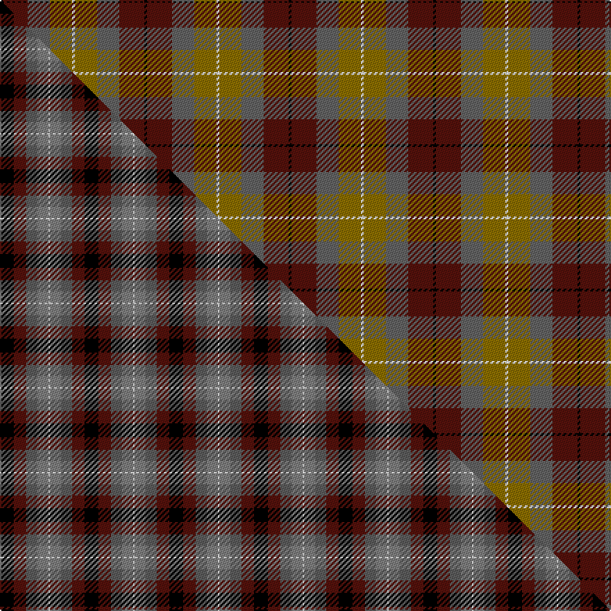

This is one **variant** — a specific cloth: this exact thread count and colourway, with its own
provenance below. It is one weaving of the [sett](/tartans/p/po/pople/) (the scale-free proportion — the
same cloth at any scale or shade), whose colour order is pattern [KBBGW](/stripes/kbbgw/).

Part of the [Pople](/tartans/p/po/pople/) tartan — the named design grouping this sett with its other cloths.

Sourced from tartans-authority.  It is a [5 stripe tartan](/stripes/stripes5/).

Original link <code>http://www.tartansauthority.com/tartan-ferret/display/3247/</code> — retired · [Internet Archive copy](https://web.archive.org/web/*/http://www.tartansauthority.com/tartan-ferret/display/3247/*)

Dataset <small>— provenance for this record, inherited from the source manifest</small>

<dl class="dataset-prov">
<dt>source</dt><dd><a href="/sources/tartans-authority/">Scottish Tartans Authority</a></dd>
<dt>data captured from</dt><dd><a href="https://github.com/thetartan/tartan-database/blob/master/data/tartans-authority/data.csv">https://github.com/thetartan/tartan-database/blob/master/data/tartans-authority/data.csv</a></dd>
<dt>data date</dt><dd>Unknown <small>(this record)</small></dd>
<dt>licence</dt><dd><a href="https://creativecommons.org/licenses/by-nc-nd/4.0/">CC BY-NC-ND 4.0</a></dd>
</dl>

Capture chain <small>— the hands this data passed through, oldest first; each capture carries its own licence</small>

<ol class="capture-chain">
<li><a href="https://www.tartansauthority.com/">Scottish Tartans Authority</a> <small>the heritage body’s archive — its tartan-ferret record browser is retired; dead record links are shown unlinked, with an Internet Archive copy (ITI numbers are not SRT references)</small></li>
<li><a href="https://github.com/thetartan/tartan-database">thetartan/tartan-database</a> <small>2016-2017</small> · <a href="https://creativecommons.org/licenses/by-nc-nd/4.0/">CC BY-NC-ND 4.0</a> <small>Levko Kravets's frozen compilation — the capture we vendored, and where its CC licence text came from</small></li>
<li>this dictionary <small>captured 2026-06-10 · commit 5bf86c7566</small> <small>each re-capture is a git commit to data/sources</small></li>
</ol>

## Register references

External register numbers recorded for this tartan.

- Scottish Tartans Authority (ITI): 3247

## Thread count
K/2 DR18 N16 Y16 W/2

One full sett is **104 threads**.

## Palette
<table><thead><tr><th>Colour</th><th>Shade</th><th>OKLCh</th></tr></thead><tbody><tr><td>DR</td><td><code style="background-color:#55120C;">#55120C</code> <small style="color:#888">#55120C</small></td><td><small style="color:#888">oklch(30.0% 0.099 29.3)</small></td></tr><tr><td>K</td><td><code style="background-color:#000000;">#000000</code> <small style="color:#888">#000000</small></td><td><small style="color:#888">oklch(0.0% 0.000 0.0)</small></td></tr><tr><td>W</td><td><code style="background-color:#F7F7F7;">#F7F7F7</code> <small style="color:#888">#F7F7F7</small></td><td><small style="color:#888">oklch(97.6% 0.000 89.9)</small></td></tr><tr><td>N</td><td><code style="background-color:#636363;">#636363</code> <small style="color:#888">#636363</small></td><td><small style="color:#888">oklch(50.0% 0.000 89.9)</small></td></tr><tr><td>Y</td><td><code style="background-color:#8B6E00;">#8B6E00</code> <small style="color:#888">#8B6E00</small></td><td><small style="color:#888">oklch(55.1% 0.113 90.4)</small></td></tr></tbody></table>

# Sample pattern

## Compared to the master

This cloth is one sett of its design; the master sett (the exemplar the design is anchored on) is below for comparison.

Its **ΔTartan distance** from the master is **1.85** — the same measure the nearest-tartans table ranks by (0 is identical; a re-scale of the same cloth is near 0, a recolour or a different proportion further).

<figure class="master-compare" style="margin:0">

this sett
master sett ★

<figcaption style="color:#888;font-size:smaller">One weave of this sett against the <a href="/setts/k10dr9n8y8w1/">master sett ★</a>, split on the diagonal: a shared proportion runs seamlessly across it with only the shades shifting; a different proportion breaks on it.</figcaption>
</figure>

## Nearest tartan variants

The nearest existing variants by ΔTartan distance, with this cloth at the top so the swatches line up against it.

ΔTartan

Threads

Variant

Sett

—

104

<a href="/variants/s5/k1dr9n8y8w1~x2/">Pople (Name)</a>

<a href="/ttd/edit/#slug=dy12k4w2n6r3~x2&amp;base=k1dr9n8y8w1~x2" title="compare in the TTD">2.12</a>

78

<a href="/variants/s5/dy12k4w2n6r3~x2/">Strathblane (Fashion)</a>

<a href="/ttd/edit/#slug=k8lo2n30dr30lb3~x2&amp;base=k1dr9n8y8w1~x2" title="compare in the TTD">2.13</a>

270

<a href="/variants/s5/k8lo2n30dr30lb3~x2/">Douglas Ancient Red</a>

<a href="/ttd/edit/#slug=g30y3db8r25~x2&amp;base=k1dr9n8y8w1~x2" title="compare in the TTD">2.70</a>

154

<a href="/variants/s4/g30y3db8r25~x2/">Dohmen Family (Zuid-Nederland)</a>

<a href="/ttd/edit/#slug=y15k10n30o11w3y5~x2&amp;base=k1dr9n8y8w1~x2" title="compare in the TTD">2.71</a>

256

<a href="/variants/s6/y15k10n30o11w3y5~x2/">McHale (Personal)</a>

<a href="/ttd/edit/#slug=y32k21r16lr6dt4~x2~r1706028&amp;base=k1dr9n8y8w1~x2" title="compare in the TTD">2.73</a>

244

<a href="/variants/s5/y32k21r16lr6dt4~x2~r1706028/">Scottish American Athletic Assoc</a>

<a href="/ttd/edit/#slug=r15dt8g25dt72n98lb15~dt0900000&amp;base=k1dr9n8y8w1~x2" title="compare in the TTD">2.76</a>

436

<a href="/variants/s6/r15dt8g25dt72n98lb15~dt0900000/">Afternoon Tea / Black Tea</a>

<a href="/ttd/edit/#slug=do9ly9n9r1lb1~x4&amp;base=k1dr9n8y8w1~x2" title="compare in the TTD">2.87</a>

192

<a href="/variants/s5/do9ly9n9r1lb1~x4/">Jardine #2</a>

<a href="/ttd/edit/#slug=r39db22k11y22g5~x2&amp;base=k1dr9n8y8w1~x2" title="compare in the TTD">3.00</a>

308

<a href="/variants/s5/r39db22k11y22g5~x2/">Abbink, Ingmar (Personal)</a>

<a href="/ttd/edit/#slug=db30y3o11y3n33r6~x2&amp;base=k1dr9n8y8w1~x2" title="compare in the TTD">3.02</a>

272

<a href="/variants/s6/db30y3o11y3n33r6~x2/">Balfour</a>

<a href="/ttd/edit/#slug=k2y1dg12y12dr12k1r2~x4&amp;base=k1dr9n8y8w1~x2" title="compare in the TTD">3.11</a>

320

<a href="/variants/s7/k2y1dg12y12dr12k1r2~x4/">PSD: Operation Iraqi Freedom</a>

## Neighbour map

Every grey dot is one of 13656 variants placed by the first two principal components of the ΔTartan feature space (42% of its variance). Red is this tartan; blue dots are its nearest — click one to open its page. The map is a flat projection of a many-dimensional space — [how to read it](/posts/neighbourhood-maps/).

<svg viewBox="0 0 640 380" role="img" style="max-width:100%;height:auto;border:1px solid #e0e0e0;border-radius:4px;display:block" xmlns="http://www.w3.org/2000/svg"><image href="/nn/cloud.v1.png" width="640" height="380"/><a href="/variants/s5/dy12k4w2n6r3~x2/"><circle cx="153.0" cy="222.1" r="4" fill="#3465a4"><title>Strathblane (Fashion)</title></circle></a><a href="/variants/s5/k8lo2n30dr30lb3~x2/"><circle cx="251.3" cy="184.7" r="4" fill="#3465a4"><title>Douglas Ancient Red</title></circle></a><a href="/variants/s4/g30y3db8r25~x2/"><circle cx="273.0" cy="248.7" r="4" fill="#3465a4"><title>Dohmen Family (Zuid-Nederland)</title></circle></a><a href="/variants/s6/y15k10n30o11w3y5~x2/"><circle cx="183.0" cy="205.5" r="4" fill="#3465a4"><title>McHale (Personal)</title></circle></a><a href="/variants/s5/y32k21r16lr6dt4~x2~r1706028/"><circle cx="139.1" cy="208.7" r="4" fill="#3465a4"><title>Scottish American Athletic Assoc</title></circle></a><a href="/variants/s6/r15dt8g25dt72n98lb15~dt0900000/"><circle cx="254.4" cy="203.8" r="4" fill="#3465a4"><title>Afternoon Tea / Black Tea</title></circle></a><a href="/variants/s5/do9ly9n9r1lb1~x4/"><circle cx="169.5" cy="234.0" r="4" fill="#3465a4"><title>Jardine #2</title></circle></a><a href="/variants/s5/r39db22k11y22g5~x2/"><circle cx="141.8" cy="219.4" r="4" fill="#3465a4"><title>Abbink, Ingmar (Personal)</title></circle></a><a href="/variants/s6/db30y3o11y3n33r6~x2/"><circle cx="270.2" cy="219.4" r="4" fill="#3465a4"><title>Balfour</title></circle></a><a href="/variants/s7/k2y1dg12y12dr12k1r2~x4/"><circle cx="188.2" cy="185.9" r="4" fill="#3465a4"><title>PSD: Operation Iraqi Freedom</title></circle></a><circle cx="194.8" cy="232.2" r="5" fill="#c00000"/><text x="320" y="376" text-anchor="middle" font-size="11" fill="#999">ground</text><text x="11" y="190" text-anchor="middle" font-size="11" fill="#999" transform="rotate(-90 11 190)">complexity</text></svg>

ID: /variants/s5/k1dr9n8y8w1~x2/
