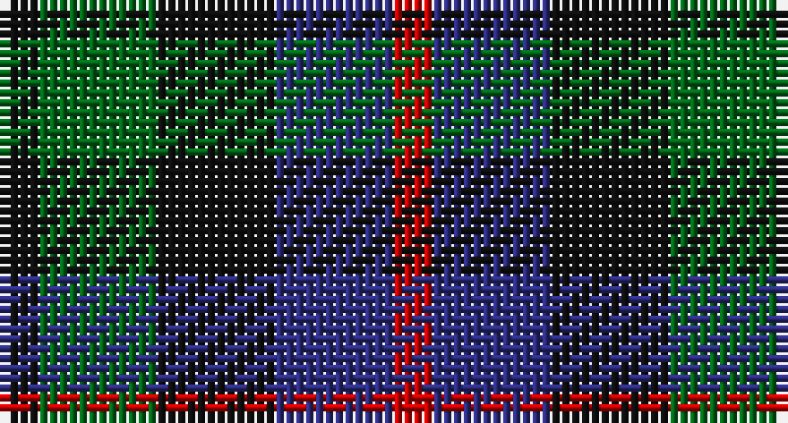

This page is one **sett** — a single exact thread-count. It belongs to the [tartan](/setts/k1g3k3db3r1/)
(the same proportion at any scale), whose colour order is pattern [KGKBR](/stripes/kgkbr/).

Part of the [Durham](/tartans/durham/) tartan — the named design grouping this sett with its other cloths.

Sourced from house-of-tartan.  It is a [5 stripe tartan](/stripes/stripes5/).

Original link http://www.house-of-tartan.scotland.net/house/TartanViewjs.asp?colr=Def&tnam=1089

## Provenance

Earliest known date: 1819 It was Wilson's practice to give the names of towns to many of his new designs. Maybe because the order came from there or because it was the name of the purchaser. There was a family of Durhams associated with the Royal Court in Edinburgh prior to the Union of the Crowns. Wilson was also a collector of tartans, receiving samples from his agents in the Highlands and from purchase orders from around the world. See 'Denholme' and 'Urquhart'.

## Thread count
K/4 G12 K12 DB12 R/4

One full sett is **80 threads**.

## Palette

Palette: <strong>Tartan Register</strong>
<table><thead><tr><th>Colour</th><th>Threads</th><th>Shade</th><th>Base</th><th>OKLCh</th></tr></thead><tbody><tr><td>K/</td><td style="text-align:right;font-variant-numeric:tabular-nums">4</td><td><code style="background-color:#101010;">#101010</code> <small style="color:#888">#101010</small></td><td>K <code style="background-color:#000000;">#000000</code></td><td><small style="color:#888">oklch(17.3% 0.000 89.9)</small></td></tr><tr><td>G</td><td style="text-align:right;font-variant-numeric:tabular-nums">12</td><td><code style="background-color:#006818;">#006818</code> <small style="color:#888">#006818</small></td><td>G <code style="background-color:#006100;">#006100</code></td><td><small style="color:#888">oklch(45.0% 0.142 145.0)</small></td></tr><tr><td>K</td><td style="text-align:right;font-variant-numeric:tabular-nums">12</td><td><code style="background-color:#101010;">#101010</code> <small style="color:#888">#101010</small></td><td>K <code style="background-color:#000000;">#000000</code></td><td><small style="color:#888">oklch(17.3% 0.000 89.9)</small></td></tr><tr><td>DB</td><td style="text-align:right;font-variant-numeric:tabular-nums">12</td><td><code style="background-color:#2C2C80;">#2C2C80</code> <small style="color:#888">#2C2C80</small></td><td>B <code style="background-color:#2A418A;">#2A418A</code></td><td><small style="color:#888">oklch(35.0% 0.138 276.6)</small></td></tr><tr><td>R/</td><td style="text-align:right;font-variant-numeric:tabular-nums">4</td><td><code style="background-color:#C80000;">#C80000</code> <small style="color:#888">#C80000</small></td><td>R <code style="background-color:#CC0000;">#CC0000</code></td><td><small style="color:#888">oklch(52.3% 0.215 29.2)</small></td></tr></tbody></table>

# Sample pattern

## Compared to the master

This cloth is one sett of its design; the master sett (the exemplar the design is anchored on) is below for comparison.

<figure style="margin:0"><figcaption style="color:#888;font-size:smaller">this sett</figcaption></figure>
<figure style="margin:0"><figcaption style="color:#888;font-size:smaller"><a href="/setts/k4g8k7db8r4/">master sett →</a></figcaption></figure>

## Nearest tartans

The nearest existing variants by ΔTartan distance, with this tartan at the top so the swatches line up against it.

ΔTartan

Tartan

Sett

—

<a href="/ttd/edit/#slug=k1g3k3db3r1~x4">Durham District Tartan</a> <a class="nn-out" href="/variants/s5/k1g3k3db3r1~x4/" title="open its dictionary page">↗</a>

1.05

<a href="/ttd/edit/#slug=dp3k3dp3dg6r2~x2&amp;base=k1g3k3db3r1~x4">Austin (Wilson's No 137)</a> <a class="nn-out" href="/variants/s5/dp3k3dp3dg6r2~x2/" title="open its dictionary page">↗</a>

1.06

<a href="/ttd/edit/#slug=g9k11dp8t2~x2&amp;base=k1g3k3db3r1~x4">Wilson's No.228</a> <a class="nn-out" href="/variants/s4/g9k11dp8t2~x2/" title="open its dictionary page">↗</a>

1.12

<a href="/ttd/edit/#slug=db4k5dg4r1~x4&amp;base=k1g3k3db3r1~x4">Unidentified pattern #3</a> <a class="nn-out" href="/variants/s4/db4k5dg4r1~x4/" title="open its dictionary page">↗</a>

1.18

<a href="/ttd/edit/#slug=k4dg4ly1dg4k4db4k1~x2&amp;base=k1g3k3db3r1~x4">MacKay Coat</a> <a class="nn-out" href="/variants/s7/k4dg4ly1dg4k4db4k1~x2/" title="open its dictionary page">↗</a>

1.18

<a href="/ttd/edit/#slug=k4dg4k1dg4k4db4ly1~x2&amp;base=k1g3k3db3r1~x4">Unidentified No 39</a> <a class="nn-out" href="/variants/s7/k4dg4k1dg4k4db4ly1~x2/" title="open its dictionary page">↗</a>

1.21

<a href="/ttd/edit/#slug=dp3k3dp3dg6ly2~x2&amp;base=k1g3k3db3r1~x4">Austin (Wilson's No 173)</a> <a class="nn-out" href="/variants/s5/dp3k3dp3dg6ly2~x2/" title="open its dictionary page">↗</a>

1.25

<a href="/variants/s8/dg6dp3ki3dp3ki3dp3dg6k2~x2/">Wilson's No.173</a>

1.28

<a href="/ttd/edit/#slug=dp8k11g9r2~x2&amp;base=k1g3k3db3r1~x4">Norwich Collection No. 60</a> <a class="nn-out" href="/variants/s4/dp8k11g9r2~x2/" title="open its dictionary page">↗</a>

1.32

<a href="/ttd/edit/#slug=k1db3k3dg3r1dg3k3dg1r1~x2&amp;base=k1g3k3db3r1~x4">Unidentified No 30</a> <a class="nn-out" href="/variants/s9/k1db3k3dg3r1dg3k3dg1r1~x2/" title="open its dictionary page">↗</a>

1.32

<a href="/ttd/edit/#slug=r4dg15k15db15lb4~x2&amp;base=k1g3k3db3r1~x4">Dalmeny #1</a> <a class="nn-out" href="/variants/s5/r4dg15k15db15lb4~x2/" title="open its dictionary page">↗</a>

## Neighbour map

Every grey dot is one of 14360 variants placed by the first two principal components of the ΔTartan feature space (44% of its variance). Red is this tartan; blue dots are its nearest — click one to open its page.

<svg viewBox="0 0 640 380" role="img" style="max-width:100%;height:auto;border:1px solid #e0e0e0;border-radius:4px;display:block" xmlns="http://www.w3.org/2000/svg"><image href="/nn/cloud.v1.png" width="640" height="380"/><a href="/variants/s5/dp3k3dp3dg6r2~x2/"><circle cx="122.6" cy="317.4" r="4" fill="#3465a4"><title>Austin (Wilson's No 137)</title></circle></a><a href="/variants/s4/g9k11dp8t2~x2/"><circle cx="167.7" cy="310.5" r="4" fill="#3465a4"><title>Wilson's No.228</title></circle></a><a href="/variants/s4/db4k5dg4r1~x4/"><circle cx="169.5" cy="323.7" r="4" fill="#3465a4"><title>Unidentified pattern #3</title></circle></a><a href="/variants/s7/k4dg4ly1dg4k4db4k1~x2/"><circle cx="169.1" cy="306.5" r="4" fill="#3465a4"><title>MacKay Coat</title></circle></a><a href="/variants/s7/k4dg4k1dg4k4db4ly1~x2/"><circle cx="169.1" cy="306.5" r="4" fill="#3465a4"><title>Unidentified No 39</title></circle></a><a href="/variants/s5/dp3k3dp3dg6ly2~x2/"><circle cx="93.5" cy="305.8" r="4" fill="#3465a4"><title>Austin (Wilson's No 173)</title></circle></a><a href="/variants/s8/dg6dp3ki3dp3ki3dp3dg6k2~x2/"><circle cx="136.0" cy="301.9" r="4" fill="#3465a4"><title>Wilson's No.173</title></circle></a><a href="/variants/s4/dp8k11g9r2~x2/"><circle cx="157.2" cy="297.7" r="4" fill="#3465a4"><title>Norwich Collection No. 60</title></circle></a><a href="/variants/s9/k1db3k3dg3r1dg3k3dg1r1~x2/"><circle cx="140.1" cy="297.1" r="4" fill="#3465a4"><title>Unidentified No 30</title></circle></a><a href="/variants/s5/r4dg15k15db15lb4~x2/"><circle cx="90.0" cy="287.7" r="4" fill="#3465a4"><title>Dalmeny #1</title></circle></a><circle cx="130.3" cy="319.2" r="5" fill="#c00000"/></svg>

ID: /variants/s5/k1g3k3db3r1~x4/
