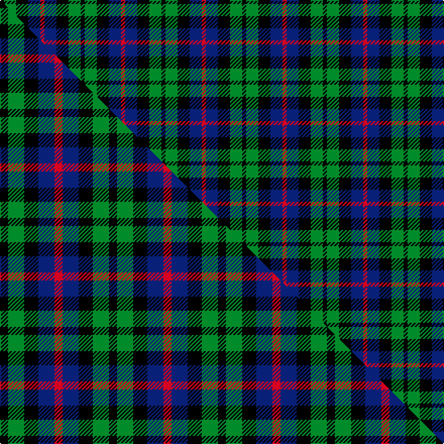

This page is one **sett** — a single exact thread-count. It belongs to the [tartan](/setts/k1g3k3db3r1/)
(the same proportion at any scale), whose colour order is pattern [KGKBR](/stripes/kgkbr/).

Part of the [Durham](/tartans/durham/) tartan — the named design grouping this sett with its other cloths.

Sourced from house-of-tartan.  It is a [5 stripe tartan](/stripes/stripes5/).

Original link http://www.house-of-tartan.scotland.net/house/TartanViewjs.asp?colr=Def&tnam=1089

## Provenance

Earliest known date: 1819 It was Wilson's practice to give the names of towns to many of his new designs. Maybe because the order came from there or because it was the name of the purchaser. There was a family of Durhams associated with the Royal Court in Edinburgh prior to the Union of the Crowns. Wilson was also a collector of tartans, receiving samples from his agents in the Highlands and from purchase orders from around the world. See 'Denholme' and 'Urquhart'.

## Thread count
K/4 G12 K12 DB12 R/4

One full sett is **80 threads**.

## Palette
<table><thead><tr><th>Colour</th><th>Shade</th><th>OKLCh</th></tr></thead><tbody><tr><td>DB</td><td><code style="background-color:#082077;">#082077</code> <small style="color:#888">#082077</small></td><td><small style="color:#888">oklch(30.0% 0.149 265.1)</small></td></tr><tr><td>G</td><td><code style="background-color:#008B2A;">#008B2A</code> <small style="color:#888">#008B2A</small></td><td><small style="color:#888">oklch(55.4% 0.170 145.9)</small></td></tr><tr><td>K</td><td><code style="background-color:#000000;">#000000</code> <small style="color:#888">#000000</small></td><td><small style="color:#888">oklch(0.0% 0.000 0.0)</small></td></tr><tr><td>R</td><td><code style="background-color:#D60020;">#D60020</code> <small style="color:#888">#D60020</small></td><td><small style="color:#888">oklch(55.2% 0.224 25.5)</small></td></tr></tbody></table>

# Sample pattern

## Compared to the master

This cloth is one sett of its design; the master sett (the exemplar the design is anchored on) is below for comparison.

Its **ΔTartan distance** from the master is **0.36** — the same measure the nearest-tartans table ranks by (0 is identical; a re-scale of the same cloth is near 0, a recolour or a different proportion further).

<figure class="master-compare" style="margin:0">

this sett
master sett ★

<figcaption style="color:#888;font-size:smaller">One weave of this sett against the <a href="/setts/k4g8k7db8r4/">master sett ★</a>, split on the diagonal: a shared proportion runs seamlessly across it with only the shades shifting; a different proportion breaks on it.</figcaption>
</figure>

## Nearest tartan variants

The nearest existing variants by ΔTartan distance, with this cloth at the top so the swatches line up against it.

ΔTartan

Threads

Variant

Sett

—

80

<a href="/variants/s5/k1g3k3db3r1~x4/">Durham District Tartan</a>

<a href="/ttd/edit/#slug=k5g20k18db20r5~x2&amp;base=k1g3k3db3r1~x4" title="compare in the TTD">0.32</a>

252

<a href="/variants/s5/k5g20k18db20r5~x2/">Denholm (Fashion)</a>

<a href="/ttd/edit/#slug=k2g8k7db8r2~x2&amp;base=k1g3k3db3r1~x4" title="compare in the TTD">0.33</a>

100

<a href="/variants/s5/k2g8k7db8r2~x2/">Denholme</a>

<a href="/ttd/edit/#slug=k4g8k7db8r4~x2&amp;base=k1g3k3db3r1~x4" title="compare in the TTD">0.36</a>

108

<a href="/variants/s5/k4g8k7db8r4~x2/">Durham</a>

<a href="/ttd/edit/#slug=k3g10k10r3db8w3~x2&amp;base=k1g3k3db3r1~x4" title="compare in the TTD">0.74</a>

136

<a href="/variants/s6/k3g10k10r3db8w3~x2/">Russell (Clan)</a>

<a href="/ttd/edit/#slug=k3g8k8r2db8w2~x2&amp;base=k1g3k3db3r1~x4" title="compare in the TTD">0.76</a>

114

<a href="/variants/s6/k3g8k8r2db8w2~x2/">Mitchell Family Tartan</a>

<a href="/ttd/edit/#slug=dr3k1g1k1db3~x16&amp;base=k1g3k3db3r1~x4" title="compare in the TTD">0.80</a>

192

<a href="/variants/s5/dr3k1g1k1db3~x16/">Clark Clerk(e)</a>

<a href="/ttd/edit/#slug=k4g16k14y3db16r4~x2&amp;base=k1g3k3db3r1~x4" title="compare in the TTD">0.81</a>

212

<a href="/variants/s6/k4g16k14y3db16r4~x2/">Birse</a>

<a href="/ttd/edit/#slug=k4dg16k14ly3t16r4~x2&amp;base=k1g3k3db3r1~x4" title="compare in the TTD">0.85</a>

212

<a href="/variants/s6/k4dg16k14ly3t16r4~x2/">Birse</a>

<a href="/ttd/edit/#slug=k2y1g6k6db6w1~x4&amp;base=k1g3k3db3r1~x4" title="compare in the TTD">1.09</a>

164

<a href="/variants/s6/k2y1g6k6db6w1~x4/">Dyce #3</a>

<a href="/ttd/edit/#slug=k5g14k16db12g4~x2&amp;base=k1g3k3db3r1~x4" title="compare in the TTD">1.27</a>

186

<a href="/variants/s5/k5g14k16db12g4~x2/">Unidentified #29</a>

## Neighbour map

Every grey dot is one of 13620 variants placed by the first two principal components of the ΔTartan feature space (42% of its variance). Red is this tartan; blue dots are its nearest — click one to open its page.

<svg viewBox="0 0 640 380" role="img" style="max-width:100%;height:auto;border:1px solid #e0e0e0;border-radius:4px;display:block" xmlns="http://www.w3.org/2000/svg"><image href="/nn/cloud.v1.png" width="640" height="380"/><a href="/variants/s5/k5g20k18db20r5~x2/"><circle cx="96.9" cy="268.4" r="4" fill="#3465a4"><title>Denholm (Fashion)</title></circle></a><a href="/variants/s5/k2g8k7db8r2~x2/"><circle cx="95.2" cy="268.7" r="4" fill="#3465a4"><title>Denholme</title></circle></a><a href="/variants/s5/k4g8k7db8r4~x2/"><circle cx="47.1" cy="323.7" r="4" fill="#3465a4"><title>Durham</title></circle></a><a href="/variants/s6/k3g10k10r3db8w3~x2/"><circle cx="47.4" cy="248.6" r="4" fill="#3465a4"><title>Russell (Clan)</title></circle></a><a href="/variants/s6/k3g8k8r2db8w2~x2/"><circle cx="63.3" cy="239.5" r="4" fill="#3465a4"><title>Mitchell Family Tartan</title></circle></a><a href="/variants/s5/dr3k1g1k1db3~x16/"><circle cx="135.0" cy="288.2" r="4" fill="#3465a4"><title>Clark Clerk(e)</title></circle></a><a href="/variants/s6/k4g16k14y3db16r4~x2/"><circle cx="78.8" cy="226.5" r="4" fill="#3465a4"><title>Birse</title></circle></a><a href="/variants/s6/k4dg16k14ly3t16r4~x2/"><circle cx="77.4" cy="226.2" r="4" fill="#3465a4"><title>Birse</title></circle></a><a href="/variants/s6/k2y1g6k6db6w1~x4/"><circle cx="98.5" cy="218.6" r="4" fill="#3465a4"><title>Dyce #3</title></circle></a><a href="/variants/s5/k5g14k16db12g4~x2/"><circle cx="149.4" cy="288.7" r="4" fill="#3465a4"><title>Unidentified #29</title></circle></a><circle cx="85.8" cy="286.8" r="5" fill="#c00000"/><text x="320" y="376" text-anchor="middle" font-size="11" fill="#999">ground</text><text x="11" y="190" text-anchor="middle" font-size="11" fill="#999" transform="rotate(-90 11 190)">complexity</text></svg>

ID: /variants/s5/k1g3k3db3r1~x4/
