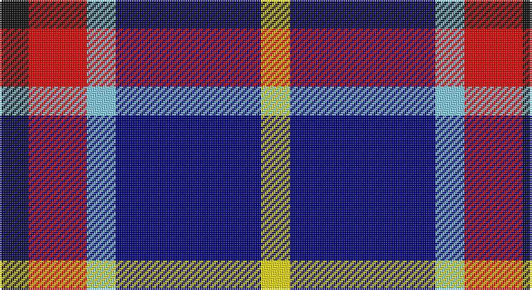

This page is one **sett** — a single exact thread-count. It belongs to the [tartan](/setts/k1r2lt1db5ly1/)
(the same proportion at any scale), whose colour order is pattern [KRWBY](/stripes/krwby/).

Sourced from register-of-tartans.  It is a [5 stripe tartan](/stripes/stripes5/).

Original link https://www.tartanregister.gov.uk/tartanDetails.aspx?ref=10211

## Also known as

This cloth is also recorded under:

- Trinity College, Toronto Uni. (Corp

## Register references

External register numbers recorded for this tartan.

- Scottish Register of Tartans: [10211](https://www.tartanregister.gov.uk/tartanDetails.aspx?ref=10211)

## Thread count
K/16 R32 LB16 DB80 Y/16

One full sett is **288 threads**.

## Palette

Palette: <strong>Tartan Register</strong> <small style="color:#888">(4 of 5 colours)</small>
<table><thead><tr><th>Colour</th><th>Threads</th><th>Shade</th><th>Base</th><th>OKLCh</th></tr></thead><tbody><tr><td>K/</td><td style="text-align:right;font-variant-numeric:tabular-nums">16</td><td><code style="background-color:#101010;">#101010</code> <small style="color:#888">#101010</small></td><td>K <code style="background-color:#000000;">#000000</code></td><td><small style="color:#888">oklch(17.3% 0.000 89.9)</small></td></tr><tr><td>R</td><td style="text-align:right;font-variant-numeric:tabular-nums">32</td><td><code style="background-color:#FF0000;">#FF0000</code> <small style="color:#888">#FF0000</small></td><td>R <code style="background-color:#CC0000;">#CC0000</code></td><td><small style="color:#888">oklch(62.8% 0.258 29.2)</small></td></tr><tr><td>LB</td><td style="text-align:right;font-variant-numeric:tabular-nums">16</td><td><code style="background-color:#82CFFD;">#82CFFD</code> <small style="color:#888">#82CFFD</small></td><td>W <code style="background-color:#F7F7F7;">#F7F7F7</code></td><td><small style="color:#888">oklch(82.2% 0.100 236.0)</small></td></tr><tr><td>DB</td><td style="text-align:right;font-variant-numeric:tabular-nums">80</td><td><code style="background-color:#000080;">#000080</code> <small style="color:#888">#000080</small></td><td>B <code style="background-color:#2A418A;">#2A418A</code></td><td><small style="color:#888">oklch(27.1% 0.188 264.1)</small></td></tr><tr><td>Y/</td><td style="text-align:right;font-variant-numeric:tabular-nums">16</td><td><code style="background-color:#FFE600;">#FFE600</code> <small style="color:#888">#FFE600</small></td><td>Y <code style="background-color:#F2BF00;">#F2BF00</code></td><td><small style="color:#888">oklch(91.7% 0.192 101.4)</small></td></tr></tbody></table>

# Sample pattern

## Nearest tartans

The nearest existing variants by ΔTartan distance, with this tartan at the top so the swatches line up against it.

ΔTartan

Tartan

Sett

—

<a href="/ttd/edit/#slug=k1r2lt1db5ly1~x16">University of Trinity College</a> <a class="nn-out" href="/variants/s5/k1r2lt1db5ly1~x16/" title="open its dictionary page">↗</a>

1.36

<a href="/ttd/edit/#slug=db2ly1db7w1k7w2~x6&amp;base=k1r2lt1db5ly1~x16">Hawick Rugby Club (Corporate)</a> <a class="nn-out" href="/variants/s6/db2ly1db7w1k7w2~x6/" title="open its dictionary page">↗</a>

1.38

<a href="/ttd/edit/#slug=p19w2g12t3k4~x2&amp;base=k1r2lt1db5ly1~x16">Wilson's, No 111</a> <a class="nn-out" href="/variants/s5/p19w2g12t3k4~x2/" title="open its dictionary page">↗</a>

1.42

<a href="/ttd/edit/#slug=lr2r1t7db7lb1~x8&amp;base=k1r2lt1db5ly1~x16">Bryson (1988) (Name)</a> <a class="nn-out" href="/variants/s5/lr2r1t7db7lb1~x8/" title="open its dictionary page">↗</a>

1.43

<a href="/ttd/edit/#slug=r15w10db48t32r6~x2&amp;base=k1r2lt1db5ly1~x16">Lands of Liberty (Fashion)</a> <a class="nn-out" href="/variants/s5/r15w10db48t32r6~x2/" title="open its dictionary page">↗</a>

1.50

<a href="/ttd/edit/#slug=r5db35k25db8ly10r5~x2&amp;base=k1r2lt1db5ly1~x16">University of Notre Dame</a> <a class="nn-out" href="/variants/s6/r5db35k25db8ly10r5~x2/" title="open its dictionary page">↗</a>

1.52

<a href="/ttd/edit/#slug=r21db61lo8w21~x2&amp;base=k1r2lt1db5ly1~x16">Kellogg College University of Oxford</a> <a class="nn-out" href="/variants/s4/r21db61lo8w21~x2/" title="open its dictionary page">↗</a>

1.53

<a href="/ttd/edit/#slug=r4t28k6w12k12ly3~x2&amp;base=k1r2lt1db5ly1~x16">MacTavish / Thom(p)son, dress</a> <a class="nn-out" href="/variants/s6/r4t28k6w12k12ly3~x2/" title="open its dictionary page">↗</a>

1.54

<a href="/ttd/edit/#slug=db18w3db3w3r3w3k5ly12~x2&amp;base=k1r2lt1db5ly1~x16">Kile (Red line) (Personal)</a> <a class="nn-out" href="/variants/s8/db18w3db3w3r3w3k5ly12~x2/" title="open its dictionary page">↗</a>

1.55

<a href="/ttd/edit/#slug=dp8ly6k2y1w1~x8&amp;base=k1r2lt1db5ly1~x16">Ballater Victoria Week</a> <a class="nn-out" href="/variants/s5/dp8ly6k2y1w1~x8/" title="open its dictionary page">↗</a>

1.58

<a href="/ttd/edit/#slug=t16db3t3o3t3db10r12w4~x2&amp;base=k1r2lt1db5ly1~x16">Greer (Name?)</a> <a class="nn-out" href="/variants/s8/t16db3t3o3t3db10r12w4~x2/" title="open its dictionary page">↗</a>

## Neighbour map

Every grey dot is one of 14360 variants placed by the first two principal components of the ΔTartan feature space (44% of its variance). Red is this tartan; blue dots are its nearest — click one to open its page.

<svg viewBox="0 0 640 380" role="img" style="max-width:100%;height:auto;border:1px solid #e0e0e0;border-radius:4px;display:block" xmlns="http://www.w3.org/2000/svg"><image href="/nn/cloud.v1.png" width="640" height="380"/><a href="/variants/s6/db2ly1db7w1k7w2~x6/"><circle cx="196.8" cy="218.7" r="4" fill="#3465a4"><title>Hawick Rugby Club (Corporate)</title></circle></a><a href="/variants/s5/p19w2g12t3k4~x2/"><circle cx="208.2" cy="192.3" r="4" fill="#3465a4"><title>Wilson's, No 111</title></circle></a><a href="/variants/s5/lr2r1t7db7lb1~x8/"><circle cx="160.8" cy="213.0" r="4" fill="#3465a4"><title>Bryson (1988) (Name)</title></circle></a><a href="/variants/s5/r15w10db48t32r6~x2/"><circle cx="185.6" cy="224.2" r="4" fill="#3465a4"><title>Lands of Liberty (Fashion)</title></circle></a><a href="/variants/s6/r5db35k25db8ly10r5~x2/"><circle cx="220.4" cy="222.4" r="4" fill="#3465a4"><title>University of Notre Dame</title></circle></a><a href="/variants/s4/r21db61lo8w21~x2/"><circle cx="230.1" cy="223.1" r="4" fill="#3465a4"><title>Kellogg College University of Oxford</title></circle></a><a href="/variants/s6/r4t28k6w12k12ly3~x2/"><circle cx="147.7" cy="179.0" r="4" fill="#3465a4"><title>MacTavish / Thom(p)son, dress</title></circle></a><a href="/variants/s8/db18w3db3w3r3w3k5ly12~x2/"><circle cx="120.9" cy="172.4" r="4" fill="#3465a4"><title>Kile (Red line) (Personal)</title></circle></a><a href="/variants/s5/dp8ly6k2y1w1~x8/"><circle cx="172.0" cy="184.9" r="4" fill="#3465a4"><title>Ballater Victoria Week</title></circle></a><a href="/variants/s8/t16db3t3o3t3db10r12w4~x2/"><circle cx="124.3" cy="204.8" r="4" fill="#3465a4"><title>Greer (Name?)</title></circle></a><circle cx="164.7" cy="211.9" r="5" fill="#c00000"/></svg>

ID: /variants/s5/k1r2lt1db5ly1~x16/
