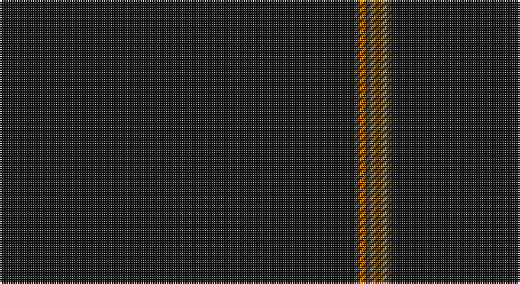

This page is one **sett** — a single exact thread-count. It belongs to the [tartan](/setts/k200dy3lo3dy3lo3/)
(the same proportion at any scale), whose colour order is pattern [KGYGY](/stripes/kgygy/).

Sourced from register-of-tartans.  It is a [5 stripe tartan](/stripes/stripes5/).

Original link https://www.tartanregister.gov.uk/tartanDetails.aspx?ref=3820

2 attestations — the source records this cloth was collapsed from (oldest owns this page)

<ul>
<li>01/03/2003 — SmartWool (register-of-tartans, <a href="https://www.tartanregister.gov.uk/tartanDetails.aspx?ref=3820">record</a>)</li>
<li>March 2003 — SmartWool (Corporate) (tartans-authority, <a href="http://www.tartansauthority.com/tartan-ferret/display/5828/">record</a>)</li>
</ul>

## Register references

External register numbers recorded for this tartan.

- Scottish Register of Tartans: [3820](https://www.tartanregister.gov.uk/tartanDetails.aspx?ref=3820)
- Scottish Tartans Authority (ITI): 5828

## Thread count
K/200 T3 O3 T3 O/3

One full sett is **221 threads**.

## Palette

Palette: <strong>Tartan Register</strong>
<table><thead><tr><th>Colour</th><th>Threads</th><th>Shade</th><th>Base</th><th>OKLCh</th></tr></thead><tbody><tr><td>K/</td><td style="text-align:right;font-variant-numeric:tabular-nums">200</td><td><code style="background-color:#101010;">#101010</code> <small style="color:#888">#101010</small></td><td>K <code style="background-color:#000000;">#000000</code></td><td><small style="color:#888">oklch(17.3% 0.000 89.9)</small></td></tr><tr><td>T</td><td style="text-align:right;font-variant-numeric:tabular-nums">3</td><td><code style="background-color:#604000;">#604000</code> <small style="color:#888">#604000</small></td><td>G <code style="background-color:#006100;">#006100</code></td><td><small style="color:#888">oklch(39.8% 0.083 76.8)</small></td></tr><tr><td>O</td><td style="text-align:right;font-variant-numeric:tabular-nums">3</td><td><code style="background-color:#D87C00;">#D87C00</code> <small style="color:#888">#D87C00</small></td><td>Y <code style="background-color:#F2BF00;">#F2BF00</code></td><td><small style="color:#888">oklch(67.3% 0.155 61.8)</small></td></tr><tr><td>T</td><td style="text-align:right;font-variant-numeric:tabular-nums">3</td><td><code style="background-color:#604000;">#604000</code> <small style="color:#888">#604000</small></td><td>G <code style="background-color:#006100;">#006100</code></td><td><small style="color:#888">oklch(39.8% 0.083 76.8)</small></td></tr><tr><td>O/</td><td style="text-align:right;font-variant-numeric:tabular-nums">3</td><td><code style="background-color:#D87C00;">#D87C00</code> <small style="color:#888">#D87C00</small></td><td>Y <code style="background-color:#F2BF00;">#F2BF00</code></td><td><small style="color:#888">oklch(67.3% 0.155 61.8)</small></td></tr></tbody></table>

# Sample pattern

## Nearest tartans

The nearest existing variants by ΔTartan distance, with this tartan at the top so the swatches line up against it.

ΔTartan

Tartan

Sett

—

<a href="/ttd/edit/#slug=k200dy3lo3dy3lo3">SmartWool</a> <a class="nn-out" href="/variants/s5/k200dy3lo3dy3lo3/" title="open its dictionary page">↗</a>

1.06

<a href="/ttd/edit/#slug=k99r5k4r3k2y1~x2&amp;base=k200dy3lo3dy3lo3">Allt Dubh (Black Burn)</a> <a class="nn-out" href="/variants/s6/k99r5k4r3k2y1~x2/" title="open its dictionary page">↗</a>

1.12

<a href="/ttd/edit/#slug=r2k50n2r1~x2&amp;base=k200dy3lo3dy3lo3">Galloway (Name)</a> <a class="nn-out" href="/variants/s4/r2k50n2r1~x2/" title="open its dictionary page">↗</a>

1.66

<a href="/ttd/edit/#slug=k8ly3k120ly3k40t2k4~x2&amp;base=k200dy3lo3dy3lo3">Lochaber (Hesketh)</a> <a class="nn-out" href="/variants/s7/k8ly3k120ly3k40t2k4~x2/" title="open its dictionary page">↗</a>

1.76

<a href="/ttd/edit/#slug=k50r1db3dp1~x4&amp;base=k200dy3lo3dy3lo3">Alich (Personal)</a> <a class="nn-out" href="/variants/s4/k50r1db3dp1~x4/" title="open its dictionary page">↗</a>

1.79

<a href="/ttd/edit/#slug=dg60r2dg8r1dg5k2&amp;base=k200dy3lo3dy3lo3">St. David's (District)</a> <a class="nn-out" href="/variants/s6/dg60r2dg8r1dg5k2/" title="open its dictionary page">↗</a>

1.94

<a href="/ttd/edit/#slug=k50r1dt3dp1~x4&amp;base=k200dy3lo3dy3lo3">Alich (Personal)</a> <a class="nn-out" href="/variants/s4/k50r1dt3dp1~x4/" title="open its dictionary page">↗</a>

2.08

<a href="/ttd/edit/#slug=k100dp5k4dp3k2y1k2dp2k4dp5~x2&amp;base=k200dy3lo3dy3lo3">Webster, Colin Wesley (Personal)</a> <a class="nn-out" href="/variants/s10/k100dp5k4dp3k2y1k2dp2k4dp5~x2/" title="open its dictionary page">↗</a>

2.26

<a href="/ttd/edit/#slug=dg60r2dg8r1dg5w2&amp;base=k200dy3lo3dy3lo3">St. David's Welsh District Tartan</a> <a class="nn-out" href="/variants/s6/dg60r2dg8r1dg5w2/" title="open its dictionary page">↗</a>

2.45

<a href="/ttd/edit/#slug=k184r1k2r2k2r1k2w1k6w1k4r10k20&amp;base=k200dy3lo3dy3lo3">Edinburgh International Film Festival</a> <a class="nn-out" href="/variants/s13/k184r1k2r2k2r1k2w1k6w1k4r10k20/" title="open its dictionary page">↗</a>

2.46

<a href="/ttd/edit/#slug=do88o3ly2k2lr1~x2&amp;base=k200dy3lo3dy3lo3">Eternity, Dedicated 2 Weddings</a> <a class="nn-out" href="/variants/s5/do88o3ly2k2lr1~x2/" title="open its dictionary page">↗</a>

## Neighbour map

Every grey dot is one of 14360 variants placed by the first two principal components of the ΔTartan feature space (44% of its variance). Red is this tartan; blue dots are its nearest — click one to open its page.

<svg viewBox="0 0 640 380" role="img" style="max-width:100%;height:auto;border:1px solid #e0e0e0;border-radius:4px;display:block" xmlns="http://www.w3.org/2000/svg"><image href="/nn/cloud.v1.png" width="640" height="380"/><a href="/variants/s6/k99r5k4r3k2y1~x2/"><circle cx="626.0" cy="193.3" r="4" fill="#3465a4"><title>Allt Dubh (Black Burn)</title></circle></a><a href="/variants/s4/r2k50n2r1~x2/"><circle cx="626.0" cy="204.2" r="4" fill="#3465a4"><title>Galloway (Name)</title></circle></a><a href="/variants/s7/k8ly3k120ly3k40t2k4~x2/"><circle cx="626.0" cy="169.4" r="4" fill="#3465a4"><title>Lochaber (Hesketh)</title></circle></a><a href="/variants/s4/k50r1db3dp1~x4/"><circle cx="626.0" cy="213.2" r="4" fill="#3465a4"><title>Alich (Personal)</title></circle></a><a href="/variants/s6/dg60r2dg8r1dg5k2/"><circle cx="626.0" cy="199.7" r="4" fill="#3465a4"><title>St. David's (District)</title></circle></a><a href="/variants/s4/k50r1dt3dp1~x4/"><circle cx="626.0" cy="216.9" r="4" fill="#3465a4"><title>Alich (Personal)</title></circle></a><a href="/variants/s10/k100dp5k4dp3k2y1k2dp2k4dp5~x2/"><circle cx="626.0" cy="148.0" r="4" fill="#3465a4"><title>Webster, Colin Wesley (Personal)</title></circle></a><a href="/variants/s6/dg60r2dg8r1dg5w2/"><circle cx="626.0" cy="171.0" r="4" fill="#3465a4"><title>St. David's Welsh District Tartan</title></circle></a><a href="/variants/s13/k184r1k2r2k2r1k2w1k6w1k4r10k20/"><circle cx="626.0" cy="111.8" r="4" fill="#3465a4"><title>Edinburgh International Film Festival</title></circle></a><a href="/variants/s5/do88o3ly2k2lr1~x2/"><circle cx="626.0" cy="154.9" r="4" fill="#3465a4"><title>Eternity, Dedicated 2 Weddings</title></circle></a><circle cx="626.0" cy="190.9" r="5" fill="#c00000"/></svg>

ID: /variants/s5/k200dy3lo3dy3lo3/
