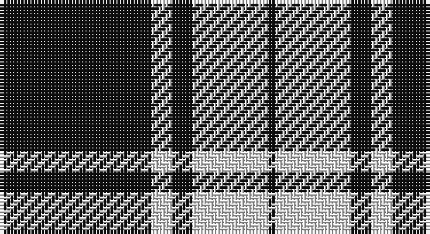

This page is one **sett** — a single exact thread-count. It belongs to the [tartan](/setts/k22w3k3w11k1/)
(the same proportion at any scale), whose colour order is pattern [KWKWK](/stripes/kwkwk/).

Sourced from register-of-tartans.  It is a [5 stripe tartan](/stripes/stripes5/).

Original link https://www.tartanregister.gov.uk/tartanDetails.aspx?ref=2700

## Also known as

This cloth is also recorded under:

- MacPhee, MacFee or MacIvor

2 attestations — the source records this cloth was collapsed from (oldest owns this page)

<ul>
<li>undated — MacPhee MacFee or MacIver (register-of-tartans, <a href="https://www.tartanregister.gov.uk/tartanDetails.aspx?ref=2700">record</a>)</li>
<li>undated — MacPhee, MacFee or MacIvor (weddslist, <a href="http://www.weddslist.com/cgi-bin/tartans/pg.pl?source=sts">record</a>)</li>
</ul>

## Register references

External register numbers recorded for this tartan.

- Scottish Register of Tartans: [2700](https://www.tartanregister.gov.uk/tartanDetails.aspx?ref=2700)
- Scottish Tartans World Register: 1229

## Thread count
K/44 LN6 K6 LN22 K/2

One full sett is **114 threads**.

## Palette

Palette: <strong>Tartan Register</strong>
<table><thead><tr><th>Colour</th><th>Threads</th><th>Shade</th><th>Base</th><th>OKLCh</th></tr></thead><tbody><tr><td>K/</td><td style="text-align:right;font-variant-numeric:tabular-nums">44</td><td><code style="background-color:#101010;">#101010</code> <small style="color:#888">#101010</small></td><td>K <code style="background-color:#000000;">#000000</code></td><td><small style="color:#888">oklch(17.3% 0.000 89.9)</small></td></tr><tr><td>LN</td><td style="text-align:right;font-variant-numeric:tabular-nums">6</td><td><code style="background-color:#E0E0E0;">#E0E0E0</code> <small style="color:#888">#E0E0E0</small></td><td>W <code style="background-color:#F7F7F7;">#F7F7F7</code></td><td><small style="color:#888">oklch(90.7% 0.000 89.9)</small></td></tr><tr><td>K</td><td style="text-align:right;font-variant-numeric:tabular-nums">6</td><td><code style="background-color:#101010;">#101010</code> <small style="color:#888">#101010</small></td><td>K <code style="background-color:#000000;">#000000</code></td><td><small style="color:#888">oklch(17.3% 0.000 89.9)</small></td></tr><tr><td>LN</td><td style="text-align:right;font-variant-numeric:tabular-nums">22</td><td><code style="background-color:#E0E0E0;">#E0E0E0</code> <small style="color:#888">#E0E0E0</small></td><td>W <code style="background-color:#F7F7F7;">#F7F7F7</code></td><td><small style="color:#888">oklch(90.7% 0.000 89.9)</small></td></tr><tr><td>K/</td><td style="text-align:right;font-variant-numeric:tabular-nums">2</td><td><code style="background-color:#101010;">#101010</code> <small style="color:#888">#101010</small></td><td>K <code style="background-color:#000000;">#000000</code></td><td><small style="color:#888">oklch(17.3% 0.000 89.9)</small></td></tr></tbody></table>

# Sample pattern

## Nearest tartans

The nearest existing variants by ΔTartan distance, with this tartan at the top so the swatches line up against it.

ΔTartan

Tartan

Sett

—

<a href="/ttd/edit/#slug=k22w3k3w11k1~x2">MacPhee MacFee or MacIver</a> <a class="nn-out" href="/variants/s5/k22w3k3w11k1~x2/" title="open its dictionary page">↗</a>

1.37

<a href="/ttd/edit/#slug=w24k16w1k16w3k8w2~x2&amp;base=k22w3k3w11k1~x2">Saks Fifth Avenue (Corp)</a> <a class="nn-out" href="/variants/s7/w24k16w1k16w3k8w2~x2/" title="open its dictionary page">↗</a>

1.41

<a href="/ttd/edit/#slug=k53o22k10o10k2o4~x2&amp;base=k22w3k3w11k1~x2">Black Isle</a> <a class="nn-out" href="/variants/s6/k53o22k10o10k2o4~x2/" title="open its dictionary page">↗</a>

1.44

<a href="/variants/s8/w5k20w10k1r2~x2/">St. Piran Cornish Flag</a>

1.46

<a href="/ttd/edit/#slug=t50k4t12k23lo4k4~x2&amp;base=k22w3k3w11k1~x2">Sligo Irish County Tartan</a> <a class="nn-out" href="/variants/s6/t50k4t12k23lo4k4~x2/" title="open its dictionary page">↗</a>

1.46

<a href="/ttd/edit/#slug=k36w4k3w4k6w2k1w12~x4&amp;base=k22w3k3w11k1~x2">Menzies (1938)</a> <a class="nn-out" href="/variants/s8/k36w4k3w4k6w2k1w12~x4/" title="open its dictionary page">↗</a>

1.47

<a href="/ttd/edit/#slug=w5k20w10k1r2~x2&amp;base=k22w3k3w11k1~x2">Cornish Flag (District)</a> <a class="nn-out" href="/variants/s5/w5k20w10k1r2~x2/" title="open its dictionary page">↗</a>

1.48

<a href="/ttd/edit/#slug=k37w9k3g9w3~x2&amp;base=k22w3k3w11k1~x2">Glen Coe #1 (Fashion)</a> <a class="nn-out" href="/variants/s5/k37w9k3g9w3~x2/" title="open its dictionary page">↗</a>

1.54

<a href="/ttd/edit/#slug=w5k3ly6k5w3k30ly2~x2&amp;base=k22w3k3w11k1~x2">Northern Kentucky University</a> <a class="nn-out" href="/variants/s7/w5k3ly6k5w3k30ly2~x2/" title="open its dictionary page">↗</a>

1.60

<a href="/ttd/edit/#slug=k37w9k3dg9w3~x2&amp;base=k22w3k3w11k1~x2">Glen Coe Trade Tartan</a> <a class="nn-out" href="/variants/s5/k37w9k3dg9w3~x2/" title="open its dictionary page">↗</a>

1.61

<a href="/ttd/edit/#slug=k1o2k7o11k18ly2k1~x2&amp;base=k22w3k3w11k1~x2">DDB Canada (Fashion)</a> <a class="nn-out" href="/variants/s7/k1o2k7o11k18ly2k1~x2/" title="open its dictionary page">↗</a>

## Neighbour map

Every grey dot is one of 14360 variants placed by the first two principal components of the ΔTartan feature space (44% of its variance). Red is this tartan; blue dots are its nearest — click one to open its page.

<svg viewBox="0 0 640 380" role="img" style="max-width:100%;height:auto;border:1px solid #e0e0e0;border-radius:4px;display:block" xmlns="http://www.w3.org/2000/svg"><image href="/nn/cloud.v1.png" width="640" height="380"/><a href="/variants/s7/w24k16w1k16w3k8w2~x2/"><circle cx="349.7" cy="184.0" r="4" fill="#3465a4"><title>Saks Fifth Avenue (Corp)</title></circle></a><a href="/variants/s6/k53o22k10o10k2o4~x2/"><circle cx="449.6" cy="199.0" r="4" fill="#3465a4"><title>Black Isle</title></circle></a><a href="/variants/s8/w5k20w10k1r2~x2/"><circle cx="343.7" cy="171.7" r="4" fill="#3465a4"><title>St. Piran Cornish Flag</title></circle></a><a href="/variants/s6/t50k4t12k23lo4k4~x2/"><circle cx="369.2" cy="198.3" r="4" fill="#3465a4"><title>Sligo Irish County Tartan</title></circle></a><a href="/variants/s8/k36w4k3w4k6w2k1w12~x4/"><circle cx="450.9" cy="140.6" r="4" fill="#3465a4"><title>Menzies (1938)</title></circle></a><a href="/variants/s5/w5k20w10k1r2~x2/"><circle cx="324.2" cy="182.4" r="4" fill="#3465a4"><title>Cornish Flag (District)</title></circle></a><a href="/variants/s5/k37w9k3g9w3~x2/"><circle cx="363.1" cy="202.8" r="4" fill="#3465a4"><title>Glen Coe #1 (Fashion)</title></circle></a><a href="/variants/s7/w5k3ly6k5w3k30ly2~x2/"><circle cx="404.3" cy="168.4" r="4" fill="#3465a4"><title>Northern Kentucky University</title></circle></a><a href="/variants/s5/k37w9k3dg9w3~x2/"><circle cx="372.6" cy="208.0" r="4" fill="#3465a4"><title>Glen Coe Trade Tartan</title></circle></a><a href="/variants/s7/k1o2k7o11k18ly2k1~x2/"><circle cx="394.7" cy="188.2" r="4" fill="#3465a4"><title>DDB Canada (Fashion)</title></circle></a><circle cx="412.0" cy="197.7" r="5" fill="#c00000"/></svg>

ID: /variants/s5/k22w3k3w11k1~x2/
