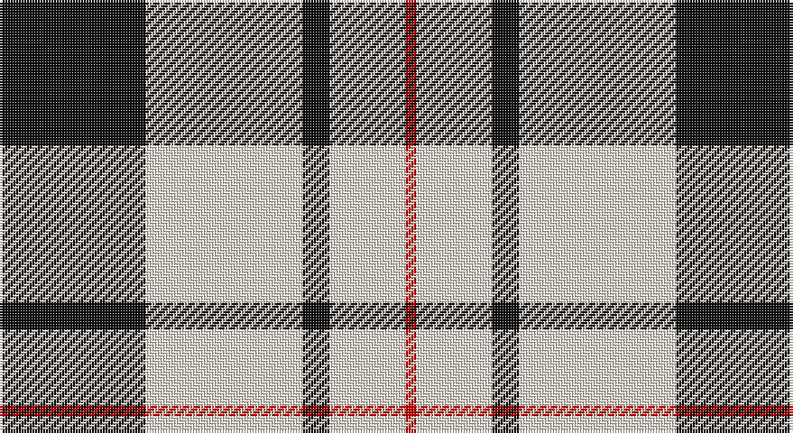

This page is one **sett** — a single exact thread-count. It belongs to the [tartan](/setts/k27w29k5w14r2/)
(the same proportion at any scale), whose colour order is pattern [KWKWR](/stripes/kwkwr/).

Sourced from register-of-tartans.  It is a [5 stripe tartan](/stripes/stripes5/).

Original link https://www.tartanregister.gov.uk/tartanDetails.aspx?ref=2901

2 attestations — the source records this cloth was collapsed from (oldest owns this page)

<ul>
<li>01/06/2007 — McPartlin (Personal) (register-of-tartans, <a href="https://www.tartanregister.gov.uk/tartanDetails.aspx?ref=2901">record</a>)</li>
<li>June 2007 — McPartlin (Personal) (tartans-authority, <a href="http://www.tartansauthority.com/tartan-ferret/display/7244/">record</a>)</li>
</ul>

## Register references

External register numbers recorded for this tartan.

- Scottish Register of Tartans: [2901](https://www.tartanregister.gov.uk/tartanDetails.aspx?ref=2901)
- Scottish Tartans Authority (ITI): 7244

## Thread count
K/54 LY58 K10 LY28 R/4

One full sett is **250 threads**.

## Palette

Palette: <strong>Tartan Register</strong> <small style="color:#888">(2 of 3 colours)</small>
<table><thead><tr><th>Colour</th><th>Threads</th><th>Shade</th><th>Base</th><th>OKLCh</th></tr></thead><tbody><tr><td>K/</td><td style="text-align:right;font-variant-numeric:tabular-nums">54</td><td><code style="background-color:#101010;">#101010</code> <small style="color:#888">#101010</small></td><td>K <code style="background-color:#000000;">#000000</code></td><td><small style="color:#888">oklch(17.3% 0.000 89.9)</small></td></tr><tr><td>LY</td><td style="text-align:right;font-variant-numeric:tabular-nums">58</td><td><code style="background-color:#F8E8D8;">#F8E8D8</code> <small style="color:#888">#F8E8D8</small></td><td>W <code style="background-color:#F7F7F7;">#F7F7F7</code></td><td><small style="color:#888">oklch(93.9% 0.028 67.5)</small></td></tr><tr><td>K</td><td style="text-align:right;font-variant-numeric:tabular-nums">10</td><td><code style="background-color:#101010;">#101010</code> <small style="color:#888">#101010</small></td><td>K <code style="background-color:#000000;">#000000</code></td><td><small style="color:#888">oklch(17.3% 0.000 89.9)</small></td></tr><tr><td>LY</td><td style="text-align:right;font-variant-numeric:tabular-nums">28</td><td><code style="background-color:#F8E8D8;">#F8E8D8</code> <small style="color:#888">#F8E8D8</small></td><td>W <code style="background-color:#F7F7F7;">#F7F7F7</code></td><td><small style="color:#888">oklch(93.9% 0.028 67.5)</small></td></tr><tr><td>R/</td><td style="text-align:right;font-variant-numeric:tabular-nums">4</td><td><code style="background-color:#C80000;">#C80000</code> <small style="color:#888">#C80000</small></td><td>R <code style="background-color:#CC0000;">#CC0000</code></td><td><small style="color:#888">oklch(52.3% 0.215 29.2)</small></td></tr></tbody></table>

# Sample pattern

## Nearest tartans

The nearest existing variants by ΔTartan distance, with this tartan at the top so the swatches line up against it.

ΔTartan

Tartan

Sett

—

<a href="/ttd/edit/#slug=k27w29k5w14r2~x2">McPartlin (Personal)</a> <a class="nn-out" href="/variants/s5/k27w29k5w14r2~x2/" title="open its dictionary page">↗</a>

1.25

<a href="/ttd/edit/#slug=w5r3w35k28w4k11w2~x2&amp;base=k27w29k5w14r2~x2">MacPherson of Cluny (Black and White)</a> <a class="nn-out" href="/variants/s7/w5r3w35k28w4k11w2~x2/" title="open its dictionary page">↗</a>

1.26

<a href="/ttd/edit/#slug=w14k2w14k19w2~x2&amp;base=k27w29k5w14r2~x2">MacLeod Black &amp; White</a> <a class="nn-out" href="/variants/s5/w14k2w14k19w2~x2/" title="open its dictionary page">↗</a>

1.31

<a href="/ttd/edit/#slug=w8k1w8k12w1~x2&amp;base=k27w29k5w14r2~x2">MacLeod, Black &amp; White</a> <a class="nn-out" href="/variants/s5/w8k1w8k12w1~x2/" title="open its dictionary page">↗</a>

1.33

<a href="/ttd/edit/#slug=w5k20w2r5w20r2~x2&amp;base=k27w29k5w14r2~x2">Gangs of New York Fashion Check Tartan</a> <a class="nn-out" href="/variants/s6/w5k20w2r5w20r2~x2/" title="open its dictionary page">↗</a>

1.35

<a href="/ttd/edit/#slug=r8ly6k11ly6k11ly30r3~x2&amp;base=k27w29k5w14r2~x2">Blackberry (Fashion)</a> <a class="nn-out" href="/variants/s7/r8ly6k11ly6k11ly30r3~x2/" title="open its dictionary page">↗</a>

1.36

<a href="/ttd/edit/#slug=w6b3w20k2w3k25w3~x2&amp;base=k27w29k5w14r2~x2">Forbes Dress (Clans Originaux)</a> <a class="nn-out" href="/variants/s7/w6b3w20k2w3k25w3~x2/" title="open its dictionary page">↗</a>

1.38

<a href="/ttd/edit/#slug=k23ly3k23w36r4~x2&amp;base=k27w29k5w14r2~x2">Macleod, Winnifred Mary, Dress</a> <a class="nn-out" href="/variants/s5/k23ly3k23w36r4~x2/" title="open its dictionary page">↗</a>

1.38

<a href="/ttd/edit/#slug=w32r12db12w2db3~x2&amp;base=k27w29k5w14r2~x2">Fraser Arisaid Red (Dance)</a> <a class="nn-out" href="/variants/s5/w32r12db12w2db3~x2/" title="open its dictionary page">↗</a>

1.38

<a href="/ttd/edit/#slug=lr2dr4lr2dr4lr9k1~x2&amp;base=k27w29k5w14r2~x2">Buchanan VS</a> <a class="nn-out" href="/variants/s6/lr2dr4lr2dr4lr9k1~x2/" title="open its dictionary page">↗</a>

1.41

<a href="/ttd/edit/#slug=w5k20w10k1r2~x2&amp;base=k27w29k5w14r2~x2">Cornish Flag (District)</a> <a class="nn-out" href="/variants/s5/w5k20w10k1r2~x2/" title="open its dictionary page">↗</a>

## Neighbour map

Every grey dot is one of 14360 variants placed by the first two principal components of the ΔTartan feature space (44% of its variance). Red is this tartan; blue dots are its nearest — click one to open its page.

<svg viewBox="0 0 640 380" role="img" style="max-width:100%;height:auto;border:1px solid #e0e0e0;border-radius:4px;display:block" xmlns="http://www.w3.org/2000/svg"><image href="/nn/cloud.v1.png" width="640" height="380"/><a href="/variants/s7/w5r3w35k28w4k11w2~x2/"><circle cx="300.9" cy="158.2" r="4" fill="#3465a4"><title>MacPherson of Cluny (Black and White)</title></circle></a><a href="/variants/s5/w14k2w14k19w2~x2/"><circle cx="311.9" cy="234.8" r="4" fill="#3465a4"><title>MacLeod Black &amp; White</title></circle></a><a href="/variants/s5/w8k1w8k12w1~x2/"><circle cx="319.2" cy="230.5" r="4" fill="#3465a4"><title>MacLeod, Black &amp; White</title></circle></a><a href="/variants/s6/w5k20w2r5w20r2~x2/"><circle cx="249.8" cy="188.6" r="4" fill="#3465a4"><title>Gangs of New York Fashion Check Tartan</title></circle></a><a href="/variants/s7/r8ly6k11ly6k11ly30r3~x2/"><circle cx="276.4" cy="198.9" r="4" fill="#3465a4"><title>Blackberry (Fashion)</title></circle></a><a href="/variants/s7/w6b3w20k2w3k25w3~x2/"><circle cx="281.1" cy="170.5" r="4" fill="#3465a4"><title>Forbes Dress (Clans Originaux)</title></circle></a><a href="/variants/s5/k23ly3k23w36r4~x2/"><circle cx="247.0" cy="200.0" r="4" fill="#3465a4"><title>Macleod, Winnifred Mary, Dress</title></circle></a><a href="/variants/s5/w32r12db12w2db3~x2/"><circle cx="286.7" cy="176.8" r="4" fill="#3465a4"><title>Fraser Arisaid Red (Dance)</title></circle></a><a href="/variants/s6/lr2dr4lr2dr4lr9k1~x2/"><circle cx="316.3" cy="222.8" r="4" fill="#3465a4"><title>Buchanan VS</title></circle></a><a href="/variants/s5/w5k20w10k1r2~x2/"><circle cx="324.2" cy="182.4" r="4" fill="#3465a4"><title>Cornish Flag (District)</title></circle></a><circle cx="298.6" cy="201.7" r="5" fill="#c00000"/></svg>

ID: /variants/s5/k27w29k5w14r2~x2/
