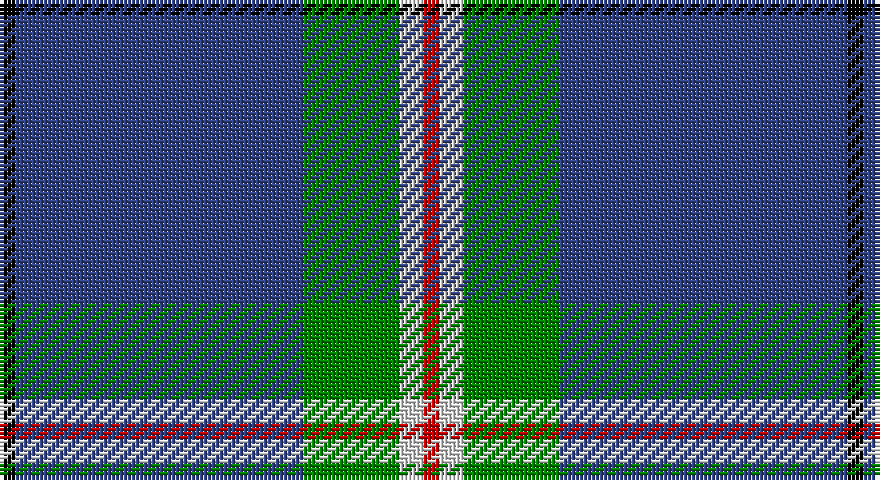

This page is one **sett** — a single exact thread-count. It belongs to the [tartan](/setts/k2db36g12w3r2/)
(the same proportion at any scale), whose colour order is pattern [KBGWR](/stripes/kbgwr/).

Part of the [Cleland](/tartans/cleland/) tartan — the named design grouping this sett with its other cloths.

Sourced from weddslist.  It is a [5 stripe tartan](/stripes/stripes5/).

Original link http://www.weddslist.com/cgi-bin/tartans/pg.pl?source=sts

## Thread count
K/4 B72 G24 LN6 R/4

One full sett is **212 threads**.

## Palette

Palette: <strong>Tartan Register</strong> <small style="color:#888">(2 of 5 colours)</small>
<table><thead><tr><th>Colour</th><th>Threads</th><th>Shade</th><th>Base</th><th>OKLCh</th></tr></thead><tbody><tr><td>K/</td><td style="text-align:right;font-variant-numeric:tabular-nums">4</td><td><code style="background-color:#000000;">#000000</code> <small style="color:#888">#000000</small></td><td>K <code style="background-color:#000000;">#000000</code></td><td><small style="color:#888">oklch(0.0% 0.000 0.0)</small></td></tr><tr><td>B</td><td style="text-align:right;font-variant-numeric:tabular-nums">72</td><td><code style="background-color:#304080;">#304080</code> <small style="color:#888">#304080</small></td><td>B <code style="background-color:#2A418A;">#2A418A</code></td><td><small style="color:#888">oklch(39.4% 0.109 270.2)</small></td></tr><tr><td>G</td><td style="text-align:right;font-variant-numeric:tabular-nums">24</td><td><code style="background-color:#008000;">#008000</code> <small style="color:#888">#008000</small></td><td>G <code style="background-color:#006100;">#006100</code></td><td><small style="color:#888">oklch(52.0% 0.177 142.5)</small></td></tr><tr><td>LN</td><td style="text-align:right;font-variant-numeric:tabular-nums">6</td><td><code style="background-color:#E0E0E0;">#E0E0E0</code> <small style="color:#888">#E0E0E0</small></td><td>W <code style="background-color:#F7F7F7;">#F7F7F7</code></td><td><small style="color:#888">oklch(90.7% 0.000 89.9)</small></td></tr><tr><td>R/</td><td style="text-align:right;font-variant-numeric:tabular-nums">4</td><td><code style="background-color:#C00000;">#C00000</code> <small style="color:#888">#C00000</small></td><td>R <code style="background-color:#CC0000;">#CC0000</code></td><td><small style="color:#888">oklch(50.7% 0.208 29.2)</small></td></tr></tbody></table>

# Sample pattern

## Compared to the master

This cloth is one sett of its design; the master sett (the exemplar the design is anchored on) is below for comparison.

<figure style="margin:0"><figcaption style="color:#888;font-size:smaller">this sett</figcaption></figure>
<figure style="margin:0"><figcaption style="color:#888;font-size:smaller"><a href="/setts/k2n36g12w3r2/">master sett →</a></figcaption></figure>

## Nearest tartans

The nearest existing variants by ΔTartan distance, with this tartan at the top so the swatches line up against it.

ΔTartan

Tartan

Sett

—

<a href="/ttd/edit/#slug=k2db36g12w3r2~x2">Cleland</a> <a class="nn-out" href="/variants/s5/k2db36g12w3r2~x2/" title="open its dictionary page">↗</a>

1.20

<a href="/ttd/edit/#slug=k2n36g12w3r2~x2&amp;base=k2db36g12w3r2~x2">Cleland</a> <a class="nn-out" href="/variants/s5/k2n36g12w3r2~x2/" title="open its dictionary page">↗</a>

1.31

<a href="/ttd/edit/#slug=db30r3db3ly3db3g30db36w5~x2&amp;base=k2db36g12w3r2~x2">De Nardi Hunting (Personal)</a> <a class="nn-out" href="/variants/s8/db30r3db3ly3db3g30db36w5~x2/" title="open its dictionary page">↗</a>

1.34

<a href="/ttd/edit/#slug=k30b40ly3b5w2b6~x2&amp;base=k2db36g12w3r2~x2">Micron</a> <a class="nn-out" href="/variants/s6/k30b40ly3b5w2b6~x2/" title="open its dictionary page">↗</a>

1.34

<a href="/ttd/edit/#slug=db60dg16w8lo3~x2&amp;base=k2db36g12w3r2~x2">MaleHsuHK (Hong Kong) (Personal)</a> <a class="nn-out" href="/variants/s4/db60dg16w8lo3~x2/" title="open its dictionary page">↗</a>

1.35

<a href="/ttd/edit/#slug=lr5k6w2dg7w2dt44w2~x2&amp;base=k2db36g12w3r2~x2">Leblant-Macqueron (Personal)</a> <a class="nn-out" href="/variants/s7/lr5k6w2dg7w2dt44w2~x2/" title="open its dictionary page">↗</a>

1.39

<a href="/ttd/edit/#slug=g23db3k8db4g4db56ly8&amp;base=k2db36g12w3r2~x2">Tern House</a> <a class="nn-out" href="/variants/s7/g23db3k8db4g4db56ly8/" title="open its dictionary page">↗</a>

1.40

<a href="/ttd/edit/#slug=db26t6dg1o1w2~x2&amp;base=k2db36g12w3r2~x2">Special Air Service</a> <a class="nn-out" href="/variants/s5/db26t6dg1o1w2~x2/" title="open its dictionary page">↗</a>

1.41

<a href="/ttd/edit/#slug=db47g14dr5o2r3g7~x2&amp;base=k2db36g12w3r2~x2">Round Table of Britain and Ireland, RtbI.</a> <a class="nn-out" href="/variants/s6/db47g14dr5o2r3g7~x2/" title="open its dictionary page">↗</a>

1.41

<a href="/ttd/edit/#slug=k2w1g5r1t18r2~x2&amp;base=k2db36g12w3r2~x2">Norris (1998) (Name)</a> <a class="nn-out" href="/variants/s6/k2w1g5r1t18r2~x2/" title="open its dictionary page">↗</a>

1.43

<a href="/ttd/edit/#slug=b64k3g14k4b4k12lo4~x2&amp;base=k2db36g12w3r2~x2">Murray of Elibank</a> <a class="nn-out" href="/variants/s7/b64k3g14k4b4k12lo4~x2/" title="open its dictionary page">↗</a>

## Neighbour map

Every grey dot is one of 14360 variants placed by the first two principal components of the ΔTartan feature space (44% of its variance). Red is this tartan; blue dots are its nearest — click one to open its page.

<svg viewBox="0 0 640 380" role="img" style="max-width:100%;height:auto;border:1px solid #e0e0e0;border-radius:4px;display:block" xmlns="http://www.w3.org/2000/svg"><image href="/nn/cloud.v1.png" width="640" height="380"/><a href="/variants/s5/k2n36g12w3r2~x2/"><circle cx="406.0" cy="177.8" r="4" fill="#3465a4"><title>Cleland</title></circle></a><a href="/variants/s8/db30r3db3ly3db3g30db36w5~x2/"><circle cx="342.6" cy="176.0" r="4" fill="#3465a4"><title>De Nardi Hunting (Personal)</title></circle></a><a href="/variants/s6/k30b40ly3b5w2b6~x2/"><circle cx="354.9" cy="175.7" r="4" fill="#3465a4"><title>Micron</title></circle></a><a href="/variants/s4/db60dg16w8lo3~x2/"><circle cx="420.9" cy="199.1" r="4" fill="#3465a4"><title>MaleHsuHK (Hong Kong) (Personal)</title></circle></a><a href="/variants/s7/lr5k6w2dg7w2dt44w2~x2/"><circle cx="363.8" cy="123.9" r="4" fill="#3465a4"><title>Leblant-Macqueron (Personal)</title></circle></a><a href="/variants/s7/g23db3k8db4g4db56ly8/"><circle cx="370.7" cy="175.4" r="4" fill="#3465a4"><title>Tern House</title></circle></a><a href="/variants/s5/db26t6dg1o1w2~x2/"><circle cx="452.7" cy="149.5" r="4" fill="#3465a4"><title>Special Air Service</title></circle></a><a href="/variants/s6/db47g14dr5o2r3g7~x2/"><circle cx="359.5" cy="155.6" r="4" fill="#3465a4"><title>Round Table of Britain and Ireland, RtbI.</title></circle></a><a href="/variants/s6/k2w1g5r1t18r2~x2/"><circle cx="367.5" cy="156.5" r="4" fill="#3465a4"><title>Norris (1998) (Name)</title></circle></a><a href="/variants/s7/b64k3g14k4b4k12lo4~x2/"><circle cx="413.1" cy="162.1" r="4" fill="#3465a4"><title>Murray of Elibank</title></circle></a><circle cx="387.2" cy="169.2" r="5" fill="#c00000"/></svg>

ID: /variants/s5/k2db36g12w3r2~x2/
