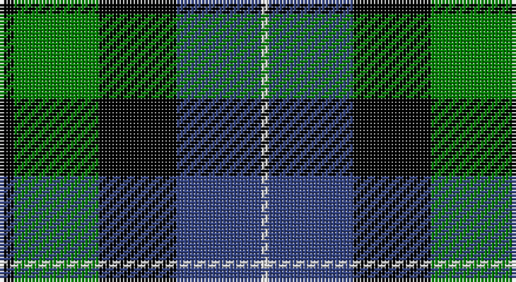

This page is one **sett** — a single exact thread-count. It belongs to the [tartan](/setts/k2g12k11db12w1/)
(the same proportion at any scale), whose colour order is pattern [KGKBW](/stripes/kgkbw/).

Part of the [MacKirdy](/tartans/mackirdy/) tartan — the named design grouping this sett with its other cloths.

Sourced from weddslist.  It is a [5 stripe tartan](/stripes/stripes5/).

Original link http://www.weddslist.com/cgi-bin/tartans/pg.pl?source=sts

## Provenance

Earliest known date: 1930-50 This sample comes from the MacGregor-Hastie collection which forms the basis of the cloth archive of the Scottish Tartans Society. MacGregor-Hastie noted, "A pattern seen at Andersons, Edinburgh, was labelled 'MacKirdy'. It is a simple green tartan. The family are usually given as a sept of the Stuarts of Bute. The tartan is modern". One can assume that the sample dates between 1930 and 1950. At a very early period the larger part of the Island of Bute belonged to the Mackuerdys, which was leased to them by King James IV in 1489. Later Bute became the stronghold of the Stuarts of Bute.

2 attestations — the source records this cloth was collapsed from (oldest owns this page)

<ul>
<li>undated — MacKirdy (weddslist, <a href="http://www.weddslist.com/cgi-bin/tartans/pg.pl?source=sts">record</a>)</li>
<li>undated — MacKirdy Family Tartan (house-of-tartan, <a href="http://www.house-of-tartan.scotland.net/house/TartanViewjs.asp?colr=Def&tnam=1092">record</a>)</li>
</ul>

## Thread count
K/4 G24 K22 B24 LN/2

One full sett is **146 threads**.

## Palette

Palette: <strong>Tartan Register</strong> <small style="color:#888">(2 of 4 colours)</small>
<table><thead><tr><th>Colour</th><th>Threads</th><th>Shade</th><th>Base</th><th>OKLCh</th></tr></thead><tbody><tr><td>K/</td><td style="text-align:right;font-variant-numeric:tabular-nums">4</td><td><code style="background-color:#000000;">#000000</code> <small style="color:#888">#000000</small></td><td>K <code style="background-color:#000000;">#000000</code></td><td><small style="color:#888">oklch(0.0% 0.000 0.0)</small></td></tr><tr><td>G</td><td style="text-align:right;font-variant-numeric:tabular-nums">24</td><td><code style="background-color:#008000;">#008000</code> <small style="color:#888">#008000</small></td><td>G <code style="background-color:#006100;">#006100</code></td><td><small style="color:#888">oklch(52.0% 0.177 142.5)</small></td></tr><tr><td>K</td><td style="text-align:right;font-variant-numeric:tabular-nums">22</td><td><code style="background-color:#000000;">#000000</code> <small style="color:#888">#000000</small></td><td>K <code style="background-color:#000000;">#000000</code></td><td><small style="color:#888">oklch(0.0% 0.000 0.0)</small></td></tr><tr><td>B</td><td style="text-align:right;font-variant-numeric:tabular-nums">24</td><td><code style="background-color:#304080;">#304080</code> <small style="color:#888">#304080</small></td><td>B <code style="background-color:#2A418A;">#2A418A</code></td><td><small style="color:#888">oklch(39.4% 0.109 270.2)</small></td></tr><tr><td>LN/</td><td style="text-align:right;font-variant-numeric:tabular-nums">2</td><td><code style="background-color:#E0E0E0;">#E0E0E0</code> <small style="color:#888">#E0E0E0</small></td><td>W <code style="background-color:#F7F7F7;">#F7F7F7</code></td><td><small style="color:#888">oklch(90.7% 0.000 89.9)</small></td></tr></tbody></table>

# Sample pattern

## Compared to the master

This cloth is one sett of its design; the master sett (the exemplar the design is anchored on) is below for comparison.

<figure style="margin:0"><figcaption style="color:#888;font-size:smaller">this sett</figcaption></figure>
<figure style="margin:0"><figcaption style="color:#888;font-size:smaller"><a href="/setts/k2g12k11b12w1/">master sett →</a></figcaption></figure>

## Nearest tartans

The nearest existing variants by ΔTartan distance, with this tartan at the top so the swatches line up against it.

ΔTartan

Tartan

Sett

—

<a href="/ttd/edit/#slug=k2g12k11db12w1~x2">MacKirdy</a> <a class="nn-out" href="/variants/s5/k2g12k11db12w1~x2/" title="open its dictionary page">↗</a>

0.58

<a href="/ttd/edit/#slug=k2g12k12r1db12g2~x2&amp;base=k2g12k11db12w1~x2">Ferguson of Balquhidder</a> <a class="nn-out" href="/variants/s6/k2g12k12r1db12g2~x2/" title="open its dictionary page">↗</a>

0.67

<a href="/ttd/edit/#slug=t1db11k11g11k2t1~x2&amp;base=k2g12k11db12w1~x2">Unnamed, No 59</a> <a class="nn-out" href="/variants/s6/t1db11k11g11k2t1~x2/" title="open its dictionary page">↗</a>

0.73

<a href="/ttd/edit/#slug=db12k17g19w2k5~x2&amp;base=k2g12k11db12w1~x2">Wilson's, Folio 131</a> <a class="nn-out" href="/variants/s5/db12k17g19w2k5~x2/" title="open its dictionary page">↗</a>

0.73

<a href="/ttd/edit/#slug=k4g19k16w2db15g4~x2&amp;base=k2g12k11db12w1~x2">Graham of Montrose</a> <a class="nn-out" href="/variants/s6/k4g19k16w2db15g4~x2/" title="open its dictionary page">↗</a>

0.73

<a href="/ttd/edit/#slug=w1db9k9g9k2w1~x4&amp;base=k2g12k11db12w1~x2">MacNeil 1</a> <a class="nn-out" href="/variants/s6/w1db9k9g9k2w1~x4/" title="open its dictionary page">↗</a>

0.74

<a href="/ttd/edit/#slug=r2g12k12g1db12g1~x2&amp;base=k2g12k11db12w1~x2">Gunn</a> <a class="nn-out" href="/variants/s6/r2g12k12g1db12g1~x2/" title="open its dictionary page">↗</a>

0.74

<a href="/ttd/edit/#slug=k4w2g18k13db12k2~x2&amp;base=k2g12k11db12w1~x2">Melville</a> <a class="nn-out" href="/variants/s6/k4w2g18k13db12k2~x2/" title="open its dictionary page">↗</a>

0.89

<a href="/ttd/edit/#slug=k4lb2dg8db8lb1&amp;base=k2g12k11db12w1~x2">Douglas Green</a> <a class="nn-out" href="/variants/s5/k4lb2dg8db8lb1/" title="open its dictionary page">↗</a>

0.96

<a href="/ttd/edit/#slug=db3r1db10k8g10r1g3~x4&amp;base=k2g12k11db12w1~x2">Blair</a> <a class="nn-out" href="/variants/s7/db3r1db10k8g10r1g3~x4/" title="open its dictionary page">↗</a>

0.96

<a href="/ttd/edit/#slug=g18t2g4k14db12k3~x2&amp;base=k2g12k11db12w1~x2">Graham of Menteith</a> <a class="nn-out" href="/variants/s6/g18t2g4k14db12k3~x2/" title="open its dictionary page">↗</a>

## Neighbour map

Every grey dot is one of 14360 variants placed by the first two principal components of the ΔTartan feature space (44% of its variance). Red is this tartan; blue dots are its nearest — click one to open its page.

<svg viewBox="0 0 640 380" role="img" style="max-width:100%;height:auto;border:1px solid #e0e0e0;border-radius:4px;display:block" xmlns="http://www.w3.org/2000/svg"><image href="/nn/cloud.v1.png" width="640" height="380"/><a href="/variants/s6/k2g12k12r1db12g2~x2/"><circle cx="171.4" cy="213.0" r="4" fill="#3465a4"><title>Ferguson of Balquhidder</title></circle></a><a href="/variants/s6/t1db11k11g11k2t1~x2/"><circle cx="167.5" cy="213.6" r="4" fill="#3465a4"><title>Unnamed, No 59</title></circle></a><a href="/variants/s5/db12k17g19w2k5~x2/"><circle cx="165.0" cy="242.0" r="4" fill="#3465a4"><title>Wilson's, Folio 131</title></circle></a><a href="/variants/s6/k4g19k16w2db15g4~x2/"><circle cx="162.0" cy="225.5" r="4" fill="#3465a4"><title>Graham of Montrose</title></circle></a><a href="/variants/s6/w1db9k9g9k2w1~x4/"><circle cx="146.4" cy="218.0" r="4" fill="#3465a4"><title>MacNeil 1</title></circle></a><a href="/variants/s6/r2g12k12g1db12g1~x2/"><circle cx="173.0" cy="207.2" r="4" fill="#3465a4"><title>Gunn</title></circle></a><a href="/variants/s6/k4w2g18k13db12k2~x2/"><circle cx="159.6" cy="222.8" r="4" fill="#3465a4"><title>Melville</title></circle></a><a href="/variants/s5/k4lb2dg8db8lb1/"><circle cx="135.9" cy="244.6" r="4" fill="#3465a4"><title>Douglas Green</title></circle></a><a href="/variants/s7/db3r1db10k8g10r1g3~x4/"><circle cx="167.2" cy="214.6" r="4" fill="#3465a4"><title>Blair</title></circle></a><a href="/variants/s6/g18t2g4k14db12k3~x2/"><circle cx="177.6" cy="229.2" r="4" fill="#3465a4"><title>Graham of Menteith</title></circle></a><circle cx="161.1" cy="228.5" r="5" fill="#c00000"/></svg>

ID: /variants/s5/k2g12k11db12w1~x2/
