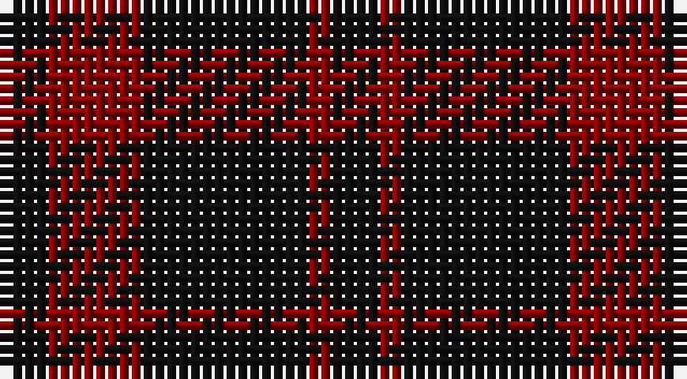

This page is one **sett** — a single exact thread-count. It belongs to the [tartan](/setts/k2r4k7r1k2/)
(the same proportion at any scale), whose colour order is pattern [KRKRK](/stripes/krkrk/).

Part of the [Romsdal Tresfjord](/tartans/romsdal-tresfjord/) tartan — the named design grouping this sett with its other cloths.

Sourced from register-of-tartans.  It is a [5 stripe tartan](/stripes/stripes5/).

Original link https://www.tartanregister.gov.uk/tartanDetails.aspx?ref=3545

## Also known as

This cloth is also recorded under:

- Romsdal Tresfjord District (Artefact
- Romsdal, Tresfjord

2 attestations — the source records this cloth was collapsed from (oldest owns this page)

<ul>
<li>01/01/2002 — Romsdal Tresfjord (register-of-tartans, <a href="https://www.tartanregister.gov.uk/tartanDetails.aspx?ref=3545">record</a>)</li>
<li>pre 2002 — Romsdal Tresfjord District (Artefact (tartans-authority, <a href="http://www.tartansauthority.com/tartan-ferret/display/2088/">record</a>)</li>
</ul>

## Register references

External register numbers recorded for this tartan.

- Scottish Register of Tartans: [3545](https://www.tartanregister.gov.uk/tartanDetails.aspx?ref=3545)
- Scottish Tartans Authority (ITI): 2088
- Scottish Tartans World Register: 2088

## Thread count
K/4 DR8 K14 DR2 K/4

One full sett is **56 threads**.

## Palette

Palette: <strong>Tartan Register</strong>
<table><thead><tr><th>Colour</th><th>Threads</th><th>Shade</th><th>Base</th><th>OKLCh</th></tr></thead><tbody><tr><td>K/</td><td style="text-align:right;font-variant-numeric:tabular-nums">4</td><td><code style="background-color:#101010;">#101010</code> <small style="color:#888">#101010</small></td><td>K <code style="background-color:#000000;">#000000</code></td><td><small style="color:#888">oklch(17.3% 0.000 89.9)</small></td></tr><tr><td>DR</td><td style="text-align:right;font-variant-numeric:tabular-nums">8</td><td><code style="background-color:#880000;">#880000</code> <small style="color:#888">#880000</small></td><td>R <code style="background-color:#CC0000;">#CC0000</code></td><td><small style="color:#888">oklch(39.4% 0.162 29.2)</small></td></tr><tr><td>K</td><td style="text-align:right;font-variant-numeric:tabular-nums">14</td><td><code style="background-color:#101010;">#101010</code> <small style="color:#888">#101010</small></td><td>K <code style="background-color:#000000;">#000000</code></td><td><small style="color:#888">oklch(17.3% 0.000 89.9)</small></td></tr><tr><td>DR</td><td style="text-align:right;font-variant-numeric:tabular-nums">2</td><td><code style="background-color:#880000;">#880000</code> <small style="color:#888">#880000</small></td><td>R <code style="background-color:#CC0000;">#CC0000</code></td><td><small style="color:#888">oklch(39.4% 0.162 29.2)</small></td></tr><tr><td>K/</td><td style="text-align:right;font-variant-numeric:tabular-nums">4</td><td><code style="background-color:#101010;">#101010</code> <small style="color:#888">#101010</small></td><td>K <code style="background-color:#000000;">#000000</code></td><td><small style="color:#888">oklch(17.3% 0.000 89.9)</small></td></tr></tbody></table>

# Sample pattern

## Nearest tartans

The nearest existing variants by ΔTartan distance, with this tartan at the top so the swatches line up against it.

ΔTartan

Tartan

Sett

—

<a href="/ttd/edit/#slug=k2r4k7r1k2~x2">Romsdal Tresfjord</a> <a class="nn-out" href="/variants/s5/k2r4k7r1k2~x2/" title="open its dictionary page">↗</a>

1.19

<a href="/ttd/edit/#slug=k20r3k20r20~x2&amp;base=k2r4k7r1k2~x2">Wcwm 9275-1333-2</a> <a class="nn-out" href="/variants/s4/k20r3k20r20~x2/" title="open its dictionary page">↗</a>

1.28

<a href="/ttd/edit/#slug=k10dp5k30dp5k10dp9~x4&amp;base=k2r4k7r1k2~x2">Leonard Hunting</a> <a class="nn-out" href="/variants/s6/k10dp5k30dp5k10dp9~x4/" title="open its dictionary page">↗</a>

1.37

<a href="/ttd/edit/#slug=k30dp5k10dp9~x4&amp;base=k2r4k7r1k2~x2">Leonard Hunting (Name)</a> <a class="nn-out" href="/variants/s4/k30dp5k10dp9~x4/" title="open its dictionary page">↗</a>

1.87

<a href="/ttd/edit/#slug=k3r20k20r3~x2&amp;base=k2r4k7r1k2~x2">Clan Anord (Corporate)</a> <a class="nn-out" href="/variants/s4/k3r20k20r3~x2/" title="open its dictionary page">↗</a>

1.89

<a href="/ttd/edit/#slug=k12r7k1r9~x4&amp;base=k2r4k7r1k2~x2">Lendrum (Black &amp; Red) or MacFarlane</a> <a class="nn-out" href="/variants/s4/k12r7k1r9~x4/" title="open its dictionary page">↗</a>

1.92

<a href="/ttd/edit/#slug=k24n18k11n4k11n18k53n4&amp;base=k2r4k7r1k2~x2">Spirit of Glyndwr Grey (Fashion)</a> <a class="nn-out" href="/variants/s8/k24n18k11n4k11n18k53n4/" title="open its dictionary page">↗</a>

2.03

<a href="/ttd/edit/#slug=r9k1r5g6r4k2~x4&amp;base=k2r4k7r1k2~x2">MacAn of Lurgyvallan (Hose)</a> <a class="nn-out" href="/variants/s6/r9k1r5g6r4k2~x4/" title="open its dictionary page">↗</a>

2.09

<a href="/ttd/edit/#slug=n6k16n6k16n45k4~x2&amp;base=k2r4k7r1k2~x2">Grey Spirit Fashion Tartan</a> <a class="nn-out" href="/variants/s6/n6k16n6k16n45k4~x2/" title="open its dictionary page">↗</a>

2.10

<a href="/ttd/edit/#slug=k15n7k6n11k50n4~x2&amp;base=k2r4k7r1k2~x2">Freedom of Scotland</a> <a class="nn-out" href="/variants/s6/k15n7k6n11k50n4~x2/" title="open its dictionary page">↗</a>

2.10

<a href="/ttd/edit/#slug=k24n18k11n4k11n18k53r4&amp;base=k2r4k7r1k2~x2">Spirit of Glyndwr Gold (Fashion)</a> <a class="nn-out" href="/variants/s8/k24n18k11n4k11n18k53r4/" title="open its dictionary page">↗</a>

## Neighbour map

Every grey dot is one of 14360 variants placed by the first two principal components of the ΔTartan feature space (44% of its variance). Red is this tartan; blue dots are its nearest — click one to open its page.

<svg viewBox="0 0 640 380" role="img" style="max-width:100%;height:auto;border:1px solid #e0e0e0;border-radius:4px;display:block" xmlns="http://www.w3.org/2000/svg"><image href="/nn/cloud.v1.png" width="640" height="380"/><a href="/variants/s4/k20r3k20r20~x2/"><circle cx="427.4" cy="348.9" r="4" fill="#3465a4"><title>Wcwm 9275-1333-2</title></circle></a><a href="/variants/s6/k10dp5k30dp5k10dp9~x4/"><circle cx="511.3" cy="319.8" r="4" fill="#3465a4"><title>Leonard Hunting</title></circle></a><a href="/variants/s4/k30dp5k10dp9~x4/"><circle cx="530.3" cy="340.9" r="4" fill="#3465a4"><title>Leonard Hunting (Name)</title></circle></a><a href="/variants/s4/k3r20k20r3~x2/"><circle cx="397.5" cy="311.1" r="4" fill="#3465a4"><title>Clan Anord (Corporate)</title></circle></a><a href="/variants/s4/k12r7k1r9~x4/"><circle cx="419.8" cy="308.3" r="4" fill="#3465a4"><title>Lendrum (Black &amp; Red) or MacFarlane</title></circle></a><a href="/variants/s8/k24n18k11n4k11n18k53n4/"><circle cx="488.8" cy="259.5" r="4" fill="#3465a4"><title>Spirit of Glyndwr Grey (Fashion)</title></circle></a><a href="/variants/s6/r9k1r5g6r4k2~x4/"><circle cx="421.0" cy="277.9" r="4" fill="#3465a4"><title>MacAn of Lurgyvallan (Hose)</title></circle></a><a href="/variants/s6/n6k16n6k16n45k4~x2/"><circle cx="460.0" cy="269.0" r="4" fill="#3465a4"><title>Grey Spirit Fashion Tartan</title></circle></a><a href="/variants/s6/k15n7k6n11k50n4~x2/"><circle cx="564.5" cy="266.5" r="4" fill="#3465a4"><title>Freedom of Scotland</title></circle></a><a href="/variants/s8/k24n18k11n4k11n18k53r4/"><circle cx="460.6" cy="240.0" r="4" fill="#3465a4"><title>Spirit of Glyndwr Gold (Fashion)</title></circle></a><circle cx="480.5" cy="319.7" r="5" fill="#c00000"/></svg>

ID: /variants/s5/k2r4k7r1k2~x2/
