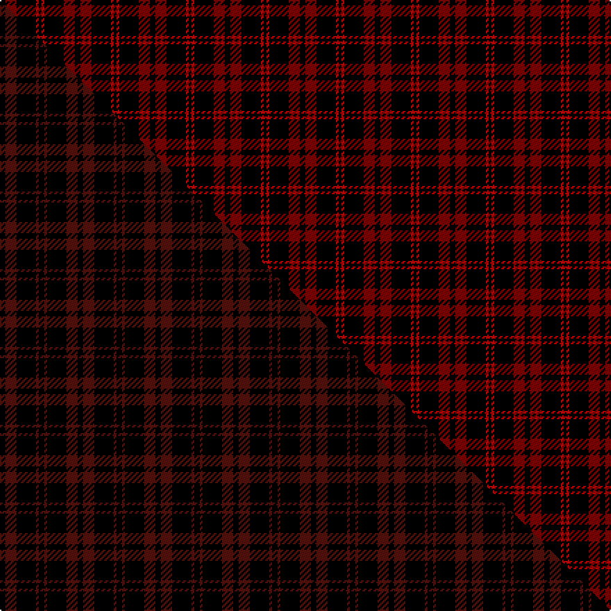

This is one **variant** — a specific cloth: this exact thread count and colourway, with its own
provenance below. It is one weaving of the [sett](/tartans/r/ro/romsdal-tresfjord/) (the scale-free proportion — the
same cloth at any scale or shade), whose colour order is pattern [KRKRK](/stripes/krkrk/).

Part of the [Romsdal Tresfjord](/tartans/r/ro/romsdal-tresfjord/) tartan — the named design grouping this sett with its other cloths.

Sourced from weddslist.  It is a [5 stripe tartan](/stripes/stripes5/).

Original link [http://www.weddslist.com/cgi-bin/tartans/pg.pl?source=sts](http://www.weddslist.com/cgi-bin/tartans/pg.pl?source=sts)

Dataset <small>— provenance for this record, inherited from the source manifest</small>

<dl class="dataset-prov">
<dt>source</dt><dd><a href="/sources/weddslist/">Weddslist</a></dd>
<dt>data captured from</dt><dd><a href="https://github.com/thetartan/tartan-database/blob/master/data/weddslist/data.csv">https://github.com/thetartan/tartan-database/blob/master/data/weddslist/data.csv</a></dd>
<dt>data date</dt><dd>2016-11-17 <small>(dataset default)</small></dd>
<dt>licence</dt><dd><a href="https://creativecommons.org/licenses/by-nc-nd/4.0/">CC BY-NC-ND 4.0</a></dd>
</dl>

Capture chain <small>— the hands this data passed through, oldest first; each capture carries its own licence</small>

<ol class="capture-chain">
<li><a href="https://www.weddslist.com/tartans/">Weddslist</a> <small>the living privately compiled reference</small></li>
<li><a href="https://github.com/thetartan/tartan-database">thetartan/tartan-database</a> <small>2016-2017</small> · <a href="https://creativecommons.org/licenses/by-nc-nd/4.0/">CC BY-NC-ND 4.0</a> <small>Levko Kravets's frozen compilation — the capture we vendored, and where its CC licence text came from</small></li>
<li>this dictionary <small>captured 2026-06-10 · commit 5bf86c7566</small> <small>each re-capture is a git commit to data/sources</small></li>
</ol>

## Thread count
K/4 R8 K14 Ri2 K/2

One full sett is **54 threads**.

## Palette
<table><thead><tr><th>Colour</th><th>Shade</th><th>OKLCh</th></tr></thead><tbody><tr><td>R</td><td><code style="background-color:#800000;">#800000</code> <small style="color:#888">#800000</small></td><td><small style="color:#888">oklch(37.7% 0.155 29.2)</small></td></tr><tr><td>K</td><td><code style="background-color:#000000;">#000000</code> <small style="color:#888">#000000</small></td><td><small style="color:#888">oklch(0.0% 0.000 0.0)</small></td></tr><tr><td>R</td><td><code style="background-color:#C00000;">#C00000</code> <small style="color:#888">#C00000</small></td><td><small style="color:#888">oklch(50.7% 0.208 29.2)</small></td></tr></tbody></table>

# Sample pattern

## Compared to the master

This cloth is one sett of its design; the master sett (the exemplar the design is anchored on) is below for comparison.

Its **ΔTartan distance** from the master is **1.16** — the same measure the nearest-tartans table ranks by (0 is identical; a re-scale of the same cloth is near 0, a recolour or a different proportion further).

<figure class="master-compare" style="margin:0">

this sett
master sett ★

<figcaption style="color:#888;font-size:smaller">One weave of this sett against the <a href="/setts/k2dr4k7dr1k2/">master sett ★</a>, split on the diagonal: a shared proportion runs seamlessly across it with only the shades shifting; a different proportion breaks on it.</figcaption>
</figure>

## Nearest tartan variants

The nearest existing variants by ΔTartan distance, with this cloth at the top so the swatches line up against it.

ΔTartan

Threads

Variant

Sett

—

54

<a href="/variants/s5/k2r4k7ri1k1~x2~r1506028-ri2008029/">Romsdal, Tresfjord</a>

<a href="/ttd/edit/#slug=k2dr4k7dr1k2~x2&amp;base=k2r4k7ri1k1~x2~r1506028-ri2008029" title="compare in the TTD">1.16</a>

56

<a href="/variants/s5/k2dr4k7dr1k2~x2/">Romsdal Tresfjord</a>

<a href="/ttd/edit/#slug=k8y1k1r1k4db1~x12&amp;base=k2r4k7ri1k1~x2~r1506028-ri2008029" title="compare in the TTD">1.36</a>

276

<a href="/variants/s6/k8y1k1r1k4db1~x12/">Justus</a>

<a href="/ttd/edit/#slug=k17dr6k2lb6k17lo2~x2&amp;base=k2r4k7ri1k1~x2~r1506028-ri2008029" title="compare in the TTD">1.39</a>

162

<a href="/variants/s6/k17dr6k2lb6k17lo2~x2/">Black Clan/Family Tartan</a>

<a href="/ttd/edit/#slug=k17dr6k2lb6k17ly2~x2&amp;base=k2r4k7ri1k1~x2~r1506028-ri2008029" title="compare in the TTD">1.39</a>

162

<a href="/variants/s6/k17dr6k2lb6k17ly2~x2/">Black (symmetrical)</a>

<a href="/ttd/edit/#slug=k17dr6k2w6k17ly2~x2&amp;base=k2r4k7ri1k1~x2~r1506028-ri2008029" title="compare in the TTD">1.39</a>

162

<a href="/variants/s6/k17dr6k2w6k17ly2~x2/">Black 1990 (Name)</a>

<a href="/ttd/edit/#slug=k8dr49k8lb3k20lo3~x2&amp;base=k2r4k7ri1k1~x2~r1506028-ri2008029" title="compare in the TTD">1.57</a>

342

<a href="/variants/s6/k8dr49k8lb3k20lo3~x2/">Dunbar (District)</a>

<a href="/ttd/edit/#slug=k55r18k4r18k38&amp;base=k2r4k7ri1k1~x2~r1506028-ri2008029" title="compare in the TTD">1.63</a>

173

<a href="/variants/s5/k55r18k4r18k38/">Unidentified Kirtle</a>

<a href="/ttd/edit/#slug=k16t2k8r3lr3r3k8~x2&amp;base=k2r4k7ri1k1~x2~r1506028-ri2008029" title="compare in the TTD">1.64</a>

124

<a href="/variants/s7/k16t2k8r3lr3r3k8~x2/">Benson (New England)</a>

<a href="/ttd/edit/#slug=r19k8r18k50w14k6&amp;base=k2r4k7ri1k1~x2~r1506028-ri2008029" title="compare in the TTD">1.74</a>

205

<a href="/variants/s6/r19k8r18k50w14k6/">Knights Breton</a>

<a href="/ttd/edit/#slug=k13r2k13r19k2~x2&amp;base=k2r4k7ri1k1~x2~r1506028-ri2008029" title="compare in the TTD">1.79</a>

166

<a href="/variants/s5/k13r2k13r19k2~x2/">MacLeod of Raasay (Highland Society of London)</a>

## Neighbour map

Every grey dot is one of 13657 variants placed by the first two principal components of the ΔTartan feature space (42% of its variance). Red is this tartan; blue dots are its nearest — click one to open its page. The map is a flat projection of a many-dimensional space — [how to read it](/posts/neighbourhood-maps/).

<svg viewBox="0 0 640 380" role="img" style="max-width:100%;height:auto;border:1px solid #e0e0e0;border-radius:4px;display:block" xmlns="http://www.w3.org/2000/svg"><image href="/nn/cloud.v1.png" width="640" height="380"/><a href="/variants/s5/k2dr4k7dr1k2~x2/"><circle cx="444.9" cy="265.8" r="4" fill="#3465a4"><title>Romsdal Tresfjord</title></circle></a><a href="/variants/s6/k8y1k1r1k4db1~x12/"><circle cx="448.9" cy="179.8" r="4" fill="#3465a4"><title>Justus</title></circle></a><a href="/variants/s6/k17dr6k2lb6k17lo2~x2/"><circle cx="337.4" cy="192.7" r="4" fill="#3465a4"><title>Black Clan/Family Tartan</title></circle></a><a href="/variants/s6/k17dr6k2lb6k17ly2~x2/"><circle cx="336.6" cy="192.9" r="4" fill="#3465a4"><title>Black (symmetrical)</title></circle></a><a href="/variants/s6/k17dr6k2w6k17ly2~x2/"><circle cx="327.9" cy="190.6" r="4" fill="#3465a4"><title>Black 1990 (Name)</title></circle></a><a href="/variants/s6/k8dr49k8lb3k20lo3~x2/"><circle cx="325.6" cy="157.2" r="4" fill="#3465a4"><title>Dunbar (District)</title></circle></a><a href="/variants/s5/k55r18k4r18k38/"><circle cx="406.3" cy="209.1" r="4" fill="#3465a4"><title>Unidentified Kirtle</title></circle></a><a href="/variants/s7/k16t2k8r3lr3r3k8~x2/"><circle cx="342.7" cy="181.0" r="4" fill="#3465a4"><title>Benson (New England)</title></circle></a><a href="/variants/s6/r19k8r18k50w14k6/"><circle cx="247.4" cy="198.3" r="4" fill="#3465a4"><title>Knights Breton</title></circle></a><a href="/variants/s5/k13r2k13r19k2~x2/"><circle cx="311.3" cy="220.2" r="4" fill="#3465a4"><title>MacLeod of Raasay (Highland Society of London)</title></circle></a><circle cx="355.6" cy="222.6" r="5" fill="#c00000"/><text x="320" y="376" text-anchor="middle" font-size="11" fill="#999">ground</text><text x="11" y="190" text-anchor="middle" font-size="11" fill="#999" transform="rotate(-90 11 190)">complexity</text></svg>

ID: /variants/s5/k2r4k7ri1k1~x2~r1506028-ri2008029/
